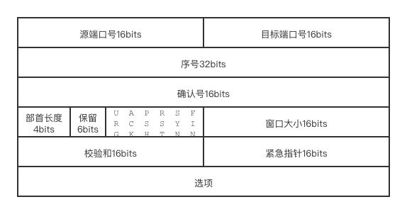
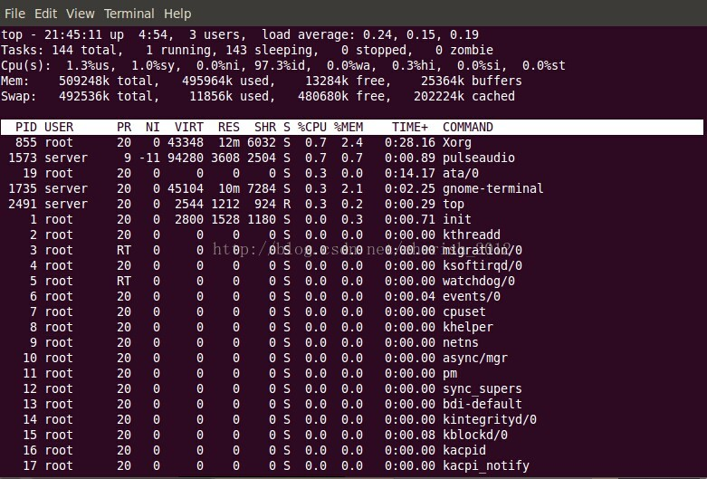
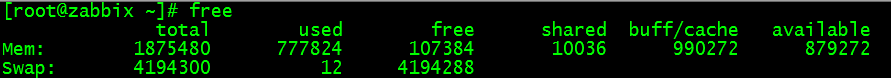

最近在网上看到了一张图，我觉得可以根据这张图对后端程序员的一些基本知识进行一下整理。
<!--more-->
原图来源已经不可考了，而且我看到的清晰度比较低，所以我就重新画一下，如果有知道原作者是谁的，欢迎联系我，我去征求一下放图的授权。如果不允许，我将把图删掉。
下面是我重绘的图。  
  
# OS
## 网络
### TCP新建连接和断开连接的状态机的迁移

#### 报文（部首）格式
TCP的报文部首长度是可变的，其结构如下：  
  

* 序号（32位），本报文数据段在完整数据中的编号（不一定从0开始）。  
* 确认号（32位），本报文确认收悉的报文的序号+1。表示我确认的是你发过来的哪个（序号的）TCP报文，也即我期待的下一个序号是多少。
* 部首长度（4位），TCP报文头的字节数的四分之一。没有“选项”部分的话，默认是20 bytes，那么这里就是0101b（5=20/4）。最大可以扩展到60 bytes（4位二进制最大15，15×4=60）。
* 保留（6位）。
* 6个标志位（6位）：
    * URG：紧急指针启动标志位（urgent）
    * ACK：确认序号有效标志位（acknowledge）
    * PSH：收到数据立即将数据传输给上层，而不是等缓冲区填满（push）
    * RST：重置标志位，通常用于重置已经混乱的连接（reset）
    * SYN：建立连接同步标志位（synchronized）
    * FIN：结束连接标志位，提出一方将此位置位（finish）
* 窗口大小：滑动窗口的大小，用于流量控制。
* 校验和：IP仅计算IP头，而TCP会计算TCP部首与消息主体。
* 紧急指针：当URG=1时启用。
* 选项：最多可以提供20字节的额外信息。 

#### 建立连接过程
当建立连接时：  

1. 客户端发送SYN=1，序号=X，表示我想和你建立连接  
2. 服务端发送SYN=1，ACK=1，序号=Y，确认号=X+1。表示我收到了你的请求，同意连接。
3. 客户端发送ACK=1，序号=X+1，确认号=Y+1。表示我收到了你的确认，我们可以开始发送消息了。

为什么要进行3次握手？  
因为发送的报文序号不一定从0开始，所以客户端首先告诉服务端我要从X开始发，这时候服务端告诉客户端“好的”，然后服务端告诉客户端我会从Y开始发，客户端回复好的。只不过在实际执行中，服务端回复的“好的”和发送的服务端的序号这两个报文合并了。所以总共是3次。

#### 断开连接过程
当断开连接时：
（这里客户端表示主动方，服务端表示被动方）  

1. 客户端发送FIN=1，ACK=1，序号=M，同时可以添加确认号以确认上一条TCP报文。这样就表示我客户端想要断开连接了。
2. 服务端发送ACK=1，序号=N，确认号=M+1。表示我服务器收到了你的断开请求，允许断开。与此同时，服务端将连接关闭的消息告知应用层服务。此时，TCP连接是半关闭状态，客户端不再发送消息，但服务端可以将未发送完的消息继续发送（客户端还是会ACK接收到的消息）。  
3. 服务端发送FIN=1，ACK=1，序号=N，确认号=M+1。表示服务端应用层收到断开通知后，该发送的消息都发号了，主动执行连接断开操作。
4. 客户端发送ACK=1，序号=M，确认号=N+1。表示客户端已经可以断开此连接了，之后客户端服务端各自等待一小段时间都没有收到对方的消息，双方就释放连接资源了。

为什么要4次挥手？最主要的原因是TCP是全双工的。  
因为客户端发送的FIN仅表示我不再发送了，服务端可能还有数据（也就是半关闭状态），所以服务端会首先回复“好的，我知道你要断开了”作为第二次挥手。  
接下来当服务端发送完成后，通过FIN报文告知客户端我这边也发送完毕了。此时服务端就进入了超时等待状态。此时客户端原则上可以回复我知道你发送完了作为回复，以让双方都健康地断开连接。  

### 保证可靠传输和数据时序的基本理论
通过TCP报文部首中的序号、确认号来保证传输的可靠性和顺序性。序号表示我方发送的这个消息的序号，确认号表示我确认收到了你方发送的消息（期待你发过来新消息的序号）。如果序号对不上，就会重发。  

### BIO、AIO的区别和在各操作系统上、各语言上的API的区别

BIO是指Block IO，也就是阻塞式IO。  
BIO的不足：当读取时，如果没有读到预期的数量，会阻塞IO所在线程，等待对方直到发送为止。

NIO是指Non-block IO，也就是非阻塞式IO。  
NIO的优点：每一次尽可能地读取，读不到就返回一个错误码。这样在没有消息时，不会发生线程阻塞。  
NIO的缺点：反复尝试读取的时间不好把握，时间太短了重试频繁，时间太长了，响应延时就大。

IO Multiplexing（IO多路复用）：IO多路复用是在一个线程上使用多个IO线路，可以以用于NIO上，使用时不断轮询注册的socket fd，当没有新消息时就跳过，发现有新消息时就调用对应的回调进行处理（也可以用于BIO，不过还是会被阻塞住，那就没有意义了）。  
IO多路复用缺点：轮询发现新数据读取时，线程仍然是阻塞的。对于每一个被监听的fd，由于在同一个线程中，所以是没有状态的。而且轮询是发生在用户态，无法感知对应端口，所以只能一个一个去轮询。
常用的IO多路复用技术有select和poll。  

epoll：linux下的IO多路复用的实现，在poll的基础上进行了升级，采用注册制，每注册一个新的监听，就会为其创建一个上下文环境（而不用像select或者poll一样，每次都传入一个fd数组）。而且，由于注册是发生在内核态，当监听的端口有数据写入时，能够马上获知，这样在每一次等待结束时，只需要从中取出有消息的端口进行处理，而不需要轮询所有的端口。所以epoll能够监听大量的端口

AIO是指Asynchronized IO，也就是异步式IO，通常是响应式的。epoll就是一种AIO，将原先NIO或者BIO这种轮询或者等待式的，换成了订阅式的，由操作系统感知哪个端口有了新数据，然后调用相应的回调函数（也就是我们写的程序）。这样就可以采用异步的方式来完成IO操作。  

## 操作系统
### 进程与线程
进程是系统分配资源的最小单元。
线程是CPU调度的最小单元。

### 死锁的原因及解决
原因：多线程执行过程中，对于需要同时访问而不可同时访问的资源（aka不可剥夺资源），请求持有和释放持有的顺序不当，会造成死锁。信号量的不当使用也可能造成死锁（比如互相等待对方发出信号以进行后续的操作）。  

避免死锁：  

* 加锁顺序：各线程按照相同的顺序获得锁。
* 加锁时限：当请求一个锁但不得时，重试一定的时间后放弃，并释放目前自己已经持有的锁。回头重新再进行访问。
* 死锁检测：检测互相持有或环装持有锁的情况。当检测到时，通过线程的优先级，释放一部分，让优先级较高的先执行完，优先级低的回退之后重新再执行（为什么不释放所有的？因为这样可能导致大家又互相持有）  

### Linux下常用的问题排查的命令
#### top：系统状态监控  
  

* load average：在1min、5min、15min中，运行队列里的负载程度
* Cpu：CPU的使用情况。
    * us — user。用户空间（未改变优先级的进程）占用CPU的百分比。
    * sy — system。内核空间占用CPU的百分比。
    * ni — nice（谦让）。改变过优先级的进程占用CPU的百分比
    * id — idle。空闲CPU百分比
    * wa — wait。IO等待占用CPU的百分比
    * hi — HardwareInterrupt。硬中断占用CPU的百分比
    * si — SoftwareInterrupt。软中断占用CPU的百分比
* Mem：内存使用情况
    * total：总内存量
    * used：已使用的（已纳入管理的）
    * free：未使用（未纳入管理的）
    * buffers：缓存
* Swap：交换空间。类似于Windows虚拟内存，如果Swap的used在不断变化，说明在不断将磁盘空间交换为虚拟的内存，这时候可能真实内存就不太够用了。

#### free：内存使用情况
  

* buff/cache：对磁盘的缓存。将磁盘中的数据整块搬运到内存中缓存起来。在旧的系统中buff是指buffer cache，是磁盘缓冲区；cache是page cache，指页高速缓存。现在两个概念指同一块内容。  
* free和available：free是指真正没有使用的内存大小；available是应用程序可以感知的可使用的内存大小。有一部分内存已经被操作系统接管了，但还没有分配给任何应用程序。当free不足时，可能回去释放buff/cache区来增加一点空间。  
* Swap：交换空间。磁盘上的一块区域（分区）或一个文件（Swap文件）。当内存吃紧时，将内存中一部分不常访问的数据放到Swap中，这样操作系统就能够使用更多的内存了。  

#### vmstat、pmstat：系统整体状态

#### iostat：IO状态

### 进程间通信方式
5种方式
#### Pipe管道
半双工（只能单一方向）、只能用于亲缘进程。

linux api：  
创建管道：pipe(int fd[2])  
读：read(fd[0], char buffer[], int len)  
写：write(fd[1], char buffer[], int len)    
关：close(fd)  

#### FIFO（有名管道）
利用一个文件描述符（一个文件名，但不占用磁盘空间）。半双工（一边读，另一边同时写）

linux api：  
创建FIFO：fd=mkfifo(char* path, mode_t mode)  
打开FIFO：fd=open(char* path, mode_t mode)  
读：read(fd, char buffer[], int len)  
写：write(fd, char buffer[], int len)  
关：close(fd)  

#### 消息队列
面向记录，消息有特定的格式和优先级。独立于发送进程和接受进程，半持久化。消息可以随机查询，不是FIFO的。  

linux api：  
生成标识：key_t key = ftok(char* path, int proj_id)  
连接消息队列：int msgid = msgget(key_t key, int flag)  
生产消息：msgsnd(int msgid, const void* msgptr, size_t size, int flag)  
消费消息：msgrcv(int msgid, const void* msgptr, long msgtype, int flag)  
管理消息队列：msgctl(int msqid, int cmd, struct msqid_ds *buf)  
其中msgptr是一个struct的指针，size是其中data的长度：  
```c
struct{
    long msgtype;
    char data[X];
}
```

#### Semaphore信号量
信号量用于进程间同步，本身不共享数据（可通过共享内存共享）。信号量基于操作系统PV操作，具有原子性。

linux api：  
生成标识：key_t key=ftok(char* path, int proj_id)  
创建或获取信号量集：int semid=semget(key_t key, int num_sems, int sem_flag)
操作信号量（成功返回0）：semop(int semid, struct sembuf, size_t num_ops)
控制信号量：semctl(int semid, int cmd, ...)

其中struct sembuf是用来操作信号量组的数据结构：
```cpp
struct{
    short sem_num; // 目标信号在信号量组中的下标 
    short sem_op;  // 操作，通常是-1（竞争）或0（释放）
    short sem_flag;
}
```
这样，在执行可能需要竞争的操作时，首先执行sem_op=-1，成功后，在执行完成后执行sem_op=1恢复信号量。  

#### 共享内存
速度最快，因为直接操作内存，但也正因如此，需要进行同步。所以通常与信号量搭配使用。  

linux api：  
生成标识：key_t key=ftok(char* path, int proj_id)   
创建或获取共享内存：int shm_id = shmget(key_t key, size_t size, int flag)  
将进程内指针共享：void* ptr=shmat(int shm_id, const void *addr, int flag)  
断开共享：shmdt(void *addr)  
操作共享内存：shmctl(int shm_id, int cmd, struct shmid_ds *buf)   

## 算法

# Java基础
## Java应用基础
### 反射
### Collection
## 多线程
### 线程的含义、状态
NEW、RUNNABLE、BLOCK、WAIT、TIMED_WAIT
### 线程和线程池的关系
### 线程同步方法和可能会发生的问题

偏向锁、轻量级锁、重量级锁。

#### synchronized和lock的区别
synchronized是关键字，直接利用系统进行。遵循锁升级过程。  
lock是一组接口或接口的实现。ReentryLock默认生成非公平锁，也可以加参数`new ReentryLock(true)`生成公平锁。lock是基于在同一个线程中锁是可重入的这一特性实现的。  
在lock.lock()中，会判断当前锁的进入次数，如果为0，表示未锁，接下来通过CAS进行置未，并记录当前线程，以示占有。如果不是0，那么如果当前线程是lock被持有的线程，那么进入次数+1，直到运行到unlock()再进行-1。然后进行。  
这里，根据公平或非公平锁，会有一些区别。非公平锁的话，只要执行lock()就会首先进行抢占CAS，失败了再学习公平锁。而公平锁在判断进入次数发现自己被锁在外面时，会在顺着当前被阻塞的队列，一个一个去尝试解锁，谁先碰到看谁运气好。  
而ReentryReadWriteLock与ReentryLock不同之处在于，其中包含了2个lock，一个是readLock，一个是writeLock。readLock可以在writeLock非锁的情况被任意线程访问；而writeLock只能在readLock（哪怕是同意线程也不行）和writeLock都非锁的情况下才能访问。  
这样会遇到一个问题，如果在读锁中再获取写锁，或者在写锁中获取读锁会怎么样？
结论是，在写锁中获取读锁，是OK的，锁会降级为读锁。而如果在读锁中获取写锁，因为写锁会判断读锁的状态，所以会阻塞，也就是说读锁不能升级。  

之所以能够存储和获取被阻塞的队列，是因为这些lock中的同步器Sync都继承自AbstractQueuedSynchronizer，里面的一个个volatile Node就是用来存放这些被阻塞的线程的。直到通过interrupt()打断其等待为止。  

#### CAS原理及应用
CAS即compare and swap。
CAS(T, E, V)，T表示目标对象，E表示期望值，V表示新值。也即从T中取出E，然后经过运算得到了V，这时候想将V放回T中，需要通过CAS这一原子操作，来确定在运算E到V的过程中T没有发生变化。一个CAS实现的伪代码是这样的：
```c
bool cas(void* obj, int expect, int newValue)
{
    if(*obj == expect){
        *obj = newValue;
        return true;
    }else{
        return false;
    }
}
```
而使用的代码，比如在`Unsafe`中：
```java
public final int getAndAddInt(Object obj, long addr, int addon) {
    int getValue;
    do {
        getValue = this.getIntVolatile(obj, addr);
    } while(!this.compareAndSwapInt(obj, addr, getValue, getValue + addon));
    return getValue;
}
```
先通过obj获取其addr地址处的值，然后不断尝试通过CAS将getValue+addOn的值写入obj中。如果失败的话，就说明有其他线程在竞争obj，就重新读取obj的值，再次getValue+addOn，直到obj中的值和预期值是一致的，执行swap操作。  

可以看到，在CAS处在不断循环，如果竞争异常激烈的话，这里将会重复循环很多很多次。所以CAS是乐观的，相信本身的竞争没有那么多，很快就能得到预期的结果。  

### 不同场景下的线程模型
#### fork/join
使用 ForkJoinPool创建一个线程池，自定义一个RecursiveTask（有返回值）或者RecursiveAction（无返回值），来将任务拆解。最后在需要的时候将结果合并起来。  
下面是一个计算某个字符串中小写字母是否出现的例子。
```java
public class Main06 {
    static class Counter extends RecursiveTask<Integer> {
        final private String target;
        final private int from;
        final private int to;
        Counter(String target, int from, int to){
            this.target = target;
            this.from = from;
            this.to = to;
        }
        @Override
        protected Integer compute() {
            if(to - from > 1){
                int mid = from + (to - from) / 2 ;
                Counter c1 = new Counter(target, from, mid);
                c1.fork();
                Counter c2 = new Counter(target, mid, to);
                c2.fork();
                return c2.join() | c1.join();
            }else{
                char c = target.charAt(from);
                return (1 << (c-'a'));
            }
        }
    }
    public static void main(String[] args) throws ExecutionException, InterruptedException {
        String target = "asdoifuweornzkcxvnoiaewurjzlknv";
        
        ForkJoinPool fjp = new ForkJoinPool(Runtime.getRuntime().availableProcessors());
        Future<Integer> future = fjp.submit(new Counter(target, 0, target.length()));
        int containLetters = future.get();
        
        System.out.println(Integer.toBinaryString(containLetters);
        for(char c='z';c>='a';c--){
            if(target.contains(c+"")){
                System.out.print(c);
            }else{
                System.out.print(" ");
            }
        }
        System.out.println();
    }
}
```
输出结果：  
```
10111101100110111100111101  
z xwvu sr  on lkji  fedc a
```
常用方法：
fork()拆分任务  
join()类似于Thread.join()，等待拆分的任务执行结束。不需要等待的话可以不执行。  
invokeAll()执行所有传入的任务。
#### api b/nb
不太清楚什么意思，block api和nonblock api？

### java.util.concurrent包下的常用工具类
#### 并发数据结构
* List：  
    * Vector：所有get、set全都使用synchronized。底层使用数组，扩容x2（ArrayList扩容x1.5）
    * Collection.synchronizedList：装饰器模式，调用各个方法时，通过synchronized代码块包裹调用。
    * CopyOnWriteArrayList：读时不加锁，写时加锁复制写后再覆盖整数组。
* Set：
    * Collection.SynchronizedSet
    * CopyOnWriteSet
* Map：
    * Collection.SynchronizedMap
    * HashTable：所有方法采用synchronized修饰，会锁住整个表。
    * ConcurrentHashMap：jdk1.7中对Entry进行分段Segment，写时只锁定特定的Segment。jdk1.8中每一个格子是一个Node，所以直接synchronized对应的Node
* Queue/Deque:
    * ConcurrentLinkedQueue：通过CAS操作。
    * ArrayBlockedQueue，LinkedBlockedQueue：对特定方法（put、offer、peek等）使用ReentrantLock进行加锁。

#### 并发工具
* semaphore信号量：
* CountDownLatch：倒数计数器，各线程中通过cdl.countDown()来减数计数，需要阻塞等待计数完结的线程执行cdl.await进行等待，知道计数为0时cdl.await释放线程占用，执行后续。CountDownLatch只能倒计数一次。
* CyclicBarrier：与COuntDownLatch类似，只需要调用cb.await()方法，当await的数量达到初始化时的parties时，释放所有的await。CyclicBarrier在await释放之后，是可以重复利用的。CyclicBarrier继承自Condition。

## JVM虚拟机
另开专题
## 设计模式
另开专题

## OOP——SOLID原则
* Single Responsibility Principle：单一职责原则。即一个类、接口、方法，只专注于一件事情。可以降低代码的粒度、耦合性和复杂度，提高可读性，提高可维护性，降低更改时的风险。
* Open Closed Principle：开闭原则。即对扩展开放，对修改关闭，用抽象建立框架，用实现扩展细节。这样可以保证代码框架整体的稳定性，对需要修改的部分，通过对抽象派生出新的实现来进行扩展。
* Liskov Substitution Principle：里氏替换原则。也就是派生类可以替代基类。对于基类已经实现的方法，原则上派生类不应该覆盖，但可以增加自己特有的功能（比如通过重载）。这样做可以提高代码重用性，提高代码扩展性；但也有缺点，增加了一定的耦合性（修改了父类的方法，必然会影响子类的功能），降低了代码的灵活性（因为父类的模板是对子类的约束）。
* Law of Demeter：迪米特法则。当两个实体不需要通信时，避免直接的互相调用。也就是说只依赖需要依赖的，只暴露需要暴露的（比如买房的时候，只通过中介进行，而不需要跟每一个售楼中心去沟通）。这么做的优点是，降低了系统的耦合度、提高了各个模块间的独立性，提高了类的可复用性和扩展性。但过度使用该法则，可能会造成中介过度，通信效率降低。
* Interface Segregation Principle：接口隔离原则，也就是说接口的设计应遵循最小功能原则，如果接口可以拆分，就拆分成不同的接口。与单一职责的区别是，单一职责约束的是功能职责，而接口隔离约束的是对接口的依赖；单一职责约束的是程序的实现与细节，而接口隔离约束的是整体框架的设计。好处：将大街口拆分为小接口集合，在应对变更时，可以提高系统的灵活性和可维护性；接口的隔离提高了系统模块的内聚性，减少了对外交互，降低了系统耦合度；使用多个接口，一定程度上还能表示类的层次关系；进行接口实现时，可以避免因为接口过大，而去实现根本用不到的功能。
* Dependence Inversion Principle：依赖倒置原则，即上层模块不应依赖下层模块，上层和下层应该依赖于抽象；抽象不应依赖于细节，细节应该依赖于抽象。[举个例子](https://www.jianshu.com/p/c3ce6762257c)，如果要开一家披萨店，肯定要有披萨店这个类，然后披萨店需要有芝士披萨、海鲜披萨等等，所以披萨店是依赖于这些具体的披萨的；而现在这样思考，店里有芝士披萨、海鲜披萨，他们都能抽象出披萨这个接口，这样这些披萨转而依赖于披萨接口；而披萨店只需要一个披萨接口，就可以统领所有披萨，甚至还可以创建意面接口，去统领各类意面（蝴蝶意面、长条意面等等）。这就是依赖倒置。

# DB
## nosql
### redis
#### 数据结构

* string（字符串）：incr、decr、incrby、decrby
* list（双向链表，用于模拟队列、栈）：lpush、lpop、rpush、rpop、llen
* set（集合）：sadd、scard（元素数量）、sismember、srem（删除）
* hash（KV散列）：hset、hget、hmget（获取多个key对应的value）
* orderset（有序集合）：zset(score,name)、zcard、zrange(from,to,withscore)

#### 持久化
* RDB方式：即通过bgsave命令，主进程fork一个子进程（fork时阻塞），子进程生成RDB文件，然后根据主进程内存生成快照，并写入RDB文件中。当然也可以通过save命令，暂停整个redis，写完RDB后再恢复阻塞。当然也可以通过redis.conf，配置自动触发（save 60 10000表示每60秒内，如果有超过10000个记录发生变化，则触发保存）  
* AOF方式：每执行一条redis语句，就记录一次，追加到AOF文件中，相当于操作日志。宕机后根据这个AOF文件恢复。可以配置为always（即每个指令都记录）、everysec（即每一秒异步记录）、no（不开启AOF）

对比，RDB文件紧凑、全量备份、恢复速度快，使用bgsave时主进程除了fork外丝毫不受影响（且无IO）。但是子进程运行时，主进程中的修改不会被记录下来。  
而AOF可以更好的保护数据不丢失，一般AOF会每隔1秒，通过一个后台线程执行一次fsync操作，最多丢失1秒钟的数据。AOF日志文件没有任何磁盘寻址的开销，写入性能非常高，文件不容易破损。AOF日志文件即使过大的时候，出现后台重写操作，也不会影响客户端的读写。AOF日志文件的命令通过非常可读的方式进行记录，这个特性非常适合做灾难性的误删除的紧急恢复。比如某人不小心用flushall命令清空了所有数据，只要这个时候后台rewrite还没有发生，那么就可以立即拷贝AOF文件，将最后一条flushall命令给删了，然后再将该AOF文件放回去，就可以通过恢复机制，自动恢复所有数据。但是AOF文件通常比RDB文件更大，开启AOF后，redis的写qps会降低。

#### 为什么Redis快
1. 单线程，没有线程竞争
2. 在内存中，减少磁盘IO
3. 多路复用

#### redis主从机制
redis中存在3个定时任务：  

1. 每隔10秒，从节点向主节点获取redis集群拓扑结构。
2. 每隔2秒，每个从节点会广播自己对主节点状态的判断，也会接收到其他节点的判断。
3. 每1秒，每个从节点会向其他主从节进行心跳检测。当三次心跳检测失败，就会通过投票选举新的主节点。  

#### Redis常见问题
缓存击穿：  
高并发下，多线程同时查询一个缓存，缓存中如果没有这个记录，多线程同时去访问数据库，使数据库压力增大。  
解决方案：  

1. 后台刷新。后台定义个定时任务，主动更新缓存（特别是热点缓存）  
2. 检查更新。将过期时间与value拼接，取出时发现快过期的话，就重新在放回去，延长过期时间。
3. 分级缓存。但是可能会造成缓存不一致。  
4. 加锁：拿不到缓存时，tryLock，成功的去数据库拿数据，失败的话延时一小段时间再从缓存拿。  

缓存雪崩：
缓存服务突然不可用，造成大量并发访问打向缓存后的服务（如数据库）。  
解决方案：
1. 对于大量相同到期时间的缓存，可以设置随机的过期时间，以错开失效时间，避免集中性的缓存失效。  
2. 设置热点数据永不过期。  
3. 分布式部署，热点数据均匀分布。
4. 服务降级、熔断，采用备用数据展示（避免前端显示异常）。  

缓存数据库双写不一致问题：
T1写数据库A=a，T2查缓存A=b，T2写缓存A=b，T1删缓存A
解决方案：  
1. 延迟双删  
2. 使用分布式锁，将写数据库与更新缓存原子化  
分布式锁如何解决性能问题：读写锁，

### AeroSpike

### memcache

## sql
### mysql
#### 索引原理
MySQL使用的是B+Tree。
B-Tree（不是B减Tree，是B hyphen Tree）是平衡多路查找树，每一个非叶子节点中都包含了多个孩子和关键字（及其值），每一个叶子节点只包含关键字（及其值）。每一个节点占用一个磁盘的block。  
B+Tree是一种在B-Tree基础上进行改进的数据接口。对于B-Tree而言，如果值很大，那么就会导致节点能存储的信息变少，那么势必会增加节点数量，导致树深增加。所以B+Tree的非叶子节点中，只存放顺序的信息，而所有值都放在叶子节点中。此外，为了增加访问的灵活性，叶子节点之间还增加了一个链式结构（即相邻叶子节点可以通过指针直接双向访问）。
而数据库的B+Tree在实现时，利用了磁盘的存储特性，磁盘的最小存储单位是扇区（sector），而操作系统的块（block）通常是整数倍的sector，操作系统以页（page）为单位管理内存，一页（page）通常默认为4K，数据库的页通常设置为操作系统页的整数倍，因此索引结构的节点被设计为一个页的大小，然后利用外存的“预读取”原则，每次读取的时候，把整个节点的数据读取到内存中，然后在内存中查找。
这样而言，B+Tree就有了这样的优点：首先速度更快，尽可能多的降低了树的高度，而且利用磁盘特性进行预读取。其次，查询速度更稳定，因为叶子节点的高度是相同的。

MySQL中将索引分为两类，分别是聚集索引（Cluster Index）和辅助索引（Secondary Index）。
聚集索引将主键按照顺序存放（如果没有定义主键，则将第一个Unique且Not Null的列作为主键，如果还不存在，innoDB就自己生成一个6字节的值作为隐藏主键），B+Tree中的叶子节点就是按照聚集索引进行存放的。可以很快进行排序查找和范围查找。  

#### 事务和事务的隔离
事务的基本要求：
ACID：原子性（Atomic）、一致性（Consistency）、隔离性（Isolation）、持久性（Durability）。

事务的并发问题：  

1. 脏读：事务A读取了事务B更新的数据，然后B回滚操作，那么A读取到的数据是脏数据
2. 不可重复读：事务 A 多次读取同一数据，事务 B 在事务A多次读取的过程中，对数据作了更新并提交，导致事务A多次读取同一数据时，结果 不一致。
3. 幻读：在事务A中执行修改操作，操作过程中另一事务插入了一条新数据，导致事务A在执行后，重读时发现有一条数据仿佛没有经过自己的修改。系统管理员A将数据库中所有学生的成绩从具体分数改为ABCDE等级，但是系统管理员B就在这个时候插入了一条具体分数的记录，当系统管理员A改结束后发现还有一条记录没有改过来，就好像发生了幻觉一样，这就叫幻读。  

小结：不可重复读的和幻读很容易混淆，不可重复读侧重于修改，幻读侧重于新增或删除。解决不可重复读的问题只需锁住满足条件的行，解决幻读需要锁表

隔离级别：  

事务隔离级别    脏读    不可重复读  幻读  
读未提交（read-uncommitted）	是	是	是
不可重复读（read-committed）	否	是	是
可重复读（repeatable-read）	否	否	是
串行化（serializable）	否	否	否

隔离级别越高，数据的一致性就越高，但是对并发性能的影像也越大。

#### 数据库高可用
半同步复制：主从关系，利用MySQL5.5之后的半同步复制（通过配置）机制，实现多个MySQL服务器之间的同步。为什么叫半同步，因为只需要有一个从完成事务，就可以了。这样在主机挂了之后，至少有一个从机是可靠的。  
