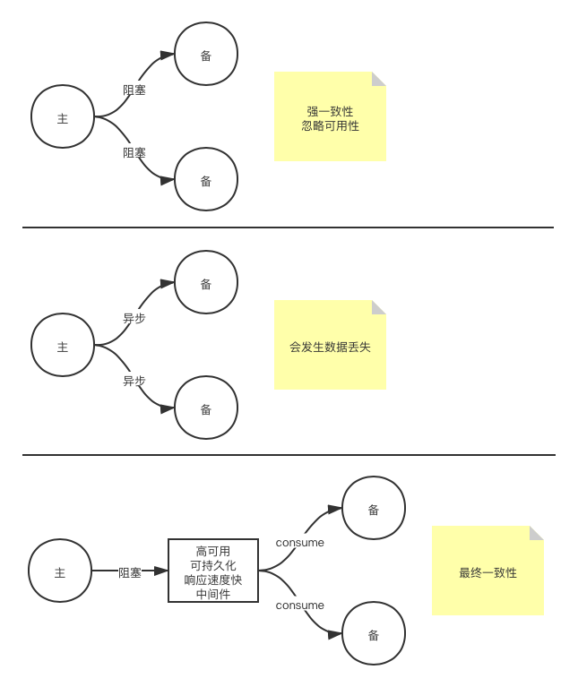
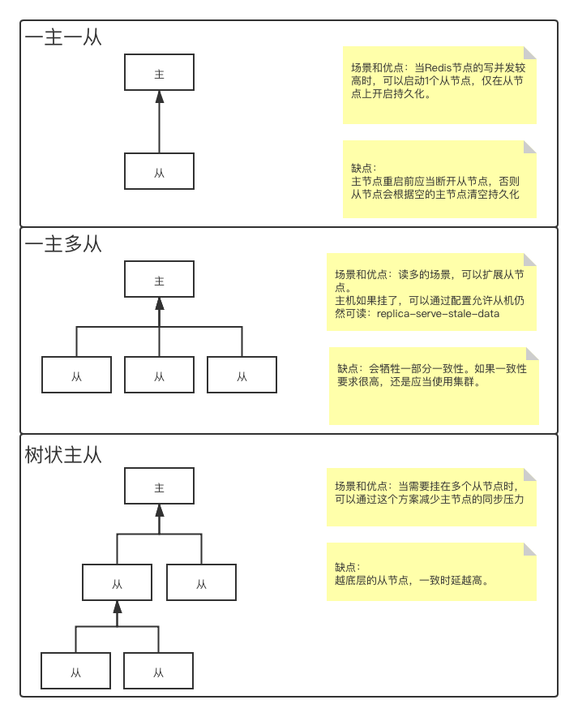
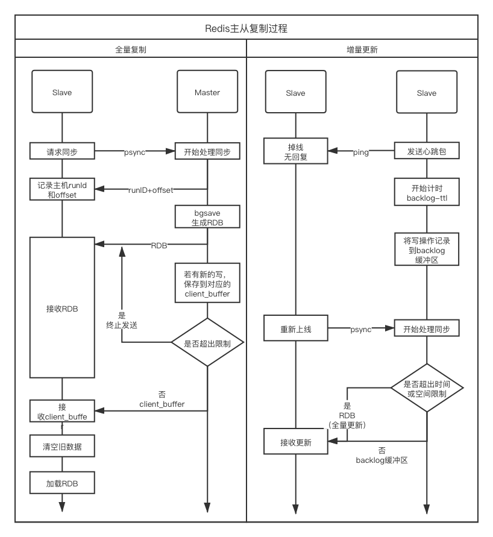

[前文](2021/01/04/Cache-02RedisAdvance/)介绍了Redis的一些进阶操作，包括管道、发布/订阅、事务，以及作为缓存时的一些注意事项，还介绍了2种持久化方式。本文将介绍在集群情况下如何配置Redis，以及会遇到什么问题。  
<!--more-->

# 单机单节点瓶颈
在单机单节点情况下，通常会有如下问题：  

1. 单点故障
2. 容量有限
3. 连接压力、计算压力  

对这三个问题有3个维度的解决方案AKF原则。

1. 全量复制：设置主节点的多个备份节点，写操作交给主节点，主节点同步给备份节点。备份节点同时可以承担一部分读操作的压力。
2. 功能拆分：将节点根据功能、服务、资源拆分成多个，1个节点服务中只存放一部分业务。
3. 数据分区：对相同功能服务资源进行细分，根据优先级（冷热）、逻辑（比如编号范围），对业务节点再拆分。  

Redis可通过主从复制或Sentinel提供全量复制的功能，通过Redis Cluster提供数据分区的功能。根据功能拆分应当由开发者根据功能、服务、资源的不同自行拆分和建立Redis连接。

针对全量复制，通常有3种方式：

1. 主机与从机（或备份节点）之间采用同步阻塞的方式传输数据。这样可以保证数据的“强一致性”，但当从节点发生故障或不可达时，会破坏可用性（即C和A不可兼得），而这与使用主从或主备模式的初衷（提高可用性）是矛盾的。  
2. 主机与从机（或备份节点）之间采用异步的方式传输数据。这样可以主机快速响应客户端请求，但是当主机宕机时，从机数据可能是不完整的。即无法达成一致性。  
3. 主机与从机之间通过一个高可用的的中间件将准备传输的数据持久化，从机慢慢消费中间件中的数据。这样主机与中间件是同步阻塞的，但时间很短；主机与从机之间是异步的。当主机宕机后，待从机消费完成中间件中的数据，再同步给主机。这样，达成最终一致性。  

  

但无论选择何种方案，最终主机都需要负担读写，也即主机仍然是一个单节点。因此，需要在主机宕机之后，将备机切换为主机，或通过备份机恢复主机，从而达到高可用（High Availability，HA）。  

为了达到高可用，如果依赖于人，显然是不可靠的。所以会交给程序进行。但如果仅启用单个监控程序，显然又是一个单点问题，所以通常又会采用集群来进行。这样，才能将发生错误的概率降低。


既然监控是一个集群，那必然存在决策的问题。此时的决策策略是过半数投票。  
所以通常这样的备份机或者从机的数量是奇数个（举个例子，5台备份机和6台备份机，他们允许自身出现问题的数量都是2台。所以在宕机容忍2台的情况下，5台更经济；而且往往6台比5台出现问题的概率更高）。  

# Redis的主从复制
Redis可以开启主从复制，这使用默认的异步复制，其特点是低延迟和高性能，是弱一致的。  

## 指令
Redis启动时默认使用的主机Master模式。  
启动后可以使用`REPLICAOF host port`指令，连接主机，将自己转换为从机。  
也可以在启动时添加启动参数`--replicaof host port`直接连接主机。  
当主机宕机或其他原因需要将从机升级为主机时，可以通过`REPLICAOF no one`切换为主机。

## 配置

```bash
# 配置从机启动时连接的主机信息
replicaof <masterip> <masterport>

# 如果主机配置了密码，通过此选项设置
masterauth <master-password>

# 当从机正在与主机同步时，从机是否允许响应客户端的请求（可能是过期的数据）
# 当掉线重连时通常是有数据的，而初次同步时通常是空的
replica-serve-stale-data yes

# 从机是否是只读的
# 当设为no时，从机可以作为临时缓存，在同步后会删除数据
replica-read-only yes

# 不启用diskless，则主机将RDB先写到硬盘，在传送给从机
# 启用diskless，则主机直接将RDB从内存通过网络传送给从机，适合网络带宽大的情况。通过后一个参数设置等待从机连接到主机的时延
repl-diskless-sync no 
repl-diskless-sync-delay 5

# 在从机断开连接的ttl秒内，主机会有一个size大小的空间记录这一段时间的增量更新。如果从机下次连接时这个空间已经溢出或者时间超过ttl，则直接全量更新
repl-backlog-size 1mb
repl-backlog-ttl 3600 # 0表示永不超时

# 如果下面2个参数都是非0的话，启用。
# 从上一次主机ping从机得到回应开始的lag秒内，如果不足min-to-write个从机在线，则主机阻塞客户端的写操作。
min-replicas-to-write 0 # 默认是0
min-replicas-max-lag 10 # 默认是10
```

## 说明
当主机上注册了从机后，主机会将本机完整的RDB发给从机
如果从机是掉线重连的主机，在一定时间内，只会发送增量部分。当然如果从机启用了AOF，由于其中没有记录主机的相关信息，所以还是会请求全量RDB。  

## 通常的主从结构拓扑

通常有三种主从结构的拓扑。

1. 一主一从：即一个主机挂载一个从机。通常用于对主机的并发写操作很多的情况下。在此种目的下，通常会关闭主机的持久化，而将持久化工作交给从机，以提高主机的吞吐量。但是需要注意，如果主机宕机，重新上线之前，一定要断开从机对主机的连接，不然主机会将空库同步给从机，造成持久化数据丢失。
2. 一主多从：即一个主机并列挂载多个从机。当读操作较多时，可以通过从机进行读写分离。即使在主机宕机时，从机依然可以通过启用`replica-serve-stale-data`来允许此时客户端的读操作（默认开启）。当然主从复制会牺牲一定的一致性，如果对一致性要求很高，还是应该使用集群模式。
3. 树状主从：即从机挂载从机。当需要很多从机时，为了避免主机同步造成的IO压力，可以将一部分从机挂载在某些从机下。  

  

## 主从复制逻辑
主从复制有全量复制和增量复制两种，具体过程如下图：

  

其中client_buffer是指：
```bash
client-output-buffer-limit <class> <hard limit> <soft limit> <soft seconds>
```
表示在特定`class`的情况下，如果向客户端写的缓冲区存储持续超过`soft limit`达到`soft seconds`秒，或者瞬时存储超过`hard limit`，则断开与`class`的连接。其中`class`可选`normal`（普通情况下，包括事务）、`replica`（主从复制时）、`pubsub`（订阅发布时）。  

backlog缓冲区及ttl是指通过`repl-backlog-size`和`repl-backlog-ttl`设置的增量更新缓冲区。  

## 总结优缺点
优点：  

1. 一个Master可以同步多个Slave
2. Slave可以呈树状，以分担Master的同步压力
3. Master和Slave均以异步方式进行复制，不会阻塞客户端对Master的请求
4. Master可以将持久化任务交给Slave完成，降低Master的IO压力
5. 自动完成复制

缺点：

1. Redis不具备自动容错和恢复功能，需要等待服务重启或手动切换IP
2. 主机宕机前的部分数据可能无法及时同步到从机，此时切换IP会造成数据不一致。
3. Redis的RDB会对内存有一定的压力


# 哨兵Redis Sentinel
Redis Sentinel提供三个功能：

* 监控（Monitoring）：不断检查Master和Slave是否正常运作
* 提醒（Notification）：当被监控的Redis服务器出现问题，可以通过API向管理员或其他应用程序发送通知
* 自动故障迁移（Automatic failover）：当Master宕机，会开始自动故障迁移操作，将失效的Master的一个Slave升级为Master，并通知其他相关Slave向新的Master复制；当客户端湿度连接失效的Master时，也会向客户端返回新的Master地址，以取代宕机的。

Sentinel通过这条命令启动：
```bash
redis-server /path/to/conf.conf --sentinel
```

Sentinel通过Master的发布订阅通道获知其他Sentinel的信息。


## 重要配置项
配置文件模板在源码目录的sentinel.conf中。  
重要的配置项有：
```bash
# sentinal服务的端口号
port 26379

# 
```