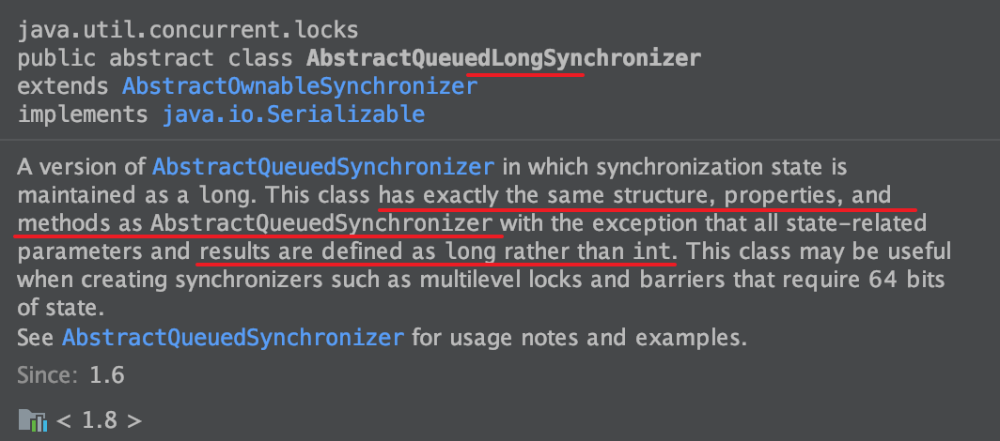

前文中主要线程的原理、进程内线程同步的原理、以及JUC中常用或常问的工具类的用法和特点进行介绍。本文将对JUC中各个工具类的基础——AQS——进行源码级细致分析。
<!--more-->
# AbstractQueuedSynchronizor
前文JUC中的工具类中，不使用`synchronized`，是如何实现阻塞和阻塞队列的呢？答案就是，这些类中都存在一个（大部分都命名为`Sync`）继承自`java.util.concurrent.locks.AbstractQueuedSynchronizer`（也就是AQS）的内部类，通过其实例化生成的对象（通常命名为`sync`）进行上锁、***阻塞***、排队、解锁的过程。  
接下来，以`ReentrantLock`为例，看一看AQS是如何实现这一功能的。  

# AQS的基本构造
AQS是由一个双向链表构成的，其结点是`java.util.concurrent.locks.AbstractQueuedSynchronizer.Node`。`Node`中有一些属性，来一个个看一下：
```java
// java.util.concurrent.locks.AbstractQueuedSynchronizer.Node
volatile int waitStatus;
volatile Node prev;
volatile Node next;
volatile Thread thread;
Node nextWaiter;
```
* `waitStatus`：当前结点的等待状态。初始化为0，表示是普通的一个同步线程结点；初始化为`CONDITION`(值为`-2`)，表示这个结点是通过`condition.await()`进行阻塞的。此外还有一些可选的值可以在运行时被赋值，如`CANCELLED`（值为`1`）表示该线程获取锁的过程（因为timeout超时或interrupt中断）已经被取消了、`SIGNAL`(值为`-1`)、`PROPAGATE`（值为`-3`）。总的而言，大部分情况下不需要去判断这些特定的值，只需要根据符号就可以了，正值就表示已经被取消了，负值则表示正处于等待状态。
* `prev`：前驱结点。只有在入队的时候才会被赋值，在出队的时候才会被设为null。
* `next`：后继结点。只有在入队的时候才会被赋值，当某结点被取消（`CACELLED`）的时候会被修改（修改为指向自己以示标记，也为了能更好地GC），在出队的时候才会被设为null。从这种意义上来说，next为null不能表示这个结点就在队尾。
* `thread`：用于记录这个结点表示的thread。在入队的时候赋值，当当被取消或者被设为头结点（开始使用这个线程）时，设为null
* `nextWaiter`：专门用于`Condition`的等待队列，因为`Condition`是独占的，所以只需要一个单向链表就可以了。当`Condition`被唤醒，结点将重新被加入上面的双向链表等待队列去重新获取锁。

然后，在AQS中，有声明为该Node类型的属性，记录该双向队列的头尾结点。
```java
// java.util.concurrent.locks.AbstractQueuedSynchronizer
private transient volatile Node head;
private transient volatile Node tail;
private volatile int state;
```

* `head`：等待队列的头。因为头结点是当前正在使用的结点，所以`head.waitStatus`绝对不会是`CANCELLED`
* `tail`：等待队列的尾。只能通过入队方法（`enq(Node)`）修改，来添加一个结点
* `state`：同步的状态。对于`ReentrantLock`而言，就是重入的次数，初始化时为0，在同一线程中每lock一次就+1，每unlock一次就-1，当回到0时，就说明这个锁可以释放了。

# ReentrantLock的实现
先看一下`ReentrantLock`是如何实现的。
## 加锁和等待
### 公平与非公平的第一次对比
首先看一下加锁。`ReentrantLock.lock()`中只有一句话：`sync.lock()`。而根据`new ReentrantLock(boolean fair)`中`fair=true`或`fair=false`（默认为`false`，sync可能有2种实现：`ReentrantLock.FairSync`和`ReentrantLock.NonfairSync`，也就是公平锁与非公平锁。
```java
// ReentrantLock.FairSync
final void lock() {
    acquire(1);
}
// ReentrantLock.NonfairSync
final void lock() {
    if (compareAndSetState(0, 1))
        // 通过CAS将state从0设为1成功，即说明抢占成功
        // 将锁的独占线程设为当前线程
        setExclusiveOwnerThread(Thread.currentThread());
    else
        // 抢占失败，走正常的上锁逻辑
        acquire(1);
}
```
所以说，公平锁就是走正常的获取锁流程；而非公平锁，则首先抢占式先通过CAS的方式改变一下锁的`state`（将`state`通过CAS设为`1`，如过成功，则将锁的独占线程`thread`变量设为当前线程），失败的话，再走正常的获取锁流程。  

### 开始获取锁
接下来看看`acquire()`怎么做。  
```java
// AbstractQueuedSynchronizer#acquire
public final void acquire(int arg) {
    if (!tryAcquire(arg) && acquireQueued(addWaiter(Node.EXCLUSIVE), arg))
        selfInterrupt();
}
```
这里就又回到了AQS中。if中有两个条件，通过`&&`连接，如果第一个条件满足，则短路第二个表达式。  
第一个表达式是`tryAcuire(1)`，也就是尝试获取锁。如果成功的话，直接执行selfInterrupt()，如果失败则执行第二个表达式。
第二个表达式是`acquireQueue(addWaiter(Node.EXCLUSIVE), 1)`，看样子是先将结点作为独占结点加入等待队列，然后开始等待。  
如果最终if返回`true`，则会执行`selfInterrupt()`，这个就很简单，当前线程中断。看来是在什么地方进入了等待状态，可以相应interrupt的那种。
```java
// AbstractQueuedSynchronizer#selfInterrupt
static void selfInterrupt() {
    Thread.currentThread().interrupt();
}
```

### 首先，尝试获取锁
那么就先看看`tryAcquire(1)`吧。这里根据公平锁或者非公平锁，又有两种实现。  
先看看公平的方式：
```java
// ReentrantLock.FairSync#tryAcquire
protected final boolean tryAcquire(int acquires) {
    final Thread current = Thread.currentThread();
    // 获取重入次数
    int c = getState();
    if (c == 0) {
        // 如果重入次数为0
        if (!hasQueuedPredecessors() && compareAndSetState(0, acquires)) {
            // 如果不需要排队竞争，直接可以进入队列
            // 且通过CAS成功将state从0设为1
            // 则将锁的独占线程thread设为自己，返回获取成功
            setExclusiveOwnerThread(current);
            return true;
        }
    }
    else if (current == getExclusiveOwnerThread()) {
        // 如果当前线程就是锁的独占线程，说明是重入
        // 那么就增加一次重入次数，acquires传入的是1，返回获取成功
        int nextc = c + acquires;
        if (nextc < 0)
            throw new Error("Maximum lock count exceeded");
        setState(nextc);
        return true;
    }
    // 返回获取失败
    return false;
}
```
也就是，如果当前锁没有被被占有，那么就通过CAS尝试获取（因为可能判断的时候还没有，但是设置的时候就有其他线程竞争了，通过CAS保证只有一个线程能够成功占有）；如果锁当前已经被占有了，但是是被当前线程占有的，那么就增加一次重入；不然的话，就占有失败。  

而非公平的情况是这样的：
```java
// ReentrantLock.NonfairSync
protected final boolean tryAcquire(int acquires) {
    return nonfairTryAcquire(acquires);
}
// Sync#nonfairTryAcquire
final boolean nonfairTryAcquire(int acquires) {
    final Thread current = Thread.currentThread();
    int c = getState();
    if (c == 0) {
        if (compareAndSetState(0, acquires)) {
            setExclusiveOwnerThread(current);
            return true;
        }
    }
    else if (current == getExclusiveOwnerThread()) {
        int nextc = c + acquires;
        if (nextc < 0) // overflow
            throw new Error("Maximum lock count exceeded");
        setState(nextc);
        return true;
    }
    return false;
}
```
可以看到，非公平与公平的方式，只在于公平的方式在重入次数为0时，需要额外判断一个`!hasQueuedPredecessors()`。  
```java
// AbstractQueuedSynchronizer#hasQueuedPredecessors
public final boolean hasQueuedPredecessors() {
    Node t = tail; 
    Node h = head;
    Node s;
    return h != t &&
        ((s = h.next) == null || s.thread != Thread.currentThread());
}
```
那么这个方法的注释有50行，比代码长10倍（代码是5行），但还是看的有点迷糊。具体是干什么的呢？我想了半天没有合适的措辞，好在有[大佬](https://blog.csdn.net/weixin_38106322/article/details/107154961)已经整理过了，我再分情况复述一下： 

首先先给这个函数一个中文表述：当前线程准备获取锁了，是否需要排队，是的话返回true，不需要排队的话返回false。接下来分情况讨论。

* 返回false：
    * `h != t`为`false`：说明h和t相等。
        * 两个都是null，就说明队列才刚刚初始化，那队列中自然不会有与当前结点相关的结点了。
        * 两个不是null但是相等，就说明队列中只有这1个元素。但是由于这个队列中的头结点不参与排队，所以当前线程的结点可以直接入队。
    * `h != t`、`h.next == null`、`h.next.thread ！=currentThread`都是`false`：这三个条件分别是说，虽然头结点与尾结点不同，头结点有后继结点，头结点的后继结点代表的线程就是本线程。说明本线程正好排队排到了，那就不用再排队了。
* 返回true：
    * `h != t`和`h.next == null`都为`true`。前者说明队列中有不止一个元素，后者说明头结点的后继结点为空。这可能发生在下面的代码处，因为head和tail都是懒初始化的，所以第一次运行入队时，头尾都是null。因此需要创建一个伪结点进行占位。所以`new Node()`之后，正式调用setHead()设置真头结点之前，会存在`head.next == null`的情况，这一情况不一定是本线程造成的（或者说应该不是本线程造成的，因为本线程还没有执行过`enq()`方法），所以应当去排队。（这里感觉大佬说的不太对，我按照自己的理解重新写在这里）。
    * `h != t`为`true`，`h.next == null`为`false`，`h.next.thread ！=currentThread`为`true`：既然队列中不止一个结点，且下一个结点不是本线程的结点，那就乖乖去排队把。
```java
// AbstractQueuedSynchronizer#enq
private Node enq(final Node node) {
    for (;;) {
        Node t = tail;
        if (t == null) { 
            if (compareAndSetHead(new Node()))
                // after set a new Node without setting next
                tail = head;
        } else {
            node.prev = t;
            if (compareAndSetTail(t, node)) {
                t.next = node;
                return t;
            }
        }
    }
}
```

### 尝试失败，去排队
tryAcquire失败之后，就会执行if的第二个表达式：`acquireQueued(addWaiter(Node.EXCLUSIVE), 1)`。
先看看`addWaiter(Node.EXCLUSIVE)`。
```java
// AbstractQueuedSynchronizer#addWaiter
private Node addWaiter(Node mode) {
    // 创建一个本线程的结点
    Node node = new Node(Thread.currentThread(), mode);
    // 先快速尝试一下
    Node pred = tail;
    if (pred != null) {
        node.prev = pred;
        if (compareAndSetTail(pred, node)) {
            // 一发入魂，直接将本结点插入为尾结点
            pred.next = node;
            return node;
        }
    }
    // 尾结点为空，或者没有一发入魂，那么就自旋入队
    enq(node);
    // 返回当前结点
    return node;
}
// AbstractQueuedSynchronizer#enq
private Node enq(final Node node) {
    // 不断自旋，直到成功
    for (;;) {
        Node t = tail;
        if (t == null) { 
            // 如果尾结点为空，那么此时头结点应该也是空的
            if (compareAndSetHead(new Node()))
                // 头尾结点设为相同，然后再次自旋
                tail = head;
        } else {
            // 先将node的前驱设为现在的尾结点，
            node.prev = t;
            // 然后将尾结点设为node
            if (compareAndSetTail(t, node)) {
                // 原来的尾结点的后继结点设为node，串联成双向链表
                t.next = node;
                return t;
            }
        }
    }
}
```
首先进行一次快速插入队尾操作，当然前提是队列存在（队尾如果为null就说明队列还没有初始化过），成功的话就直接结束了。失败的话，就通过`enq()`方法进行入队。  
`enq()`中通过`for(;;)`进行自旋。如果队列不存在，就创建一个伪结点对头尾结点占位，然后再次自旋，尝试将node插入到队尾，不断自旋直到插入成功。  
最后，`addWaiter()`返回当前线程的结点`node`，作为`acquireQueued`的参数。
```java
final boolean acquireQueued(final Node node, int arg) {
    boolean failed = true;
    try {
        boolean interrupted = false;
        // 自旋
        for (;;) {
            // 获得当前node的前驱结点
            final Node p = node.predecessor();
            // 如果前驱是head，尝试获取锁
            if (p == head && tryAcquire(arg)) {
                // 获取成功，本结点升级为头结点
                setHead(node);
                p.next = null; // help GC
                failed = false;
                // 返回在等待过程中，是否发生过中断
                return interrupted;
            }
            if (shouldParkAfterFailedAcquire(p, node) && parkAndCheckInterrupt())
                // 如果需要park而且真的park了，而且然后又被interrupt打断park了
                // 那么就要记录此次打断并返回。
                interrupted = true;
        }
    } finally {
        if (failed)
            cancelAcquire(node);
    }
}
```
我们先看一下`shouldParkAfterFailedAcquire(p, node) && parkAndCheckInterrupt()`。
```java
// AbstractQueuedSynchronizer#shouldParkAfterFailedAcquire
private static boolean shouldParkAfterFailedAcquire(Node pred, Node node) {
    int ws = pred.waitStatus;
    if (ws == Node.SIGNAL)
        // 如果前驱的waitStatus是SIGNAL
        // 那么就可以去park了
        return true;
    if (ws > 0) {
        // 如果被取消了，那么就向前找第一个还活着的
        do {
            node.prev = pred = pred.prev;
        } while (pred.waitStatus > 0);
        pred.next = node;
    } else {
        // 如果前驱是其他存活状态
        // 就尝试将前驱的waitStatus设为SIGNAL
        compareAndSetWaitStatus(pred, ws, Node.SIGNAL);
    }
    return false;
}
// AbstractQueuedSynchronizer#parkAndCheckInterrupt
private final boolean parkAndCheckInterrupt() {
    LockSupport.park(this);
    return Thread.interrupted();
}
```
前一个方法用于判断本线程是否可以去park也就是休息。这里根据前驱结点分为几种情况。  

* `pred.waitStatus == SIGNAL`：这个就表示前驱结点在完成后，会通知其后继结点（也就是本结点），那么本结点就可以不再自旋了，节省CPU资源。  
* `pred.waitStatus > 0`：前驱结点竞争锁的过程已经被取消了。那么就向前找第一个还存活的结点，作为本结点的前驱结点，其他中间的被取消的结点就会被GC掉。  
* `otherwise`：其他情况下，也就是其他存活状态下，就通过CAS尝试将前驱结点的`waitStatus`设为`SIGNAL`，如果设置失败了，就回到`acquireQueued`方法中自旋再试一次（说不定那时候，前驱结点就编程头结点了，那本结点就不用park了）。  

如果确认可以park了，就进入`parkAndCheckInterrupt`方法，执行`LockSupport.park(this)`。这时候，能够唤醒park的有两种方式：
* `LockSupport.unpark(thread)`：这是通过`AbstractQueuedSynchronizer#unparkSuccessor`方法可以执行到的。通过`unpark`来终止`park`不会改变线程的`interrupted`标志位。
* `thread.interrupt()`：通过某个线程实例的`interrupt()`方法（注意不是静态方法`Thread.interrupted()`）。这时，虽然`park`会醒来，但是不会抛出异常，但是当前线程的`interrupted`标志位会置位。  
正因为`park()`方法可能会消费`thread.interrupt()`造成的中断，却不会抛出异常，所以需要将这次中断记录下来。  

这时候就再次回到了外层的`for(;;)`循环也就是自旋过程中。如果本结点的前驱结点是头结点（也就是说本结点是队列的第一顺位），而且tryAcquire成功的话，那么本结点就可以去获取资源了。当然了，中间如果出现了任何异常，那就滚落到finally代码块中，执行cancelAcquire过程。

### 取消

```java
private void cancelAcquire(Node node) {
    // 结点还未创建的话，无视
    if (node == null)
        return;
    // 先将持有的线程引用置空
    node.thread = null;
    // 将前驱以及前驱的前驱，只要是已经取消的，都跳过
    Node pred = node.prev;
    while (pred.waitStatus > 0)
        node.prev = pred = pred.prev;
    // 本结点的前驱结点的后继结点
    Node predNext = pred.next;
    // 将本结点的waitStatus设为CANCELLED
    node.waitStatus = Node.CANCELLED;
    if (node == tail && compareAndSetTail(node, pred)) {
        // 如果本结点是尾结点，且成功将本结点的前驱设为新的尾结点（也就是本结点出队成功）
        // 就尝试将新的尾结点的后继结点设为null
        compareAndSetNext(pred, predNext, null);
    } else {
        // 失败的话
        int ws;
        if (pred != head &&
            ((ws = pred.waitStatus) == Node.SIGNAL ||
                (ws <= 0 && compareAndSetWaitStatus(pred, ws, Node.SIGNAL))) &&
            pred.thread != null) {
            // 如果前驱的后继结点需要唤醒（SIGNAL）
            // 或者虽然是其他状态但是成功设置为SIGNAL
            // 就尝试将前驱结点的后继设为当前结点的后继（也就是将本结点从队列中remove）
            Node next = node.next;
            if (next != null && next.waitStatus <= 0)
                compareAndSetNext(pred, predNext, next);
        } else {
            // 唤醒本结点
            unparkSuccessor(node);
        }
        // 将node的后继指向自己
        // （作为CANCEL的标志，也为了方便GC）
        node.next = node; 
    }
}
```

这样，加锁和排队的过程就是这样了。

## 释放锁
然后看一下解锁。`ReentrantLock.unlock()`中同样只有一句话：`sync.release(1)`。而AQS的release方法是这样的：
```java
// AbstractQueuedSynchronizer#release
public final boolean release(int arg) {
    if (tryRelease(arg)) {
        // 尝试release成功
        Node h = head;
        if (h != null && h.waitStatus != 0)
            // unpark head的后继结点
            unparkSuccessor(h);
        return true;
    }
    // 尝试release失败
    return false;
}
```
过程很清晰，尝试释放`arg`（这里是`1`），如果返回`true`，就`unparkSuccessor(head)`也就是unpark后继结点；如果尝试释放返回`false`，则`release`返回`false`。  
那么`tryRelease`是如何实现的呢？由于以`ReentrantLock`为例，所以要看`ReentrantLock`中对`tryRelease`的覆盖：  
```java
// ReentrantLock.Sync#tryRelease
protected final boolean tryRelease(int releases) {
    // state 减1
    int c = getState() - releases;
    if (Thread.currentThread() != getExclusiveOwnerThread())
        throw new IllegalMonitorStateException();
    boolean free = false;
    if (c == 0) {
        // 如果state 减1之后是0，说明重入次数清零，可以释放
        free = true;
        setExclusiveOwnerThread(null);
    }
    setState(c);
    return free;
}
```
这里的`getState()`就是获取的`state`，可以理解还没有被抵消的重入（Reentrant）次数，减去`releases`也就是1，那么c就是在抵消本次重入后还剩的冲入次数。如果这个值是0，那么就应该准备释放这个锁了，首先要将这个锁的独占线程从自己设为`null`(`setExclusiveOwnerThread(null)`)。
如果`c`是`0`也就是说重入次数已经清零的话，那么就可以释放锁了，所以返回`true`。这样的话，就进入`unparkSuccessor`方法：
```java
// AbstractQueuedSynchronizer#unparkSuccessor
private void unparkSuccessor(Node node) {
    // 获取头结点的waitStatus
    int ws = node.waitStatus;
    if (ws < 0)
        // 小于0，则通过CAS将waitStatus改为0
        // 即使失败了也没有关系，因为头结点一定是有效的
        compareAndSetWaitStatus(node, ws, 0);
    // 从后往前找离头结点最近（离尾结点最远）的那个仍然存活（waitStatus<=0)的后继结点
    Node s = node.next;
    if (s == null || s.waitStatus > 0) {
        s = null;
        for (Node t = tail; t != null && t != node; t = t.prev)
            if (t.waitStatus <= 0)
                s = t;
    }
    // 将这个仍然存活的最优先的结点unpark，唤醒开始工作
    if (s != null)
        LockSupport.unpark(s.thread);
}
```
首先，如果头结点的`waitStatus`如果小于0，则先尝试将头结点的waitStatus置为0，这里即使失败了也没有关系，因为头结点能够保证是未被取消的：
```java
// AbstractQueuedSynchronizer#head
/**
* Head of the wait queue, lazily initialized.  Except for
* initialization, it is modified only via method setHead.  Note:
* If head exists, its waitStatus is guaranteed not to be
* CANCELLED.
*/
private transient volatile Node head;
```
然后从后往前找最前面的一个未被取消（`waitStatus<=0`的结点）且不是head的结点（`t!=node`，而`node`是传入的`head`）。为什么要从后往前找呢，首先这是一个双向链表，本来是可以通过`head.next`去从前往后找，也可以通过`tail.prev`从后往前找的；但是由于在取消时，会将`node.next`设为自己（`node.next=node`，见`java.util.concurrent.locks.AbstractQueuedSynchronizer#cancelAcquire`的最后一行），所以可能正向链表会中断。因而采用倒序递归的方式去查找。  
接下来就调用`LockSupport.unpark(s.thread)`唤醒该线程，继续工作了。

这样，回到`AbstractQueuedSynchronizer.release(int)`方法，就能够很清晰的看懂了。如果尝试释放锁失败（`tryRelease(1)==false`，则抵消一次重入次数；如果尝试释放锁成功，则唤醒head后的首个未被取消的结点（对应的线程）。

## 对于Condition的操作
`Condition`的实现有2种，分别是`AbstractQueuedSynchronizer.ConditionObject`和`AbstractQueuedLongSynchronizer.ConditionObject`两个类就差一个Long，其区别也很简单：  
  
也就是说AQS里面的参数、结果（特别是`state`）是用`int`表示的，而AQ Long S是用`long`来表示的，其他都是一样的。  
那就用AQS中的`ConditionObject`来看一下`Condition`的加锁过程。

condition的加锁是通过`condition.await()`方法进行的，查看其在`AbstractQueuedSynchronizer.ConditionObject`中的实现：
```java
// AbstractQueuedSynchronizer.ConditionObject#await()
public final void await() throws InterruptedException {
    // 如果线程已经置位中止标志了，就抛出中止异常
    if (Thread.interrupted())
        throw new InterruptedException();
    // 将当前结点加入ConditionWaiter队列
    Node node = addConditionWaiter();
    // 释放本线程对锁的持有，保存当前的state，用于后面重新进入
    int savedState = fullyRelease(node);
    int interruptMode = 0;
    while (!isOnSyncQueue(node)) {
        // 如果这个结点不在同步队列中，则park
        LockSupport.park(this);
        if ((interruptMode = checkInterruptWhileWaiting(node)) != 0)
            // 当醒来之后，如果线程被中断了，则停止while
            break;
    }
    if (acquireQueued(node, savedState) && interruptMode != THROW_IE)
        // 确认获得锁，如果不是通过InterruptException中断的话：
        interruptMode = REINTERRUPT;
    if (node.nextWaiter != null) 
        // 如果等待队列中下一个不是null的话，做一下清理
        unlinkCancelledWaiters();
    if (interruptMode != 0)
        // 根据interruptMode决定是否需要抛出InterruptException异常
        reportInterruptAfterWait(interruptMode);
}
```
可以看到里面虽然行数不多，但是函数很多。大致的过程就是，先将本线程加入该`Condition`的等待队列中，然后释放本线程持有的锁并记录现在的冲入次数，接下来`park`直到被唤醒，唤醒之后重新进入锁的竞争队列中，直到争取到锁，根据被唤醒的原因决定是否需要抛出`InterruptException`异常。  

需要注意的是，等待队列不同于前面`lock()`的竞争队列。

### 加入Condition的等待队列
```java
// ConditionObject#addConditionWaiter
private Node addConditionWaiter() {
    Node t = lastWaiter;
    // 如果队尾被取消了，那么就清理掉队尾
    if (t != null && t.waitStatus != Node.CONDITION) {
        unlinkCancelledWaiters();
        t = lastWaiter;
    }
    Node node = new Node(Thread.currentThread(), Node.CONDITION);
    // 向队尾插入本线程对应的Condition结点
    if (t == null)
        firstWaiter = node;
    else
        t.nextWaiter = node;
    lastWaiter = node;
    return node;
}
```
这里应该比较简单，首先获取队尾结点，如果队尾被取消了，那么就在此时做一下清理工作；如果队尾为空，那么就说明等待队列还没有初始化，那么队头和队尾都设为此结点；不然的话，就说明现在队伍是存在的，将此结点插入队尾。  
所谓的清理工作（`unlinkCancelledWaiters()`）就是从头到尾遍历一下，如果发现有某个结点的状态是`CANCELLED`，就将其剔出等待队列。  
```java
private void unlinkCancelledWaiters() {
    Node t = firstWaiter;
    Node trail = null;
    // 从头遍历
    while (t != null) {
        Node next = t.nextWaiter;
        if (t.waitStatus != Node.CONDITION) {
            t.nextWaiter = null;
            if (trail == null)
                firstWaiter = next;
            else
                trail.nextWaiter = next;
            if (next == null)
                lastWaiter = trail;
        }
        else
            trail = t;
        t = next;
    }
}
```
### 释放锁并记录状态
为什么要释放锁呢，因为现在已经进入了`condition`的等待状态，如果还要继续持有锁的话，就会阻塞别的线程对锁的争用。但是后面`await`结束后，还需要重新占有锁，所以需要记录下`state`也就是重入次数，否则无法正确释放锁。
```java
final int fullyRelease(Node node) {
    boolean failed = true;
    try {
        // 获取锁的重入次数，并返回进行记录。
        int savedState = getState();
        // 释放对锁的持有
        if (release(savedState)) {
            failed = false;
            return savedState;
        } else {
            throw new IllegalMonitorStateException();
        }
    } finally {
        if (failed)
            node.waitStatus = Node.CANCELLED;
    }
}
```
`release()`就是[ReentrantLock释放锁](#释放锁)调用的那个方法，就不在进入查看了。  

### 进入等待状态
在进入等待状态之前，首先要确认一下该Node在不在竞争队列之中：
```java
// AbstractQueuedSynchronizer.ConditionObject#await()
while (!isOnSyncQueue(node)) {
    LockSupport.park(this);
    if ((interruptMode = checkInterruptWhileWaiting(node)) != 0)
        break;
}
// AbstractQueuedSynchronizer#isOnSyncQueue
final boolean isOnSyncQueue(Node node) {
    if (node.waitStatus == Node.CONDITION || node.prev == null)
        return false;
    if (node.next != null) 
        return true;
    return findNodeFromTail(node);
}
// AbstractQueuedSynchronizer#findNodeFromTail
private boolean findNodeFromTail(Node node) {
    Node t = tail;
    for (;;) {
        if (t == node)
            return true;
        if (t == null)
            return false;
        t = t.prev;
    }
}
```
如何判断在不在锁的竞争队列之中呢？如果`node`的`waitStatus`是`CONDITION`那就一定不在锁的竞争队列之中；如果`node`的前驱`null`那也一定不在竞争队列之中；如果后继不是`null`那就一定在竞争队列之中（但`node.next == null`不代表它就不在竞争队列之中）；最后还是无法判断的话，就只能从竞争队列从尾到头进行遍历来确认了。  

如果在竞争队列之中，就不能再`await`了，而应该去竞争锁。如果不在竞争队列中，那就可以进行`await`，执行`LockSupport.park()`挂起。

### Condition的唤醒
`condition`通过`signalAll()`唤醒：
```java
// AbstractQueuedSynchronizer.ConditionObject#signalAll
public final void signalAll() {
    if (!isHeldExclusively())
        // 如果不是被独占的，那说明状态出现问题了
        throw new IllegalMonitorStateException();
    Node first = firstWaiter;
    if (first != null)
        // 从队列第一个开始依次发信号
        doSignalAll(first);
}
// AbstractQueuedSynchronizer.ConditionObject#doSignalAll
private void doSignalAll(Node first) {
    lastWaiter = firstWaiter = null;
    do {
        Node next = first.nextWaiter;
        first.nextWaiter = null;
        // 依次遍历，发信号进行唤醒
        transferForSignal(first);
        first = next;
    } while (first != null);
}
// AbstractQueuedSynchronizer#transferForSignal
final boolean transferForSignal(Node node) {
    if (!compareAndSetWaitStatus(node, Node.CONDITION, 0))
        return false;
    // 将当前结点加入锁的竞争队列，返回node的前驱结点
    Node p = enq(node);
    int ws = p.waitStatus;
    if (ws > 0 || !compareAndSetWaitStatus(p, ws, Node.SIGNAL))
        // 如果前驱是取消状态，或者尝试将其设为SIGNAL失败，就立刻唤醒本结点
        // 不然的话，就是在锁的竞争队列中，直到竞争到锁才被唤醒
        LockSupport.unpark(node.thread);
    return true;
}
```
从上面可以看出，Condition的唤醒，并不是真的唤醒，而是将其从等待队列中移动到锁的竞争队列中，只有当竞争成功之后，才能被唤醒。  

### 唤醒后处理
```java
// AbstractQueuedSynchronizer.ConditionObject#await()
while (!isOnSyncQueue(node)) {
    LockSupport.park(this);
    if ((interruptMode = checkInterruptWhileWaiting(node)) != 0)
        break;
}
if (acquireQueued(node, savedState) && interruptMode != THROW_IE)
    // 更新结点关系，然后记录唤醒原因
    interruptMode = REINTERRUPT;
if (node.nextWaiter != null) 
    // 如果是取消的，那么就要清理等待队列
    unlinkCancelledWaiters();
if (interruptMode != 0)
    // 如果是非正常原因导致唤醒的，上报唤醒原因
    reportInterruptAfterWait(interruptMode);
```
被唤醒后，首先要判断一下被唤醒的原因，如果不等于0，也就是Thread的interrupted标志位被置位了，则立刻结束循环，否则继续while判断。
```java
private int checkInterruptWhileWaiting(Node node) {
    return Thread.interrupted() ?
        (transferAfterCancelledWait(node) ? THROW_IE : REINTERRUPT) :
        0;
}
```
如果while判断结点已经在同步队列中了，也结束循环。  
这时候，再次执行`acquireQueued`，因为原来的等待不是在`acquireQueued`中执行的，所以需要通过`acquireQueued`对后续结点进行更新，但是可以放心，当前结点一定在竞争队列开头，所以不会再次发生park。  
然后如果是取消的那么就清理一下等待队列中被取消的结点。如果是非正常原因被唤醒的，就将结果记录，看看需不需要抛出`InterruptException`。

# CountDownLatch
ReentrantLock是独占的，接下来来看一个共享的锁，`CountDownLatch`。
先看一下`CountDownLatch`的初始化：
```java
// CountDownLatch#CountDownLatch
public CountDownLatch(int count) {
    if (count < 0) throw new IllegalArgumentException("count < 0");
    this.sync = new Sync(count);
}
// CountDownLatch.Sync#Sync
Sync(int count) {
    setState(count);
}
// AbstractQueuedSynchronizer#setState
protected final void setState(int newState) {
    state = newState;
}
```
可以看到，CDL直接将输入的`count`作为形参，构造了`sync`对象。而Sync的构造函数中，直接调用AQS中的`setState`将AQS的state设为了`count`。

## CountDownLatch的阻塞等待
然后是`await()`。里面也是一句话：
```java
// CountDownLatch#await()
public void await() throws InterruptedException {
    sync.acquireSharedInterruptibly(1);
}
// AbstractQueuedSynchronizer#acquireSharedInterruptibly
public final void acquireSharedInterruptibly(int arg) throws InterruptedException {
    if (Thread.interrupted())
        throw new InterruptedException();
    if (tryAcquireShared(arg) < 0)
        doAcquireSharedInterruptibly(arg);
}
```
调用了`acquireSharedInterruptibly`可中断地获取共享锁。里面首先判断当前线程的interrupt标志位，然后尝试获取共享锁。
```java
// CountDownLatch.Sync#tryAcquireShared
protected int tryAcquireShared(int acquires) {
    return (getState() == 0) ? 1 : -1;
}
// ReentrantLock.FairSync#tryAcquire
protected final boolean tryAcquire(int acquires) {
    final Thread current = Thread.currentThread();
    int c = getState();
    if (c == 0) {
        if (!hasQueuedPredecessors() &&
            compareAndSetState(0, acquires)) {
            setExclusiveOwnerThread(current);
            return true;
        }
    }
    else if (current == getExclusiveOwnerThread()) {
        int nextc = c + acquires;
        if (nextc < 0)
            throw new Error("Maximum lock count exceeded");
        setState(nextc);
        return true;
    }
    return false;
}
```
从这里与独占锁`ReentrantLock.FairSync`（`UnfairSync`也是一样的）的`tryAcquire`进行对比，可以发现，`CountDownLatch`这个共享锁在判断自己是否可以获得锁的时候，并没有使用原子操作。这是因为`await`这个获取锁的方法并不需要修改锁中state的值，而仅仅根据state的值进行判断`countdown`的次数够不够了（也就是只需要读），而且`CountDownLatch`自己可以保证倒数到0之后就不会发生变化了，所以不需要上锁；而`ReentrantLock`中因为需要在`lock`时改变state，所以必须通过CAS的方式进行。
在`tryAcquireShared`中，仅仅用一个`<0`的值表示目前`CountDownLatch`的`state`还没有变成`0`。而如果`<0`的话，就要通过`doAcquireSharedInterruptibly`进行阻塞。 
```java
//  AbstractQueuedSynchronizer#doAcquireSharedInterruptibly
private void doAcquireSharedInterruptibly(int arg) throws InterruptedException {
    final Node node = addWaiter(Node.SHARED);
    boolean failed = true;
    try {
        for (;;) {
            final Node p = node.predecessor();
            if (p == head) {
                int r = tryAcquireShared(arg);
                if (r >= 0) {
                    setHeadAndPropagate(node, r);
                    p.next = null; // help GC
                    failed = false;
                    return;
                }
            }
            if (shouldParkAfterFailedAcquire(p, node) &&
                parkAndCheckInterrupt())
                throw new InterruptedException();
        }
    } finally {
        if (failed)
            cancelAcquire(node);
    }
}
// 作为对比，这里放出独占锁的acquireQueue方法：
acquireQueued(addWaiter(Node.EXCLUSIVE), arg))
// AbstractQueuedSynchronizer#acquireQueued
final boolean acquireQueued(final Node node, int arg) {
    boolean failed = true;
    try {
        boolean interrupted = false;
        for (;;) {
            final Node p = node.predecessor();
            if (p == head && tryAcquire(arg)) {
                setHead(node);
                p.next = null; // help GC
                failed = false;
                return interrupted;
            }
            if (shouldParkAfterFailedAcquire(p, node) &&
                parkAndCheckInterrupt())
                interrupted = true;
        }
    } finally {
        if (failed)
            cancelAcquire(node);
    }
}
```
可以看到，这里共享锁阻塞的方法`doAcquireSharedInterruptibly`与独占锁的`acquireQueued`也很相似。大致过程都是通过`addWaiter`将一个`SHARED`模式的结点加入竞争队列的队尾，如果当前节点位于队列最优先位置（队首元素不参与竞争），则再次确认锁是否可以被获取。如果可以获取锁，就修改竞争队列中的头结点，并返回；如果不在最优先位置的话，就根据需要进行park。  
由于是Interruptibly的，所以在被唤醒后，如果发现是通过中断唤醒的，就需要立刻将中断继续抛出。  
在这一段，获取锁失败后是否需要park的方法`shouldParkAfterFailedAcquire`和执行park的方法`parkAndCheckInterrupt`在前面都已经分析过了，这里着重看一下`setHeadAndPropagate(node, r)`这个方法。这里`node`是指当前线程代表的结点，`r`是`tryAcquireShared`的返回值，因为其`>=0`，根据方法这里`r=1`。
```java
private void setHeadAndPropagate(Node node, int propagate) {
    // 记录一下旧的head
    Node h = head; 
    setHead(node);
    if (propagate > 0 || h == null || h.waitStatus < 0 || (h = head) == null || h.waitStatus < 0) {
        Node s = node.next;
        if (s == null || s.isShared())
            doReleaseShared();
    }
}
```
这里首先先记录一下旧的队列头，因为后面要用到，然后将现在的节点设为队列头，表示接下来可以被唤醒了。  
下面的判断看起来比较复杂，但是由于第一个判断`propagate>0`在使用`CountDownLatch`时是必然成立的（因为这个`propagate`就是外面传入的`r`，只有在其`>=0`时才能传进来，而`CountDownLatch`的`r`只能取`1`或`-1`），所以后面的判断都可以短路掉。  
稍微解释一下这个`propagate`的含义，其实就是在本节点获取成功之后，还剩余的共享锁的数量。对于需要控制可共享数量的共享锁（比如`Semaphore`，可以看一下`Semaphore`的`tryAcquireShared`方法的实现）这个值可能发生变化，但对于`CountDownLatch`这种只要锁释放了，`await`的线程都可以通过的共享锁，这个值只是一个标记。  
接下来，如果node是尾节点（表示该`CountDownLatch`只要一个线程在`await`）或者后面虽然有节点，但也是共享的（比如多个线程都通过同一把`CountDownLatch`来`await`），这时候调用`doReleaseShared()`去根据需要看看要不要唤醒后面的结点。
```java
private void doReleaseShared() {
    for (;;) {
        // 先记录一下当前的头结点
        Node h = head;
        if (h != null && h != tail) {
            int ws = h.waitStatus;
            if (ws == Node.SIGNAL) {
                // SIGNAL表示当本节点被唤醒后，后继节点也需要被通知到
                if (!compareAndSetWaitStatus(h, Node.SIGNAL, 0))
                    // 如果修改状态失败了，就再次自旋
                    continue;   
                // 修改成功，唤醒后继节点
                unparkSuccessor(h);
            }
            else if (ws == 0 &&
                        !compareAndSetWaitStatus(h, 0, Node.PROPAGATE))
                continue;
        }
        // 如果在此过程中，头结点没有发生变化，就结束自旋
        if (h == head)  
            break;
    }
}
```
这边还是通过`for(;;)`进行自旋。   
首先记录一下当前的头结点，这样在最后，再判断一下，如果头结点没有发生变化，就结束自旋；如果头结点发生了变化，就说明在操作过程中，有新的节点插入了进来。那么就再次自旋，这时候获得的节点就是新的头结点，再次尝试去释放它的后继节点。  
然后判断如果头结点的`waitStatus`是`SIGNAL`的话，就表示当自己被唤醒之后，需要通知后继节点。所以，先尝试通过`CAS`将头结点的`waitStatus清`零，成功的话就通知后继节点`unpark`。  
如果头结点的`waitStatus`是`0`而且尝试修改其为`PROPAGATE`失败，那么就要跳过`h==head`的判断，以防提前中止自旋。  
所以`doRelseaseShared`的作用就是不断读取头结点，如果需要唤醒其后继节点就去唤醒后继节点。如果执行完这些操作，头结点没有发生变化的话，这一批次的修改就算告一段落，结束自旋；如果头结点发生了变化，那么就获取新的头结点去重复做这些事情，直到这一批操作结束。  
也就是说，在共享锁中，释放的时候是根据SIGNAL状态进行链式释放的（也就是PROPAGATE传播的）。  
## CountDownLatch倒数
接下来是倒数方法`countdown()`就比较简单了，上面的唤醒链需要一个导火索，也就是一个被唤醒的节点。这就要通过`countdown()`来进行：
```java
// CountDownLatch#countDown
public void countDown() {
    sync.releaseShared(1);
}
// AbstractQueuedSynchronizer#releaseShared
public final boolean releaseShared(int arg) {
    if (tryReleaseShared(arg)) {
        // 对state减arg，如果减到0了，就将锁释放
        doReleaseShared();
        return true;
    }
    return false;
}
// 作为对比，下面这个是用于独占锁的release方法
// AbstractQueuedSynchronizer#release
public final boolean release(int arg) {
    if (tryRelease(arg)) {
        Node h = head;
        if (h != null && h.waitStatus != 0)
            unparkSuccessor(h);
        return true;
    }
    return false;
}
```
这里直接调用了AQS的releaseShared方法，和独占锁的release方法格局与思路基本一致，因为`doReleaseShared`中已经包含了对head为空的判断，所以就不需要再重复了。  

```java
// CountDownLatch.Sync#tryReleaseShared
protected boolean tryReleaseShared(int releases) {
    // Decrement count; signal when transition to zero
    for (;;) {
        int c = getState();
        if (c == 0)
            return false;
        int nextc = c-1;
        if (compareAndSetState(c, nextc))
            return nextc == 0;
    }
}
// ReentrantLock.Sync#tryRelease
protected final boolean tryRelease(int releases) {
    int c = getState() - releases;
    if (Thread.currentThread() != getExclusiveOwnerThread())
        throw new IllegalMonitorStateException();
    boolean free = false;
    if (c == 0) {
        free = true;
        setExclusiveOwnerThread(null);
    }
    setState(c);
    return free;
}
```
对于独占的锁，在尝试释放的时候，需要修改其独占线程的引用，而共享的就不需要。其他的过程大同小异，就是将state减去一个值。
