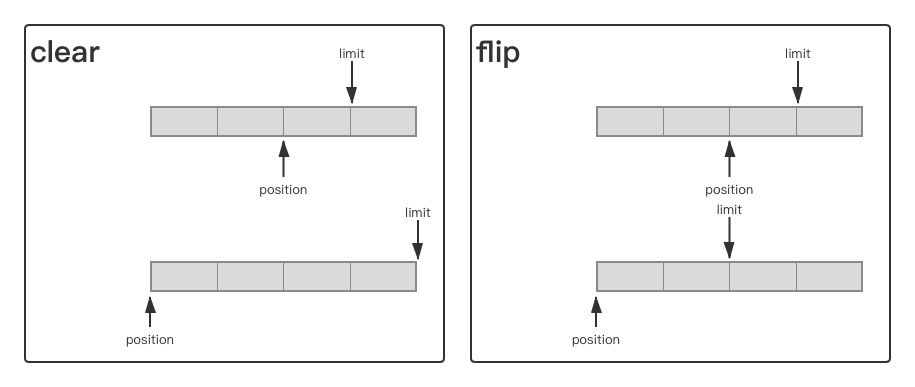
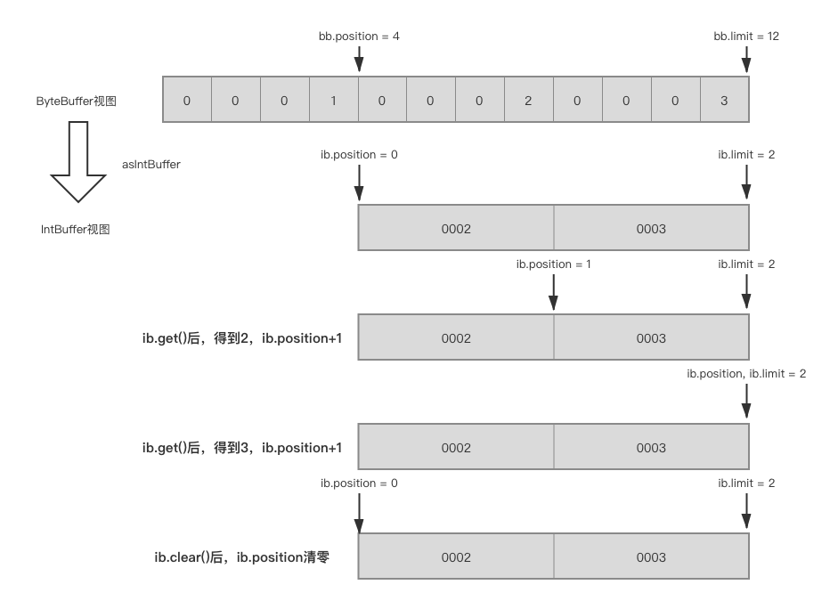

在[学习缓存的时候](2021/01/02/Cache-01Basic/)，简要认识了一下IO的变迁史。在这篇文章中，将详细介绍一下各个历史阶段中IO的变迁过程。

<!--more-->

对于UNIX系统来说，“一些皆文件”，无论是是一个txt文件、一个文件夹、一个磁盘、一个光驱、一个网络URL、一个鼠标、一个打印机，这些在UNIX的用户眼中，统统都是“文件”。也因此，这些“文件”通过`open`、`read`、`write`、`close`等操作，就可以进行基础甚至全部访问操作。一个普通的文本文件可以打开、读取、写入、关闭，一个打印机可以打开（连接）、读取（查看打印列表）、写入（打印）、关闭（断开连接），一个网络URL可以打开（连接）、读取（下载）、写入（上传/发送）、关闭（断开连接）。从这种层面上来说，UNIX的一切皆文件是一种面向接口编程的实践，对于大部分而言，这些接口传输的都是字节流。    
Windows其实也是类似的，底层大多也将各类抽象为文件，无论是串口、键盘等，都可以利用ReadFile和WriteFile进行操作。只不过为了更好的可读性，再上层再次封装，变成了各种不同的设备、对象。  

在Linux系统中，设备的驱动注册后，当有相关的设备被创建，就将注册的驱动对象写入Linux的`inode`中。在open时将驱动中的read、write等函数放入`file`结构体中的`file_operations`中，并返回file结构体的索引file descriptor（也就是fd）。这样当通过fd调用read、write等指令时，通过`file_operations`就可以调用到驱动中的各个方法了。（相关结构体可以参见[这篇文章](https://www.linuxidc.com/linux/2017-02/140227.htm)）  

因为操作系统的资源是有限的，如果不对访问进行区分，可能会造成访问间的冲突。Inter的X86架构划分了R0~R3特权等级，R0权限最高，R3权限最低。Linux通常使用R0和R3，R0就是内核态，R3就是用户态。当在用户态下调用内核态的方法时，就需要从用户态切换到内核态。所以上面提到的IO操作就涉及到了用户态向内核态的切换。这个过程相对比较占用资源，因为需要将用户态的上下文保存下来，完事还要恢复现场，同时由于内核不信任用户，还需要做一些校验和检查，零零总总的操作有可能比实际执行的函数耗时还要长。在IO密集的情况下，这个损耗是不可容忍的。  

正因如此，在IO的变迁，就是在不断降低阻塞的时间，减少开销，提高程序的执行效率。

# 阻塞/非阻塞与同步/异步
首先需要明确几个概念。什么是阻塞与非阻塞，什么是同步与异步。  
我们知道，读取一个IO端口，有2步。首先是检查有无数据就绪，可以读取；然后是将就绪的数据从内核中拷贝到用户空间中。  
检查有无数据就绪这个过程可以是阻塞的，也就是一直等待，直到有数据就绪；也可以是非阻塞的，也就是发现没有数据就绪，就先去执行别的事情，稍后再来检查。  
将数据从内核拷贝到用户控件，可以是与用户的其他指令同步的，也就是拷贝完成了再执行其他的执行；也可以是异步的，也就是一边拷贝，一边用户执行其他的指令。  

举一个不太恰当的例子，对于烧水的这个过程，将水在烧水壶中烧开，然后倒入热水壶中备用。如果使用普通的烧水壶，我不知道水什么时候开，如果一直观察水开了没有，直到水开了倒出热水，再做其他的事情，这就是阻塞同步的。如果我时不时过来看一眼水开了没有，没开的话我就先去做别的事情，但是当水开了我还是要停下其他的工作把开水倒出来，这就是非阻塞同步的。如果我买的是一个高科技热水壶，我只需要给它下一个烧水的指令，烧好了之后它能自动倒出热水到热水壶中，而我在此期间可以去左点其他的事情，这就是非阻塞异步的。在这个例子中，开水就是我需要的数据，烧水壶就是内核态的容器，检查水开了没有就是检查数据是否就绪，将开水从烧水壶倒入热水壶就是将数据从内核中拷贝到用户空间。  

# BIO——Blocking IO

最初的IO是完全阻塞的同步的。这就是BIO。
在Java中，最简单的写法就是各种XXXInputStream和OutputStream。常见的有`FileInputStream`、`ChannelInputStream`、`SocketInputStream`等等。

既然是Blocking IO，那么它在inputStream.read处就是阻塞的，直到数据准备完成才会返回。这在文件系统上不是很明显，但是在socket上就非常明显了。相关代码就不展示了，很基础。  

这里需要说的是用户态与内核态的切换造成的性能损耗。我们假设有10个字符需要通过write写入文件。如果我1个字符1个字符的调用write，那么需要调用10次，需要进行10次“用户态-内核态-用户态”的切换。但是如果我一次性将10个字符都交给内核，那么就只需要进行1次“用户态-内核态-用户态”的切换。可以想见后者的效率理论上应该更高。  

Java的BufferedOutputStream就是后一种想法的实现。我们可以做一个实验。不过上面的说法是相同的数据比较时间长短，要准备一个大文件比较麻烦，这里反过来，相同时间比较数据写入的速度。  
以下代码位于我的[github仓库learnIO中](https://github.com/discko/learnio/tree/master/nio/src/main/java/space/wudi/learnio/io)
```java
// TestBioBuffer.java
public class TestBioBuffer {
    private static volatile boolean flag;
    private static final int delay = 5000;  // delay 5 seconds
    public static void main(String[] args) throws IOException {
        test(1);
        test(10);
        test(100);
        test(8*1024);
        test(16*1024);
        test(24*1024);
    }
    private static void test(int bytesEachTime) throws IOException {
        // write bytesEachTime bytes at once with and without buffer
        System.out.println("------------test "+bytesEachTime+" bytes each time");
        byte[] data = getData(bytesEachTime);
        Timer timer1 = startTimer();
        testWithoutBuffer("/tmp/WithoutBuffer.txt."+bytesEachTime, data);
        timer1.cancel();
        Timer timer2 = startTimer();
        testWithBuffer("/tmp/WithBuffer.txt."+bytesEachTime, data);
        timer2.cancel();
    }
    // create and start a timer to stop the loop after delay
    private static Timer startTimer(){
        flag = true;
        Timer timer = new Timer();
        timer.schedule(new TimerTask() {
            public void run() { flag = false; }
        }, delay);
        return timer;
    }
    private static byte[] getData(int len){
        byte[] bytes = new byte[len];
        for(int i=0;i<len;i++){
            bytes[i]='a';
        }
        return bytes;
    }
    private static void testWithoutBuffer(String filename, byte[] data) throws IOException {
        // directly use FileOutputStream, without buffer
        try (FileOutputStream fos = new FileOutputStream(filename)){
            while (flag) {
                fos.write(data);
            }
            fos.flush();    // force flush to disk
        }
        // check file size
        System.out.println("output without buffer done. size = " + new File(filename).length());
    }
    private static void testWithBuffer(String filename, byte[] data) throws IOException {
        // use a buffered OutputStream to output to file
        // 2nd parameter of new BufferedOutputStream is buffer size, default is 8192B
        try(BufferedOutputStream bos = new BufferedOutputStream(new FileOutputStream(filename)/*, 16*1024*/)) {
            while (flag) {
                bos.write(data);
            }
            bos.flush();    // force flush to dist
        }
        // check file size
        System.out.println("output with buffer done.    size = " + new File(filename).length());
    }
}
```

首先是默认buffer大小的情况下（8k）： 

> ------------test 1 bytes each time
output without buffer done. size = 1696000
output with buffer done.    size = 236268904
------------test 10 bytes each time
output without buffer done. size = 19415060
output with buffer done.    size = 2902987640
------------test 100 bytes each time
output without buffer done. size = 158360000
output with buffer done.    size = 4002388300
------------test 4096 bytes each time
output without buffer done. size = 3118297088
output with buffer done.    size = 4433104896
------------test 8192 bytes each time
output without buffer done. size = 5410914304
output with buffer done.    size = 5402279936
------------test 16384 bytes each time
output without buffer done. size = 7075823616
output with buffer done.    size = 6856409088

然后是buffer大小为16k的情况下：  

>------------test 1 bytes each time
output without buffer done. size = 2017573
output with buffer done.    size = 240117056
------------test 10 bytes each time
output without buffer done. size = 19067480
output with buffer done.    size = 3281763900
------------test 100 bytes each time
output without buffer done. size = 161144400
output with buffer done.    size = 5610525300
------------test 8192 bytes each time
output without buffer done. size = 4813963264
output with buffer done.    size = 6567288832
------------test 16384 bytes each time
output without buffer done. size = 6554075136
output with buffer done.    size = 6761381888
------------test 24576 bytes each time
output without buffer done. size = 7432421376
output with buffer done.    size = 6854615040

可以看到，在每一次输出的数量很少的情况下，BufferedOutputStream的效率是很高的。如果每次输出1个字节，BufferedOutputStream的速度甚至可以达到FileOutputStream的100倍（应该与硬盘也有关系）。  
但随着单次输出的大小的提高，当达到与buffer size接近时，BufferedOutputStream的优势不再，反而因为不断地将数据复制到buffer中，反而浪费了不少的时间。  
当单次输出的数量超过buffer size时，因为封装的层次和调用栈的加深，BufferedOutputStream反而落了下风。  

从BufferedOutputStream.write的源码中也可以看出来它的取舍：
```java
// java.io.BufferedOutputStream
public synchronized void write(byte b[], int off, int len) throws IOException {
        if (len >= buf.length) {
            // 当要输出的大小超过本身buffer的大小时
            // 不经过buffer中转，直接输出
            flushBuffer();
            out.write(b, off, len);
            return;
        }
        if (len > buf.length - count) {
            flushBuffer();
        }
        // 将数据复制到buffer中
        System.arraycopy(b, off, buf, count, len);
        count += len;
    }
```

人们常说的计算机IO的位置，CPU的寄存器是第一级存储，速度最快大小最小；然后是各级CPU缓存；接下来是内存；次之是硬盘；最末是网络。一般来说IO只认为是最后两个的输入和输出。从这个排序也可以看出，对于本地磁盘上的IO速度还不一定是最慢的，网络传输的延时不确定性才是IO真正的瓶颈所在。  

举个例子：
```java
ServerSocket server = new ServerSocket();
while(true){
    Socket client = server.accept();
    new Thread(new ClientHandler(client)).start();
}
```
上面这种写法是常见的Socket处理方式。因为对client的IO是阻塞的，为了能够同时处理多个Socket连接的IO，需要为每一个Socket连接开辟新线程。  


# ByteBuffer使用
通过`ByteBuffer.allocate(capacity)`或者`ByteBuffer.allocateDirect(capacity)`可以在堆内或者堆外（直接内存）开辟一块`capacity`大小的空间作为Buffer使用；也可以通过`ByteBuffer.wrap(byte[])`等方式直接开辟一块为value量身打造的空间。

`ByteBuffer`中有3个变量`position`、`limit`、`mark`。怎么理解呢？ 
首先需要明确如何读写`ByteBuffer`。读的时候，从当前读取位置开始，一直读到最后一个有效位置；写的时候，往当前写入位置写，一直写到最后一个位置。  
这里就出现了几个特定的位置：“当前读取位置”、“最后一个有效位置”、“当前写入位置”、“最后一个位置”。  

* “当前读取位置”：逐字节读取，每次读取这个位置的字符，然后这个位置向后移动一个，直到达到最后一个有效位置。
* “最后一个有效位置”：读的时候需要标记出来最后一个字节在什么地方，不能超出。因为超出后的字节是未定义的。
* “当前写入位置”：逐字节写入，每一个字符都要写在这个位置，然后这个位置向后移动一个，让后续写时能够找到合适的位置。
* “最后一个位置”：也即该片内存的尾位置，或者认为是数组的尾单元。  

于是，通过`position`来标记当前的读写的位置，将`limit`作为最后一个有效位置。为了让ByteBuffer支持reset（也就是恢复position到某一个特定位置），还需要`mark`去记录。这样，通过这3个变量，就可以完成ByteBuffer的操作了。  

比如，先写再读再写的场景：
```java
// 向buffer中写
while(hasNextByte() && position < limit){
    buffer[position++] = nextByte()
}
// 然后从buffer中读
// 读取的位置需要回到0，但是读取的结尾需要限制
limit = position;
position = 0;
while(position < limit){
    readByte(buffer[position++]);
}
// 再向buffer中写
// 直接从0位置覆盖
position = 0;
limit = capacity;
while(hasNextByte() && position < limit){
    buffer[position++] = nextByte()
}
```
这样就能看出来了，当从写到读时，通常需要将`limit`置为当前的`position`，然后`position`清零；而从读到写时，通常需要将`limit`的限制取消，而`position`清零。对应于这两个过程，就是`flip()`和`clear()`，也就是：
```java
// java.nio.Buffer
public final Buffer flip() {
    limit = position;
    position = 0;
    mark = -1;
    return this;
}
public final Buffer clear() {
    position = 0;
    limit = capacity;
    mark = -1;
    return this;
}
```
  
当然还有一些特殊情况下，`limit`只需要保持现在的值，而将`position`归零（比如需要对buffer内的同一内容多次读取），则直接使用`rewind`也就是倒带：
```java
// java.nio.Buffer
public final Buffer rewind() {
    position = 0;
    mark = -1;
    return this;
}
```

而如果不是让`position`回到0，而是某个特定的位置，则首先通过`mark()`设置mark为当前`position`，当p`osition`漂移后，通过`reset()`来重置`position`到`mark`的位置：
```java
// java.nio.Buffer
public final Buffer mark() {
    mark = position;
    return this;
}
public final Buffer reset() {
    int m = mark;
    if (m < 0)
        throw new InvalidMarkException();
    position = m;
    return this;
}
final void discardMark() {                          // package-private
    mark = -1;
}
```
在flip、clear、rewind时都会清除`mark`，此外还可以通过`discardMark()`来清除`mark`。  

此外，需要注意的是，虽然`ByteBuffer`有诸如`asCharBuffer()`、`asIntBuffer()`、`asDoubleBuffer()`这样的方法，来对同一段数据采用不同的视图来操作（也即将同一个空间看做char或int或double之类构成的数组），但是得到的相应的`CharBuffer`、`IntBuffer`等视图与原来的`ByteBuffer`是不共享`position`、`limit`、`mark`和`capacity`的，而且这4个参数的单位也会变成视图中的元素，也就是说对于`IntBuffer`，如果执行`readInt`，`IntBuffer.position`还是只会+1，而原来的`ByteBuffer.position`不变。  
而且在`asXXXBuffer`创建新视图的时候，只会将`ByteBuffer`中目前剩余的部分（也就是`position`到`limit`之间的部分）作为新视图可以操作的部分。因此如果需要对`ByteBuffer`中已经有的数据，通过其他的视图读写，一定要将position设置为0。
```java
ByteBuffer bb = ByteBuffer.allocate(12);
// 向bb中写入0x00000001, 0x0000002, 0x00000003
bb.put(new byte[]{(byte)0, (byte)0, (byte)0, (byte)1, (byte)0, (byte)0, (byte)0, (byte)2, (byte)0, (byte)0, (byte)0, (byte)3});
bb.position(4);
System.out.println(bb); // [pos=4 lim=12 cap=12]
IntBuffer ib = bb.asIntBuffer();
System.out.println(ib.get());   // 2
System.out.println(ib.get());   // 3
ib.clear();
System.out.println(ib.get());   // 2
```
  

如果ByteBuffer中剩余的部分不是目标视图的单元大小的整数倍，则会通过向下取整确定视图的大小（也就是抛弃靠后的无法对其的容量），这从源码中也可以看出来：
```java
public LongBuffer asLongBuffer() {  //转换为Long视图
    int size = this.remaining() >> 3;   //remaining = limit - position，每一个long占8个字节，所以>>3
    int off = offset + position();  // offset恒为0
    return (bigEndian   // 大小端
        ? (LongBuffer)(new ByteBufferAsLongBufferB(this,    // 持有数据
                                                    -1,     // mark
                                                    0,      // position
                                                    size,   // limit
                                                    size,   //capacity
                                                    off))   // 在内存单元中的偏移基量
        : (LongBuffer)(new ByteBufferAsLongBufferL(this,
                                                    -1,
                                                    0,
                                                    size,
                                                    size,
                                                    off)));
}
```