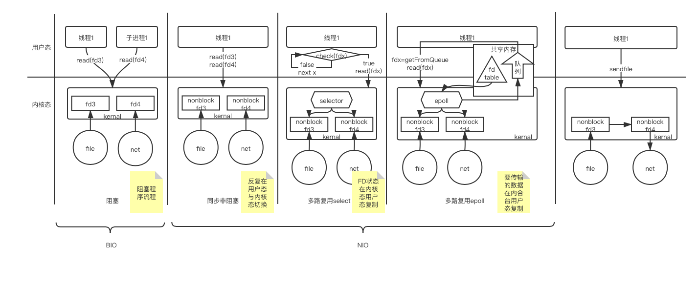
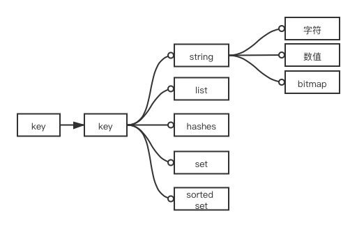

学习一下缓存技术。
<!--more-->

# 数据访问速度
机械硬盘读写速度大约每次是毫秒级（ms)，固态硬盘可以达到几十微秒（μs）。  
对于磁盘而言，其实磁盘想输出多少都可以，只要性能够就可以。但是操作系统来要数据的时候，是按照固定尺寸来要的。最一开始是逐磁盘单元读取的，后来嫌慢，就几个单元几个单元一下子读（linux叫做块block，windows叫簇cluster），这样一方面提高了吞吐量，一方面屏蔽了不同磁盘的底层实现（磁盘数据单元具体有多大）。  
而对磁盘来说，机械硬盘的最小数据单元叫扇区sector，固态硬盘的最小数据单元叫page，是读写的基本单位。每一次都按最小单位来读的话，也挺浪费时间的，所以磁盘上也会有缓存，在按照指令读取之后，往往在等待新的指令到来之前会预读一部分。这样如果新来的IO指令正好要读取的是已经预读的部分，就直接将磁盘缓存中的数据返回回去；如果预读猜错了，再从磁盘上重新读取。  
由于操作系统按块读取，这样每秒磁盘的吞吐量大致就是MB级（每次读取ms级，每次读取kB级）。后来随着技术的发展，磁盘上的扇区也在变大，现在每个扇区可以是4kB了，操作系统的块大小也可以修改。  

内存读写速度大约每次是纳秒级（ns）。由于进程无法直接访问物理内存，只能通过虚拟内存来访问（以此达到内存空间的隔离），那么就必然需要一个空间来存储虚拟内存与物理内存的映射关系，而且为了提高查询映射关系的效率，这个映射表也必须放在内存上。如果按照1对1映射的话，显然太浪费了（甚至如果将所有内存全部分配出去的话，内存就不够存储这个映射表了）。为此操作系统采用页（page）的方式来管理内存，每一个物理内存与虚拟内存都分割成页，通常1页是4kB，那么存储的映射关系虽然还是1对1的，但是存储量缩小为了原来的1/4000。  

正是因为这样的设计，数据库中通常也会以4kB为一个单元来存储（对应一个磁盘块）。对于B+Tree而言，每一个节点，无论是叶节点（存放索引）还是数据（存放数据），都是以4kB为单位进行存放，这样可以提高磁盘查找的速度。在数据库查找时，只会将当前节点放到内存中，其他的索引和数据因为太大所以都放在磁盘上。  

问： 如果数据表的行数很多，数据库的性能会下降么？
答：

1. 如果表有索引的话，增删改会变慢。因为维护索引需要对磁盘进行操作，行越多，那么占用的磁盘空间就越大，需要对磁盘进行修改的空间就会越大。
2. 但如果只是搜索的话，
    * 在并发比较小的情况下，没有很大的影响，因为查询次数基本是固定的；
    * 但在高并发的情况下，由于磁盘是串行读取的，且吞吐量（带宽）有限，如果前后并发所需查询的数据在不同的块中，那就需要等待前一个块读取完成了，才能读取下一个块，因此会被硬盘读取阻塞。  

由于硬盘单位容量价格便宜，但是读写速度慢；而内存单位容量价格贵，但是读写速度快。为了做一个折中，将部分数据放在内存中，部分数据放在硬盘上，由此就产生了缓存中间件。  

数据库比较可以参考[https://db-engines.com](https://db-engines.com)

# IO方式的变迁
最初，IO是完全阻塞的，通过read()函数来读取文件或网络时，如果数据还没有ready，那么发出read()的线程是阻塞的，所以通常IO会单独起一个线程或子进程来进行。  
这时的IO就是BIO，阻塞通信。  

后来，由于阻塞会停止整个线程或者子进程的程序流，而且每一个线程都会占用一定的系统资源（JVM初始1MB/线程，可调），线程调度也需要时间，因此系统内核升级增加了非阻塞的read。在创建文件描述符fd时，可以指定数据传输的方式（比如socket的SOCK_NONBLOCK）。这样，用户就可以实时轮询遍历所有需要访问的fd，如果有数据就读，没有数据就查询下一个fd。  

但是这样一来，如果有很多的fd等待去读取，那就必然会遇到这样的问题：如果可以被读取的fd比较少，那么总是通过read()去访问每一个fd，会在内核态和用户态间反复切换，来回复制很多东西。所以系统内核再次升级，将轮询放入内核，并向外暴露一个bitmap，每一位代表用户需要监听的一个fd。这样，用户只需要查询这个bitmap，对置位（说明对应的fd有数据进来）的fd进行读取就可以了。这个过程就是select。  

select情况下，每次还会对bitmap的复制，而且查询bitmap时还需要对每一位进行遍历。为此，系统内核提供了一个epoll功能。通过epoll_create创建一个共享内存，可由用户态与内核态共同访问；通过epoll_ctl注册各个fd，fd会存储到共享内存中的一个映射表（红黑树实现）中；在一段时间内，如果某个fd有数据来了，就会被写道共享内存中的一个队列中，这样当epoll_wait时，就可以获取到这个队列，有针对性的去访问对应的fd。  

以上都是NIO也就是同步非阻塞的实现。nginx、redis、tomcat等都是通过epoll去实现网络流的多路访问。  

接下来，能不在内核态与用户态间传输的数据，基本上都已经避免了。现在还剩下2个问题。  

1. epoll虽然解决了用户态与内核态间对数据端口状态信息的复制，但没有解决两态间对需要传输的数据的复制。
2. NIO虽然解决了轮询时的阻塞，但没有解决有数据时读取的阻塞。

针对第1个问题。在一些场景下，系统内核提供了诸如`sendfild(int in_fd, int out_fd, off_t* offset,size_t count)`这样的函数。它需要指定一个输入in_fd（必须是一个mmap文件），一个输出fd_out（socket）。然后系统在内核中，直接读取fd_in，并发送到fd_out。这样，数据不经过用户态，直接读写。比如kafka，在写入是，通过mmap将消息写入文件，在客户端来读取时，直接通过sendfile将数据发送给客户端。

针对第2个问题，解决方案就是AIO，Asynchronous IO。  

# Redis基础
redis正在逐渐取代memcached。
memcached也是K-V结构，但是其value没有类型。所以当存储的数据比较复杂时，memcached必须将整个value全部取出。而redis可以利用list、hashes等数据类型，只取出其中的一个或一部分信息，这样减少了网络IO，而且客户端也不需要反序列化的代码。也就是计算向数据移动（数据解析过程在数据存储的地方进行）。

## 方式
redis底层以epoll为IO方式，仅开启一个进程一个线程。
从Redis 6.0开始，Redis添加了多线程的支持。不过由于Redis的瓶颈在于网络和IO，不在于CPU。所以Redis6.0开始的多线程，也仅仅是在IO的位置，也即原来是单个epoll去处理socket输入和输出，现在开启多个线程同时去epoll处理socket输入和输出。  

大致流程如下：

1. 主线程负责接收建立连接，将socket放入等待队列中
2. 主线程处理完建立连接任务后，将等待队列中的socket[Round Robin（也即轮询调度）](https://zh.wikipedia.org/wiki/循環制)分配给多个IO线程
3. 主线程阻塞等待IO完成socket的读取和解析工作
4. 主线程依次执行IO解析好的请求
5. 主线程阻塞等待IO将处理好的结果写回socket
6. 释放连接，清空等待队列。回到1。

问：Redis 6 之前的是完全的单线程么？  
答：在Redis 4之后，会有一些后台线程去执行一些比较缓慢的操作，比如清理脏数据、释放无用的连接等等。而主线程负责执行的部分是单线程的，因为Redis几乎不存在CPU瓶颈，主要受限于内存和网络，使用单线程的话，可维护性高，系统复杂度低，避免的了线程切换和加锁解锁的性能损耗，所以没有必要全局多线程。

问：为什么Redis 6 开始启用多线程？  
答：服务器核心数上升，利用多线程可以充分利用计算机资源。部分公司的业务场景需要支持超高QPS。利用多线程减少网络IO部分的阻塞，可以提高QPS。

问：Redis 6的多线程是否会存在并发安全问题？  
答：不会。因为执行过程还是单线程的。

问：Redis的多线程和Memcached的多线程有什么异同？  
答：两者都采用了master-worker的线程模型，即master接受连接请求，然后将这些请求交给worker去处理。不同的地方在于：Redis最终的命令执行会回到master中，这样能够解决并发安全问题；而Memcached的命令执行在worker中。

## 数据结构
Redis也分了数据库，可以通过redis-cli -n 去选择连接的数据库。  
每一个数据库中都以key-value形式存放数据。
Redis的value可以有如下一些数据结构：  
   
其中string中以字节存放。所以说redis是二进制安全的，只要使用的客户端定义好自己的编解码方式，就可以正确存取数据，redis不干预数据的二进制结构。  

## 常用指令
所有命令的语法、用例、历史版本以及复杂度都可以在Redis的官网查看到，这里是[网址](https://redis.io/commands/)。
### 通用：

* 过期时间相关：
    * EXPIRE key second：设置或更新过期时长，单位秒。pexpire单位毫秒同理。
    * EXPIREAT key timestamp：设置或更新过期时间点，秒级时间戳。pexpireat毫秒级时间戳同理。
    * TTL key：显示剩余时间，单位秒。pttl单位毫秒同理。
* 删除
    * DEL key [key ...]：删除一个或多个key及对应的value
    * FLUSHDB：清空当前db的所有键值对
    * FLUSHALL：清空所有db的所有键值对

### string
以字节存放。二进制安全，只要客户端间定义好编解码规则，就可以正确存储数据，Redis不干预二进制结构。

* 通用：
    * SET key value [EX seconds|PX milliseconds|KEEPTTL] [NX|XX]：NX/XX表示在key不存在/存在时SET才会成功
    * GET key：根据key查找
    * SETNX key value：当key不存在时设置
    * SETEX key seconds value： 设置秒级过期时间。psetex毫秒级同理。
    * APPEND key value：向后追加，转换为raw型。下次使用时能转成数值转数值，否则转成字符串
    * STRLEN：字节数
    * MSET key value [key value ...]：设置多个kv对。msetnx不存在时设置同理。
    * MGET key [key ...]：获取多个值
    * GETSET key value：原子操作，先取再设
* 字符串：
    * GETRANGE key start end：转为字符串并截取，含头含尾，可以用负索引。
    * SETRANGE key offset value：字符串部分覆盖
* 数值：
    * INCR key：自增1。decr自减1同理。
    * INCRBY key increment：增加一个整数。DECRBY减去同理。
    * INCRBYFLOAT key increment：增加一个浮点数。DECRBYFLOAT减去一个浮点数同理。
* 位图：从左往右依次是第0个字节、第1个字节。每个字节从高位（左）往低位（右）是第0位、第1位。
    * SETBIT key offset value：将位图的第offset位置value。value只能是0或1。
    * GETBIT key offset：从位图第offset位取值，只能返回0或1。
    * BITCOUNT key [start end]：计数位图中的1的数量。start end表示第几个字节，**不是第几位**，可以用负索引。
    * BITPOS key value [start end]：找范围内的第一个value的位置。value只能取0或1。start和end是字节序号，**不是第几位**，可以用负索引。
    * BITOP operation destkey key [key ...]：对若干key进行位操作，并存入destkey中。operation支持AND、OR、NOT、XOR四种。长度不一致时，短的在后面（右侧）补零。

### list
在Redis 3.2 之前，长度较短时，采用ziplist，超过阈值后使用双向链表（`list-max-ziplist-value 64`，`list-max-ziplist-entries 512`)。  
ziplist中每一个节点中的数据都是变长的，所以优点是节省空间，但查找时只能顺序（包括逆序）查找，随机查找需要O(n)的时间，而且修改可能会引发连锁反应（节点属性prerawlen记录前一个节点的长度，小于254B时用1B存储，超过254B时，本节点及后面所有结点都用5B来存储），插入就更不用说了。  
双向链表由于使用的是非连续内存，对插入和修改比较友好，查找依然是O(n)的，但是由于每个结点都存在prev、next，非常浪费空间。  
在3.2之后采用quicklist。quicklist整体是一个双向链表，但是每一个节点是一个ziplist做紧密存储。而且quicklist可以利用lzf算法对每一个ziplist节点进行无损压缩（头尾结点不可压缩）。  

list中，一般总是认为左边为前，右边为后。list是有序的，其顺序是插入或逆向的插入顺序（从左往右插入）。

* 通用：
    * LPUSH key element [element ...]：从左侧依次插入元素
    * LPOP key：从左侧依次弹出元素
    * RPUSH key element [element ...]：从右侧依次插入元素
    * RPOP key：用右侧依次弹出元素
    * LSET key index element：修改list中某个元素。index不能超出范围，可以是负索引。
    * LINDEX key index：返回第index个元素，index为正则从左开始，为负责从右开始数
    * LRANGE key start end：返回列表中范围内的元素。start和end可为负索引，包含start和end。
    * LINSERT key BEFORE|AFTER pivot element：在list中目标值pivot前（左）或后（右）插入一个元素，只会根据左边首个值为pivot的节点进行操作,**不是根据索引插入**。
    * LREM key count value：删除list中count个值为value的节点。count为正时从前（左）开始找，为负时从后（右）开始找，为0时删除所有。
    * BLPOP key [key ...] timeout：如果依次查找个列表中，只要有一个存在值，则LPOP，否则阻塞timeout秒直到某个列表中有值（timeout为0时则一直阻塞）。BRPOP同理。都是FIFO先到先服务的。
    * LLEN key：统计list中元素个数。
    * LTRIM key start end：将list修建为只剩范围内的元素。也即删除start之前和end之后的元素。剩余list保留start和end。start和end可以负索引。`ltrim key 0 -1`后整个list不变。

* 栈：通过同向命令实现
    * LPUSH+LPOP （栈顶在左）或 RPUSH+RPOP（栈顶在右）
* 队列：通过反向命令实现
    * LPUSH+RPOP （队首在右）或 RPUSH+LPOP（队首在左）
* 数组：时间复杂度O(n)
    * LSET、LINDEX随机访问
* 阻塞单播队列：
    * BLPOP、BRPOP

### hash 哈希表
hash表整个redis的存储结构。
hash表中有ht[2]这样一个数组。平时只会只用`ht[0]`，但在扩容过程中会启用`ht[1]`。  
hash表示一个二维结构。第一维是一个数组，表示hash索引。第二维是链表，位于第一维数组中每一个单元中，存放结点（key，value，next）。  

扩容：当总元素达到第一维也就是hash索引长度时（即负载因子为1），将会开始在`ht[1]`中创建一个2倍长度的数组，开始扩容。扩容过程是渐进式的，而且当进行bgsave或bgrewriteaof时不进行扩容）。当负载因子大于5时，无论是否在执行命令，强制扩容。  
缩容：当负载因子小于0.1时，开始缩容（不考虑bgsave或bgrewriteaof）。缩容至能方的下目前所有元素的最小的2的幂。  
在扩容或缩容过程中，会进行rehash，即重新计算hash。

* 添加/更新
    * HSET key field value [field value ...]：插入键值对。hmset同用法，可用已弃用。
    * HSETNX key field value：不field存在时设置。
* 查询
    * HKEYS key：获取所有field
    * HVALS key：获取所有value
    * HLEN key：获取键值对数量
    * HGET key field：获取特定field的value
    * HMGET key field [field ...]：一次获取多个field的value
    * HGETALL key：获取所有键值对
    * HEXISTS key field：判断field是否存在
* 删
    * HDEL key field [field ...]：删除一个或多个field及对应的value
* 对value的操作
    * HSTRLEN key field：field的值的字节长度
    * HINCRBY key field increment：对field的值增加整数，可以为负。HINCRBYFLOAT增加浮点数同理。

### set集合
特征：无序，去重。 
底层使用intset或者hashtable实现。  
intset是一个int数组。开头是元素尺寸、元素个数2个属性。初始化是根据首个元素的大小，按照数组能放下的最小长度初始化数组（INT16、INT32、INT64）。然后继续插入元素，如果新来的数值元素超过了当前尺寸，则整个集合里所有已经存储了的元素也都要升级。当元素尺寸无法升级，或者存进来的元素不是数字，或者元素数量超过512个（`set-max-intset-entries 512`）之后，将会从intset切换为hashtable。  
hashtable也是一个stringobject数组，key就是存放的元素，value为空。  

* 集合基础
    * SADD key member [member ...]：向集合中添加
    * SCARD key：获取集合中元素个数。（card是cardinality也就是“集合的势”的缩写）
    * SISMEMBER key member：判断member在不在集合中
    * SMEMBERS key：获取集合中所有的member
    * SREM key member [member ...]：删除元素
    * SRANDMEMBER key [count]：从集合中抽若干个元素。如果count为正，则抽出来的不重复，因此count超过集合大小后，会将集合全部返回（不够的就算了）；如果为负，则抽出来的元素可以重复；为0则返回空集。默认count为1。  
    * SPOP key [count]：从集合中弹出若干个元素。count不能为负，默认count=1。
* 集合运算
    * SDIFF key [key ...]：集合的差集（剩余元素必为首个集合的元素）。如果只有一个集合的话，就是与空集做差。
    * SINTER key [key ...]：集合的交集，如果只有一个集合，就是与空集做交。（inter是intersect的缩写）。
    * SUNION key [key ...]：集合的并集。如果只有一个集合，就是与空集做并。
* 集合运算并存储
    * SDIFFSTORE destination key [key ...]：集合的差集，并存储到destination中。
    * SINTERSTORE destination key [key ...]：集合的交集，并存储到destination中。
    * SUNIONSTORE destination key [key ...]： 集合的并集，并存储到destination中。  

### sorted set有序集合
sorted set的底层是通过跳跃表实现的。元素查找和插入的复杂度是O(logn)。

* 添加/更新：
    * ZADD key [NX | XX] [CH] [INCR] score member [score member ...]：向有序集合中添加元素和分值（先score再member）。NX表示只插入不更新（失败了的就算了）；XX表示只更新不插入（失败了的就算了）；CH表示返回值是添加和更新的所有元素的数量（原本仅仅是插入元素的数量）；INCR表示对目标元素增加score的分值，只支持一对score-member。  
    * ZINCRBY key increment member：对集合中某个元素的score增加。可以为负，可以是浮点数。
* 查找/获取：
    * ZRANGE key start end [WITHSCORES]：返回范围内的所有元素（和分值，如果添加了WITHSCORES参数）。这里的索引是rank，取出的包括start和end，可以用负索引。zrevrange同理，其索引是rank的逆序。
    * ZRANGEBYSCORE key min max [WITHSCORES] [LIMIT offset count]：返回范围内的所有元素（和分值，如果添加了WITHSCORES参数）。这里的索引是score，取出的包括socore为min和max的（如果写作诸如`zrangebyscore sset (1 (5`则表示区间1到5，不包括1和5）。可以通过LIMIT offset count来设置只选出范围内第offset开始共count个元素（类似于SQL中的`Select * from table limit offset, count`）。ZREVRANGEBYSCORE同理，其索引是score的逆序。
    * ZRANGEBYLEX key min max [LIMIT offset count]：通过字典序排序并返回。**只有当所有score都相等时才有效**，否则结果是不可预测的。ZREVRANGEBYLEX同理。
    * ZRANK key member：获取对应元素的rank（也就是排名，从0开始）。ZREVRANK同理，倒序排名。
* 删除：
    * ZREM key member [member ...]：删除若干元素
    * ZREMRANGEBYRANK key start stop：根据排名，区间删除。包含start和stop，可以是负索引。
    * ZREMRANGEBYSCORE key min max：根据分数，区间删除。
    * ZREMRANGEBYLEX key min max：根据字典序，区间删除。
* 集合操作：6.2开始新增了ZINTER、ZUNION、ZDIFF、ZDIFFSTORE几个命令。
    * ZINTERSTORE destination numkeys key [key ...] [WEIGHTS weight [weight ...]] [AGGREGATE SUM|MIN|MAX]：将多个集合做差集，并存储到destination，可以通过AGGREGATE设置score聚合的方式（默认为SUM），如果是相加聚合可以通过WEIGHTS设置各个集合聚合时的权重（权重可以为负，绝对值可以大于1）。
    * ZUNIONSTORE destination numkeys key [key ...] [WEIGHTS weight [weight ...]] [AGGREGATE SUM|MIN|MAX]：将多个集合做并集，并存储到destination，可以通过AGGREGATE设置score聚合的方式（默认为SUM），如果是相加聚合可以通过WEIGHTS设置各个集合聚合时的权重（权重可以为负，绝对值可以大于1）。
