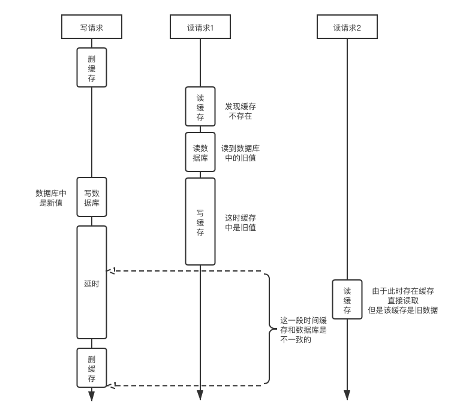

[前一篇文章](/2021/01/02/Cache-01Basic/)对缓存的一些基础知识，以及Redis的基本用法有了一定的了解。本文将列举一些进阶用法，包括管道、发布订阅、事务等等。
<!--more-->

# 利用管道批量发送命令
由于每一次连接都需要建立连接，这需要一定的时间消耗。如果每次只发送一条指令，就比较浪费。因此建立一次连接，发收多条消息是比较经济的做法。在Spring中可以采用连接池的方式，通过长连接来操作Redis。在非框架环境下，如果有客户端，也可以直接使用客户端（比如redis-cli或者可视化的客户端），也可以通过管道，一次将需要的消息都发出去。

## 利用netcat进行socket连接
在linux系统（macOS也行）上都可以安装一款名为netcat的网络工具。  

> yum install nc    # CentOS
> brew install nc   # macOS

Windows上也有移植版本，可以自行搜索。  

netcat是一款简单易用的UNIX网络工具，通常用于网络连接的测试或黑客工具。通过nc可以轻易的创建各种类型的连接。这里使用nc去创建一个持久的socket连接。  

建立一个连接
```bash
nc localhost 6379
```
回车之后，就可以直接交互式的发送redis命令，并接收返回值了（如果有密码的话，可以用指令`auth xxx`输入密码）。  
也可以通过管道将指令一次性发送：
```bash
echo -e "set key5 5\nincr key5\nget key5" | nc localhost 6379
```
这时就会一次性返回：  
```bash
+OK     # 建立连接成功    
:6      # set成功  
$1      # incr成功  
6       # get结果  
```

## 利用redis-cli --pipe
当命令数很多的时候，通过nc很难确认是否所有命令都成功执行。  
从Redis 2.6开始，redis-cli内检了管道模式，可以通过管道向redis-cli输入命令。  
这时，可以先准备一个文本文件，其中记录了所有需要批量执行的命令。当然，因为redis只支持Windows下的换行符（`\r\n`），所以可以利用unix2dos工具箱进行转码，在安装（`yum install unix2dos`或者`brew install unix2dos`之类的）后，直接执行`unix2dos redis_batch.txt`就可以得到转换好的文件。  
然后通过诸如cat指令提取这个文本文件中的命令，并通过管道符连接redis即可：
```bash
cat redis_batch.txt | redis-cli --pipe
```
然后就会显示错误的条数和redis服务的响应数量。  

当然，这里直接使用`cat redis_batch.txt | redis-cli`，不添加`--pipe`开关也可以，这样的话，每一条响应都会输出在终端上，而且据说效率会比`--pipe`要慢不少。  

# 发布/订阅
订阅：SUBCRIBE channel [channel ...]：订阅频道在此时之后的消息  
发布：PUBLISH channel message：向频道发送消息  

例：聊天消息，既需要实时获取，也需要历史记录，这个系统应当如何设计？  
利用redis的发布订阅功能，可以实现实时获取的功能。对于历史记录可分为短期历史记录和长期历史记录，长期历史记录存放在数据库中（可通过kafka写入数据库），短期数据通过redis的sorted set（支持区间删除和取出）以时间为score存储或者list作为队列存储。  

下图是消息上传和下载的流程。左边是简易的实现方式。为了保持3个存储器中数据的一致性，可以采用右侧的方式来进行。  
  


# 事务
事务标记：MULTI：标记事务由此开始，此标记后的相同客户端发至服务端的指令都被缓存。
事务执行：EXEC：连续执行MULTI指令之后，此条指令之前的所有被缓存的指令。多个客户端开启事务时，以首先发送EXEC指令的先后顺序执行。
事务取消：DISCARD：取消MULTI标记。
键值监控：WATCH key [key ...]：在事务开启前先获取key的值，在EXEC时如果这些值发生了变化，则中断事务（无论事务执行中是否使用了这个或这些key）。

Redis的事务仅能保证原子性，当执行发生错误时，已执行的指令依然生效，不支持回滚（因为无法预知错误，redis的错误仅可能是语法的错误，比如对string执行队列操作等等）。  

# 布隆过滤器（Bloom Filter）

利用BF可以缓解缓存穿透（缓存击穿）的问题。  
所谓缓存穿透，是指大量请求同时查询一个缓存，缓存中如果没有这个记录，这些请求同时去访问数据库，使数据库压力增大。  

考虑一个场景，数据库中存在一些数据。如果现在高并发访问，需要大量的查询，这些查询可能是存在于数据库中，也可能不存在数据库中。这样的场景会有如下3种设计方案：  

1. 让所有请求直接访问数据库。
2. 将数据库中的数据都放到Redis缓存中。
3. 将一部分数据放到缓存中，当缓存中不存在时交给数据库去查询。  

针对方案2，当数据非常大时，所需要的内存缓存也是巨量的，成本太高。对于方案1，数据的负载过高。针对方案2，在一些情况下是可以的，但是当大量请求没有命中缓存时，依然会遇到缓存击穿的问题，直接高并发访问数据库。  
这时，如果存在一个过滤器，如果能高效判断请求的东西是否在大数据集中，哪怕不是特别精准，也能够有效缓解缓存击穿的问题。  

## 基本布隆过滤器
这时，就要请出布隆过滤器（Bloom Filter）。   
BF由k个hash函数和一个bitmap组成。初始化时，对每一个大数据集中的数据，进行k个hash，得到k个散列值，并对bitmap对应位置置位（可能存在重复置位）。使用时，对请求的数据也进行k个hash，得到k个散列值，去判断对应的bitmap位是否被置位。如果都被置位了，则这个请求可能存在于大数据集中；如果有至少1位未被置位，则这个请求一定不存在于大数据集中。  
如下图，数据集（训练集）中有Data1、Data2、Data3，值分别为5、12、21，都经过3个hash函数散列到bitmap中。  
然后过来了3个测试值Test1、Test2、Test3。Test1的值为5，与数据集中的Data1是一致的，因此其对应的散列值在bitmap中都是1，所以通过BF测试；Test2的值为13，但其散列后的3个值在bitmap中恰好都是1，所以也通过BF测试；Test3的值为34，其散列后的3个值在bitmap中有至少一个是0，所以没有通过BF测试。  
  
实际中，可以通过选择合适的hash函数组和合理的bitmap长度，来尽量避免Test2这种假阳性的发生。  

在上面的场景中，在数据初始化时，提取出数据库中的所有可被搜索数据，然后自己实现bitmap和hash函数来生成BF；也可以利用Redis的bitmap操作，自己维护一个BF；当然，还可以利用Redis的BloomFilter Module，在初始化时BF.ADD key data 所有数据库中可被搜索的元素，然后利用BF.EXISTS key data确认BF的测试结果。  

## Counting Bloom Filter 计数布隆过滤器
为了应对BF的数据集（训练集）可能会实时修改的情况，将BF的bitmap中每一位升级为一个计数器，在训练时，得到的hash散列值后不是简单将某一位置位，而是将对应的计数器+1。这样，如果需要实时删除某一个训练值，就只需要将其散列值对应的计数器-1即可。  
然而由此一来，为了增加一个可删除的功能，bitmap不得不成倍的膨胀（原本1位，现在需要膨胀为好多位，用来存放1个整数）。

## Cuckoo Filter 布谷鸟过滤器
由于BF在查询时需要多次计算hash、bitmap难以最大化利用空间（很多位都是空的），而且不支持反向操作（删除）。为此，布谷鸟过滤器（Cuckoo Filter）横空出世。  
布谷鸟（也就是杜鹃）根据小时候看的百科全书上的说法，自己基本不建造巢穴，而是将蛋下在别的鸟巢中，为了让巢主人一下子无法发现，还会踢掉一些主人的蛋，让总蛋数量保持不变。  
CF也是一样的做法。与BF使用一组hash函数和一个bitmap不同，CF使用1个hash函数、1个指纹函数、1个固定的对偶函数和1个数组（每个数组元素有k个存储单元，也即可以顺序存放k个指纹，比如4）。对偶函数的作用就是在已知一个散列位置的时候，可以计算出另一个对偶位置用于存放指纹。
```c
fp = fingerprint(data);
p1 = hash(data);
p2 = dual(p1, data);
// p1 == dual(p2, fp);
```
通常，`dual(x, y) = x ^ hash(y)`。这样在已知p1时，可以计算出p2；在已知p2时可以计算出p1。那么怎么使用呢？

在训练时，将训练数据随机使用一个hash函数得到1个散列值，首先查看数组中散列值位置的4个存储单元是否放满了，如果没有放满，则将指纹放入。如果4个位置都放满了，则尝试放入对偶位置。如果对偶位置也放满了，则从2个位置中随机中踢出一个，自己放进去。然后被踢出的根据指纹计算其自己的对偶位置，如果这个对偶位置也放满了，则替换其中一个，被踢出的继续寻找自己的对偶位置。直到所有元素都被放下，或者踢出次数达到上限（形成挤兑）。  

这样的设计是可以提高整个空间的利用率的，但是当重复插入相同元素，则会很快沾满自己可以存放的8个位置，从而形成无限踢出造成挤兑。  

# Redis作为缓存

Redis作为缓存和作为数据库的区别：

1. 缓存的数据只是数据的副本（丢了也没关系）
2. 缓存不是全量数据
3. 缓存随着访问而变化
4. 缓存里应该放热数据  

那么如何让Redis中的数据随着业务变化呢？
设置有效期：根据业务逻辑设置（部分数据只需要保存xx时长，过期就没有使用必要了）
热数据变冷淘汰：根据业务运转设置（比如经过一段时间运转，发现某些数据变成了冷数据，方访问量低迷）。

## 过期
```
SET key value EXPIRE second  
```
或者通过非原子的2步操作进行。
```
SET key value
EXPIRE key second
```
在设置了过期时长后，通过GET不会续期。只能通过`EXPIRE key second`重新设置过期时长。  

如果对正在倒计时的键值对使用`SET key value`来刷新数据，会取消其过期时间。  

Redis清除过期的策略
被动：在访问时，如果该键值已经过期，则清除。
主动：每秒做10次下面的事情，这样可以在稍微牺牲内存的情况下，保证性能。 

1. 测试随机的20个键值对
2. 删除其中过期的
3. 如果有超过25%是过期的，则重复1

## 数据淘汰设置
在conf中可以进行如下设置，位于MEMORY MANAGEMENT节中。  

```bash
# 最大内存用量，建议不要特别大，不然在快照时会很耗时
maxmemory <bytes>   

# 达到最大内存用量时，如何清除无用数据。可选：
# noeviction 不清除，放不下了就报错，通常用于数据库时
# volatile-lru 删除设有过期时间的键值对中的上次使用时间最远的的
# allkeys-lru 删除所有的键值对中的上次使用时间最远的的
# volatile-lfu、allkeys-lfu 删除使用次数最少的
# volatile-random、allkeys-random 随机删除
# volatile-ttl 删除设有过期时间的键值对中剩余时间最少的
maxmemory-policy
```

## Redis缓存时可能遇到的问题
使用缓存时，大致都会按照这样的逻辑去访问缓存和数据库。

  
这时，根据缓存中是否有值、缓存放给数据库的访问量、数据库与缓存的双写等过程，将可能存在以下问题。

### 缓存穿透
访问一个全量数据库中都不存在的key，请求会从缓存直接到穿透到数据库，然后数据库返回null。当高并发同时访问不存在的key，就会有大量的请求穿透到数据库，数据库压力剧增，可能会瘫痪，或影响其他正常流量的访问。

解决方案：  

1. 采用布隆过滤器，存储有效的key，拦截无效的key
2. 根据规则，直接过滤肯定无效的请求（比如`id<0`)
3. 如果一个key在缓存与数据库中都不存在，可以在缓存中设置key-null，并设置一个较短的过期时间，以防止短期内相同的key打到数据库上（会牺牲一定的准确性，可能造成数据库在过期时间内写入了相关信息，但缓存直接返回了null）
4. 采用异步更新策略，如果缓存不存在，则直接返回null，然后异步请求数据库，并更新缓存，这样下次请求时，缓存中就有值了（适用于有重试机制的情况）。  

### 缓存击穿
高并发访问一个数据库中存在，但是缓存中不存在的数据，同样会造成缓存短时内放过大量请求打到数据库上，这些请求的内容往往是相同的。通常会发生在热点数据过期时，或者新生热点时。  

解决方案：

1. 设置热点数据不过期（但热点数据有时往往是不可预知的）
2. 利用后台程序或线程的定时任务，定期更新过期时间（会增加系统复杂度，对固定或人工设置的热点数据相对简单，对动态热点数据要考虑甄别的方法）
3. 每次获取值时，如果剩余时间不足某个阈值，顺便更新其过期时间。（可能会发生高并发访问一个已过期的数据，则此方法失效）
4. 利用互斥锁，缓存不存在时，只能由一个线程去访问数据库（程序复杂度提高，可能发生死锁）

```java
final int EXPIRE_TIME;    // 空值或热值的过期时长
final int WAIT_TIME;      // 阻塞时的等待时长
final int MAX_RETRY_TIME; // 阻塞时最大重试次数
ReentrantLock dataLock;
public Data getData(String key){
  return getData(key, 0); // 调用内部方法
}
private Data getData(String key, int n){
  Data data = redis.getData(key);
  if(data != null){
    return data;
  }
  if(dataLock.tryLock()){
    // 获取到锁
    try{
      data = db.getData(key);
      // redis.set(key, data, EXPIRE_TIME);  //根据需要放入缓存
      return data;  // 返回从数据库中查询到的值
    }finally{
      dataLock.unlock();
    }
  }else{
    // 有别人正在数据库中查询
    Thread.sleep(WAIT_TIME);  // 等别人查好
    if(lock.getHoldCount() > 0){
      // 如果锁仍然被占着
      if(n < MAX_RETRY_TIME){
        // 继续重试
        return getData(key, n+1);
      }
      // 强行访问数据库 
      // return db.get(key);
      // 或者提前中止 
      return null;
    }
    data = redis.get(key);
    return data;
  }
}
```

### 缓存雪崩
缓存雪崩是指在短时间内，有大量缓存失效，导致原本可以通过缓存拦截的请求，一下子都达到数据库上，这些请求往往是不同的。通常是发生在批量设置的热点数据过期时，或者缓存服务意外宕机时。  

数据查询过程通常由这么几个服务器参与，最前端的Nginx服务器负责请求转发，缓存服务器负责向缓存进程发送指令，数据服务器向数据库发送指令。

根据缓存进程或集群宕机，或者缓存集中失效，可能会从下面的1或者2开始导致整个服务链雪崩：

1. 因为缓存进程宕机，导致大量请求在缓存服务器上被hang住，导致缓存服务器崩溃
2. 因为缓存无法取到，大量请求经数据服务器，直接访问数据库，导致数据库崩溃
3. 因为数据库崩溃，大量请求在数据服务器上被hang住，导致数据服务器崩溃
4. 因为Nginx无法访问缓存服务器和数据服务器，只能使用自己的缓存，当Nginx缓存过期后，或者请求的无法经过Nginx缓存的数据后，所有请求都将无法访问
5. 服务完全崩溃

解决方案：
针对缓存进程崩溃：
事前：针对缓存进程崩溃，可采用缓存集群或哨兵。  
事中：多级缓存能多撑一会儿是一会儿，以及通过服务降级来避免数据库等其他服务被打死
事后：尽快恢复缓存服务

针对缓存集中失效：
1. 缓存数据的过期时间设置随机，防止同一时间大量数据过期现象发生
2. 将热点数据均匀分布在不同的缓存库中
3. 设置热点数据永远不过期
4. 通过各种粒度的锁（如根据业务类型）或各种类型的锁（信号量允许并发、互斥锁只允许1个等）控制吞吐量

### 区别
缓存穿透是指在缓存与数据库中都没有要查询的数据的情况。也就是大量垃圾请求打在数据库上。  
缓存击穿是指数据库中存在，但是缓存中没有，这时并发向数据库请求相同的数据。也就是同一个热点数据高密度砸向数据库。  
缓存雪崩是指缓存中本来有，但是在短时间内突然大量失效，导致大量不同的请求同时打到数据库上，并雪崩式导致其他服务不可用。也就是不同的热点数据打到数据库上。

### 缓存（与数据库）双写一致性
前面3个问题都是缓存获取时可能发生的问题。在更新缓存特别是数据库和缓存都需要更新时，同样会出问题。比较重要的就是，同时更新缓存和数据库时，两者的数据不一致的问题，又叫双写一致性问题。  

为了保证双写一致性，可选的有这样几种做法：

1. 先更新缓存，再更新数据库
1. 先更新数据库，再更新缓存
2. 先删除缓存，再更新数据库，当从数据库中取出时再写缓存
3. 先更新数据库，再删缓存，当数据库中取出时再写缓存 

#### 先更新缓存，再更新数据库
这种场景很致命，当缓存更新成功，数据更新失败的时候，两者不一致时无法调和的。因为全量数据在数据库，但数据库中没有记录到部分操作对数据的影响；当缓存重启时，（即使缓存开启了持久化，也）必然会将数据库中的记录写入缓存，此时仅更新在缓存中的数据就丢失了。   

#### 先更新数据库，再更新缓存
考虑这样一个场景，A和B两个请求都想对某个key进行更新。由于某些原因（比如A请求所在虚拟机在写入数据库后GC造成一定时间的STW，甚至仅仅是CPU调度导致两个动作间隔时间偏长），就可能会造成这样的执行顺序：  

* A更新数据库 DB(key)=1
* B更新数据库 DB(key)=2
* B更新缓存 Cache(key)=2
* A更新缓存 Cache(key)=1 

这样之后，数据库中的key对应值为2，而缓存中key的对应值为1，这样就双写不一致了。  
此外，更新全量库是没有办法必须要做的，但是更新缓存呢？在写密集的情况下，大量写入缓存的数据没有被读过，就被刷新了，特别是写入缓存的值是经过一定的计算后得到的（简单的可能就是拼接一个时间或id，复杂的可能是计算大文件的md5），这样无疑会浪费大量的计算资源。  
因此，不妨直接将需要更新的缓存直接删掉，在下次使用到的时候再写进来，或者利用诸如后台刷新的策略，在资源有暇的时候异步更新到缓存中。这样造成的弊端仅仅是多了1次Cache Miss。  

#### 先删除缓存，再更新数据库
那么先删除缓存，再更新数据库会不会有问题呢？  
有这样一个场景，A想对某个key的值进行更新，同时B需要使用这个key的值： 

* A删除缓存 Cache(key).remove
* B查询缓存，发现不存在，就去查询数据库，得到旧值 old = DB(key)
* B觉得key应当在缓存中，所以将旧值写入缓存 Cache(key) = old
* A更新数据库 DB(key) = new  

这时，又造成了数据库与缓存记录的不一致。  
有人提出这个问题可以通过延时来解决，对于想要更新的那个线程这么执行：  
```java
redis.remove(key);
db.update(key, newVal);
Thread.sleep(UPDATE_REMOVE_DELAY_TIME);
redis.remove(key);
```
这种做法叫做***延迟双删***。通过一个延时，确保数据库和缓存的最终一致性。但这种做法存在一个困难的地方，那就是这个延时的时长究竟应当设置多长？如果过短，可能读线程还没有写入缓存，这样就和没有延迟双删一样；如果过长，在读线程写入缓存到延时时间结束这一段时间内，缓存与数据库依然是不一致的，而且会影响这一部分服务的吞吐量。  

  
当然图中的读请求1不一定是真的读请求，可能是任何在写请求删除缓存被后，更新数据库前，读出数据库并写入缓存的任务（比如后台更新缓存任务）。  

#### 先更新数据库，再删除缓存
这种情况其实就和上一个情况的图中的读请求2一样，在更新了数据库之后，删除缓存之前，如果有一个读请求过来，就会直接带走缓存中的旧值。这样就一个请求会得到过时的值，其实还好。  
更极端的情况是，读请求先来，发现缓存不存在（还没有缓存或缓存已经过期了），这时读请求就回去读取数据库。然后写请求过来更新数据库，然后删除缓存（这是一步无效操作，因为缓存早就不在了）。接下来读请求将刚刚从数据库中读到的已经过时的旧值写入缓存。这样同样也会造成双写不一致。  


#### 延迟双删的一些优化
不要认为延迟双删的延迟不用设置的非常长，在网络波动的情况下，重连可能就会造成百毫秒甚至数秒的延时，而因为不恰当的JVM参数设置可能会在GC时造成数秒甚至分钟级（乃至更久）的STW。这时的不一致只能等待下一次的写，才有可能得到纠正。不过这种可能性比较低，通常会通过对项目的评估，测试或计算出读和写入缓存的耗时，然后增加几百毫秒，作为这个延时的时长。  
如果采用的是数据库读写分离的策略，造成读到的是旧数据（因为读的时候，还没有完成主从同步），这个延时可以设置为主从同步的延时再增加及百毫秒。  
如果因为这个延时造成了吞吐量的下降，则可以将这个延时删除行为异步化，做一个定时任务，本次写请求立即结束。  
为了防止最后删除缓存失败的情况，还可以增加重试机制（比如将所有需要删除的key添加到缓存或者消息队列中，删除失败的话，就重新加入队列中）。  

此外还有一些比较geek的操作。因为延迟双删对业务代码的侵入性，有些人想到了监听MySQL的binlog文件。当更新了数据库之后，会体现在binlog文件中，通过某些工具（如Alibaba的canel  [kə'næl]）可以监控binlog中的更新操作，然后另起一个程序订阅canel发现的binlog更新，发现binlog更新后，再计算对应的缓存key并删除之（里面也可以加上删除失败的重试，反正都是写在非业务代码程序中的）。  

#### 终极解决方案
终极解决方案就是将服务串行化。
如果是单机暴露服务，可以直接使用synchronized或者ReentrantLock，甚至将对应的key生成唯一的对象（通过单例工厂）进行单JVM内的上锁。  
如果服务是分布式的，那可以采用分布式锁（利用Redis即可）。  

利用setnx指令，设置一个和key相关的lockkey，如果设置成功，则说明锁竞争成功（通过Redis执行指令是串行的来保证）。然后中间执行相关的redis和数据库的业务逻辑操作。接下来在finally中应当删除lockkey这个键来释放锁。  
为了防止在上锁和解锁之间，程序因为意外而直接中止，应当为lockkey设置一个过期时间，为了保证原子性，可以通过lua脚本进行。  
而在程序运行过程中，应当再开启一个守护线程，在释放锁之前应当不断为lockkey续期，以防锁提前失效。  
为了提高业务的吞吐性，还可以将这把锁分为读写锁。不过既然已经到这个地步了，就不如直接使用Redisson的ReadWriteLock了（`RReadWriteLock rwlock = redisson.getReadWriteLock(lockkey);`）


# Redis持久化
持久化有2种思路。快照/副本，日志。  

## 快照——RDB持久化
生成一个RDB文件，里面记录了当前所有内存中的数据。

### 方法

* save：阻塞。场景：关机维护
* bgsave：后台非阻塞。场景：任何手动场景
* 配置文件：自动、定时、后台非阻塞（调用bgsave）。  

配置文件：
```bash
# save <second> <changes>
save 900 1      # 每900秒只要有至少1个修改就触发bgsave
save 300 10     # 每300秒只要有至少10个修改旧触发bgsave
# 可以设置多条规则
# Redis默认开启RDB
```


### bgsave实现原理与技术基础
bgsave通过fork()实现。  
在fork后，父进程与子进程可以访问到相同的值。因为在fork时，系统仅为子进程创建了一份新的虚拟内存映射表，里面映射的物理内存的地址与父进程是一样的。所以fork速度很快，需要的内存很少。基于fork之后会修改的内容相对会很少的假设，启用COW（copy on write），即在fork之后修改的值，才会创建新的物理内存（并修改虚拟内存和物理内存的映射关系）。  
Redis利用fork创建一个子进程进行快照，这样一方面不会阻塞父进程继续IO和执行指令，另一方面父进程的修改也不会体现到子进程中，达到快照的目的。  

  

### RDB的优缺点
缺点：

1. 不支持拉链表（也即只有一个rdb文件，没有数据变迁历史记录）
2. 丢失数据可能性较大（下一次save之前的数据，会在宕机后丢失）

优点：磁盘上存储的rdb文件中的内容类似于序列化，恢复速度快。

## 写操作记录——AOF
AOF，即Append-Only File。只增量记录写操作。
### 优缺点
优点：

1. 丢失数据少（数据完整性相对高）
2. 如果RDB与AOF同时开启，则用AOF恢复数据（Redis 4.0之后，AOF文件中包括RDB的全量，以及增量的写操作

缺点：  
比RDB慢，在执行命令的同时，执行AOF的文件写操作，会降低Redis的效率。

### 如何让AOF文件足够小
重写rewrite  
Redis 4.0之前删除可以抵消的指令，合并重复的命令。所以此时的AOF是一个春指令的日志文件。此操作是一个CPU密集操作。  
Redis 4.0之后，会将RDB文件合并到AOF中，增量部分用记录指令。所以此时的AOF是一个混合体，既利用了RDB的快和节省空间，又利用了AOF的完整性。此操作比4.0时的rewrite速度快得多。（`aof-use-rdb-preamble yes`默认开启）

### 配置
AOF默认关闭
```bash
# 是否开启AOF
appendonly yes # 开启

# 写AOF时flush缓冲区的策略
appendfsync everysec    # 默认为everysec每秒进行flush，compromise
# appendfsync no        # 不手动flush，由系统自己来。速度最快，但可能会丢失未flush的数据
# appendfsync always    # 每次执行指令都会flush数据，会影响效率

# aof 重写策略
# 当aof文件增长达到特定百分比，则触发重写（与上一次aof后的文件尺寸比
auto-aof-rewrite-percentage 100
# 小于此尺寸，则不触发aof重写
auto-aof-rewrite-min-size 64mb
```