[前文](2021/01/04/Cache-02RedisAdvance/)介绍了Redis的一些进阶操作，包括管道、发布/订阅、事务，以及作为缓存时的一些注意事项，还介绍了2种持久化方式。本文将介绍在集群情况下如何配置Redis，以及会遇到什么问题。  
<!--more-->

# 单机单结点瓶颈
在单机单结点情况下，通常会有如下问题：  

1. 单点故障
2. 容量有限
3. 连接压力、计算压力  

对这三个问题有3个维度的解决方案AKF原则。

1. 全量复制：设置主结点的多个备份结点，写操作交给主结点，主结点同步给备份结点。备份结点同时可以承担一部分读操作的压力。
2. 功能拆分：将结点根据功能、服务、资源拆分成多个，1个结点服务中只存放一部分业务。
3. 数据分区：对相同功能服务资源进行细分，根据优先级（冷热）、逻辑（比如编号范围），对业务结点再拆分。   

这就是AKF Scale Cube（或者叫AKF Availability Cube）。

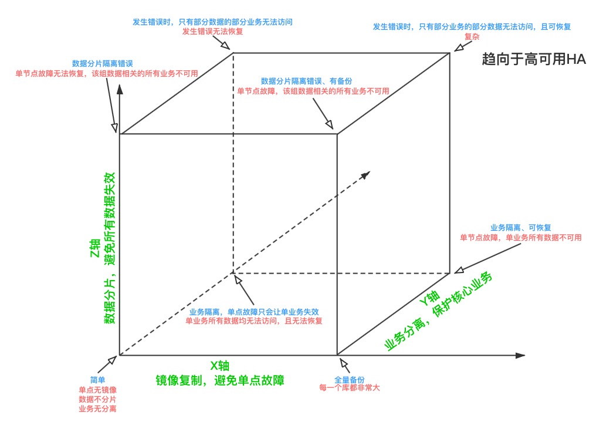

用AKF Partner的[说法](https://akfpartners.com/growth-blog/akf-scale-cube-ze-case-for-z-axis)就是：

* X轴：通过镜像备份避免单点故障
* Y轴：将认证、搜索、关注等业务分离，形成错误隔离的泳道
* Z轴：将查询按照地理位置、id等逻辑分割，对同一张表横向拆分，提高效率，避免单一业务全面瘫痪，将数据分片（sharding）。也可以理解成将用户分组。


Redis可通过主从复制或Sentinel提供全量复制的功能，通过Redis Cluster提供数据分区的功能。根据功能拆分应当由开发者根据功能、服务、资源的不同自行拆分和建立Redis连接。

针对全量复制，通常有3种方式：

1. 主机与从机（或备份结点）之间采用同步阻塞的方式传输数据。这样可以保证数据的“强一致性”，但当从结点发生故障或不可达时，会破坏可用性（即C和A不可兼得），而这与使用主从或主备模式的初衷（提高可用性）是矛盾的。  
2. 主机与从机（或备份结点）之间采用异步的方式传输数据。这样可以主机快速响应客户端请求，但是当主机宕机时，从机数据可能是不完整的。即无法达成一致性。  
3. 主机与从机之间通过一个高可用的的中间件将准备传输的数据持久化，从机慢慢消费中间件中的数据。这样主机与中间件是同步阻塞的，但时间很短；主机与从机之间是异步的。当主机宕机后，待从机消费完成中间件中的数据，再同步给主机。这样，达成最终一致性。  

  

但无论选择何种方案，最终主机都需要负担读写，也即主机仍然是一个单结点。因此，需要在主机宕机之后，将备机切换为主机，或通过备份机恢复主机，从而达到高可用（High Availability，HA）。  

为了达到高可用，如果依赖于人，显然是不可靠的。所以会交给程序进行。但如果仅启用单个监控程序，显然又是一个单点问题，所以通常又会采用集群来进行。这样，才能将发生错误的概率降低。
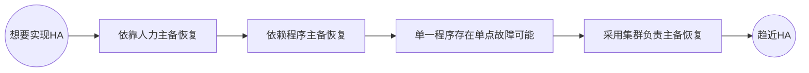

既然监控是一个集群，那必然存在决策的问题。此时的决策策略是过半数投票。  
所以通常这样的备份机或者从机的数量是奇数个（举个例子，5台备份机和6台备份机，他们允许自身出现问题的数量都是2台。所以在宕机容忍2台的情况下，5台更经济；而且往往6台比5台出现问题的概率更高）。  

# Redis的主从复制
Redis可以开启主从复制，这使用默认的异步复制，其特点是低延迟和高性能，是弱一致的。  

## 指令
Redis启动时默认使用的主机Master模式。  
启动后可以使用`REPLICAOF host port`指令，连接主机，将自己转换为从机。  
也可以在启动时添加启动参数`--replicaof host port`直接连接主机。  
当主机宕机或其他原因需要将从机升级为主机时，可以通过`REPLICAOF no one`切换为主机。

## 配置

```bash
# 配置从机启动时连接的主机信息
replicaof <masterip> <masterport>

# 如果主机配置了密码，通过此选项设置
masterauth <master-password>

# 当从机正在与主机同步时，从机是否允许响应客户端的请求（可能是过期的数据）
# 当掉线重连时通常是有数据的，而初次同步时通常是空的
replica-serve-stale-data yes

# 从机是否是只读的
# 当设为no时，从机可以作为临时缓存，在同步后会删除数据
replica-read-only yes

# 不启用diskless，则主机将RDB先写到硬盘，在传送给从机
# 启用diskless，则主机直接将RDB从内存通过网络传送给从机，适合网络带宽大的情况。通过后一个参数设置等待从机连接到主机的时延
repl-diskless-sync no 
repl-diskless-sync-delay 5

# 在从机断开连接的ttl秒内，主机会有一个size大小的空间记录这一段时间的增量更新。如果从机下次连接时这个空间已经溢出或者时间超过ttl，则直接全量更新
repl-backlog-size 1mb
repl-backlog-ttl 3600 # 0表示永不超时

# 如果下面2个参数都是非0的话，启用。
# 从上一次主机ping从机得到回应开始的lag秒内，如果不足min-to-write个从机在线，则主机阻塞客户端的写操作。
min-replicas-to-write 0 # 默认是0
min-replicas-max-lag 10 # 默认是10

# 当设置为yes时，Master会合并数据较小的请求发送给Slave，这样带宽压力小，但会有一定的延时（Linux系统默认40ms）造成主从不一致
# 当设置为no时，Master立即更新给Slave，这样带宽压力大，但能缓解主从不一致
repl-disable-tcp-nodelay no
```

## 说明
当主机上注册了从机后，主机会将本机完整的RDB发给从机
如果从机是掉线重连的主机，在一定时间内，只会发送增量部分。当然如果从机启用了AOF，由于其中没有记录主机的相关信息，所以还是会请求全量RDB。  

## 通常的主从结构拓扑

通常有三种主从结构的拓扑。

1. 一主一从：即一个主机挂载一个从机。通常用于对主机的并发写操作很多的情况下。在此种目的下，通常会关闭主机的持久化，而将持久化工作交给从机，以提高主机的吞吐量。但是需要注意，如果主机宕机，重新上线之前，一定要断开从机对主机的连接，不然主机会将空库同步给从机，造成持久化数据丢失。
2. 一主多从：即一个主机并列挂载多个从机。当读操作较多时，可以通过从机进行读写分离。即使在主机宕机时，从机依然可以通过启用`replica-serve-stale-data`来允许此时客户端的读操作（默认开启）。当然主从复制会牺牲一定的一致性，如果对一致性要求很高，还是应该使用集群模式。
3. 树状主从：即从机挂载从机。当需要很多从机时，为了避免主机同步造成的IO压力，可以将一部分从机挂载在某些从机下。  

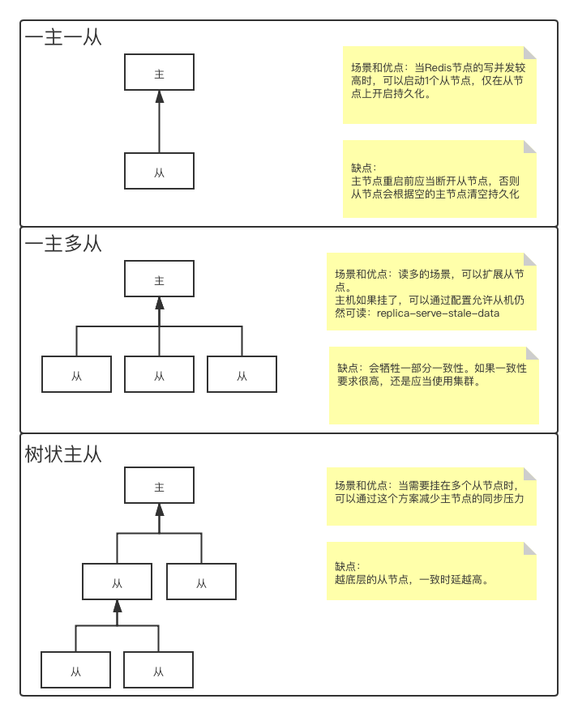  

## 主从复制逻辑
主从复制有全量复制和增量复制两种，具体过程如下图：

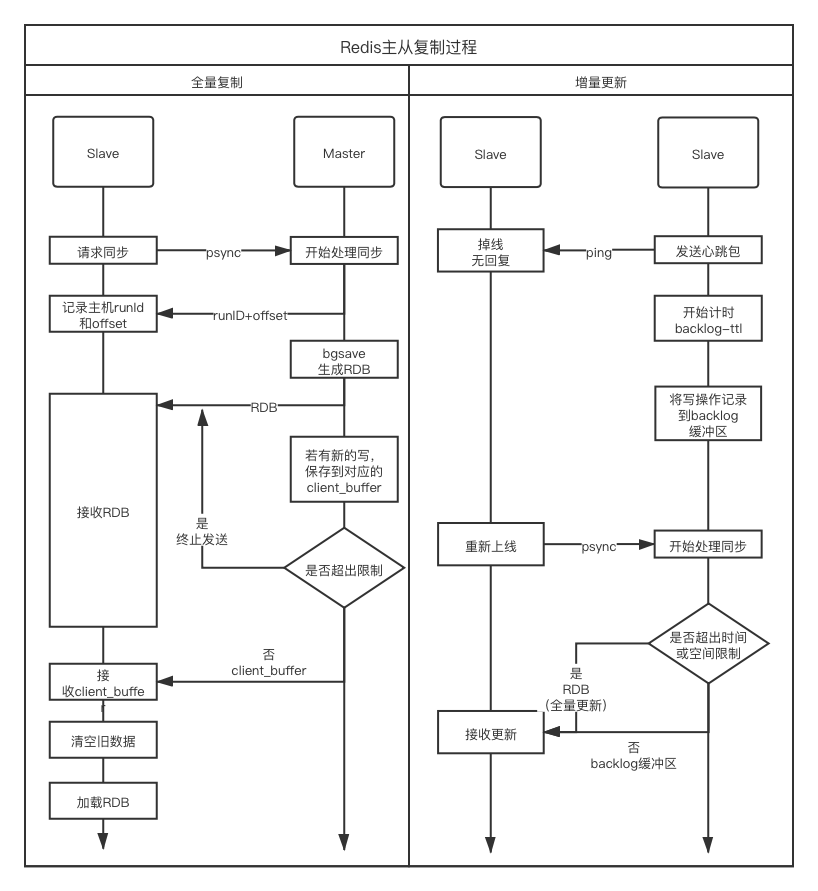  

其中client_buffer是指：
```bash
client-output-buffer-limit <class> <hard limit> <soft limit> <soft seconds>
```
表示在特定`class`的情况下，如果向客户端写的缓冲区存储持续超过`soft limit`达到`soft seconds`秒，或者瞬时存储超过`hard limit`，则断开与`class`的连接。其中`class`可选`normal`（普通情况下，包括事务）、`replica`（主从复制时）、`pubsub`（订阅发布时）。  

backlog缓冲区及ttl是指通过`repl-backlog-size`和`repl-backlog-ttl`设置的增量更新缓冲区。  

在主从复制过程中，会维护一个复制偏移量，Master记录自己这边的数据总偏移量，从机记录自己已经复制了的偏移量。在某一次增量更新时，先根据双方offset的差准备数据，如果这个数据量比较小，在backlog-size之内，就直接发送出去，如果超过了，则直接进行全量复制。所以说，主机的ReplicationID和offset两者的组合其实就确定了一个数据集的确切版本。

此外，关于过期时间在主从机上的操作，大致是这样的：Slave不会让key过期，而是等Master让key过期后发送删除指令。但由于这个行为存在时延，会造成主从不一致，因此在从Slave读取被设置了过期时间的key时，还应该通过ttl读取期过期时间，如果<0就说明已经无效了，正在或者即将从Slave中被删除。  

这里要吐槽一下Redis官方解释和[CN的翻译]，看得我一头雾水（当然也可能是我英语差）。  
[官方的](https://redis.io/topics/replication#how-redis-replication-deals-with-expires-on-keys)：
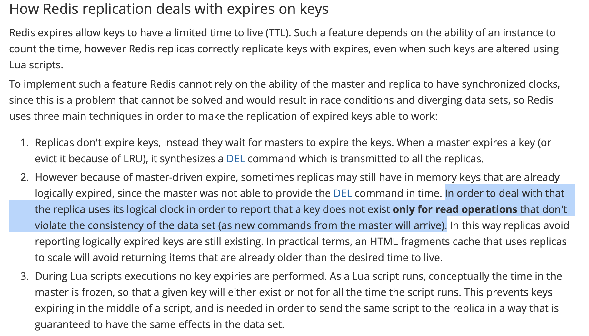  
[中文网](http://www.redis.cn/topics/replication.html#redis--key-)的翻译：

> 为了处理这个问题，slave 使用它的逻辑时钟以报告只有在不违反数据集的一致性的读取操作（从主机的新命令到达）中才存在 key。  


## 总结优缺点
优点：  

1. 一个Master可以同步多个Slave
2. Slave可以呈树状，以分担Master的同步压力
3. Master和Slave均以异步方式进行复制，不会阻塞客户端对Master的请求
4. Master可以将持久化任务交给Slave完成，降低Master的IO压力
5. 自动完成复制

缺点：

1. Redis不具备自动容错和恢复功能，需要等待服务重启或手动切换IP
2. 主机宕机前的部分数据可能无法及时同步到从机，此时切换IP会造成数据不一致。
3. Redis的RDB会对内存有一定的压力


# 哨兵Redis Sentinel
Redis Sentinel提供三个功能：

* 监控（Monitoring）：不断检查Master和Slave是否正常运作
* 提醒（Notification）：当被监控的Redis服务器出现问题，可以通过API向管理员或其他应用程序发送通知
* 自动故障迁移（Automatic failover）：当Master宕机，会开始自动故障迁移操作，将失效的Master的一个Slave升级为Master，并通知其他相关Slave向新的Master复制；当客户端湿度连接失效的Master时，也会向客户端返回新的Master地址，以取代宕机的。

Sentinel通过这条命令启动：
```bash
redis-server /path/to/conf.conf --sentinel
```

Sentinel通过Master的发布订阅通道获知其他Sentinel的信息。

## 工作流程

### 健康检查
哨兵定时向主结点、从结点及其他哨兵发送PING。

### 主观下线
如果在超过一定时间（`sentinel down-after-milliseconds <master-name> <millisecond>`）没有PONG响应的话，本sentinel标记其为主观下线SDOWN（Subjective Down）。

### 客观下线
当某个结点被标记为SDOWN不意味着该结点会被立刻下线，立刻开始failover（故障转移）。当被标记SDOWN的是Master结点时，这台sentinel会告知其他sentinel本结点认为Master已经SDOWN了。当有超过`<quonum>`个sentinel同意时（因为可能只是本sentinel网络不好造成没有收到回复），则标记Master为客观下线ODOWN（Objective Down）。所以`<quonum>`值越小就越敏感，但误判的概率就高了。

### 选举领导者
被标记为ODOWN之后，正式的failover就要开始了。此时各sentinel会选举出1个leader，由其进行故障转移。选举通过Raft算法进行，要求当选的sentinel应当要有至少max(quorun, sentinel个数/2+1)张选票才可以。  

### 故障转移
故障转移时，首先要挑选出Slave中能够继任Master的。其原则按照如下顺序：  

* 依然在线，而不是SDOWN、距离上一次成功PING超过5秒
* 优先级最高的，即Slave的配置项中slave priority最小的
* 主从复制最完整，也即复制偏移量最大的
* 前面都一样时，各Slave取runID最小的作为Master  

接下来，sentinal的leader对新选举出来的Redis服务发送`slaveof no one`指令，转为Master。  
向其他Slave发送指令，去follow新的Master，并全量复制。  
关注之前ODOWN的旧Master，当发现其下线后，通知其follow新主机。

## Sentinel的简易工作机制
由于sentinel不支持直接告知客户端新的主从列表，所以需要客户端自己想办法。那只能从sentinel通信的原理入手。  

首先，sentinel只需要直到一个Master，就能知道各个Slave的信息呢？因为sentinel通过对Master发送INFO指令，得到的返回值中就有各个Slave的信息：

> \# Replication
role:master
connected_slaves:2
slave0:ip=127.0.0.1,port=6381,state=online,offset=170081,lag=1
slave1:ip=127.0.0.1,port=6382,state=online,offset=169948,lag=1
master_replid:76ea6a06933e3a0e4e77786f58632d38cebed774
master_replid2:d8367b170dd01b07d0d4c8076dc78b13edc9a46f
master_repl_offset:170081
second_repl_offset:114449
repl_backlog_active:1
repl_backlog_size:1048576
repl_backlog_first_byte_offset:1
repl_backlog_histlen:170081

然后为什么sentinel也不需要配置其他的sentinel就可以互相通信？因为在Master中，sentinel利用其中的一个pubsub通道进行通信：

> 127.0.0.1:6380> PSUBSCRIBE *
Reading messages... (press Ctrl-C to quit)
1) "psubscribe"
2) "*"
3) (integer) 1
1) "pmessage"
2) "*"
3) "\__sentinel__:hello"
4) "127.0.0.1,26382,273e15e7e1a6fa523299b6e6345381801ba3b2fd,2,Master01,127.0.0.1,6380,2"
1) "pmessage"
2) "*"
3) "\__sentinel__:hello"
4) "127.0.0.1,26381,f00b73406cceb9e39fd4aa4c636374b8ecbb0703,2,Master01,127.0.0.1,6380,2"

通过这里，就可以让新来的sentinel直到有哪些旧的sentinel已经附着在Master上了。同时，通过这种机制，定时检查Master是否存活。对于Slave也是一样，也会在Slave上建立`__sentinel__:hello`这个通道进行存活性监测。  

最后，Sentinel之间如何互相通信呢？同样是通过pubsub的通道。Sentinel会在自己的pubsub中开启多个通道，用于发布对某个结点状态的监视情况：  

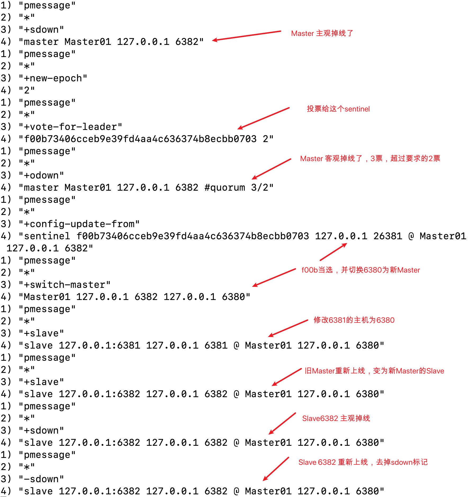  

所以，如果客户端需要在Master掉线后，重新找到Master和Slave的列表，就需要去监听至少1个Sentinel的pubsub的`+switch-master`通道，然后获取新Master的位置，最后获取Slave列表。

## 网络分区时的一致性
比如现在有Redis1(M)、Redis2(S)、Redis3(S)一主二从，以及3个哨兵Sentinel1、Sentinel2、Sentinel3。因为网络问题，Redis1与Sentinel1与另外4个隔离了。但Redis1与Sentinel1能够通信，Redis2、Redis3、Sentinel2、Sentinel3这4个也能彼此通信。  

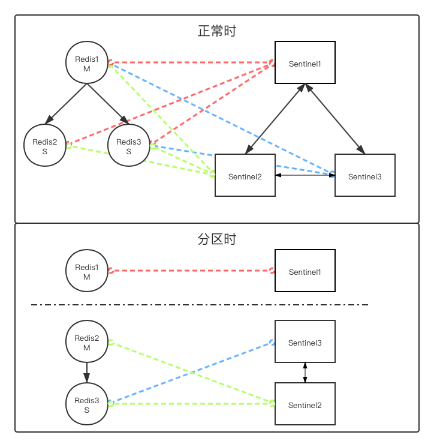 

这时，Redis2与Redis3通过Sentinel2与Sentinel3选举出了新的Master。但由于Redis1只是对Redis2和Redis3不可见，因此Redis1依然持续在对外暴露读写服务。  

接下来，问题来了。当Redis1与Redis2、3的网络分区恢复后，因为Sentinel2和Sentinel3已经将Redis2选为新的Master了，所以Redis1只能忽略掉自己在此期间的写操作，将Redis2同步过来。对于把Redis当做缓存可能没什么，但如果将Redis作为数据库，那么在网络分区过程中的数据就永久丢失了。这显然是无法容忍的。  

为此，应当要求Master在Slave数量不足时，禁止读操作，作为一个折中的解决方案：
```bash
# 当slaves数量不足时，禁止读操作
min-slaves-to-write 1
# 当slave无回应超时超过这个时间时，认为其掉线
min-slaves-max-lag 10
```

当然这个问题并没有解决，当分区后两个分区剩余的Slave数量都超过设定时，2个Master都会读写，通过这种办法仍然无法解决问题。特别是利用Redis生成分布式锁时，这个问题更为致命。

## 重要配置项
配置文件模板在源码目录的sentinel.conf中。  
重要的配置项有：
```bash
# sentinal服务的端口号
port 26379

# 设置需要监听的主机
# sentinel monitor <master-name> <ip> <redis-port> <quorum>
# 其中master-name自定义，后面用于指代此主机，A-Za-z0-9{.-_}
# quorum表示需要几票才认为Master已经ODOWN了
# 可以设置多组Master
sentinel monitor mymaster 127.0.0.1 6379 2

# 如果PING后各个结点在下面的时间内没有回复或者错误回复，则认为其主观掉线SDOWN了默认值为30秒
sentinel down-after-milliseconds mymaster 30000

# 在进行failover的时候，允许多少个Slave从新的Master同步。
# 1表示一次一个，这样会慢一点。如果数字比较大，那么这些Slave就会在同步时都不可用，可能会影响业务正常运行
sentinel parallel-syncs mymaster 1

# 当slaves数量不足时，禁止读操作
min-slaves-to-write 1
# 当slave无回应超时超过这个时间时，认为其掉线
min-slaves-max-lag 10
```

# 改变客户端
上面根据单机单节点，通过AFKCube的X轴方向扩展，利用主从复制和Sentinel基本解决了大部分单点故障恢复问题，并且通过读写分离解决了一部分访问压力，但更大规模的访问压力、存储容量限制以及高可用的故障恢复能力仍然没有解决。  
所以利用AKF的Y轴方向和Z轴方向来尝试通过修改客户端解决这个问题。  

既然需要将Redis节点在Y轴和Z轴方向上扩展，那就必然会进行分库。接下来看看集中分库的解决方案。

## Y轴——业务拆分
将各种业务拆分到不同的Redis库中，比如用户信息Redis、支付信息Redis、商品信息Redis，然后在业务代码侧建立对这几个不同的Redis服务器的连接。
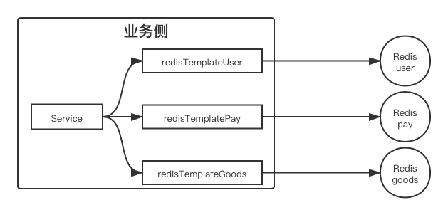

通过`Spring-Data-Redis`建立对不同业务Redis的连接（池）的方式具体的代码可以参考[这个链接](https://www.iteye.com/blog/357029540-2389235)。  

## Z轴——数据分片
当单业务Redis中的数据量达到上限，无法再拆分时，就需要考虑在Z轴方向上进行扩展了。  
数据分片通常可以通过哈希取模（又叫modula）或者随机节点（random）的方式进行。  
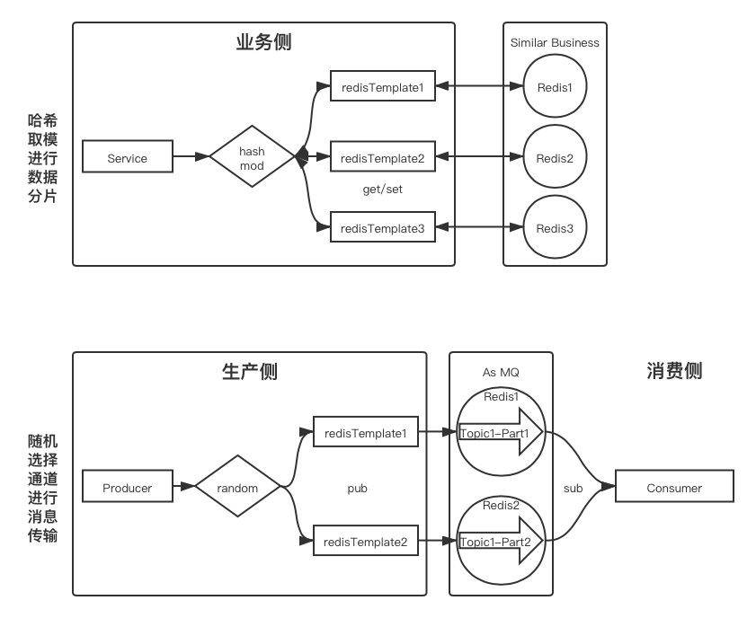

哈希取模首先将某个键值（如id、ip）先通过hash，然后提供相关服务的Redis的结点数量取模，从而将键值映射到对应的Redis结点上，也即`redisIndex = hash(key) % REDIS_INSTANCE_NUM`。在存取时都通过相同的`hash()`函数和`REDIS_INSTANCE_NUM`，就可以找到相同的Redis结点。  
这种方案在Redis结点数量不变时，对只会对时间性能增加一个`O(1)`的损耗（因变量是Redis的结点数，这里是1）。但是当Redis再次发生单结点性能瓶颈需要扩容时，模数`REDIS_INSTANCE_NUM`就会发生变化，导致目前在Redis集群中的所有数据都需要重新Sharding，否则就只能全部失效，等待重新从数据库中读取后再写到扩容后的目标结点中。而且需要选择一个相对合理的`hash()`函数配合`REDIS_INSTANCE_NUM`常数，以免Redis中的数据分布不均造成倾斜。

另一种方式是随机选取Redis结点。这种方式无法应用于对特定键值的存取，因为完全随机后，get方并不知道数据放在哪个Redis结点中。这种方式通常应用于将Redis作为消息队列使用时，当单机Redis无法应对较大的消息生产消费吞吐量，而将一个Topic拆分为多个Partition。这时，生产者就可以随机选择一个Redis，将生产压力均分掉，然后消费者可以根据自身消费能力同时sub所有Redis或者也采用集群的方式共同消费。  

## 一致性哈希
那么对于按键值存取的Redis缓存，是否有解决方案呢？普通的hash一般指非一致性哈希，也就是在改变映射集后需要对之前的映射关系重新计算。那么按照这个定义，如果使用一致性哈希，也就是在改变映射集（Redis集群）后不需要重新计算映射关系，就能解决这个问题了。 
常用的一致性哈希算法比如Katama。
一致性哈希会使用一个可以随机访问的环形数组，数组的每一个位置对应一个Redis结点。然后上线一些真实的Redis结点，放入环形数组中，剩下没有放真实Redis结点的就是虚拟结点；而虚拟结点指向其后的第1个真实结点。  
这样，当存取时，通过1个`hash()`函数并对环形数组长度取模，映射到环形数组上，如果恰好映射到真实Redis结点，那就可以直接使用；如果映射到虚拟结点，就根据该虚拟结点的指向去访问下一个最近的真实Redis结点。  
形成的这个环叫做哈希环，或者叫Katama环（Consistent Hash Ring)。

由于真实Redis结点的位置可以人为选择，所以很容易就平衡各个结点的数据量。而且这个环形数组可以设的很大（哪怕$2^{32}$，也不过占用了4GB），而带来的好处就是，取模的模数永远都不需要发生变化，所以当扩容的时候，不需要让整个缓存集群中的所有结点的所有数据都失效。  

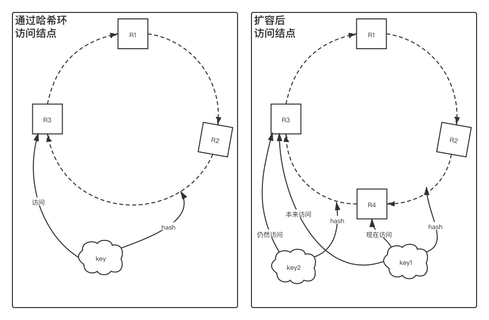  
那么扩容的时候怎么操作呢？从上面的右图可以看出来，一部分hash到新加入结点R4之前的数据已经在旧的R3中失效了，而hash到R4之后的数据仍然在R3中有效。这时可以有2种方案。  

1. 抛弃新扩容结点的下一个真实结点中的值。这样，当查询时Cache Miss，直接去数据库查询后，更新到新扩容的结点中。由于只是一小部分缓存失效，造成缓存击穿或缓存雪崩的可能性比较小。
2. 查询时，如果发现目标结点Cache Miss了，则向下1个结点发起查询（上右图中就是查询key1到R4发现不存在，则再向R3发起查询）。这样完全避免了击穿，但可能会浪费连接，而且当扩容插入多个结点时，向后查询的数量可能需要增加。  

# Redis集群代理
上面在客户端进行AKF的Y轴和Z轴扩展本身是可以实现的，但是这样会增加代码的复杂性，提高系统的维护成本。  
而其实本身这一过程，都是在由Client去计算应当存储于或者获取自哪一个Redis节点，同时每一个Client都需要去建立到每一个Redis结点的连接，这在微服务架构下，特别是启用Redis连接池的情况下，对每一个Redis结点的连接压力是可怕的。  
如果像Nginx一样，对Client只暴露一个不记录状态的代理，那么就只需要关注这个代理的性能就可以了。只要代理计算节点速度够快，那么吞吐量就高。Client也只需要建立到代理的连接，从而缓解各个Redis节点的连接数压力。  
如果一个代理能力有限，就多启用几个代理。不过考虑到业务通常应当对客户端或上层保持透明，所以通过LVS+keepalived进行高可用。   

注意，对外保持透明往往是很重要的，这意味着客户端只需要直到服务端的1组地址和端口号，就像只有1个Redis在提供服务一样。这样无论Redis宕机或删减节点，亦或是发生了迁移，客户端都不需要感知也不需要修改代码。

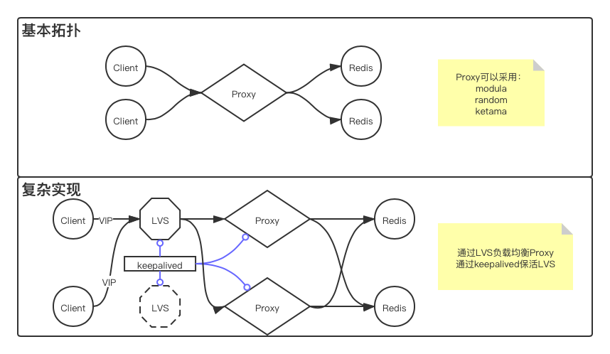
 
常用的HA Proxy有Twitter的[twemproxy](https://github.com/twitter/twemproxy)、[Predixy](https://github.com/joyieldInc/predixy)、Redis官方的[RedisCluster](https://redis.io/topics/cluster-tutorial)，还有豌豆荚的[Codis](https://github.com/CodisLabs/codis)（里面写了Codis自己与twemproxy和RedisCluster的对比）。

这几个代理的横向对比可以参看[这篇文章](https://blog.csdn.net/rebaic/article/details/76384028)。  

## twemproxy（nutcracker）
twemproxy（或者叫nutcracker）是Twitter自研的Redis集群。它大致将[上面](#改变客户端)提到的在客户端实现代理的功能转移到了服务端，提供modula、random、katama三种分发方式。支持在key上标记tag的方式保证相同tag放到同一个redis实例中。 

twemproxy不支持主从模式在宕机后的自动切换（如果Sentinel在发现Master宕机后将Slave升级为Master的话，twemproxy是无法自主切换代理的节点的），如果一定要通过此方式进行，可以通过脚本的方式，即在Sentinel中`sentinel deny-scripts-reconfig yes`修改为`no`，并在`sentinel client-reconfig-script master-name /path/to/script`处添加脚本位置，在脚本中编写修改twemproxy的配置文件、重启twemproxy的命令。具体过程见[这里](https://blog.csdn.net/wyl9527/article/details/94024654#4.%20twemprox%E4%BB%A3%E7%90%86redis%E7%9A%84%E9%9B%86%E7%BE%A4)

## Redis Cluster
Redis Cluster是Redis官方提供的集群，支持无主模式，每一个节点可以横向进行主备扩展。  

比如要启动一个Redis集群，有3个提供服务的Redis结点（Redis Cluster要求只要有3个Master结点），每个结点另有1个备份结点（也就是一共6个Redis结点）。  
在启动6个Redis服务之后，直接通过这样的命令（或者通过配置文件进行）将6个独立的节点配置为一个集群：
```bash
redis-cli --cluster create Host1:Port1 Host2:Port2 Host3:Port3 Host4:Port4 Host5:Port5 Host6:Port6 --cluster-replicas 1
```
这里--cluster-replicas参数表示加入的结点中，每个Master对应几个备份节点。  

然后采用默认配置或者手动调整其中的slot后，就可以通过这条命令，任意连接其中一个。当数据不存在于该Redis中时，会根据slot的位置自动切换至目标Master结点上。  
不过如果切换到目标Redis上后，目标Redis宕机连接不可用，那么该连接就失效了，直到该Redis重新上线（此时该结点可能已经变成Slave了），然后执行get/set等指令后，将会重新进行Redirect。  

上面提到的slot是什么呢？
对整个Redis Cluster最多可以分为16384个槽位（slot），cluster中的每一个结点可以认领其中的一部分。然后再对key进行hash后，将key映射到不同的槽位上。这样，当需要添加或者删除结点时，只需要将一部分槽位（连同其中的key-value）一起移动就可以了。在整个集群的每一个结点中，都记录着每一个槽位的归属，所以任意连接其中一个结点（通过`redis-cli -c`指令显示的要求来连接集群），当所要求的key对应的slot不在本结点时，会自动切换至目标结点。
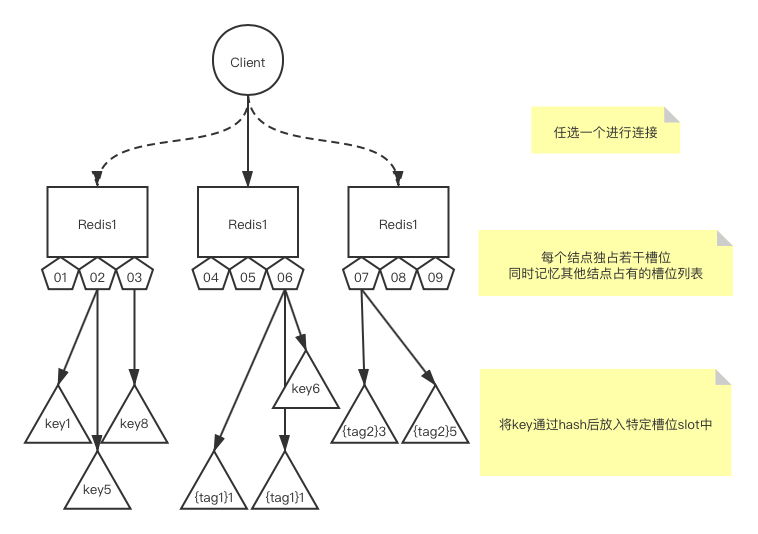  


## Predixy
上面也说到了，RedisCluster可以自动切换主备，有一定的透明性，但当目前正在使用的连接宕机，而又不知道其他节点的情况下，将无法响应任何指令，所以RedisCluster不太像一个代理，而像是在Redis单点服务上增加了一些功能。而twemproxy可以对客户端透明，但是很难让redis集群实现主备关系。  
Predixy可以在RedisCluster的基础上，再加一层代理，不但利用RedisCluster的自动切换主备和寻址的功能，还能让外部完全感受不到Redis集群中实现的细节。

Predixy可以直接应用于Redis Sentinel，也可以应用于Redis Cluster。对外仅暴露一个地址端口对（当然，也可以通过keepalived实现VIP转移）。

[使用用例](https://blog.csdn.net/c43693/article/details/100948021)

## 总结
无论使用那一种方式，在集群模式下，事务的实现都是困难的。twemproxy是不支持的；predixy仅支持在sentinel单结点模式下的事务；redis cluster仅支持key在同一结点中的事务（需要在同一结点中执行watch、multi和exec以及操作指令）。