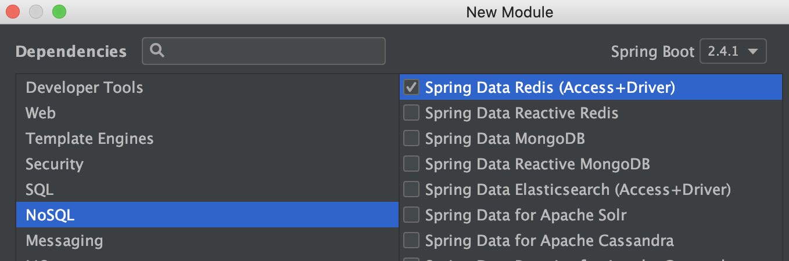
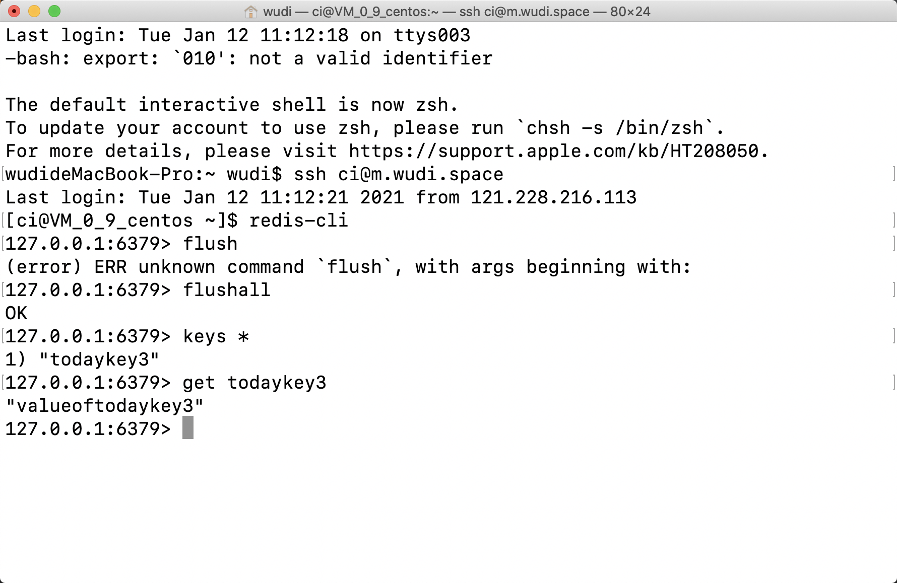
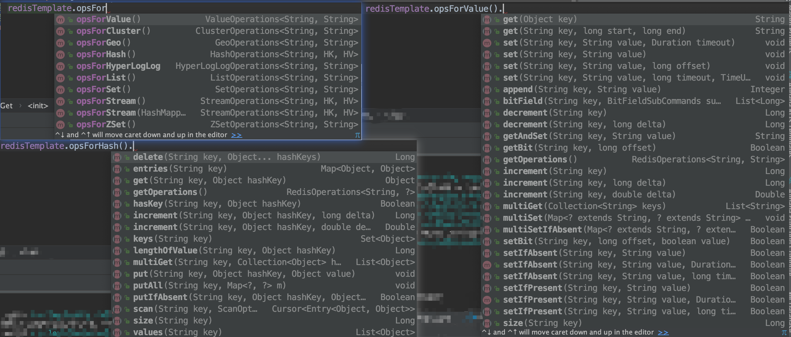
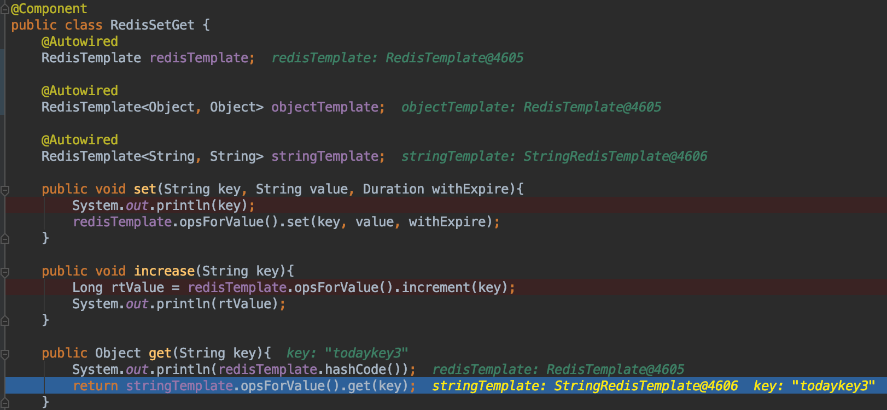
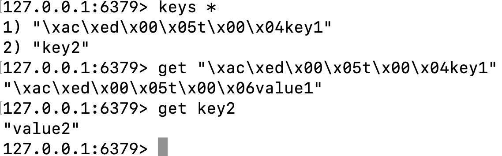
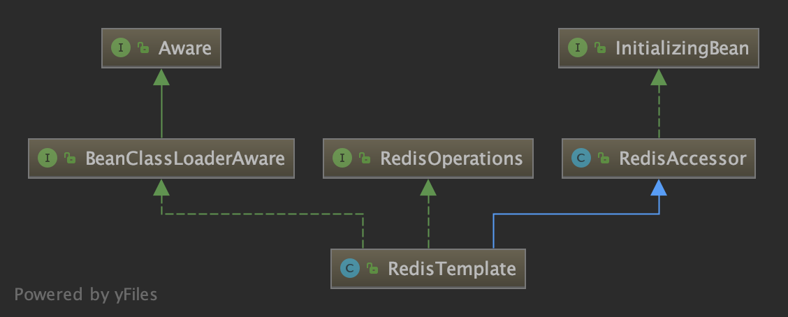
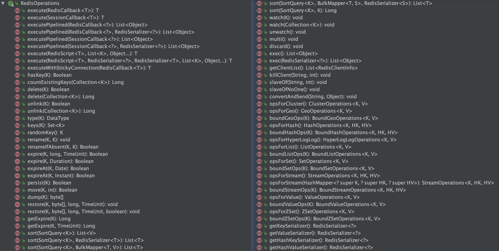

前面几篇文章介绍了Redis的一些理论和通过redis-cli的用法。本文将在Spring Boot中通过Spring-Data-Redis来操作Redis，并简要看一下Spring-Data-Redis是如何操作Redis的。  

<!--more-->

# 加入Spring-Data-Redis
## Maven引入
创建一个Spring Boot（2.4.1）项目后，通过Initializer选择Nosql-Redis(Access and Driver)就能够自动加入Spring-Data-Redis。  


当然也可以通过maven手动引入：  
```xml
<dependencies>
    <dependency>
        <groupId>org.springframework.boot</groupId>
        <artifactId>spring-boot-starter-data-redis</artifactId>
    </dependency>
</dependencies>
```
这其中除了包括了`spring-boot-starter`之外，还引入了`spring-data-redis`和`lettuce-core`。

所以该版本的`spring-data-redis`已经默认使用lettuce了。如果需要使用Jedis的话，首先需要在pom中加入`Jedis`的依赖：
```xml
<dependency>
    <groupId>redis.clients</groupId>
    <artifactId>jedis</artifactId>
</dependency>
```
然后要么要将配置中的`spring.redis.client-type`设为`jedis`（默认为`lettuce`）。要么将`spring-boot-starter-data-redis`中的`lettuce-core`依赖去掉：  

```xml

<dependency>
    <groupId>org.springframework.boot</groupId>
    <artifactId>spring-boot-starter-data-redis</artifactId>
    <exclusions>
        <exclusion>
            <groupId>io.lettuce</groupId>
            <artifactId>lettuce-core</artifactId>
        </exclusion>
    </exclusions>
</dependency>

```  
```java
```

## SpringBoot默认使用Lettuce

为什么说Spring Boot 默认使用`Lettuce`呢？从源码中就可以看到。`Lettuce`和`Jedis`生成`Connection`都需要一个工厂类，而`Spring-Data-Redis`需要将这个工厂类实例化为一个`bean`。这个过程通过两个类来实现，分别是`LettuceConnectionConfiguration`和`JedisConnectionConfiguration`.
<a name="firstConfig"></a>


```java
// springboot-autoconfig.jar!/org.springframework.boot.autoconfigure.data.redis.LettuceConnectionConfiguration
@Configuration(proxyBeanMethods = false)
@ConditionalOnClass(RedisClient.class)
@ConditionalOnProperty(name = "spring.redis.client-type", havingValue = "lettuce", matchIfMissing = true)
class LettuceConnectionConfiguration extends RedisConnectionConfiguration {
@Bean
	@ConditionalOnMissingBean(RedisConnectionFactory.class)
	LettuceConnectionFactory redisConnectionFactory(ObjectProvider<LettuceClientConfigurationBuilderCustomizer> builderCustomizers, ClientResources clientResources) {
		LettuceClientConfiguration clientConfig = getLettuceClientConfiguration(builderCustomizers, clientResources, getProperties().getLettuce().getPool());
		return createLettuceConnectionFactory(clientConfig);
	}
}

// org.springframework.boot.autoconfigure.data.redis.JedisConnectionConfiguration
@Configuration(proxyBeanMethods = false)
@ConditionalOnClass({ GenericObjectPool.class, JedisConnection.class, Jedis.class })
@ConditionalOnMissingBean(RedisConnectionFactory.class)
@ConditionalOnProperty(name = "spring.redis.client-type", havingValue = "jedis", matchIfMissing = true)
class JedisConnectionConfiguration extends RedisConnectionConfiguration {
    @Bean
	JedisConnectionFactory redisConnectionFactory(ObjectProvider<JedisClientConfigurationBuilderCustomizer> builderCustomizers) {
		return createJedisConnectionFactory(builderCustomizers);
	}
}
```
可以看到，这两个Configuration的Conditional还是有一些区别的。  
`Lettuce`的要求是基本上没什么要求：classpath中必须存在`class RedisClient`，而这个class就在lettuce包中；配置参数`spring.redis.client-type`是`lettuce`，没有也可以。  
`Jedis`的要求相对多一些，classpath中必须存在3个class；配置参数`spring.redis.client-type`是`jedis`，没有也可以；最主要的是还没有加入`RedisConnectionFactory`类型的bean。  
这时候，如果两者只有其一，那只要`spring.redis.client-type`不设置（或者设置对了），那就不会有问题；如果两者都有的话，无论先加载`Lettuce`还是`Jedis`的`Configuration`，最终保留下来的都是`Lettuce`。（先`Lettuce`，则在`Jedis`时发现已经有`RedisConnectionFactory`类型的bean了，就不创建bean了；如果先`Jedis`，则在`Lettuce`时根据bean的覆盖原则，`JedisConnectionFactory`就被`Lettuce`覆盖了，bean的覆盖顺序问题可以看[这里](https://cloud.tencent.com/developer/article/1497702)）。

## 配置Redis
redis在Spring Boot中的配置也很简单。
```properties
# 基础配置
spring.redis.host = Redis地址
spring.redis.port = Redis端口号
spring.redis.password = Redis密码，如需
spring.redis.client-type = 客户端类型，lettuce或jedis二选一，默认lettuce
spring.redis.database = 连接的目标redis db编号，默认为0

# 连接池，本节每一个lettuce都可以换成jedis
spring.redis.lettuce.pool.max-active = 最大连接数，负数表示无限制，默认为8
spring.redis.lettuce.pool.max-wait = 最大阻塞等待时间
spring.redis.lettuce.pool.max-idle = 连接池中最大空闲连接
spring.redis.lettuce.pool.min-idle = 连接池中最小空闲连接
spring.redis.lettuce.pool.time-between-eviction-runs = 驱逐线程的调度时间


# Sentinel哨兵
spring.redis.sentinel.nodes = 哨兵节点列表
spring.redis.sentinel.master = 哨兵监控的某一个master的name，表示需要连接到的主从群
spring.redis.sentinel.password = 哨兵的密码  

# Cluster集群
spring.redis.cluster.nodes = cluster结点列表
spring.redis.lettuce.cluster.refresh.adaptive = 开启或关闭Cluster的拓扑结构自动刷新，默认关闭（当Cluster结点因为掉线或增加而变化后，可以利用该功能自动更新结点拓扑关系）
spring.redis.lettuce.cluster.refresh.dynamic-refresh-sources = 当为false时，刷新拓扑只会从spring.redis.cluster.nodes设置的节点开始；为true时从所有当前已发现的节点开始。默认为true
spring.redis.lettuce.cluster.refresh.period = 自动刷新拓扑的周期，单位ms，默认60秒。

```

# 简单使用
相关代码都位于[这里](https://github.com/discko/learncache/tree/master/redis/src)  
搭建好Spring Boot Data Redis环境后，在配置`application.yml`中加入：
```yml
spring:
  redis:
    host: localhost
    port: 6379
```
由于不想使用Web框架，所以采用注入和获取bean的形式来进行测试。  

## Demo演示
### 基本RedisTemplate的使用
先编写一个测试`RedisTemplate`的`Component`：
```java
package space.wudi.learncache.redis;
import org.springframework.beans.factory.annotation.Autowired;
import org.springframework.data.redis.core.RedisTemplate;
import org.springframework.stereotype.Component;
import java.time.Duration;
@SuppressWarnings("all")
@Component
public class RedisSetGet {
    @Autowired
    RedisTemplate<String, String> stringTemplate;

    public void set(String key, String value, Duration withExpire){
        stringTemplate.opsForValue().set(key, value, withExpire);
    }
    public Object get(String key){
        return stringTemplate.opsForValue().get(key);
    }
}
```
然后在启动类中增加：
```java
package space.wudi.learncache.redis;
import org.springframework.boot.SpringApplication;
import org.springframework.boot.autoconfigure.SpringBootApplication;
import org.springframework.context.ApplicationContext;
import java.time.Duration;
@SpringBootApplication
public class RedisApplication{
    public static void main(String[] args) {
        ApplicationContext context = SpringApplication.run(RedisApplication.class, args);
        testRedisTemplate(context);
    }

    private static void testRedisTemplate(ApplicationContext context){
        RedisSetGet redis = context.getBean(RedisSetGet.class);
        String key = "todaykey3";
        String value = "valueof"+key;
        Duration expire = Duration.ofMinutes(5);
        System.out.println(redis.get(key));
        redis.set(key, value, expire);
        String redisReturn = (String)redis.get(key);
        System.out.println(redisReturn);
    }
}
```
其运行结果如下：


### 基本PubSub的使用
然后再测试一个PubSub，演示一个异常简单的聊天室。新建一个`RedisPubSub.java`：
```java
package space.wudi.learncache.redis;
import org.springframework.beans.factory.annotation.Autowired;
import org.springframework.context.annotation.Bean;
import org.springframework.data.redis.connection.Message;
import org.springframework.data.redis.connection.MessageListener;
import org.springframework.data.redis.connection.RedisConnectionFactory;
import org.springframework.data.redis.core.RedisTemplate;
import org.springframework.data.redis.listener.RedisMessageListenerContainer;
import org.springframework.stereotype.Component;
@Component
public class RedisPubSub {
    @Autowired
    RedisTemplate<String, String> redisTemplate;
    @Bean   // 注册消息监听容器
    RedisMessageListenerContainer redisMessageListenerContainer(RedisConnectionFactory factory){
        RedisMessageListenerContainer container = new RedisMessageListenerContainer();
        container.setConnectionFactory(factory);
        return container;
    }
    // 发送消息
    public void sendMessage(String name, String channel, String message){
        redisTemplate.convertAndSend(channel, String.format("%s:%s",name, message));
    }
    public static class WudiChatRoomMessageListener implements MessageListener{
        private String name;    // 记录聊天消息发送者
        public WudiChatRoomMessageListener(String name) {
            this.name = name;
        }
        @Override   // 重写MessageListener中的接收到消息的处理事件
        public void onMessage(Message message, byte[] pattern) {
            String channel = new String(message.getChannel());
            String body = new String(message.getBody());
            int pos = body.indexOf(":");
            // 消息格式为 name:sentence
            String sender = body.substring(0, pos);
            String sentence = body.substring(pos+1);
            String status = sender.equals(name)?"send":"recv";
            // 打印消息，格式：[发送或接受]通道名-发送人:内容
            System.out.printf("[%s]Chatroom %s - %8s: %s\n", status, channel, sender, sentence);
        }
    }
}
```
然后在启动器中增加：
```java
package space.wudi.learncache.redis;
import org.springframework.boot.SpringApplication;
import org.springframework.boot.autoconfigure.SpringBootApplication;
import org.springframework.context.ApplicationContext;
import org.springframework.data.redis.listener.ChannelTopic;
import org.springframework.data.redis.listener.RedisMessageListenerContainer;
import java.util.Scanner;
@SpringBootApplication
public class RedisApplication{
    public static void main(String[] args) {
        ApplicationContext context = SpringApplication.run(RedisApplication.class, args);
        testRedisPubSub(context);
    }
    private static void testRedisPubSub(ApplicationContext context){
        RedisMessageListenerContainer container = context.getBean(RedisMessageListenerContainer.class);
        String myName = "WuDi";
        String channel = "WudiChatRoom";
        // 注册监听事件，可以为多个人监听多个信道
        container.addMessageListener(new RedisPubSub.WudiChatRoomMessageListener(myName),
                new ChannelTopic(channel));
        System.out.println("START CHATTING ~");
        RedisPubSub redisPubSub = context.getBean(RedisPubSub.class);
        String message = null;
        Scanner scanner = new Scanner(System.in);
        // 发送消息
        while(!"quit".equals(message)){
            message = scanner.nextLine();
            redisPubSub.sendMessage(myName, channel, message);
        }
    }
}
```
最终效果：  
  

## 其他高层API用法
当然，`RedisTemplate`已经为我们封装了很多各种用法。

。

这些高阶用法可以实现对redis几乎所有的操作。  

## 字节型API
前面的文章也说到了，Redis底层是二进制安全的，因为其底层的所有值数据都是以字节数组的形式存放的，而RedisTemplate已经将其封装过了。比如String会直接调用getBytes()方法获得其默认编码（`Charset.defaultCharset() == UTF-8`）下的字节数组，而Map、List等Java对象也会转换为相应的格式或命令组合。如果Redis的存取双方都是Java那没有关系，但如果存取有一方不是Java，那最简单的方式就是直接通过字节流的形式编码好再存入Redis，调用底层字节数组的方式是这样操作的：
```java
RedisConnection conn = redisTemplate.getConnectionFactory().getConnection();
conn.hSet(byte[] key, byte[] field, byte[] value);
conn.redisTemplate.hashCommands().hSet(byte[] key, byte[] field, byte[] value);
```

当然，此外，redisTemplate还提供了修改序列化器的方式来修改对象与字节的转化关系：
```java
redisTemplate.setDefaultSerializer(new RedisSerializer<String>() {
    @Override
    public byte[] serialize(String s) throws SerializationException {
        return s.getBytes("gbk");
    }

    @Override
    public String deserialize(byte[] bytes) throws SerializationException {
        return new String(bytes, "gbk");
    }
});
```
除了修改默认的序列化器，还可以通过`setKeySerializer`、`setStringSerializer`等方式指定key、value、hash等不同位置和类型的序列化器。  

## RedisTemplate的泛型绑定
上面的代码中都是将RedisTemplate的泛型写全了`RedisTemplate<String, String>`。其实不写的话也可以。当然，结果会有一些变化。  
从下图中可以看到，当把RedisTemplate的泛型去掉之后，或者泛型为`<Object, Object>`，这两个自动绑定的对象是一样的，而`RedisTemplate<String, String>`则是自动绑定了一个`StringRedisTemplate`类型的实例。  
  

接下来尝试执行下面两条语句
```java
/*
@Autowired
RedisTemplate redisTemplate;
@Autowired
RedisTemplate<String, String> stringTemplate;
*/
redisTemplate.opsForValue().set("key1", "value1");
stringTemplate.opsForValue().set("key2", "value2")
System.out.println("rT.get(key1)="+redisTemplate.opsForValue().get("key1"));
System.out.println("sT.get(key1)="+stringTemplate.opsForValue().get("key1"));
System.out.println("rT.get(key2)="+redisTemplate.opsForValue().get("key2"));
System.out.println("sT.get(key2)="+stringTemplate.opsForValue().get("key2"));
```
可以在redis上看到这样的2条记录：


通过`StringRedisTemplate`执行的set操作符合直觉，而通过`RedisTemplate`的插入比想象中多了很多不可见字符。  

而在下面的4个get得到的输出是这样的：

> rT.get(key1)=value1  
sT.get(key1)=null  
rT.get(key2)=null  
sT.get(key2)=value2   

猜想这应该是Redis的二进制安全导致的。  

通过调试，逐步找到了输出的二进制的位置，可以看到，RedisTemplate的默认Serializer是`a`，其内部通过`org.springframework.core.serializer.DefaultSerializer`来序列化和反序列化。而`DefaultSerializer`的`serialize()`方是这样的，也即通过ObjectOutputStream将key和value序列化成字节流放入ByteArrayOutputStream中：
```java
// org.springframework.core.serializer.DefaultSerializer
public void serialize(Object object, OutputStream outputStream) throws IOException {
    if (!(object instanceof Serializable)) {
        throw new IllegalArgumentException(getClass().getSimpleName() + " requires a Serializable payload but received an object of type [" + object.getClass().getName() + "]");
    }
    ObjectOutputStream objectOutputStream = new ObjectOutputStream(outputStream);
    objectOutputStream.writeObject(object);
    objectOutputStream.flush();
}
// org.springframework.core.serializer.Serializer#serializeToByteArray
default byte[] serializeToByteArray(T object) throws IOException {
    ByteArrayOutputStream out = new ByteArrayOutputStream(1024);
    serialize(object, out);
    return out.toByteArray();
}
```
而StringRedisTemplate的默认Serializer是`StringRedisSerializer`，其`serialize()`方法是这样的，直接获取`String`的`byte`数组：
```java
// org.springframework.data.redis.serializer.StringRedisSerializer#serialize
public byte[] serialize(@Nullable String string) {
    return (string == null ? null : string.getBytes(charset));  // charset = UTF-8
}
```

反序列化同理，`RedisTemplate`使用的是`DefaultDeserializer`，而`StringRedisTemplate`仍然使用的`StringRedisSerializer`。 
这与[下一章下一节](#配置自动加载)可以呼应起来看

# SpringDataRedis简易工作原理
## 配置自动加载
由于不需要进行扫描或者`@Configuration`，在spring-data-redis.jar中也没有`@EnableAutoConfig`，所以只能去`spring-boot-autoconfig`。在`META-INF/spring.factories`中可以搜索到与redis相关的3个：
```properties
org.springframework.boot.autoconfigure.EnableAutoConfiguration=\
org.springframework.boot.autoconfigure.data.redis.RedisAutoConfiguration,\
org.springframework.boot.autoconfigure.data.redis.RedisReactiveAutoConfiguration,\
org.springframework.boot.autoconfigure.data.redis.RedisRepositoriesAutoConfiguration,\
```
所以自动配置是从`org.springframework.boot.autoconfigure.data.redis.RedisAutoConfiguration`这个类开始的。  

```java
// springboot-autoconfig.jar
package org.springframework.boot.autoconfigure.data.redis;
// import ...
@Configuration(proxyBeanMethods = false)
@ConditionalOnClass(RedisOperations.class)
@EnableConfigurationProperties(RedisProperties.class)
@Import({ LettuceConnectionConfiguration.class, JedisConnectionConfiguration.class })
public class RedisAutoConfiguration {
	@Bean
	@ConditionalOnMissingBean(name = "redisTemplate")
	@ConditionalOnSingleCandidate(RedisConnectionFactory.class)
	public RedisTemplate<Object, Object> redisTemplate(RedisConnectionFactory redisConnectionFactory) {
		RedisTemplate<Object, Object> template = new RedisTemplate<>();
		template.setConnectionFactory(redisConnectionFactory);
		return template;
	}

	@Bean
	@ConditionalOnMissingBean
	@ConditionalOnSingleCandidate(RedisConnectionFactory.class)
	public StringRedisTemplate stringRedisTemplate(RedisConnectionFactory redisConnectionFactory) {
		StringRedisTemplate template = new StringRedisTemplate();
		template.setConnectionFactory(redisConnectionFactory);
		return template;
	}
}
```

这里会生成2个bean，一个是`RedisTemplate<Object, Object>`类型的名为`redisTemplate`，一个是`StringRedisTemplate`类型的名为`stringRedisTemplate`。进一步的，可以看到，`StringRedisTemplate`是继承自`RedisTemplate<String, String>`，而且在构造时，就将所有的序列化器都设置为了`UTF-8`编码的`StringRedisSerializer`：  
```java
// org.springframework.data.redis.core.StringRedisTemplate
public class StringRedisTemplate extends RedisTemplate<String, String> {
	public StringRedisTemplate() {
		setKeySerializer(RedisSerializer.string());
		setValueSerializer(RedisSerializer.string());
		setHashKeySerializer(RedisSerializer.string());
		setHashValueSerializer(RedisSerializer.string());
	}
    // 省略
}
// org.springframework.data.redis.serializer.RedisSerializer#string

static RedisSerializer<String> string() {
    return StringRedisSerializer.UTF_8;
}
```

那么这两个bean所需要的RedisConnectionFactory又是从哪里生成的呢？从`RedisAutoConfiguration`类的注解`@Import`可以看到，引入两个Configuration，分别是`Lettuce`和`Jedis`。这两个就是在[一开始](#firstConfig)介绍的对RedisConnectionFactory的两个不同的实现。以`Lettuce`为例：
<a href="connectionFactory">></a>
```java
private LettuceConnectionFactory createLettuceConnectionFactory(LettuceClientConfiguration clientConfiguration) {
    if (getSentinelConfig() != null) {
        return new LettuceConnectionFactory(getSentinelConfig(), clientConfiguration);
    }
    if (getClusterConfiguration() != null) {
        return new LettuceConnectionFactory(getClusterConfiguration(), clientConfiguration);
    }
    return new LettuceConnectionFactory(getStandaloneConfig(), clientConfiguration);
}
```
从这里可以看出，sentinel的配置和cluster的配置是不可以同时起效的，sentinel优先。当两个都没有的时候，通过standalone的配置生成连接工厂。  

## 调用Redis单结点
`RedisTemplate`生成好之后就可以通过`@Autowired`注入到业务代码中了。  

`RedisTemplate`是一个什么呢？从其diagram可以看出来`RedisTemplate`继承或实现自三个类/接口。其中`BeanClassLoaderAware`提供了这个bean在构造时应当使用的`ClassLoader`，`RedisAccessor`是`RedisConnectionFactory`的容器，同时提供了在bean初始化完成后的校验功能（`afterPropertiesSet()`）。  
  

而`RedisOperations`则提供`RedisTemplate`则是一个接口，提供了Redis的基础操作，包括与类型无关的数据操作（`delete`、`expire`等）、事务相关操作（`multi`、`watch`）、针对各个Redis类型的具体操作指令集（如`opsForValue`、`opsForHash`等）、针对各个Redis类型的省略重复引用key的具体操作指令集（如`boundValueOps`、`boundHashOps`等），以及最重要的指令执行函数`execute`：


直接写在RedisTemplate中的指令，都是通过execute方法，在RedisCallback这个回调中指定connection去调用特定方法的（也就是[上面写的所谓的字节型API](#字节型API)）。  
而各个Redis类型的具体操作指令集是直接返回的RedisTemplate实例中的常量对象（由于RedisTemplate是单例的，所以这些也是单例的）。
```java
// org.springframework.data.redis.core.RedisTemplate
private final ValueOperations<K, V> valueOps = new DefaultValueOperations<>(this);
public ValueOperations<K, V> opsForValue() {
    return valueOps;
}
```
相对的，绑定key（这样在后续使用时，就不需要再指定指令的key是什么）的操作指令集就是随用随创建的：
```java
// org.springframework.data.redis.core.RedisTemplate
public BoundValueOperations<K, V> boundValueOps(K key) {
    return new DefaultBoundValueOperations<>(key, this);
}
```
但无论是哪一种操作指令集，都是通过execute方法，在RedisCallback这个回调中指定connection去调用特定方法的：
```java
// org.springframework.data.redis.core.DefaultValueOperations
public V get(Object key) {
    return execute(new ValueDeserializingRedisCallback(key) {
        @Override
        protected byte[] inRedis(byte[] rawKey, RedisConnection connection) {
            return connection.get(rawKey);
        }
    }, true);
}
// org.springframework.data.redis.core.DefaultBoundValueOperations
public V get() {
    // 这里的ops就是通过RedisTemplate.opsForValue()得到的DefaultValueOperations
    // 所以这里调用的其实就是上面这个方法
    return ops.get(getKey());
}
```

### 创建Redis连接
通过`RedisConnectionUtils`，可以看到2组静态方法`bindConnection`和`getConnection`。
```java
// org.springframework.data.redis.core.RedisConnectionUtils
public static RedisConnection bindConnection(RedisConnectionFactory factory, boolean transactionSupport) {
    return doGetConnection(factory, true, true, transactionSupport);
}
public static RedisConnection getConnection(RedisConnectionFactory factory, boolean transactionSupport) {
    return doGetConnection(factory, true, false, transactionSupport);
}
```
#### 绑定or创建？
那么就来看看`doGetConnection`是如何获取连接的。
```java
public static RedisConnection doGetConnection(RedisConnectionFactory factory, boolean allowCreate, boolean bind, boolean transactionSupport) {
    // 参数校验
    Assert.notNull(factory, "No RedisConnectionFactory specified");
    // 从ThreadLocal获取connectionHolder
    RedisConnectionHolder conHolder = (RedisConnectionHolder) TransactionSynchronizationManager.getResource(factory);

    if (conHolder != null && (conHolder.hasConnection() || conHolder.isSynchronizedWithTransaction())) {
        // 如果holder存在，则通过它复用一个连接，内部实现是一个计数器自增1
        conHolder.requested();
        if (!conHolder.hasConnection()) {
            log.debug("Fetching resumed Redis Connection from RedisConnectionFactory");
            conHolder.setConnection(fetchConnection(factory));
        }
        return conHolder.getRequiredConnection();
    }
    // 否则就说明holder不存在
    if (!allowCreate) {
        throw new IllegalArgumentException("No connection found and allowCreate = false");
    }
    log.debug("Fetching Redis Connection from RedisConnectionFactory");
    // 通过factory获取一个连接
    RedisConnection connection = fetchConnection(factory);
    boolean bindSynchronization = TransactionSynchronizationManager.isActualTransactionActive() && transactionSupport;
    if (bind || bindSynchronization) {
        // 如果需要绑定
        if (bindSynchronization && isActualNonReadonlyTransactionActive()) {
            connection = createConnectionSplittingProxy(connection, factory);
        }
        try {
            // 将connection加入connectionHolder之中
            RedisConnectionHolder holderToUse = conHolder;
            if (holderToUse == null) {
                holderToUse = new RedisConnectionHolder(connection);
            } else {
                holderToUse.setConnection(connection);
            }
            // 连接复用计数自增1
            holderToUse.requested();
            if (bindSynchronization) {
                potentiallyRegisterTransactionSynchronisation(holderToUse, factory);
            }
            // 将connectionHolder加入ThreadLocal中
            if (holderToUse != conHolder) {
                TransactionSynchronizationManager.bindResource(factory, holderToUse);
            }
        } catch (RuntimeException ex) { // 发生异常则释放连接
            releaseConnection(connection, factory);
            throw ex;
        }
        return connection;
    }
    return connection;
}
```
这里的核心是一个`RedisConnectionHolder`。首先尝试通过`TransactionSynchronizationManager.getResource()`取得这个holder。
```java
// org.springframework.transaction.support.TransactionSynchronizationManager
private static final ThreadLocal<Map<Object, Object>> resources = new NamedThreadLocal<>("Transactional resources");
private static Object doGetResource(Object actualKey) {
    Map<Object, Object> map = resources.get();
    if (map == null) {
        return null;
    }
    Object value = map.get(actualKey);
    if (value instanceof ResourceHolder && ((ResourceHolder) value).isVoid()) {
        map.remove(actualKey);
        if (map.isEmpty()) {
            resources.remove();
        }
        value = null;
    }
    return value;
}
```
可以看到这里的类内常量属性`resources`就是一个`ThreadLocal`。  
如果`conHolder`存在，则通过它获取一个连接，并且通过`conHolder.requested()`将connection的引用+1个。  
如果`conHolder`，那么就要通过`fetchConnection(factory)`去获取`RedisConnection`了。  
获取得到连接对象后，如果需要`bind`，则通过`TransactionSynchronizationManager.bindResource(factory, holderToUse);`将RedisConnectionHolder对象加入resources这个ThreadLocal中保留起来。这样下一个执行bindConnection的指令，就可以直接获取连接，而不需要去`fetchConnection`了。  

#### Lettuce创建连接
再往下挖，看看`fetchConnection`是怎么做的。  

```java
// org.springframework.data.redis.core.RedisConnectionUtils
private static RedisConnection fetchConnection(RedisConnectionFactory factory) {
    return factory.getConnection();
}
```
也就是直接调用`factory`的`getConnection`方法。而RedisConnectionfactory在这里有2种实现，分别是Lettuce的和Jedis的。那就看看Lettuce的吧。  

```java
// org.springframework.data.redis.connection.lettuce.LettuceConnectionFactory
public RedisConnection getConnection() {
    if (isClusterAware()) {
        return getClusterConnection();  // 获取RedisCluster的连接
    }
    LettuceConnection connection;
    connection = doCreateLettuceConnection(getSharedConnection(), connectionProvider, getTimeout(), getDatabase());// 获取普通连接
    connection.setConvertPipelineAndTxResults(convertPipelineAndTxResults);//添加
    return connection;
}
```
上面是通过`getClusterConnection`获取RedisCluster的连接的，下面是通过`doCreateLettuceConnection`获取普通连接的。集群连接我们先不去管，先看看`doCreateLettuceConnection`的几个参数。
这个函数除了第二个connectionProvider在前面已经生成好了（在初始化bean时，通过`afterPropertiesSet()`设置的），`getTimeout()`和`getDatabase()`都是从设置里直接取出来的，默认分别是`60s`和`0`。接下来还剩一个`getSharedConnection()`

```java
// org.springframework.data.redis.connection.lettuce.LettuceConnectionFactory
private boolean shareNativeConnection = true;
protected StatefulRedisConnection<byte[], byte[]> getSharedConnection() {
    // shareNativeConnection == true
    return shareNativeConnection ? (StatefulRedisConnection) getOrCreateSharedConnection().getConnection() : null;
}
private SharedConnection<ByteBuffer> getOrCreateSharedReactiveConnection() {
    synchronized (this.connectionMonitor) {
        if (this.reactiveConnection == null) {
            this.reactiveConnection = new SharedConnection<>(reactiveConnectionProvider);
        }
        return this.reactiveConnection;
    }
}
```
从这里可以看出来，Lettuce中使用的`StatefulRedisConnection`，是通过先创建`SharedConnection<ByteBuffer>`，再通过`SharedConnection.getConnection()`得到的。
```java
// org.springframework.data.redis.connection.lettuce.LettuceConnectionFactory.SharedConnection
StatefulConnection<E, E> getConnection() {
    synchronized (this.connectionMonitor) {
        if (this.connection == null) {
            this.connection = getNativeConnection();
        }
        if (getValidateConnection()) {
            validateConnection();
        }
        return this.connection;
    }
}
```
继续往下，getNativeConnection()，会根据初始化时选择的connectionPrivider去获取连接（根据配置去选择实现：
```java
// org.springframework.data.redis.connection.lettuce.LettuceConnectionFactory.SharedConnection
private StatefulConnection<E, E> getNativeConnection() {
    // 这里的connectionProvider根据LettuceConnectionFactory.afterPropertiesSet()来看，是ExceptionTranslatingConnectionProvider
    return connectionProvider.getConnection(StatefulConnection.class);
}
// org.springframework.data.redis.connection.lettuce.LettuceConnectionFactory.ExceptionTranslatingConnectionProvider
public <T extends StatefulConnection<?, ?>> T getConnection(Class<T> connectionType) {
    try {
        // ExceptionTranslatingConnectionProvider内的delegate也是一个ConnectionProvider
        // 根据LettuceCnnectionFactory.doCreateConnectionProvider来看有3种可能
        return delegate.getConnection(connectionType);
    } catch (RuntimeException e) {
        throw translateException(e);
    }
}
// org.springframework.data.redis.connection.lettuce.LettuceConnectionFactory
protected LettuceConnectionProvider doCreateConnectionProvider(AbstractRedisClient client, RedisCodec<?, ?> codec) {
    // 省略
    if (isStaticMasterReplicaAware()) {
        // 省略
        return new StaticMasterReplicaConnectionProvider((RedisClient) client, codec, nodes, readFrom);
    }
    if (isClusterAware()) {
        return new ClusterConnectionProvider((RedisClusterClient) client, codec, readFrom);
    }
    return new StandaloneConnectionProvider((RedisClient) client, codec, readFrom);
}
```
那就先看看独立模式`StandaloneConnectionProvider`的`getConnection(connectionType)`吧。  
```java
public <T extends StatefulConnection<?, ?>> T getConnection(Class<T> connectionType) {
    // 省略
    if (StatefulConnection.class.isAssignableFrom(connectionType)) {
        return connectionType.cast(readFrom.map(it -> this.masterReplicaConnection(redisURISupplier.get(), it))
                .orElseGet(() -> client.connect(codec)));
    }
    throw new UnsupportedOperationException("Connection type " + connectionType + " not supported!");
}
```
所以最终返回的应当是`client.connect(codec)`返回的连接。这个client是一个`RedisClient`对象，如果设了密码的话，会经过`AuthenticatingRedisClient`做一个中转，还是会调用RedisClient去执行。
```java
// io.lettuce.core.RedisClient
public <K, V> StatefulRedisConnection<K, V> connect(RedisCodec<K, V> codec) {
    checkForRedisURI();
    return getConnection(connectStandaloneAsync(codec, this.redisURI, getDefaultTimeout()));
}
```
其中`connectStandaloneAsync`返回的是一个Future，而`getConnection`是将异步执行的Future同步get的方法，所以直接看`connectStandaloneAsync`。
```java
// io.lettuce.core.RedisClient
private <K, V> ConnectionFuture<StatefulRedisConnection<K, V>> connectStandaloneAsync(RedisCodec<K, V> codec, RedisURI redisURI, Duration timeout) {
    // 省略
    DefaultEndpoint endpoint = new DefaultEndpoint(getOptions(), getResources());
    RedisChannelWriter writer = endpoint;
    if (CommandExpiryWriter.isSupported(getOptions())) {
        writer = new CommandExpiryWriter(writer, getOptions(), getResources());
    }
    // 实例化connection，并在其中加入sync、async、react三种指令集
    StatefulRedisConnectionImpl<K, V> connection = newStatefulRedisConnection(writer, endpoint, codec, timeout);
    // 创建connection的future对象
    ConnectionFuture<StatefulRedisConnection<K, V>> future = connectStatefulAsync(connection, endpoint, redisURI,
            () -> new CommandHandler(getOptions(), getResources(), endpoint));
    // 添加future的完成事件
    future.whenComplete((channelHandler, throwable) -> {
        if (throwable != null) {
            connection.close();
        }
    });
    return future;
}
```
这里可以注意一下这个`newStatefulRedisConnection`方法，它返回了一个`StatefulRedisConnectionImpl`对象。这个对象里有什么呢？
```java
// io.lettuce.core.StatefulRedisConnectionImpl
public StatefulRedisConnectionImpl(RedisChannelWriter writer, PushHandler pushHandler, RedisCodec<K, V> codec, Duration timeout) {
    super(writer, timeout);
    this.pushHandler = pushHandler;
    this.codec = codec;
    this.async = newRedisAsyncCommandsImpl();
    this.sync = newRedisSyncCommandsImpl();
    this.reactive = newRedisReactiveCommandsImpl();
}
```
它里面包含了同步、异步、响应式3个`RedisCommands`的实现。以同步的为例看一看：
```java
// io.lettuce.core.StatefulRedisConnectionImpl
protected RedisCommands<K, V> newRedisSyncCommandsImpl() {
    // 传入上面刚生成好的RedisCommands的异步实现async
    return syncHandler(async(), RedisCommands.class, RedisClusterCommands.class);
}
// io.lettuce.core.RedisChannelHandler
protected <T> T syncHandler(Object asyncApi, Class<?>... interfaces) {
    // 生成一个JDK动态代理
    FutureSyncInvocationHandler h = new FutureSyncInvocationHandler((StatefulConnection<?, ?>) this, asyncApi, interfaces);
    return (T) Proxy.newProxyInstance(AbstractRedisClient.class.getClassLoader(), interfaces, h);
}
// io.lettuce.core.FutureSyncInvocationHandler
@Override
protected Object handleInvocation(Object proxy, Method method, Object[] args) throws Throwable {
    try {
        Method targetMethod = this.translator.get(method);
        // 这里的method是Redis的get、set等指令，会去调用网络库进行通信，返回值是放有Redis服务器返回回来的值的Future对象
        Object result = targetMethod.invoke(asyncApi, args);
        if (result instanceof RedisFuture<?>) {
            RedisFuture<?> command = (RedisFuture<?>) result;
            if (!isTxControlMethod(method.getName(), args) && isTransactionActive(connection)) {
                return null;
            }
            long timeout = getTimeoutNs(command);
            // 异步转同步，等待执行完成
            return Futures.awaitOrCancel(command, timeout, TimeUnit.NANOSECONDS);
        }
        return result;
    } catch (InvocationTargetException e) {
        throw e.getTargetException();
    }
}
```
这里通过将异步方式同步化，从而实现异步与同步使用同一套代码。而至于为什么使用代理，我猜想是为了<del>偷懒（😹不是）</del>代码复用，减少代码复杂度，毕竟可以去看一下`AbstractRedisAsyncCommands`写得有多长（2265行，所有的指令都实现了一遍，还有各种重载）。  

通过`connectStatefulAsync`，一路调用`initializeChannelAsync`和`initializeChannelAsync0`，终于到了最后的地方：
```java
// io.lettuce.core.AbstractRedisClient
private void initializeChannelAsync0(ConnectionBuilder connectionBuilder, CompletableFuture<Channel> channelReadyFuture, SocketAddress redisAddress) {
    logger.debug("Connecting to Redis at {}", redisAddress);
    // 创建Netty客户端
    Bootstrap redisBootstrap = connectionBuilder.bootstrap();
    // 连接成功以后的handler
    ChannelInitializer<Channel> initializer = connectionBuilder.build(redisAddress);
    redisBootstrap.handler(initializer);
    // 空指令
    clientResources.nettyCustomizer().afterBootstrapInitialized(redisBootstrap);
    // 真正的连接过程
    ChannelFuture connectFuture = redisBootstrap.connect(redisAddress);
    channelReadyFuture.whenComplete((c, t) -> {
        if (t instanceof CancellationException) {
            connectFuture.cancel(true);
        }
    });
    connectFuture.addListener(future -> {
        // 省略
        // 在Netty连接成功之后，相应事件Handshaker的Future
        RedisHandshakeHandler handshakeHandler = connectFuture.channel().pipeline().get(RedisHandshakeHandler.class);
        if (handshakeHandler == null) {
            channelReadyFuture.completeExceptionally(new IllegalStateException("RedisHandshakeHandler not registered"));
            return;
        }
        // 连接成功且握手成功后的处理
        handshakeHandler.channelInitialized().whenComplete((success, throwable) -> {
            if (throwable == null) {
                // 没有发生异常的处理，省略部分
                RedisChannelHandler<?, ?> connection = connectionBuilder.connection();
                connection.registerCloseables(closeableResources, connection);
                channelReadyFuture.complete(connectFuture.channel());
                return;
            }
            // 发生了异常的处理，省略
        });
    });
}
```
在`initializeChannelAsync0`中总共做了这么几件事情：  

1. 创建Bootstrap也就是Netty的客户端
2. 向redisBootstrap中加入Netty连接成功之后的处理事件（也就是Redis连接的初始化，或者称之为handshake握手）
3. 连接，生成connectionFuture
4. 添加握手完成的处理事件。成功则将connectionFuture中netty连接好的channel放到channelReadyFuture中；失败则清理状态。  

该函数通过channelReadyFuture将连接过程中的异常或者连接并握手完成的channel返回出去。  

#### 建立Netty Channel后的握手
最后再简单看一下握手是如何进行的。  
通过`initializeChannelAsync0`找到了连接成功后用于初始化的handler对象的生成代码：`ChannelInitializer<Channel> initializer = connectionBuilder.build(redisAddress);`，进去看看，发现创建了一个`PlainChannelInitializer`对象。  

```java
// io.lettuce.core.ConnectionBuilder
public ChannelInitializer<Channel> build(SocketAddress socketAddress) {
    return new PlainChannelInitializer(this::buildHandlers, clientResources);
}
```
这个对象的构造函数的第一个参数是一个`Supplier<List<ChannelHandler>>`，那么看来就是通过`this::buildHandlers`方法去创建连接成功的初始化handler的（包括握手）。  
```java
// io.lettuce.core.ConnectionBuilder
protected List<ChannelHandler> buildHandlers() {
    // 省略参数校验
    List<ChannelHandler> handlers = new ArrayList<>();
    connection.setOptions(clientOptions);
    // 添加channel group的监听，通过event bus知晓netty channel group中增加/移除channel的情况
    handlers.add(new ChannelGroupListener(channelGroup, clientResources.eventBus()));
    handlers.add(new CommandEncoder());
    // 握手事件
    handlers.add(getHandshakeHandler());
    handlers.add(commandHandlerSupplier.get());
    handlers.add(new ConnectionEventTrigger(connectionEvents, connection, clientResources.eventBus()));
    if (clientOptions.isAutoReconnect()) {
        // 如果需要断线重连，添加ConnectionWatchdog，默认为true
        handlers.add(createConnectionWatchdog());
    }
    return handlers;
}
```
getHandshakeHandler()中就只返回了一个`new RedisHandshakeHandler(connectionInitializer, clientResources, timeout);`。
而在`RedisHandshakeHandler`的`channelActive`方法中还是要调用`connectionInitializer.initialize`方法。那么这个`connectionInitializer`是哪里来的呢，经过一番查找，发现来自于`io.lettuce.core.RedisClient#connectStatefulAsync`中，也就是
```java
// io.lettuce.core.RedisClient
private <K, V, S> ConnectionFuture<S> connectStatefulAsync(StatefulRedisConnectionImpl<K, V> connection, Endpoint endpoint, RedisURI redisURI, Supplier<CommandHandler> commandHandlerSupplier) {
    ConnectionBuilder connectionBuilder;
    // 省略创建和初始化connectionBuilder
    // 创建connectionHandler
    connectionBuilder.connectionInitializer(createHandshake(state));
    channelType(connectionBuilder, redisURI);
    // 从该函数进入initializeChannelAsync0，通过netty连接redis服务器
    ConnectionFuture<RedisChannelHandler<K, V>> future = initializeChannelAsync(connectionBuilder);
    return future.thenApply(channelHandler -> (S) connection);
}
```
这个createHandshake也是一句话函数，返回了一个RedisHandshakedui对象`return new RedisHandshake(clientOptions.getConfiguredProtocolVersion(), clientOptions.isPingBeforeActivateConnection(),state)`。那么调用`connectionInitializer.initializer()`就是调用这个对象的`initializer`方法了：
```java
// io.lettuce.core.RedisHandshake
@Override
public CompletionStage<Void> initialize(Channel channel) {
    CompletableFuture<?> handshake;
    if (this.requestedProtocolVersion == ProtocolVersion.RESP2) {
        handshake = initializeResp2(channel);
        negotiatedProtocolVersion = ProtocolVersion.RESP2;
    } else if (this.requestedProtocolVersion == ProtocolVersion.RESP3) {
        handshake = initializeResp3(channel);
    } else if (this.requestedProtocolVersion == null) {
        handshake = tryHandshakeResp3(channel);
    } else {
        handshake = Futures.failed(new RedisConnectionException("Protocol version" + this.requestedProtocolVersion + " not supported"));
    }
    return handshake.thenCompose(ignore -> applyPostHandshake(channel, getNegotiatedProtocolVersion()));
}
```
这里可以看到，根据Redis的`ProtocolVersion`是`RESP2`还是`RESP3`。初始时，`this.requestedProtocolVersion`为`null`，所以通过`tryHandshakeResp3(channel)`尝试使用高版本的进行握手。  
```java
private CompletableFuture<?> tryHandshakeResp3(Channel channel) {
    CompletableFuture<?> handshake = new CompletableFuture<>();
    // 首先通过RESP3握手
    AsyncCommand<String, String, Map<String, Object>> hello = initiateHandshakeResp3(channel);
    hello.whenComplete((settings, throwable) -> {
        if (throwable != null) {
            if (isUnknownCommand(hello.getError())) {
                // 通过RESP3握手失败，滚落到通过RESP2握手
                fallbackToResp2(channel, handshake);
            } else {
                handshake.completeExceptionally(throwable);
            }
        } else {
            handshake.complete(null);
        }
    });
    return handshake;
}
```
当尝试使用RESP3握手失败之后，再fallback到RESP2进行握手。那么RESP3和RESP2有什么区别呢？其实很简单：
```java
// io.lettuce.core.RedisHandshake
private CompletableFuture<?> initiateHandshakeResp2(Channel channel) {
    if (connectionState.hasUsername()) {
        return dispatch(channel, this.commandBuilder.auth(connectionState.getUsername(), connectionState.getPassword()));
    } else if (connectionState.hasPassword()) {
        return dispatch(channel, this.commandBuilder.auth(connectionState.getPassword()));
    } else if (this.pingOnConnect) {
        return dispatch(channel, this.commandBuilder.ping());
    }
    return CompletableFuture.completedFuture(null);
}
private AsyncCommand<String, String, Map<String, Object>> initiateHandshakeResp3(Channel channel) {
    if (connectionState.hasPassword()) {
        return dispatch(channel, this.commandBuilder.hello(3,
                LettuceStrings.isNotEmpty(connectionState.getUsername()) ? connectionState.getUsername() : "default",
                connectionState.getPassword(), connectionState.getClientName()));
    }
    return dispatch(channel, this.commandBuilder.hello(3, null, null, connectionState.getClientName()));
}
```
也就是说，`RESP2`是通过`AUTH`指令去握手的（当没有用户名密码时，发送一个`PING`指令），而`RESP3`是通过`HELLO`指令去握手的（有用户名密码时，带上用户名密码，用户名默认为`default`；没有时只发送一个通信协议版本3）。  

所以从这个角度来看，握手就是在进行身份认证。  

到这里，连接的过程就完成了。

### execute执行
接下来再来看看如何执行Redis指令，也就是看看`execute`方法到底是如何执行的。execute追根到底一共有2个，一个是调用`RedisCallback`的，还有一个是调用`SessionCallback`的。

`SessionCallback`使用的是bindConnection，而`RedisCallback`使用的是`getConnection`。这两个函数内部调用的函数是一样的，都是`doGetConnection`，只不过第三个参数`bind`，`SessionCallback`设的是`true`，而`RedisCallback`是`false`。根据[前一节](#创建Redis连接)的描述可以知道，bindConnection在同一个线程中获取到的是同一个Netty Channel，而getConnection则不能保证是否是同一个。
因此SessionCallback通常用于执行Redis自带的事务（`multi`、`watch`、`discard`、`exec`之间的操作，这些命令要求必须在同一个Redis连接中完成），这种事务只能通过此种方式进行（见[Spring Data Redis官方文档](https://docs.spring.io/spring-data/redis/docs/2.4.3/reference/html/#tx)。  
其执行过程大致是这样的：
```java
// org.springframework.data.redis.core.RedisTemplate
stringRedisTemplate.execute(new SessionCallback<Void>() {
    @Override
    public Void execute(RedisOperations operations) throws DataAccessException {
        ValueOperations valueOperations = operations.opsForValue();
        operations.multi();
        operations.opsForValue().set("key1", "value1");
        operations.opsForValue().set("key2", "value2");
        System.out.println(operations.opsForValue().get("key1"));
        operations.exec();
        return null;
    }
});

// org.springframework.data.redis.core.RedisTemplate
public <T> T execute(SessionCallback<T> session) {
    Assert.isTrue(initialized, "template not initialized; call afterPropertiesSet() before using it");
    Assert.notNull(session, "Callback object must not be null");
    RedisConnectionFactory factory = getRequiredConnectionFactory();
    // 绑定连接
    RedisConnectionUtils.bindConnection(factory, enableTransactionSupport);
    try {
        return session.execute(this);
    } finally {
        RedisConnectionUtils.unbindConnection(factory);
    }
}
```
而RedisCallback的用法大概是这样的：
```java
stringTemplate.opsForValue().set("key", "value");
// org.springframework.data.redis.core.DefaultValueOperations
public void set(K key, V value) {
    byte[] rawValue = rawValue(value);
    execute(new ValueDeserializingRedisCallback(key) {
        @Override
        protected byte[] inRedis(byte[] rawKey, RedisConnection connection) {
            connection.set(rawKey, rawValue);
            return null;
        }
    }, true);
}
// 
public <T> T execute(RedisCallback<T> action, boolean exposeConnection, boolean pipeline) {
    // 省略参数校验
    RedisConnectionFactory factory = getRequiredConnectionFactory();
    // 获取连接
    RedisConnection conn = RedisConnectionUtils.getConnection(factory, enableTransactionSupport);
    try {
        boolean existingConnection = TransactionSynchronizationManager.hasResource(factory);
        RedisConnection connToUse = preProcessConnection(conn, existingConnection);
        boolean pipelineStatus = connToUse.isPipelined();
        if (pipeline && !pipelineStatus) {
            connToUse.openPipeline();
        }
        RedisConnection connToExpose = (exposeConnection ? connToUse : createRedisConnectionProxy(connToUse));
        T result = action.doInRedis(connToExpose);
        if (pipeline && !pipelineStatus) {
            connToUse.closePipeline();
        }
        return postProcessResult(result, connToUse, existingConnection);
    } finally {
        RedisConnectionUtils.releaseConnection(conn, factory, enableTransactionSupport);
    }
}
```
可以看出来，`SessionCallback`中其实调用的也是`RedisCallback`。那这两个有什么区别呢？可以看到，连接到redis服务器的连接`RedisConnection`，是在`execute()`方法中获得的，而用于执行`SessionCallback`和`RedisCallback`的两个`execute()`的重载，获取连接的方式并不一样。`SessionCallback`是通过`RedisConnectionUtils.bindConnection`来获取连接（连接通过`ConnectionHolder`放在`ThreadLocal`中，没有就创建）；而`RedisCallback`直接通过`RedisConnectionUtils.getConnection`来获取一个连接。  
在`execute`中调用`action.doInRedis`，然后将doInRedis的返回值通过`postProcessResult`后处理再返回。
#### 指令的发送
针对不同的指令，在`doInRedis`中也是不一样的。  
```java
// org.springframework.data.redis.core.DefaultValueOperations
public void set(K key, V value) {
    byte[] rawValue = rawValue(value);
    execute(new ValueDeserializingRedisCallback(key) {
        @Override
        protected byte[] inRedis(byte[] rawKey, RedisConnection connection) {
            connection.set(rawKey, rawValue);
            return null;
        }
    }, true);
}
// org.springframework.data.redis.core.DefaultValueOperations
public V get(Object key) {
    return execute(new ValueDeserializingRedisCallback(key) {
        @Override
        protected byte[] inRedis(byte[] rawKey, RedisConnection connection) {
            return connection.get(rawKey);
        }
    }, true);
}
// org.springframework.data.redis.core.DefaultHashOperations
public void put(K key, HK hashKey, HV value) {
    byte[] rawKey = rawKey(key);
    byte[] rawHashKey = rawHashKey(hashKey);
    byte[] rawHashValue = rawHashValue(value);
    execute(connection -> {
        connection.hSet(rawKey, rawHashKey, rawHashValue);
        return null;
    }, true);
}
```
可以看到，最终调用的`connection`中的字节指令。而在此之前，如果是string
指令集中的set相关的方法，需要通过`rawValue()`方法将`value`转换成`byte[]`；如果是hash指令集中的put相关方法，需要通过`rawKey`、`rawHashKey`、`rawHashValue`等方法将`key`、`hashkey`、`hashvalue`都转成`byte[]`。  
```java
// org.springframework.data.redis.core.AbstractOperations
byte[] rawValue(Object value) {
    if (valueSerializer() == null && value instanceof byte[]) {
        return (byte[]) value;
    }
    return valueSerializer().serialize(value);
}
```
可以看到，当value的类型就是`byte[]`时直接使用，否则需要调用相应的序列化器转换成`byte[]`。    
然后看看是如何发送的。
```java
// org.springframework.data.redis.connection.DefaultStringRedisConnection
public Boolean set(byte[] key, byte[] value) {
    return convertAndReturn(delegate.set(key, value), identityConverter);
}
// org.springframework.data.redis.connection.DefaultedRedisConnection
default Boolean set(byte[] key, byte[] value) {
    return stringCommands().set(key, value);
}
// org.springframework.data.redis.connection.lettuce.LettuceStringCommands
public Boolean set(byte[] key, byte[] value) {
    // 省略参数校验
    try {
        // 省略pipeline模式和transaction模式的发送
        // 普通情况下调用这里的
        return Converters.stringToBoolean(getConnection().set(key, value));
    } catch (Exception ex) {
        throw convertLettuceAccessException(ex);
    }
}

```
经过代理，最终到达`AbstractRedisAsyncCommands`（通过异步并等待的方式同步执行）中，这里的commandBuilder.set创建了一个`RedisCommand`，里面包含了指令类型SET、键key和值value，以及存储返回值的`StatusOutput`对象。然后调用dispatch进行执行：
```java
// io.lettuce.core.AbstractRedisAsyncCommands
public RedisFuture<String> set(K key, V value) {
    return dispatch(commandBuilder.set(key, value));
}
```
然后通过`StatefulConnection`调用`dispatch`，并返回带有返回值的`dispatched`或者`asyncCommand`对象（都是一个`AsyncCommand`）
```java
// io.lettuce.core.AbstractRedisAsyncCommands
public <T> AsyncCommand<K, V, T> dispatch(RedisCommand<K, V, T> cmd) {
    AsyncCommand<K, V, T> asyncCommand = new AsyncCommand<>(cmd);
    RedisCommand<K, V, T> dispatched = connection.dispatch(asyncCommand);
    if (dispatched instanceof AsyncCommand) {
        return (AsyncCommand<K, V, T>) dispatched;
    }
    return asyncCommand;
}
```
最后经过层层调用，在`DefaultEndpoint`中的`channelWriteAndFlush`调用Netty的channel的`writeAndFlush`将消息发送出去。
```java
private ChannelFuture channelWriteAndFlush(RedisCommand<?, ?, ?> command) {
    if (debugEnabled) {
        logger.debug("{} write() writeAndFlush command {}", logPrefix(), command);
    }
    return channel.writeAndFlush(command);
}
```
#### 指令返回值的处理
上面说到了，`AbstractRedisAsyncCommands.dispatch`的返回值是一个Future，里面就存着Netty请求执行后的返回值。在经过同步等待后，在`Lettuce*Commands`系列类的指令方法中或得到`byte[]`返回值，然后一路返回，一直回到execute写的Callback完成，返回后继续执行`AbstractOperations`的`doInRedis`，利用`deserializer`转换所需的值类型（比如String、或特定的Object。
```java
// org.springframework.data.redis.core.AbstractOperations
public final V doInRedis(RedisConnection connection) {
    byte[] result = inRedis(rawKey(key), connection);
    return deserializeValue(result);
}
```

### 释放连接
在`execute`方法中有一个finally代码块，里面就一句话，当任意一个Redis指令发送并返回（正常或异常）后，都会执行：
```java
// org.springframework.data.redis.core.RedisTemplate
public <T> T execute(RedisCallback<T> action, boolean exposeConnection, boolean pipeline) {
    // 省略校验参数
    RedisConnectionFactory factory = getRequiredConnectionFactory();
    RedisConnection conn = RedisConnectionUtils.getConnection(factory, enableTransactionSupport);
    try {
        // 省略执行与返回
    } finally {
        RedisConnectionUtils.releaseConnection(conn, factory, enableTransactionSupport);
    }
}
public <T> T execute(SessionCallback<T> session) {
    // 省略参数校验
    RedisConnectionFactory factory = getRequiredConnectionFactory();
    RedisConnectionUtils.bindConnection(factory, enableTransactionSupport);
    try {
        // 省略执行与返回
    } finally {
        RedisConnectionUtils.unbindConnection(factory);
    }
}
```
同样对应于`getConnection`和`bindConnection`，这里有`releaseConnection`和`unbindConnection`两种释放连接的方式。
```java
public static void releaseConnection(@Nullable RedisConnection conn, RedisConnectionFactory factory) {
    if (conn == null) {
        return;
    }
    RedisConnectionHolder conHolder = (RedisConnectionHolder) TransactionSynchronizationManager.getResource(factory);
    if (conHolder != null) {
        // 如果被conHolder持有本连接
        if (conHolder.isTransactionActive()) {
            // 说明在@Transactional事务中，还有其他指令执行，此时不应该断开连接
            if (connectionEquals(conHolder, conn)) {
                // 省略日志
                // 复用计数自减1，不要关闭
                conHolder.released();
            }
            return;
        }
        // 既然被conHolder持有，那么就先解绑一次
        unbindConnection(factory);
        return;
    }
    // 什么都不是，直接断开连接
    doCloseConnection(conn);
}
public static void unbindConnection(RedisConnectionFactory factory) {
    // 从ThreadLocal中获取conHolder
    RedisConnectionHolder conHolder = (RedisConnectionHolder) TransactionSynchronizationManager.getResource(factory);
    if (conHolder == null) {
        return;
    }
    // 省略日志
    if (conHolder.isTransactionActive()) {
        // 如果在@Transactional事务中，则什么都不做
        // 省略日志
    } else {
        RedisConnection connection = conHolder.getConnection();
        // 与conHolder.requested()对应，释放复用计数自减1
        conHolder.released();
        if (!conHolder.isOpen()) {
            // 将conHolder从ThreadLocal中移除
            TransactionSynchronizationManager.unbindResourceIfPossible(factory);
            // 释放连接
            doCloseConnection(connection);
        }
    }
}
```

### @Transactional事务的开启和提交
这里需要明确一下，`@Transactional`标记的事务不是由`RedisClient`管理的，它是由TransactionManager管理的，由它通过AOP控制事务的开启、结束、提交、返回。详细信息可以参见[官方文档](https://docs.spring.io/spring-data/redis/docs/2.4.3/reference/html/#tx.spring)。这里`conHolder.isTransactionActive()`就是用来判断是否启用了这种事务，经过`RedisConnectionUtils.RedisConnectionHolder#setTransactionActive`方法的注释查看`PlatformTransactionManager`接口的注释，同样说明了这一点。如果启用了这样的事务，在`RedisConnectionUtils`中方法中：
```java
// RedisConnectionUtils#doGetConnection
public static RedisConnection doGetConnection(RedisConnectionFactory factory, boolean allowCreate, boolean bind, boolean transactionSupport) {
    // 省略
    boolean bindSynchronization = TransactionSynchronizationManager.isActualTransactionActive() && transactionSupport;
    // 省略
    if (bindSynchronization) {
        potentiallyRegisterTransactionSynchronisation(holderToUse, factory);
    }
}
// RedisConnectionUtils#potentiallyRegisterTransactionSynchronisation
private static void potentiallyRegisterTransactionSynchronisation(RedisConnectionHolder connHolder,
			final RedisConnectionFactory factory) {
    // Should go actually into RedisTransactionManager
    if (!connHolder.isTransactionActive()) {
        // 就是这里设置的
        connHolder.setTransactionActive(true);
        connHolder.setSynchronizedWithTransaction(true);
        connHolder.requested();
        RedisConnection conn = connHolder.getRequiredConnection();
        boolean readOnly = TransactionSynchronizationManager.isCurrentTransactionReadOnly();
        if (!readOnly) {
            // 通过conn发送MULTI指令
            conn.multi();
        }
        // 注册一个事务同步器，用于管理这个@Transactional事务的状态
        TransactionSynchronizationManager.registerSynchronization(new RedisTransactionSynchronizer(connHolder, conn, factory, readOnly));
    }
}
```
而最后，当事务因为正常或异常而结束时，通过`RedisTransactionSynchronizer`提交或者丢弃事务。
```java
// org.springframework.data.redis.core.RedisConnectionUtils.RedisTransactionSynchronizer
@Override
public void afterCompletion(int status) {
    // 当@Transactional事务结束时，会调用这个方法
    try {
        if (!readOnly) {
            // 根据不同的结束状态，执行EXEC指令或者DISCARD指令
            switch (status) {
                case TransactionSynchronization.STATUS_COMMITTED:
                    connection.exec();
                    break;
                case TransactionSynchronization.STATUS_ROLLED_BACK:
                case TransactionSynchronization.STATUS_UNKNOWN:
                default:
                    connection.discard();
            }
        }
    } finally {
        // 省略日志
        // @Transactional事务状态切换为false，并释放连接
        connHolder.setTransactionActive(false);
        doCloseConnection(connection);
        TransactionSynchronizationManager.unbindResource(factory);
        connHolder.reset();
    }
}
```
