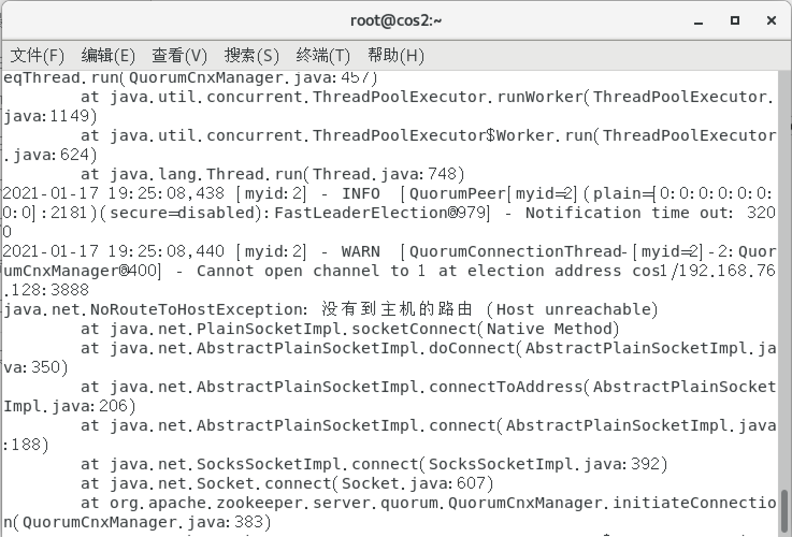
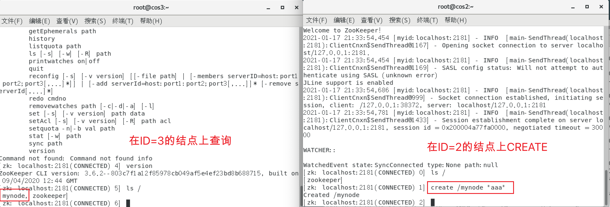
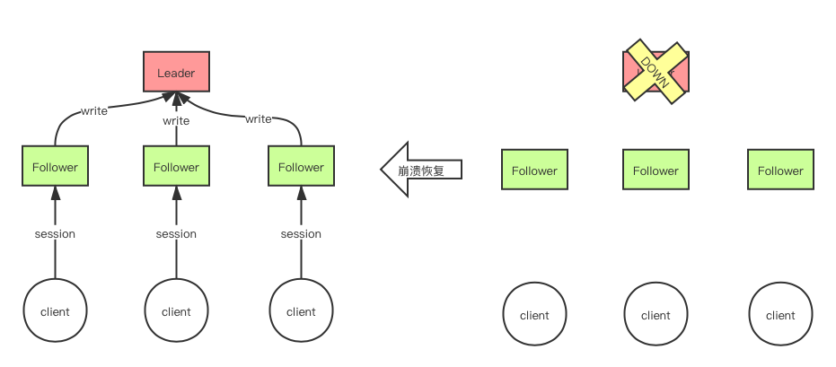
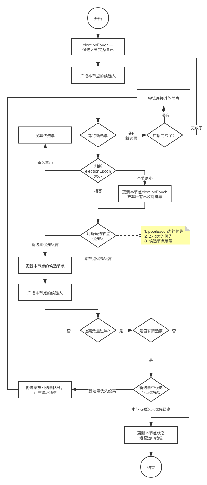

Redis是单实例的，因为基于内存，所以速度快。但也是因为基于内存，所以数据持久化是一个问题。因此发展出了主从复制。但是主从复制是异步的，在此过程中数据还是可能丢失（所以在不使用其他技术的情况下，甚至不能说Redis是最终一致性的）。为了提高Redis的可用性，在AKF的X轴方向上可以启用Redis Sentinel，采用监视和投票机制尽力保持始终有Master结点存活（也因此，Spring客户端应当直接连接Sentinel，因为Master掉线就完了，而Redis-cli本身无法直接通过Sentinel对数据存储，只能监听pubsub通道获知Master被切换为了谁）；而在Y轴和Z轴方向上，可以通过Redis Cluster（或者诸如twemproxy、predixy）等方式对数据进行集群式分片，为了更好的实现高可用，还可以增加类似于LVS、keepalived等技术。  
同样的，Redis集群也可以用作分布式锁。但由于其异步的数据复制原因，实现起来颇为复杂（比如客户端C1申请锁时Master是R1，获得锁成功。但是R1还没有来得及将锁复制给此时还是Slave的R2就挂了。接下来R2被升级为Master，客户端C2来申请同一把锁，就能成功申请到）。  

而ZooKeeper本身就定位于分布式协调服务，因此利用它来实现分布式锁，比Redis要更为靠谱。  
先通过本文对ZooKeeper是什么，以及其原理简要了解一下ZooKeeper。而具体应用将放在下一篇文章中。
<!--more-->
# ZooKeeper简介
## 设计目标
从[官网的介绍](https://zookeeper.apache.org/doc/current/zookeeperOver.html)来看，ZooKeeper为分布式应用提供分布式协调服务（A Distributed Coordination Service for Distributed Applications）。  
其设计目标是简单、可复制、有序、快。  

* 简单：通过分层命名空间（类似于文件目录的结构）组织各个层级的数据，每一个结点被称之为`znode`，可以存放少量数据（少于1MB）。这些`znode`存放于内存之中。
* 可复制：ZK可在一组ZooKeeper间复制（这一组ZK被称为`ensemble`）。这一组ZK互相知道彼此，它们在内存中维护状态镜像，在持久化存储器上存储事务日志和快照。所以只要大多数ZK结点是可用的，整个ZK服务就是可用的。
* 有序：ZK会为每一个事务添加一个顺序戳，通过此可以实现更高级别的功能（例如同步）
* 快：ZK在以读为主导的领域非常快。   

## 基本结构
每一个ZooKeeper内部通过`znode`来组织命名空间。官网上的[层次命名空间（Hierarchical Namespace）图](https://zookeeper.apache.org/doc/current/images/zknamespace.jpg)如下：  
  
`znode`会维护一个结构`stat`，里面存放这个节点的版本信息（每一次更新时这个值都会发生变化）、ACL控制信息（用于限制谁可以做什么）、时间戳。  
对`znode`的读写操作都是原子的，读时整个节点都会被读取，写时也会覆盖整个节点的数据。  
此外，ZK还提供一种临时的节点（ephemeral node），只会存活于Session持续期间。（分布式锁就可以依托于临时节点进行，甚至不需要设置过去时间）  

对于`znode`，每一个客户端都可以发起对某个节点的监视`watch`。当这个节点发生变化时，客户端就可以收到通知，当然在`znode`改变之后这个`watch`也随之取消了。（在3.6之后的版本，可以设置永久的、递归的`watch`，在被监视的节点乃至子节点们发生变化时，客户端都可以收到消息，而且在`znode`变化后`watch`不会被取消）

在集群模式下，ZooKeeper采用简单的主从模型，仅有一个Leader。[官网上的集群结构图](https://zookeeper.apache.org/doc/current/images/zkservice.jpg)如下：  
  

在此模式下，连接集群中的任意结点，都可以进行读操作。但是写操作将会被转移到Leader上进行。
正因如此整个集群在运行中会有2种状态：正常模式和无主模式（也就是Leader不可用）。当发现Leader不可用时，整个集群停止外部访问，直到新Leader被推选出现（这个时间通常在200ms以内，[官网语](https://zookeeper.apache.org/doc/current/zookeeperOver.html#Reliability)）。  
这样一来，通过数据结构，ZooKeeper可以做出如下保证：

* 有序一致性：所有从客户端来的更新都会按照发送的顺序进行
* 原子性：所有更新要么成功要么失败，没有中间结果
* 单系统镜像：无论客户端连接到哪一个ZK结点上（哪怕是因为故障切换到其他结点），它都只会看到一个版本的服务视图（service view）
* 持久性：当某一个更新被接受，就会被持久化，直到被覆盖为止
* 及时性：ZK能确保数据的最终一致性 

## 常用指令

* create [-s] [-e] [-c] [-t ttl] path [data] [acl]：创建一个位于path的`znode`结点。-e表示该结点为临时结点。-s表示该结点为存在时为其添加序列后缀。-c表示创建的是一个容器结点（当子节点都被删除后，本节点将会消失，有延时）
* get [-s] [-w] path：获取位于path处的结点。-s显示结点的`stat`属性（cZxid创建节点的事务ID，ctime创建时间，mZxid最后修改本节点的事务ID，mtime最后修改时间，，pZxid添加或删除直接子节点的事务ID）。-w表示为该节点增加一个监视。  
* set [-s] [-v version] path data：修改path结点的值为data。-s返回其修改后的`stat`信息。-v version表示此次更新的是`stat.dataVersion==version`的，如果`dataVersion`已经不是`version`时，更新失败。
* delete [-v version] path：删除没有子结点的结点。-v version作用同set。递归删除新版本使用deleteall，旧版本使用rmr，递归删除时无-v version开关。

## 主要用法

* 统一配置管理：`znode`中的数据和`watch`命令
* 分组管理：命名空间
* 统一命名： `create -s`
* 同步： `create -e`  

## 安装
ZooKeeper集群需要多台设备协同（一台也可以，但是弄起来比较麻烦，而虚拟机在配置好之后，可以直接克隆出另外的环境）。在Mac上可以使用VMware Fusion，这个对个人用户是免费使用的：可以点击[这里](https://my.vmware.com/group/vmware/evalcenter?p=fusion-player-personal)进入官网注册和下载页面，获取个人使用的License。（国内区域可能做了跳转，建议通过美国IP进行访问）。当然也可以使用Parallel Desktop，只不过比较贵。Windows上的话，最方便的应该就是VMware Station了。   

在[官网下载](https://zookeeper.apache.org/releases.html)得到二进制文件后，直接解压就可以使用了。  
由于ZooKeeper是用Java编写的，所以需要有Java环境，具体安装过程可以参考[官方教程](https://zookeeper.apache.org/doc/current/zookeeperStarted.html#sc_Download)。  
接下来是配置。ZooKeeper的配置非常简单，只需要将`$ZOOKEEPER_HOME/conf`下的`zoo_sample.cfg`复制或改名为`zoo.cfg`就可以了，主要的几个配置项如下：
```bash
######基本用法######
# 持久化数据存放的位置
dataDir=/var/zookeeper/data
# 客户端连接用的端口号
clientPort=2181

######时间规则######
# 每一个时钟周期的长度，单位毫秒
# 用于各种心跳。这个值的2倍是session过期的时间
tickTime=2000
# 在启动后连接到Leader前允许的最长时间，单位是时钟周期tickTime的个数 
# 按照当前的配置就是在 10×2000 = 20000 ms 内必须去连接Leader
initLimit=10
# 与Leader的同步通信间隔， 单位是时钟周期tickTime的个数
# sending a request and getting an acknowledgement
syncLimit=5

######集群配置######
#格式：server.id=host:port1:port2[:observer|participant]
server.1=host1:2888:3888
server.2=host2:2888:3888
server.3=host3:2888:3888
server.4=host4:2888:3888:observer
server.5=host5:2888:3888:observer
```
其中需要再额外解释一下的就是最下面的集群配置。当单机模式时，这一段是可以省略的。当集群时，就要将所有主机都列出来（当然，在运行时如果需要再添加新结点，要么一个个修改配置文件并一台台重启，要么就使用`reconfig add`命令添加新结点）。`server.id=host:port1:port2[:observer|participant]`这个格式中id是设备结点的编号，需要在`dataDir`中创建一个`myid`文件，里面只存放本结点的`id`值；host就是这个节点的ip或者hostname；port1用于集群内各机器通信（Leader监听此端口）；port2用于选举Leader，具体链接方式将在后面详述；最后一个字段表示这个节点的作用，如果可以成为Leader或者参与投票（即角色是Follower），那么就设置为participant（可省略），如果只能作为客户端读数据的端口而没有表决权，则设置为observer。  

在设置好之后，就可以启动各个节点了。  
但是我启动之后却在报错：NoRouteToHostException：  
  
既然无法连接到其他的主机，通过telnet测试后，同样无法连接到其他结点的2888或3888端口，那就很有可能是防火墙的问题了。  
由于使用的是CentOS7，默认的防火墙是firewalld，用起来感觉不太会用（后来发现GNOME提供了firewalld的GUI-，-），就直接通过`iptables`进行配置吧。
```bash
# 停止firewalld服务
systemctl stop firewalld
# 禁止其开机自动启动
systemctl disable firewalld
# 安装iptables，如果没有装的话
yum install -y iptables
# 安装iptables服务
yum install iptables-services
# 查看当前的iptables配置，-n表示列出端口号
iptables -L -n
# 删除所以iptables配置（看需要）
iptables -F
iptables -X
iptables -Z
# 先将INPUT的策略切换为ACCEPT
iptables -P INPUT ACCEPT
# 设置允许本地和ssh访问
iptables -A INPUT -i lo -j ACCEPT
iptables -A INPUT -p tcp --dport 22 -j ACCEPT
# 开启zookeeper端口
iptables -A INPUT -p tcp --dport 2181 -j ACCEPT
iptables -A INPUT -p tcp --dport 2888 -j ACCEPT
iptables -A INPUT -p tcp --dport 3888 -j ACCEPT
# 也可以指定特定的ip
#iptables -A INPUT -p tcp -s $IP --dport $PORT -j ACCEPT
# 将INPUT的策略切换为DROP，OUTPUT的策略切换为ACCEPT
iptables -P INPUT DROP
iptables -P OUTPUT ACCEPT
# 其他iptables的配置随意
# 保存配置
server iptables save
systemctl enable iptables
systemctl start iptables
```
当然也可以直接不启用iptables或者INPUT设置为ACCEPT。  
这样，zookeeper集群就可以启动了。  
  

# ZooKeeper集群
注：本章中所涉及的源码均来自ZooKeeper的官方GitHub：[https://github.com/apache/zookeeper/blob/master/zookeeper-server/](https://github.com/apache/zookeeper/blob/master/zookeeper-server/)，该master的版本对应于3.8.0-SNAPSHOT。
## 一致性算法Paxos
基础：抽屉原理：在N个副本中，一次成功更新W个，那么在读取时从超过N-W个副本中读取，就一定能读取到更新后的结果。
前提：没有拜占庭将军问题（也就是消息环境是可信的，不会被入侵破坏）。
概括：过半回复，两阶段提交（two-phase-commit，2PC，即先准备，再提交）。

大致过程在[这篇文章](https://www.douban.com/note/208430424)讲得很好。 

1. 第一阶段——准备。提案者生成（自认为）全局唯一且递增的提案编号`ProposalID`，向Paxos集群中所有机器广播Prepare请求。
2. 接受者收到Prepare请求后，判断`ProposalID`是否比之前已响应的提案编号大。
    * 如果是，则更新本地最大的提案编号为`ProposalID`。然后回复请求，并携带之前接受的提案信息。同时承诺不会接受比`ProposalID`小的提案。（即如果没有经历过第二阶段提交的提案，则告知没有上一个，否则返回`[PreID，PreVal]`。
    * 如果否，则回复错误或者不回复。
3. 当提案者收到超过半数的响应之后。这时就开始进入第二阶段——提交。根据收到的响应进行分类：
    * 如果这些响应都没有`[PreID]`，则提案者将`[ProposalID, Value]`发送给所有接受者，这个Value是提案者自定义的提案内容。
    * 如果这些响应中有一些有`[PreID]`，则提案者将`[ProposalID, Value]`发送给所有接受者，这个Value是收到的`[PreID，PreVal]`中`PreID`最大的那个的`PreVal`。
4. 当接受者收到后，再次判断`ProposalID`是否符合现在的承诺。如果符合，则更新自己目前接受的提案编号和提案内容，并回复接受；否则回复错误。
5. 当提案者收到超过半数的接受后，则认为`Value`被选定了；否则重新发起新一轮的提案。  

经过这样的二阶段过程（1、2为第一阶段，3、4、5为第二阶段），就能让大多数结点达成一致意见。  
但还存在一种特殊情况，比如3个提案者分别先被3个接受者同意，当3个提案者都开始谋求过半时会造成活锁。  
因此一个解决方案就是限制只能有1个提案者。

## ZAB协议
ZAB协议即（Zookeeper Atomic Broadcast protocol，原子广播协议）。是ZooKeeper用于分布式服务协调的核心算法，借鉴了Paxos协议。  
ZAB协议主要应用于ZooKeeper的两个状态下，在集群正常时通过ZAB协议进行消息广播，在Leader崩溃时（或失联等异常情况下）通过ZAB协议进行崩溃恢复。  

   
上图中左边就是正常情况下的ZooKeeper。Client可以连接任意一个ZooKeeper服务器（Leader或者Follower都可以）。当读取时，直接返回（或者Follower可选择先于Leader同步后再返回）；写时，统一将写任务转移给Leader，Leader再异步地通过ZAB的消息广播将更新的内容同步给各个Follower。  
上图中右边就是Leader失联后，整个ZooKeeper集群崩溃，无法对外提供任何读写服务（仅能提供部分诸如修改配置、查看状态等功能）。此时通过ZAB协议的崩溃恢复，尽快将集群恢复到左侧的状态（可能会丢失结点）。  

接下来来看看ZAB协议是如何工作的。  
### Zxid与节点状态
首先需要明确一点，什么是Zxid。Zxid是ZooKeeper的事务编号，是一个64位的整数，高32位用来存储epoch（纪元，每次重新选举Leader后需要切换成下一个纪元），低32位用于记录该纪元下的counter（事务编号）。 
有2种情况会触发Leader重选：

1. counter记满
2. 某一时刻无法联系上Leader（掉线或网络故障）或没有Leader（比如重启）

而每一个节点会在下面4种状态中的几种中来回切换：

1. LOOKING：表示现在没有Leader，正在选主
2. LEADING：表示该结点是Leader结点，可以提供读写服务
3. FOLLOWING：表示该结点是Follower结点
4. OBSERVING：表示该结点是Observer结点

### 崩溃恢复
崩溃的恢复采用投票的形式决定，选票的结构如下：
```java
// zookeeper-server/src/main/java/org/apache/zookeeper/server/quorum/Vote.java
public static class Vote {
    int version;
    // 本选票推举的节点id
    long id;
    // 本选票推举的节点的事务编号
    long zxid;
    // 记录选举的第次
    long electionEpoch;
    // 选票发送节点的状态，可选
    ServerState state;
    // 本选票推举的节点的epoch，也即zxid的高32位
    long peerEpoch;
}
```
上面是接收的选票结构`Notification`，发送的数据结构`ToSend`也是一样的，也就是把`QuorumVerifier`换成了`byte[]`。

1. 当启动或者Leader失联时，发现的节点向所有LOOKING状态的节点通过上面的结构体发送自己的ID与自己的Zxid投票。即第一轮投给自己。  
2. 收集来自其他服务器的投票
3. 根据发来的选票看是否需要修改自己的选票
4. 再次发送选票（可能还是投给自己，可能因为3而修改为头给别人）
5. 收集来自其他服务器的投票
6. 如果归票可以发现超过半数的得票者，则选其为Leader。否则回到4再来过。

下面是ZooKeeper的FastLeaderElection中寻找Leader的核心代码：
```java
// zookeeper-server/src/main/java/org/apache/zookeeper/server/quorum/FastLeaderElection.java
public Vote lookForLeader() throws InterruptedException {
    // 注册JMX
    try {
        self.jmxLeaderElectionBean = new LeaderElectionBean();
        MBeanRegistry.getInstance().register(self.jmxLeaderElectionBean, self.jmxLocalPeerBean);
    } catch (Exception e) {
        LOG.warn("Failed to register with JMX", e);
        self.jmxLeaderElectionBean = null;
    }
    // 计算选举耗时
    self.start_fle = Time.currentElapsedTime();
    try {
        // 用于记录本路投票中的所有选票，Long为选票来自的节点编号sid，Vote为选票。
        Map<Long, Vote> recvset = new HashMap<Long, Vote>();

        // 当本节点在FOLLOWING或者LEADING时，仍然可能收到之前的以前选举时发来的选票，存放在这个集合里。只用于选票投出节点在FOLLOWING或LEADING状态。用于本节点加入一个正在或刚刚确立Leader的集群中
        Map<Long, Vote> outofelection = new HashMap<Long, Vote>();
        // 初始化超时时间
        int notTimeout = minNotificationInterval;

        // 本节点的第一个选票设为自己
        synchronized (this) {
            logicalclock.incrementAndGet(); // 更新投票第次
            updateProposal(getInitId(), getInitLastLoggedZxid(), getPeerEpoch());
        }

        LOG.info("New election. My id = {}, proposed zxid=0x{}", self.getId(), Long.toHexString(proposedZxid));
        // 广播选票，包括自己也会收到
        sendNotifications();

        SyncedLearnerTracker voteSet;

        // 循环，直到本节点的状态不再是LOOKING，也就是本节点选择LEADER后停止
        while ((self.getPeerState() == ServerState.LOOKING) && (!stop)) {
            // 从收到的选票队列中获取一个，阻塞
            Notification n = recvqueue.poll(notTimeout, TimeUnit.MILLISECONDS);

            if (n == null) {
                // 如果接受队列recvqueue为空
                if (manager.haveDelivered()) {
                    // 发送队列为空，则再次发送本节点的选票
                    sendNotifications();
                } else {
                    // 发送队列不为空，则尝试连接，看看有没有掉线的节点
                    manager.connectAll();
                }

                // 延长1倍阻塞等待的时间
                int tmpTimeOut = notTimeout * 2;
                notTimeout = Math.min(tmpTimeOut, maxNotificationInterval);
                LOG.info("Notification time out: {}", notTimeout);
            } else if (validVoter(n.sid) && validVoter(n.leader)) {
                // 根据收到的新选票的发出者的节点状态switch
                switch (n.state) { 
                case LOOKING:
                    if (getInitLastLoggedZxid() == -1) {
                        LOG.debug("Ignoring notification as our zxid is -1");
                        break;  // continue while
                    }
                    if (n.zxid == -1) {
                        LOG.debug("Ignoring notification from member with -1 zxid {}", n.sid);
                        break; // continue while
                    }
                    if (n.electionEpoch > logicalclock.get()) {
                        // 如果来票的选举轮数比本机选举轮数大，说明本节点慢了
                        // 则更新本机选举轮数，并清空选票集合
                        logicalclock.set(n.electionEpoch);
                        recvset.clear();
                        if (totalOrderPredicate(n.leader, n.zxid, n.peerEpoch, getInitId(), getInitLastLoggedZxid(), getPeerEpoch())) {
                            // 如果新选票的leader更好，则修改本节点的leader建议
                            updateProposal(n.leader, n.zxid, n.peerEpoch);
                        } else {
                            updateProposal(getInitId(), getInitLastLoggedZxid(), getPeerEpoch());
                        }
                        sendNotifications();
                    } else if (n.electionEpoch < logicalclock.get()) {
                        // 这是之前的选举中的选票，抛弃
                        LOG.debug("Notification election epoch is smaller than logicalclock. n.electionEpoch = 0x{}, logicalclock=0x{}", Long.toHexString(n.electionEpoch), Long.toHexString(logicalclock.get()));
                        break;
                    } else if (totalOrderPredicate(n.leader, n.zxid, n.peerEpoch, proposedLeader, proposedZxid, proposedEpoch)) {
                        // 如果选票是本次选举的，而新选票中的leader更好
                        // 则修改本结点的leader建议
                        updateProposal(n.leader, n.zxid, n.peerEpoch);
                        sendNotifications();
                    }
                    LOG.debug("Adding vote: from={}, proposed leader={}, proposed zxid=0x{}, proposed election epoch=0x{}", n.sid, n.leader, Long.toHexString(n.zxid), Long.toHexString(n.electionEpoch));
                    // recvset中存放收到的所有选票
                    recvset.put(n.sid, new Vote(n.leader, n.zxid, n.electionEpoch, n.peerEpoch));
                    // voteSet中存放这些选票的quorumVerifier，也就是这些选票是根据哪些节点做出的决定
                    voteSet = getVoteTracker(recvset, new Vote(proposedLeader, proposedZxid, logicalclock.get(), proposedEpoch));

                    if (voteSet.hasAllQuorums()) {
                        // 回复已超半数
                        // 再次等待新的选票，超时返回null
                        while ((n = recvqueue.poll(finalizeWait, TimeUnit.MILLISECONDS)) != null) {
                            if (totalOrderPredicate(n.leader, n.zxid, n.peerEpoch, proposedLeader, proposedZxid, proposedEpoch)) {
                                // 如果新的选票更好，则放入recvqueue中，重新while循环判断
                                recvqueue.put(n);
                                break;  
                            }
                            // 新的选票没有现在的好，再次等待新的选票，或者超时
                        }
                        if (n == null) {
                            // 没有新的选票了，修改本节点状态（被选为Leader则修改为LEADING，其他的FOLLOWING或者OBSERVING）
                            setPeerState(proposedLeader, voteSet);
                            // 清空recvset，返回最终的选票结果
                            Vote endVote = new Vote(proposedLeader, proposedZxid, logicalclock.get(), proposedEpoch);
                            leaveInstance(endVote);
                            return endVote;
                        }
                    }
                    break;
                case OBSERVING:
                    // Observer不参与选举
                    LOG.debug("Notification from observer: {}", n.sid);
                    break;
                case FOLLOWING:
                case LEADING:
                    // 如果收到的是LEADING或者FOLLOWING状态的节点发来的选票
                    // 那么说明那个节点已经收到足够多的选票来修改状态了
                    // 如果本节点是同一次选举，则相信它
                    if (n.electionEpoch == logicalclock.get()) {
                        recvset.put(n.sid, new Vote(n.leader, n.zxid, n.electionEpoch, n.peerEpoch, n.state));
                        voteSet = getVoteTracker(recvset, new Vote(n.version, n.leader, n.zxid, n.electionEpoch, n.peerEpoch, n.state));
                        if (voteSet.hasAllQuorums() && checkLeader(recvset, n.leader, n.electionEpoch)) {
                            setPeerState(n.leader, voteSet);
                            Vote endVote = new Vote(n.leader, n.zxid, n.electionEpoch, n.peerEpoch);
                            leaveInstance(endVote);
                            return endVote;
                        }
                    }
                    // 记录选举外的选票。当加入一个已经建立好的集群，要确认大多数结点都选择了同一个Leader
                    outofelection.put(n.sid, new Vote(n.version, n.leader, n.zxid, n.electionEpoch, n.peerEpoch, n.state));
                    voteSet = getVoteTracker(outofelection, new Vote(n.version, n.leader, n.zxid, n.electionEpoch, n.peerEpoch, n.state));
                    if (voteSet.hasAllQuorums() && checkLeader(outofelection, n.leader, n.electionEpoch)) {
                        synchronized (this) {
                            logicalclock.set(n.electionEpoch);
                            setPeerState(n.leader, voteSet);
                        }
                        Vote endVote = new Vote(n.leader, n.zxid, n.electionEpoch, n.peerEpoch);
                        leaveInstance(endVote);
                        return endVote;
                    }
                    break;
                default:
                    LOG.warn("Notification state unrecognized: {} (n.state), {}(n.sid)", n.state, n.sid);
                    break;
                } // end of switch
            } else {
                // 如果选票无效
                if (!validVoter(n.leader)) {
                    LOG.warn("Ignoring notification for non-cluster member sid {} from sid {}", n.leader, n.sid);
                }
                if (!validVoter(n.sid)) {
                    LOG.warn("Ignoring notification for sid {} from non-quorum member sid {}", n.leader, n.sid);
                }
            }
        } // end of while
        return null;
    } finally {
        // 注销JMX
        try {
            if (self.jmxLeaderElectionBean != null) {
                MBeanRegistry.getInstance().unregister(self.jmxLeaderElectionBean);
            }
        } catch (Exception e) {
            LOG.warn("Failed to unregister with JMX", e);
        }
        self.jmxLeaderElectionBean = null;
        LOG.debug("Number of connection processing threads: {}", manager.getConnectionThreadCount());
    }
}
```
从这里可以看到，其大致的流程是这样的。  

1. 开始一次新的选举，electionEpoch自增1。然后将自己作为Leader候选人。
2. 广播一张给本节点的候选人的选票。  
3. 然后开始接受选票（包括自己发的这张，以及别的结点发的）在收到有效的选票之后，首先看选票上记录的选举的第次（`electionEpoch`）。
    * 如果是以前的选举的（小），则抛弃之；
    * 如果是以后的选举的（大，说明本节点慢了），则修改本节点的选举第次，并清空recvset集合；
    * 如果相等则第4步。
4. 当收到的选票与本节点的是同一次选举，判断以自己目前的Leader候选人与选票中的候选人哪个更合适作为Leader，将其作为新的候选人。判断的依据：
    * 节点的peerEpoch更大的优先（也就是Zxid的高32位），否则
    * Zxid更大的优先，否则
    * 结点的编号更大的优先
5. 如果本节点的候选人发生了变化，则广播自己新的选票
6. 回到3，直到超时也没有新的选票，进行归票。
    * 如果票数没有超过半数Participant，则回到2。否则
    * 继续7
7. 在确认没有新的选票过来之后，将本节点的候选人选择为新的Leader，同时修改本节点的状态（如果选的自己，则变成LEADING，否则FOLLOWING）。  

这里有几个关键的函数，一个是判断本节点是否需要将候选人更新为收到的选票上的候选人的`totalOrderPredicate`，为true则需要更新。
```java
// zookeeper-server/src/main/java/org/apache/zookeeper/server/quorum/FastLeaderElection.java
protected boolean totalOrderPredicate(long newId, long newZxid, long newEpoch, long curId, long curZxid, long curEpoch) {
    if (self.getQuorumVerifier().getWeight(newId) == 0) {
        // 选票的投票节点权重为0，直接false
        return false;
    }
    // 先判断epoch，新选票候选人比本节点候选人的高则为true，低为false，否则
    // 再判断Zxid，新选票候选人比本节点候选的大则为true，小则为false，否则
    // 最后比较两个节点的编号，新选票候选人的节点编号大则为true，小或相等false
    return ((newEpoch > curEpoch) ||
            ((newEpoch == curEpoch)
                && ((newZxid > curZxid)
                    || ((newZxid == curZxid)
                        && (newId > curId)))));
}
```
还有一个是`voteSet.hasAllQuorum()`判断是否过半，`voteSet`是一个`SyncedLearnerTracker`，它调用的`QuorumVerifier`接口的`containQuorum`方法，而这个接口通过`QuorumMaj`类来实现的：
```java
// zookeeper-server/src/main/java/org/apache/zookeeper/server/quorum/SyncedLearnerTracker.java
public boolean hasAllQuorums() {
    for (QuorumVerifierAcksetPair qvAckset : qvAcksetPairs) {
        if (!qvAckset.getQuorumVerifier().containsQuorum(qvAckset.getAckset())) {
            return false;
        }
    }
    return true;
}
// zookeeper-server/src/main/java/org/apache/zookeeper/server/quorum/flexible/QuorumMaj.java
public boolean containsQuorum(Set<Long> ackSet) {
    return (ackSet.size() > half);
}
public QuorumMaj(Map<Long, QuorumServer> allMembers) {
    this.allMembers = allMembers;
    for (QuorumServer qs : allMembers.values()) {
        if (qs.type == LearnerType.PARTICIPANT) {
            votingMembers.put(Long.valueOf(qs.id), qs);
        } else {
            observingMembers.put(Long.valueOf(qs.id), qs);
        }
    }
    half = votingMembers.size() / 2;
}
```
可以看到，half的定义是`votingMembers.size()`的一半，`votingMembers`是类型为`PARTICIPANT`的节点的集合。  
这个过程就叫做Fast Election。  

   

然后在此之后，Leader向Follower同步数据。

### 消息广播
消息广播可以认为用于同步写请求，通过以下几步完成：

1. Leader在收到Client的写请求后，将该Request作为一个Proposal，并为其分配一个全局唯一的Zxid，然后向集群广播（包括自己）。该广播是通过FIFO的队列进行的，Leader会为每一个节点准备一个队列。
2. 收到广播的节点，将Proposal以事务日志的形式写入磁盘，成功后向Leader恢复ack。
3. Leader收到超过半数的Ack后，再次通过队列广播commit消息（包括Leader自己）
4. 各节点收到commit消息后，将Proposal提交，完成消息广播过程。  

在这一过程中，对于任意一个结点，只要任何一步失败了，整个提交过程就结束了。所以对于每一个节点而言，提交过程是原子的，要么成功要么失败，不会有中间过程。

## CAP与BASE
CAP理论是说，一个分布式系统不可能同时满足下面3种：

* Consistency，一致性，也就是各个节点数据状态等都是一样的
* Availability，可用性，也就是整个分布式系统总能提供服务
* Partition tolerance，分区容错性，也就是当出现分区（比如网络原因造成部分节点间无法通信，节点宕机也可以看做是分区）时，依然能够以C或A的设计要求提供服务。  

由于分区是不可避免的，所以P通常是必选的。那么根据设计理念，一个分布式产品通常会在C或A之间选择一个。  

Redis通过主从异步复制，保证了即使发生分区，也能够快速通过其他节点提供服务，也就是侧重于可用性。但是由于侧重于可用性，就会造成异步复制的间隔中Master宕机就会造成数据丢失，所以Redis的C一致性受到挑战。  

而ZooKeeper通过ZAB这个原子广播协议，可以保证所有可用节点在同步后数据都是一致的；但是在选举Leader时或者无法选出Leader时，整个集群都无法响应客户端的请求，所以ZooKeeper无法满足A可用性。  

同时ZooKeeper能够在以下方面保持一致性：

* 顺序一致性：来自任意特定客户端的更新，最终都会按其发送的顺序被提交。通过Leader发送Proposal的FIFO队列保证。
* 原子性：每个更新要么成功，要么失败。通过ZAB协议保证
* 单一系统镜像：一个客户端无论连接哪一个客户端，最终看到的都是一样的视图。通过ZAB的消息广播保证。
* 持久性：一个更新一旦成功，就会被永久保存下来（除非被再次修改）。通过事务日志保证。  

可以看到，在很多方便，ZooKeeper都能保证“最终”一致性。   
由此引出了BASE理论。  

BASE理论的核心是，即使无法做到强一致性（Strong Consistency，也即在任何时刻任何客户端都能读到最近一次成功更新的数据），但应用可以根据自身特点，采用适当的方式达到最终一致性（Eventual Consistency，也即用户只能读到某一次更新后的数据，不能保证是最新的，但能保证在一定时间后可以达到强一致的程度，但是这个时间不能保证）。  
BASE理论的关键点有3个，分别是：  

* Basically Available，基本可用，也就是允许损失一部分可用性（比如响应时间延长、部分功能丧失）
* Soft state，软状态，即允许整个系统的数据存在中间状态（ZooKeeper的原子性是针对每一个节点而言的，这个是针对整个系统而言的），但可以通过同步消除这种软状态
* Eventual consistent，最终一致，在经过一段时间的同步之后，各节点能够达到一致的状态 

