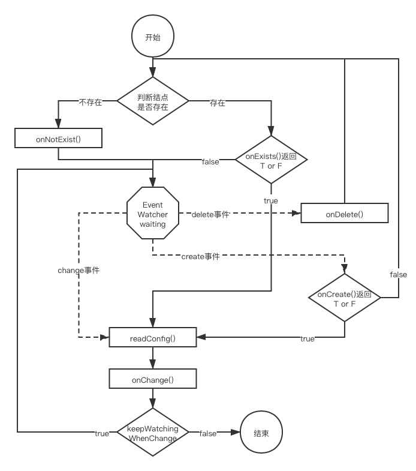

前文介绍了ZooKeeper的基本原理，本文将从缓存的角度介绍ZooKeeper的经典用法——配置管理中心和分布式锁。 

<!--more-->

# 搭建环境并创建连接
由于下面经常会因为提示思路而不断增加接口，所以部分代码并不完整。完整代码见[我的github仓库](https://github.com/discko/learncache/tree/master/zookeeper)。

使用简单的Spring Boot环境，就不赘述了。需要注意，由于ZooKeeper的API变化较大，服务器上使用何种版本的zk，客户端连接时，也应当尽量使用同一版本的。  
可以去[mvnrepository](https://mvnrepository.com/artifact/org.apache.zookeeper/zookeeper)找自己需要的版本。  

我这里用时的是3.6.2：
```xml
<dependency>
    <groupId>org.apache.zookeeper</groupId>
    <artifactId>zookeeper</artifactId>
    <version>3.6.2</version>
</dependency>
```
首先写下连接配置：
```yml
# resource/application.yml
zookeeper:
  servers: 192.168.76.128:2181,192.168.76.129:2181,192.168.76.130:2181
  timeout: 4000
```
这里的`servers`是所有可用的ZooKeeper结点，用冒号`:`隔开host和port，有多个结点的话，用逗号`,`隔开。  
然后创建一个ZooKeeper连接的工厂，由于工厂方法是静态方法，要使用的`SERVERS`和`TIMEOUT`两个变量是静态变量，所以不能通过投`@Value`注入。因此通过`@PostConstruct`将两个变量通过类成员变量`servers`和`timeout`赋值给`SERVERS`和`TIMEOUT`：
```java
package space.wudi.learncache.zookeeper.util;
@Component
public class ZooKeeperSession {
    private static final Logger logger = LoggerFactory.getLogger(ZooKeeperSession.class);
    private static String SERVERS;
    private static Integer TIMEOUT;
    @Value("${zookeeper.servers}")String servers;
    @Value("${zookeeper.timeout}")Integer timeout;
    @PostConstruct
    void postConstruct(){
        SERVERS = servers;
        TIMEOUT = timeout;
    }
    public static ZooKeeper getZooKeeperClient(String root) throws IOException, InterruptedException {
        CountDownLatch cdl = new CountDownLatch(1);
        final ZooKeeper zk = new ZooKeeper(SERVERS + root, TIMEOUT, event -> {
            switch(event.getState()){
                case SyncConnected:
                    logger.info("ZooKeeper connected");
                    cdl.countDown();
                    break;
                default:
                    logger.warn("ZooKeeper Connection {}", event.getState());
            }
        });
        cdl.await();
        return zk;
    }
}
```
因为预期的获取ZooKeeper连接的方式是同步的，而`new ZooKeeper`方法返回时不能保证连接完成。因此，通过`CountDownLatch`在返回前下断点`cdl.await()`，然后ZooKeeper的创建事件的`Watcher`中下唤醒点`cdl.countDown()`，保证返回的`ZooKeeper`对象是连接成功的。  

# 配置管理
接下来尝试将ZooKeeper做为配置管理中心来使用。  
首先明确大致的用法：  

1. 配置管理需要有2个部分组成，分别是发布配置Publisher和获取配置的Listener；
2. Publisher可能一次需要发送个配置，发送完了就没事了，被发布的配置可能是配置中心本来没有的（那么就是进行创建），也可能是已经存在的（那么就是更新）。
3. Listener应该是在后台常驻的，可能需要监听多个配置，可能需要应对同一个配置的反复修改，同时要应对监听的配置原本不存在（那么是否需要响应配置创建的事件）、配置被删除等异常情况。  

## 创建基础实体
那么就先从配置开始，创建一个配置对象`Config`，它继承自`MySerializable`接口，用于标识其可以被序列化，同时在`MySerializable`中提供一对默认的序列化与反序列化方法：
```java
// space.wudi.learncache.zookeeper.configmanager.Config
public class Config implements MySerializable {
    private static final long serialVersionUID = 1L;
    private String config;
    public Config(String config) {
        this.config = config;
    }
    // 省略getter/setter/hash/equals/toString
}
// space.wudi.learncache.zookeeper.util.MySerializable
public interface MySerializable extends Serializable {
    default byte[] toBytes() throws IOException {
        ByteArrayOutputStream baos = new ByteArrayOutputStream();
        ObjectOutputStream oos = new ObjectOutputStream(baos);
        oos.writeObject(this);
        return baos.toByteArray();
    }
    static <M> M fromBytes(byte[] bytes, Class<M> clazz) throws IOException, ClassNotFoundException {
        ByteArrayInputStream bais = new ByteArrayInputStream(bytes);
        ObjectInputStream ois = new ObjectInputStream(bais);
        return clazz.cast(ois.readObject());
    }
}
```
## 创建Callback的返回值
在callback中会获取到返回值，但是可能存在各种异常情况，返回值除了`byte[]`外可能还有需要的`Stat`、创建的节点的`path`等，所以通过`ZooKeeperResult`类进行包装：
```java
// space.wudi.learncache.zookeeper.util.ZooKeeperResult
public class ZooKeeperResult<T> {
    private Code code;
    private T data;
    private Throwable throwable;
    private Stat stat;
    // 省略构造/getter/setter/hash/equals/toString
}
// space.wudi.learncache.zookeeper.util.ZooKeeperResultHolder
public class ZooKeeperResultHolder<T> {
    protected ZooKeeperResult<T> result;
    protected ZooKeeperResultHolder() {
        result = new ZooKeeperResult();
    }
    // 省略getter/setter/hash/equals/toString
}
```
然后再创建一个基类`ZooKeeperResultHolder`持有该result并为其增加一些初始化、返回等操作。这样后面各Callback直接继承该类就可以持有并返回结果了。

## 创建配置发布工具类
然后编写配置发布过程。创建`ConfigPublish`类：
```java
public class ConfigPublisher {
    private static final Logger logger = LoggerFactory.getLogger(ConfigPublisher.class);
    private ZooKeeper zk;
    private final String root;
    public ConfigPublisher(String root) throws IOException, InterruptedException {
        this.root = root;   // 初始化明确ZooKeeper的配置根节点
        connect();          // 创建ZooKeeper连接
    }
    private void connect() throws InterruptedException, IOException {
        logger.info("connect to zookeeper server");
        if(this.zk != null){
            zk.close(); // 如果连接已经存在，则先释放旧连接
        }
        // 调用工厂方法创建新连接
        this.zk = ZooKeeperSession.getZooKeeperClient(this.root);
    }
    private void checkConnecting() throws IOException, InterruptedException {
        if(!this.zk.getState().isConnected()){
            connect();  // 如果掉线了，重新创建连接
        }
    }
    public ZooKeeperResult<String> publish(Config config, String topic, List<ACL> acls) throws IOException, InterruptedException {
        checkConnecting();
        byte[] configData = config.toBytes();   //将config转为byte[]
        List<ACL> realAcls = acls == null ? ZooDefs.Ids.OPEN_ACL_UNSAFE : acls; 
        CountDownLatch cdl = new CountDownLatch(1);
        PublishCallback publishCallback = new PublishCallback(cdl);
        zk.create(topic, configData, realAcls, CreateMode.PERSISTENT, publishCallback, configData); // 尝试创建config结点
        ZooKeeperResult<String> result = publishCallback.getResult();   // 从callback中取到publish的结果，此时可能result还是空的
        try {
            cdl.await();    // 阻塞直到publish完成
        } catch (InterruptedException ignored) {
        }
        return result;
    }
}
```
首先先尝试创建这个config结点，然后通过`PublishCallback`去监听创建情况。由于需要知道创建的结果（是一个`String`类型的返回值），所以让这个回调类继承`ZooKeeperResultHolder<String>`，这个类持有1个`ZooKeeperResult<String>`对象，由`Publisher`去获取.而create需要的是一个`StringCallback`的回调，所以先给`PublishCallback`添加一个`StringCallback`的接口：
```java
private class PublishCallback extends ZooKeeperResultHolder<String> implements AsyncCallback.StringCallback {
    private final CountDownLatch cdl;
    PublishCallback(CountDownLatch cdl) {
        this.cdl = cdl;
    }
    @Override
    public void processResult(int rc, String path, Object configData, String name) {
        Code code = Code.get(rc);
        result.setCode(code);
        switch(code){
            case OK:
                // 创建成功
                logger.info("node created.");
                result.setData(path);   // 将结果放入result中
                result.setStat(null);
                result.setThrowable(null);
                cdl.countDown();   // 解锁
                break;
            case NODEEXISTS:    
                // 如果结点已经存在，则应当转为更新该结点
                logger.info("node exists. updating");
                zk.setData(path, (byte[])configData, -1, this, configData); // 更新结点，-1表示不在意该结点的dataVersion
                break;
            default:
                logger.warn("unexpect rc while creating. rc = {}", code);
                cdl.countDown();    // 其他情况则直接释放，交由外部去处理异常
        }
    }
}
```
由于懒得再写一个事件处理类，所以直接在`PublishCallback`中再增加`setData`需要的`DataCallback`的接口：
```java
private class PublishCallback
    extends ZooKeeperResultHolder<String>
    implements AsyncCallback.StringCallback, 
    /*增加的接口：*/AsyncCallback.StatCallback
{
    private final CountDownLatch cdl;
    PublishCallback(CountDownLatch cdl) {
        this.cdl = cdl;
    }
    // create的callback方法
    @Override
    public void processResult(int rc, String path, Object configData, String name) {
        // 同上
    }
    // setData的callback方法
    @Override
    public void processResult(int rc, String path, Object ctx, Stat stat) {
        Code code = Code.get(rc);
        result.setCode(code);
        switch(code){
            case OK:
                // 设置成功，则将相关值放入result中
                logger.info("update success");
                result.setData(path);
                result.setStat(stat);
                result.setThrowable(null);
                cdl.countDown();    // 释放锁
                break;
            default:
                logger.warn("unexpect rc while updating. rc = {}", code);
                cdl.countDown();    // 其他情况则直接释放，交由外部去处理异常
        }
    }
}
```
这样，`ConfigPublisher`就完成了。

## 创建配置监听类
监听器`ConfigListener`在构造之后提供一个`listen`方法，除了要求传入监视的节点位置和发现更新后的处理事件`onChange`外，还可以对部分生命周期中的行为插入处理事件：
```java
public class ConfigListener {
    private static final Logger logger = LoggerFactory.getLogger(ConfigListener.class);
    private ZooKeeper zk;
    private String root;    
    public ConfigListener(String root) throws IOException, InterruptedException {
        this.root = root;
        connect();
    }
    // 省略connect()和checkConnect()，这两个方法与ConfigPublish中的一样
    public void listen(
            String path,                                // root下的结点路径
            Consumer<ZooKeeperResult<Config>> onChange, // 当有Config可以消费时的回调
            boolean keepWatchingWhenChange,             // 是否需要续订监听
            @Nullable Consumer<String> onNotExist,      // 当开始时节点不存在时的回调
            @Nullable Consumer<String> onDelete,        // 当监听过程中节点被删除时的回调
            @Nullable Predicate<String> onExists,       // 当开始时节点已经存在的话，是否需要调用1次onChange
            @Nullable Predicate<String> onCreate        // 被监听的节点从不存在到被创建时，是否需要调用1次onChange
    ) throws IOException, InterruptedException {
        checkConnect();
        // 创建回调对象
        ListenWatcherCallback listenWatcherCallback = new ListenWatcherCallback(onNotExist, onExists, onChange, onCreate, onDelete, keepWatchingWhenChange);
        // 首先判断被监听的节点是否存在
        zk.exists(path, listenWatcherCallback, listenWatcherCallback, path);
    }
}
```
上面大致的流程是这样的：  
  
可以看到整个的核心是一个监视器（八边形），然后通过若干判断串联起各个回调过程。  
回调监控对象`ListenWatcherCallback`首先被应用于`exists`，这个API需要的是一个`StatCallback`；同时，exists还可以传入一个Watcher作为监视器，也就是那个八边形，所以`ListenWatcherCallback`可以同时实现`StatCallback`和`Watcher`这两个接口，同时处理这两个行为以减少额外的小类的创建：
```java
private class ListenWatcherCallback
    extends ZooKeeperResultHolder<Config>   // 存放返回值
    implements AsyncCallback.StatCallback,  // exists方法的回调
        Watcher                             // Watcher
{
    private Consumer<String> onNotExist;
    private Predicate<String> onExists;
    private Consumer<ZooKeeperResult<Config>> onChange;
    private Predicate<String> onCreate;
    private Consumer<String> onDelete;
    private boolean keepWatchingWhenChange;
    // 省略构造函数
    // 下面是watcher触发时的事件
    public void process(WatchedEvent event) {
        switch (event.getType()){
            case NodeCreated:
                // 结点创建时，如果onCreate == true则调用readConfig
                // 否则回头通过exists进入watcher
                if(onCreate != null && onCreate.test(event.getPath())){
                    readConfig(event.getPath());
                }else{
                    zk.exists(event.getPath(), this, this, event.getPath());
                }
                break;
            case NodeDeleted:
                // 结点被删时，调用onDelete
                // 然后通过exists进入watcher
                if(onDelete != null){
                    onDelete.accept(event.getPath());
                }
                zk.exists(event.getPath(), this, this, event.getPath());
                break;
            case NodeDataChanged:
                // 当结点发生变化时，读取
                readConfig(event.getPath());
                break;
            default:
        }
    }
    // exists的回调
    public void processResult(int rc, String path, Object configPath, Stat stat) {
        Code code = Code.get(rc);
        result.setCode(code);
        switch(code){
            case NONODE:
                // 结点不存在，则调用onNodeExist
                if(onNotExist != null){
                    onNotExist.accept((String)configPath);
                }
                break;
            case OK:
                // 结点存在，如果onExists == true，则readConfig
                if(onExists != null && onExists.test((String)configPath)){
                    readConfig(path);
                }
                break;
            default:
        }
    }
    // 读取配置结点
    private void readConfig(String path){
        if(keepWatchingWhenChange){
            // 如果需要继续监视变化，则watcher字段设为this，继续监视path
            zk.getData(path, this, this, path);
        }else{
            // 否则watcher 字段设为false，
            // 读取path后不再监视
            zk.getData(path, false, this, path);
        }
    }
}
```
由此，判断存在与发起读取已经写完了，读取的回调还没有写。读取需要的是`DataCallback`接口，因此向`ListenWatcherCallback`添加接口：
```java
private class ListenWatcherCallback
    extends ZooKeeperResultHolder<Config>
    implements AsyncCallback.StatCallback,
        Watcher,
        AsyncCallback.DataCallback  // 增加用于getData的接口
{
// 省略成员变量、构造函数、watcher的事件处理方法、exists的回调方法、readConfig方法
// 下面是getData的回调方法
    @Override
    public void processResult(int rc, String path, Object configPath, byte[] data, Stat stat) {
        Code code = Code.get(rc);
        result.setCode(code);
        switch(code){
            case OK:
                // 读取成功
                try{
                    // 将值写入result
                    result.setData(MySerializable.fromBytes(data, Config.class));
                    result.setStat(stat);
                    result.setThrowable(null);
                }catch(Exception e){
                    result.setThrowable(e);
                }
                break;
            default:
        }
        // 调用onChange
        onChange.accept(result);
    }
}
```
至此，工具方法都已经完成。

## 测试
测试类写起来比较简单。  
首先是Publisher的：
```java
@SpringBootApplication
public class ZooKeeperPublisherApplication {

    private static final Logger logger = LoggerFactory.getLogger(ZooKeeperPublisherApplication.class);

    public static void main(String[] args) {
        SpringApplication.run(ZooKeeperPublisherApplication.class);
        try {
            ConfigPublisher configPublisher = new ConfigPublisher(ConfigPath.root);
            Config config1 = new Config(String.format("config time %s", DateTimeFormatter.ofPattern("Y-MM-DD HH:mm:ss").format(LocalDateTime.now())));
            ZooKeeperResult<String> result1 = configPublisher.publish(config1, ConfigPath.configNode1, null);
            logger.info("first config {} result = {}", ConfigPath.configNode1, result1);

            Thread.sleep(1000);

            Config config2 = new Config(String.format("config time %s", DateTimeFormatter.ofPattern("Y-MM-DD HH:mm:ss").format(LocalDateTime.now())));
            ZooKeeperResult<String> result2 = configPublisher.publish(config2, ConfigPath.configNode2, null);
            logger.info("second config {} result = {}", ConfigPath.configNode2, result2);
        } catch (IOException | InterruptedException e) {
            e.printStackTrace();
        }
    }
}
```
然后是Listener的：
```java
@SpringBootApplication
public class ZooKeeperListenerApplication {
    private static final Logger logger = LoggerFactory.getLogger(ZooKeeperListenerApplication.class);

    @SuppressWarnings("all")
    public static void main(String[] args) {
        SpringApplication.run(ZooKeeperListenerApplication.class);
        try {
            ConfigListener listener = new ConfigListener(ConfigPath.root);
            boolean loadConfigOnExists = true;
            boolean loadConfigOnCreate = true;
            listener.listen(
                    ConfigPath.configNode1, // path
                    configZooKeeperResult -> {
                        if(KeeperException.Code.OK == configZooKeeperResult.getCode()){
                            logger.info("get new config from {}: {}@{}", ConfigPath.configNode1, configZooKeeperResult.getData(), configZooKeeperResult.getStat());
                        }else{
                            logger.warn("find config but cannot apply. code = {}, throwable = {}", configZooKeeperResult.getCode(), configZooKeeperResult.getThrowable());
                        }
                    },  // onChange
                    false,  // keepWatchingOnChange
                    path -> logger.info("{} not exists", path),
                    path -> logger.info("{} has been deleted", path ),  // onNotExists
                    path -> {
                        logger.info("{} has already exists. load config? {}", path, loadConfigOnExists ? "yes" : "no");
                        return loadConfigOnExists;
                    },  // onExists
                    path -> {
                        logger.info("{} just created. load config? {}", path, loadConfigOnCreate ? "yes" : "no");
                        return loadConfigOnCreate;
                    }   // onDelete
            );
            listener.listen(
                    ConfigPath.configNode2, // path
                    configZooKeeperResult -> {
                        if(KeeperException.Code.OK == configZooKeeperResult.getCode()){
                            logger.info("get new config from {}: {}@{}", ConfigPath.configNode2, configZooKeeperResult.getData(), configZooKeeperResult.getStat());
                        }else{
                            logger.warn("find config but cannot apply. code = {}, throwable = {}", configZooKeeperResult.getCode(), configZooKeeperResult.getThrowable());
                        }
                    },  // onChange
                    true,   // keepWatchingOnChange
                    path -> logger.info("{} not exists", path),
                    path -> logger.info("{} has been deleted", path ),  // onNotExists
                    path -> {
                        logger.info("{} has already exists. load config? {}", path, !loadConfigOnExists ? "yes" : "no");
                        // 注意这里有个!
                        return !loadConfigOnExists;
                    },  // onExists
                    path -> {
                        logger.info("{} just created. load config? {}", path, !loadConfigOnCreate ? "yes" : "no");
                        // 注意这里有个!
                        return !loadConfigOnCreate;
                    }   // onDelete
            );
        } catch (IOException | InterruptedException e) {
            e.printStackTrace();
        }
        try {
            while(true){
                Thread.sleep(0);    // 模仿listener线程在后台执行
            }
        } catch (InterruptedException e) {
            e.printStackTrace();
        }
    }
}
```
这里，Listener开启2个监听，分别监听root下的configNode1与configNode2。  
对于configNode1，设置为不续订监听，也就是只会更新1次配置；但是onExists和onCreate都返回true，也就是在结点已经存在时或者结点创建时，也会更新结点（在监视状态下）。  
而configNode2，设置为续订监听，能无限次响应配置修改；但是onExists和onCreate都返回false，也就是首次开始监听时如果结点已经存在，则不会读取配置，同时如果结点从不存在到创建时，也不会读取配置，也就是只在更新时才会读取。  

初始时2个config结点是不存在的。  
然后Publisher那边3次向这两个结点推送新的配置。并且在第2次推送后，手动删除2个config结点。  

最终输出的日志如下：
```yml
// 先开启listener
s.w.l.zookeeper.util.ZooKeeperSession    : ZooKeeper connected
s.w.l.z.configmanager.ConfigListener     : topic /testZookeeperConfig1 not exists
s.w.l.z.ZooKeeperListenerApplication     : /testZookeeperConfig1 not exists
s.w.l.z.configmanager.ConfigListener     : topic /testZookeeperConfig2 not exists
s.w.l.z.ZooKeeperListenerApplication     : /testZookeeperConfig2 not exists

// 第1次启动publisher后，2个ZNode结点创建，config1更新了配置（并提示移除了watcher)，config2没有更新

s.w.l.z.configmanager.ConfigListener     : node /testZookeeperConfig1 created
s.w.l.z.ZooKeeperListenerApplication     : /testZookeeperConfig1 just created. load config? yes
s.w.l.z.configmanager.ConfigListener     : get data at /testZookeeperConfig1 and remove watcher
s.w.l.z.configmanager.ConfigListener     : get return data from /testZookeeperConfig1. size = 137
s.w.l.z.ZooKeeperListenerApplication     : get new config from /testZookeeperConfig1: Config{config='config time 2021-01-23 15:48:32'}@60129542599,60129542599,1611388112770,1611388112770,0,0,0,0,137,0,60129542599

s.w.l.z.configmanager.ConfigListener     : node /testZookeeperConfig2 created
s.w.l.z.ZooKeeperListenerApplication     : /testZookeeperConfig2 just created. load config? no
s.w.l.z.configmanager.ConfigListener     : topic /testZookeeperConfig2 exists
s.w.l.z.ZooKeeperListenerApplication     : /testZookeeperConfig2 has already exists. load config? no

// 第2次启动publisher后，2个ZNode结点更新，config1没有触发更新事件，config2更新

s.w.l.z.configmanager.ConfigListener     : node /testZookeeperConfig2 data changed
s.w.l.z.configmanager.ConfigListener     : get data at /testZookeeperConfig2 and reset watcher
s.w.l.z.configmanager.ConfigListener     : get return data from /testZookeeperConfig2. size = 137
s.w.l.z.ZooKeeperListenerApplication     : get new config from /testZookeeperConfig2: Config{config='config time 2021-01-23 15:48:52'}@60129542600,60129542606,1611388113783,1611388132534,1,0,0,0,137,0,60129542600

// 手动删除2个结点后，第2个监听触发onDelete回调（并间接调用exists方法），而第1个监听已被移除，无事件响应

s.w.l.z.configmanager.ConfigListener     : node /testZookeeperConfig2 deleted
s.w.l.z.ZooKeeperListenerApplication     : /testZookeeperConfig2 has been deleted
s.w.l.z.configmanager.ConfigListener     : topic /testZookeeperConfig2 not exists
s.w.l.z.ZooKeeperListenerApplication     : /testZookeeperConfig2 not exists

// 第3次启动publisher后，2个ZNode结点创建，config1没有触发创建事件，config2触发创建事件，但没有更新

s.w.l.z.configmanager.ConfigListener     : node /testZookeeperConfig2 created
s.w.l.z.ZooKeeperListenerApplication     : /testZookeeperConfig2 just created. load config? no
s.w.l.z.configmanager.ConfigListener     : topic /testZookeeperConfig2 exists
s.w.l.z.ZooKeeperListenerApplication     : /testZookeeperConfig2 has already exists. load config? no
```
可以看到，执行过程是符合预期的。

详细代码见[github repo](https://github.com/discko/learncache/tree/master/zookeeper)。 

# 分布式锁
由于用Redis设计的分布式锁需要考虑续期的问题，会让设计过程复杂度升高不少，而ZooKeeper可以通过create指令创建ephemeral临时结点，在Session关闭（主动关闭或掉线）时该结点就会自动删除。   

使用ZooKeeper来生成分布式锁，除了利用Session来维护结点的存在性，避免客户端宕机但是未释放锁造成死锁。

ZooKeeper中的节点作为锁，当锁释放时有两种策略让阻塞中的客户端开始竞争。  

1. 非公平锁。未竞争成功的客户端监听代表锁的ZNode或者其parent ZNode，当发现代表锁的ZNode被删除时，所有被通知到的客户端再次竞争，尝试创建ZNode，创建成功的客户端可以认为获得锁成功。通常在create时使用CreateMode.EPHEMERAL就可以了。
2. 公平锁。在create时使用CreateMode.EPHEMERAL_SEQUENTIAL创建临时的序列节点。创建最小编号的客户端可以认为获得锁成功。其他客户端watch其前一个编号的ZNode，当该结点被删除时，本节点可以自动响应去获取锁。这样自动保证请求锁的有序性，同时避免锁释放后大量客户端竞争锁造成的网络资源与计算资源的浪费。  

本文使用第二种方式去创建公平的分布式锁。

## 创建Lock实体
创建一个Lock类，与java.concurrent包下的各个Lock类似，为其实现`lock()`与`unlock()`方法：

```java
public class Lock {
    private static final String ROOT = "/locks";
    private String lockName;    // 输入的lock
    private String realLockName;// 实际的lock结点名
    private CountDownLatch cdl; // 用于lock()中阻塞的CountDownLatch
    private ZooKeeper zk;   // 保留连接
    // 构造一个Lock，传入lock的名字
    public Lock(String lock){
        this.lockName = lock;
        this.cdl = new CountDownLatch(1);
    }
    // 执行上锁的动作
    public void lock() throws Throwable {
        // 懒获取ZK连接，以防在生成Lock对象后很久不使用lock()动作造成连接占用浪费
        zk = ZooKeeperSession.getZooKeeperClient(ROOT);
        // create结点的回调
        LockWatcherCallback lockWatcherCallback = new LockWatcherCallback();
        // 获取创建节点的结果的对象
        ZooKeeperResult<String> result = lockWatcherCallback.getResult();
        // 创建一个临时的、有序的节点
        zk.create("/"+lockName+"/"+lockName, null, ZooDefs.Ids.OPEN_ACL_UNSAFE, CreateMode.EPHEMERAL_SEQUENTIAL, lockWatcherCallback, lockName);
        // 阻塞，直到cdl.countDown()
        cdl.await();
        if(result.getThrowable() != null){
            // 当result中包含异常信息，则锁获取时发生了异常，抛出
            throw result.getThrowable();
        }
    }
    public void unlock() {
        try {
            // 删除锁节点
            zk.delete(realLockName, -1);
        } catch (KeeperException.NoNodeException ignore) {
        } catch (Exception e){
        }
    }
}
```
这里为了简化后面查询已经获得锁的节点时的代码，将锁的竞争队列都放在了同一个目录下。对于`ROOT=/locks`，目标为`lockName=mylock`的锁竞争队列，其各个节点命名应当大致是下面这样的，这样只需要获取`${ROOT}/${lockName}`下的children就可以知道目前有哪些竞争节点了。
```bash
/locks/mylock/mylock00000000
/locks/mylock/mylock00000001
/locks/mylock/mylock00000002
```
### 创建回调对象
然后创建回调对象。考虑到后面会用到监视功能，所以命名时先加上Watcher，但先不引入接口。同时，为了减少参数传递，该类作为Lock的私有内部非静态类。
```java
private class LockWatcherCallback extends ZooKeeperResultHolder<String> implements AsyncCallback.StringCallback, Watcher, AsyncCallback.StatCallback {
    // create 的回调
    @Override
    public void processResult(int rc, String path, Object ctx, String name) {
        Code code = Code.get(rc);
        result.setCode(code);
        String lockName = (String) ctx;
        switch(code){
            case OK:
                // 如果ZNode创建成功，将结点的实际路径name记录到realLockName中
                // name中包含序列号，其格式大致为${ROOT}/${lockName}/${lockName}${serialNumber}
                realLockName = name;
                try {
                    // 第一个创建节点的认为其获得了锁
                    // 其他的则去监视previous
                    gainLockOrStartWatcher(lockName);
                } catch (InterruptedException | IOException e) {
                    // 发生异常则直接中止锁的获取，通过lock()方法抛出异常
                    result.setThrowable(e);
                    cdl.countDown();
                }
                break;
            case NONODE:
                // 如果ZNode创建失败，则大概率是parent ZNode不存在
                try {
                    // 通过该函数递归创建父节点
                    waitAndCreateParentNode(path);
                    if(result.getData() == null){
                        // 父节点创建失败
                        if(result.getThrowable() == null){
                            result.setThrowable(new RuntimeException("failed to create parent node for lock "+lockName));
                        }
                    }else{
                        // 父节点递归创建成功
                        zk.create(path, null, ZooDefs.Ids.OPEN_ACL_UNSAFE, CreateMode.EPHEMERAL_SEQUENTIAL, this, lockName);
                    }
                } catch (IOException | InterruptedException e) {
                    result.setData(null);
                    result.setStat(null);
                    result.setThrowable(e);
                }
                break;
            default:
                // 其他各种返回情况，作为异常情况处理
                result.setData(null);
                result.setStat(null);
                result.setThrowable(new RuntimeException("unexpected code when create node " + path+": "+ code));
                cdl.countDown();
        }
    }
}
```
### ParentNode不存在时的处理
如果create回报`NoNode`，则大概率是因为`ROOT`或者`ROOT/lockName`结点不存在。由于ZooKeeper没有提供诸如`File.mkdirs`或者类似于Linux`mkdir -p`的递归创建的命令，递归的过程由我们自己实现：
```java
private void waitAndCreateParentNode(String path) throws IOException, InterruptedException {
    // 获取parent结点路径，不含ROOT部分
    String parentPath = path.substring(0, path.lastIndexOf("/"));
    if(parentPath.length()<1){
        // 如果parentPath长度为0，却执行到此，说明ROOT不存在
        // 本过程就不再处理了
        result.setData(null);
        result.setStat(null);
        result.setThrowable(new RuntimeException("parent node create failed. Root Node "+ROOT+" not exists."));
        return;
    }
    // 启动一个新的zk client去创建parent node。
    // 需要注意的是，由于这里是通过异步+阻塞的方式，同步获取返回值
    // 不能使用正在使用的zk对象，否则会回调死锁
    CountDownLatch cdlForCreateParent = new CountDownLatch(1);
    ZooKeeperSession.getZooKeeperClient(ROOT).create(
            parentPath,     
            null,           // byte[] data 不需要
            ZooDefs.Ids.OPEN_ACL_UNSAFE,
            CreateMode.PERSISTENT,
            (rc1, path1, context, name1) -> {   // callback
                // 递归时，只应当解除上一层的阻塞
                // 所以将CDL作为context传入
                CountDownLatch createParentCdl = (CountDownLatch)context;
                Code code1 = Code.get(rc1);
                result.setCode(code1);
                switch(code1){
                    case OK:
                        // 创建parent node 成功
                        result.setData(name1);
                        createParentCdl.countDown();    // 释放本层递归的阻塞
                        break;
                    case NONODE:
                        // parent node仍然创建失败
                        try {
                            // 递归创建
                            waitAndCreateParentNode(path1);
                            // 创建完成（无论成功与否）
                        } catch (IOException | InterruptedException e) {
                            e.printStackTrace();
                            result.setData(null);
                            result.setStat(null);
                            result.setThrowable(e);
                        }
                        // 释放本层递归的阻塞（无论成功与否）
                        createParentCdl.countDown();
                        break;
                    case NODEEXISTS:
                        // 惊不惊喜！外面说结点不存在，但是当我创建的时候又说结点已经存在了
                        // 大概率是有其他线程或其他客户端也在竞争这个锁
                        // 然后它先创建好结点了，那我就直接使用该结点了
                        result.setData(path1);
                        result.setStat(null);
                        result.setThrowable(null);
                        createParentCdl.countDown();    // 释放本层递归的阻塞
                        break;
                    default:
                        // 其他不确定的情况
                        result.setData(null);
                        result.setStat(null);
                        result.setThrowable(new RuntimeException("parent node "+path1+" create failed for lock "+lockName+" with code"+code1));
                        createParentCdl.countDown();
                }
            },
            cdlForCreateParent  // 将本层递归的阻塞器传入lambda
        );
    // 阻塞本层递归，直到在lambda中被释放
    cdlForCreateParent.await();
    // 本层递归结束（无论成功与否），返回到上层递归
}
```
这样，由于这个方法是阻塞的，在调用`waitAndCreateParentNode`后，直接检查result就可以了（更好的做法是向这个方法中传入一个对象，专门用于记录这个方法递归后的结果，这样就不会污染`this.result`了）。 

同时需要注意的是，应该避免对同一个`ZooKeeer`对象的callback中重复阻塞（有兴趣可以试下下面这段代码）。
```java
// 错误示范
// 在zk对象的回调processResult中，通过各种方式阻塞，企图在这个回调中通过同一个zk对象的其他回调来释放阻塞，会失败
public void processResult(xxx) {
    CountDownLatch cdlOutside = new CountDownLatch(1);
    zk.create(nodepath1, data1, acl1, createMode1, (rc, path, context, name) ->{
        CountDownLatch cdlInside = new CountDownLatch(1);
        zk.create(nodepath2, data2, acl2, createMode2, (xxx)->{
            cdlInside.countDown();
        }, ctx2);   // blocks here
        cdlInside.await();
        cdlOutside.countDown(); // won't process this line
    }, ctx1);
    cdlOutside.await();
}
```
这也是为什么上面的代码中，不利用`zk.create(parentPath)`，而是通过`ZooKeeperSession.getZooKeeperClient`重新创建一个新的session。这是因为`ZooKeeper`对象中存在一个FIFO队列，当一个任务没有完成时，是不会执行下一个任务的（具体可以参见[最后的解释](#关于回调死锁的解释)）。

### 加锁的过程
当本次竞争锁的节点创建成功后，就可以在`zk.create`的回调方法`public void processResult(int rc, String path, Object lockName, String name)`的入参`name`中获取到节点的实际路径（不包括`ROOT`部分）。所以立即将name保存到全局变量realLockName中，因为在后续的释放锁过程中，同样会用到这个值。   
然后就是通过`gainLockOrStartWatcher`排队等待了。
```java
private void gainLockOrStartWatcher(String lockName) throws InterruptedException, IOException {
    CountDownLatch cdlForGetChildren = new CountDownLatch(1);
    List<String> children = new ArrayList<>();
    logger.info("getting children of /", lockName);
    // 同样的，通过新建一个连接来异步阻塞
    ZooKeeperSession.getZooKeeperClient(ROOT).getChildren("/"+lockName, false, (int rc, String path, Object ctx, List<String> childNodes)->{
        if(Code.get(rc) == Code.OK){
            // 将获得的所有子节点的名字（只有节点名，不含父节点及"/"）加入children中
            children.addAll(childNodes);
        }
        cdlForGetChildren.countDown();  // 释放阻塞
    }, null);
    cdlForGetChildren.await();  // 阻塞直到children获取完成
    Collections.sort(children); // 按字典序排序

    // 因为children中的值是裸的节点名，不含父节点和"/"符号
    // 所以先取出realLockName中的裸结点结点名
    String findStr = realLockName.replace("/"+lockName+"/", "");
    // 再获取本客户端获得的realLockname在children中的排序
    int order = children.indexOf(findStr);
    if(order == 0){
        // 如果是首个，那就说明竞争锁成功
        result.setData(realLockName);
        result.setStat(null);
        result.setThrowable(null);
        // 解除lock.lock的阻塞
        cdl.countDown();
    }else{
        // 否则的话，监视前一个
        zk.exists("/"+lockName+"/"+children.get(order-1), this, this, realLockName);
    }
}
```
### 加锁序列化公平化
监视前一个时有这样两种可能。  

1. 设置监视时，前一个节点还没有被释放，那万事大吉。监视设置成功后，当它释放时我可以获得事件；
2. 设置监视时，前一个节点恰好释放了，而我的监视还没有设置好，我就收不到消息了。 

正是为了避免第2种情况，上面当自己不是首个时，是通过exists去设置watcher的，因为可以顺便判断前一个节点还是否存在了。  

对于第2种情况，为exists增加回调（是一个StatCallback接口），针对第1种情况，增加一个watcher的处理事件（是一个Watcher接口）：
```java
private class LockWatcherCallback
    extends ZooKeeperResultHolder<String>
    implements AsyncCallback.StringCallback,    // create的回调
        Watcher,    // watched事件
        AsyncCallback.StatCallback  // exists的回调
{
    // exists 回调接口
    public void processResult(int rc, String path, Object ctx, Stat stat) {
        Code code = Code.get(rc);
        result.setCode(code);
        switch(code){
            case NONODE:
                // exists时前一个节点被释放了，那么本节点去获取节点
                try {
                    // 通过该方法cdl.countDown()
                    gainLockOrStartWatcher(lockName);
                } catch (InterruptedException | IOException e) {
                    e.printStackTrace();
                    cdl.countDown();
                }
                break;
            case OK:
                // 前一个节点仍然存在，那什么都不用做
                break;
            default:
                result.setData(null);
                result.setStat(null);
                result.setThrowable(new RuntimeException("unexpected return code when exists "+code));
                cdl.countDown();
        }
    }
    // watched事件
    public void process(WatchedEvent event) {
        switch (event.getType()){
            case NodeDeleted:
                // 前一个节点被删除了，本节点获取锁
                try {
                    gainLockOrStartWatcher(lockName);
                } catch (InterruptedException | IOException e) {
                    e.printStackTrace();
                    cdl.countDown();
                }
            default:
                logger.info("state of previous lock {} changes to {}", event.getPath(), event.getType());
        }
    }
}
```
由于ZooKeeper本身操作的原子性，再加上Sequential节点本身的有序性，营造出了公平锁的分为，所以其实在监事时NodeDeleted事件中、或者在exists的NoNode情况下，都可以直接cdl.countDown()去结束lock.lock()中的阻塞了。这里之所以还是使用`gainLockOrStartWatcher`方法，再次获取节点，一是为了防止意外情况，二也是增加一个手动断点的机会。  

### 锁释放
```java
public class Lock {
    // 省略
    public void unlock() {
        if(zk == null || !zk.getState().isConnected()){
            return;
        }
        try {
            zk.delete(realLockName, -1);
        } catch (KeeperException.NoNodeException ignore) {
        } catch (Exception e){
            logger.error("exception while unlock {}: {} ", realLockName, e);
        }
        logger.info("unlock {} finished", realLockName);
    }
}
```
## 编写测试程序
```java
@SpringBootApplication
public class ZooKeeperLockApplication {
    private static Logger logger = LoggerFactory.getLogger(ZooKeeperLockApplication.class);
    public static void main(String[] args) {
        SpringApplication.run(ZooKeeperLockApplication.class);
        // 先准备好5个线程
        final int ThreadCount = 5;
        Thread[] threads = new Thread[ThreadCount];
        for (int i = 0; i < ThreadCount; i++) {
            threads[i] = new Thread(()->{
                // 都去竞争mylock1这个锁
                Lock lock = new Lock("mylock1");
                try {
                    lock.lock();    // 上锁
                    logger.warn("+++++++Thread {} gain lock", Thread.currentThread().getName());
                    Thread.sleep(2000); // 模拟同步处理事件
                    logger.warn("+++++++Thread {} start to release lock", Thread.currentThread().getName());
                } catch (Throwable throwable) {
                    throwable.printStackTrace();
                }finally {
                    lock.unlock();  //释放锁
                }
            });
        }
        for (Thread thread: threads) {
            thread.start(); // 并发启动
        }
        try{
            while(true){
                Thread.sleep(5000);
                System.out.println("waiting");
            }
        } catch (InterruptedException e) {
            e.printStackTrace();
        }
    }
}
```
最终的输出（部分）如下，可以看到线程Thread-11获得了第3把锁，Thread-8是第2把，Thread-7是第1把，Thread-9是第0把，Thread-10是第4把。所以下面的lock和unlock也是按照9、7、8、11、10的顺序进行的，期间的间隔也是2秒。（各个EventThread的名字会在前面拼接上调用zk的线程名，所以[d-8-EventThread]（被截断的`Thread-8-Event`）就是Thread-8对应的lock）。
```bash
2021-01-26 10:15:06.233  [-11-EventThread]: gain node mylock10000000045 at the order of 3
2021-01-26 10:15:06.234  [d-8-EventThread]: gain node mylock10000000044 at the order of 2
2021-01-26 10:15:06.235  [d-7-EventThread]: gain node mylock10000000043 at the order of 1
2021-01-26 10:15:06.236  [d-9-EventThread]: gain node mylock10000000042 at the order of 0
2021-01-26 10:15:06.236  [       Thread-9]: +++++++Thread Thread-9 gain lock
2021-01-26 10:15:06.237  [-10-EventThread]: gain node mylock10000000046 at the order of 4
2021-01-26 10:15:08.247  [       Thread-9]: unlock /mylock1/mylock10000000042 finished

2021-01-26 10:15:08.279  [d-7-EventThread]: gain node mylock10000000043 at the order of 0
2021-01-26 10:15:08.279  [       Thread-7]: +++++++Thread Thread-7 gain lock
2021-01-26 10:15:10.286  [       Thread-7]: unlock /mylock1/mylock10000000043 finished

2021-01-26 10:15:10.294  [d-8-EventThread]: gain node mylock10000000044 at the order of 0
2021-01-26 10:15:10.294  [       Thread-8]: +++++++Thread Thread-8 gain lock
2021-01-26 10:15:12.298  [       Thread-8]: unlock /mylock1/mylock10000000044 finished

2021-01-26 10:15:12.307  [-11-EventThread]: gain node mylock10000000045 at the order of 0
2021-01-26 10:15:12.307  [      Thread-11]: +++++++Thread Thread-11 gain lock
2021-01-26 10:15:14.312  [      Thread-11]: unlock /mylock1/mylock10000000045 finished

2021-01-26 10:15:14.320  [-10-EventThread]: gain node mylock10000000046 at the order of 0
2021-01-26 10:15:14.320  [      Thread-10]: +++++++Thread Thread-10 gain lock
2021-01-26 10:15:16.337  [      Thread-10]: unlock /mylock1/mylock10000000046 finished
```

# 关于回调死锁的解释
在[上面](#ParentNode不存在时的处理)中，提到了回调死锁的情况。这一点，其实在`org.apache.zookeeper.ClientCnxn.EventThread`类中可以非常明确的理解到。

首先，`EventThread`中有一个阻塞链表，以及3个入队方法`queueEvent`、`queueCallback`、`queuePacket`，分别用于入队`Watcher`、`Callback`和`Packet`（`Packet`中存在`Watcher`和`Callback`的引用）：
```java
class EventThread extends ZooKeeperThread {
    private final LinkedBlockingQueue<Object> waitingEvents = new LinkedBlockingQueue<Object>();
    // 省略其他
    // 加入Watcher
    public void queueEvent(WatchedEvent event) {
        queueEvent(event, null);
    }
    private void queueEvent(WatchedEvent event, Set<Watcher> materializedWatchers) {
        if (event.getType() == EventType.None && sessionState == event.getState()) {
            return;
        }
        sessionState = event.getState();
        final Set<Watcher> watchers;
        if (materializedWatchers == null) {
            watchers = watcher.materialize(event.getState(), event.getType(), event.getPath());
        } else {
            watchers = new HashSet<Watcher>();
            watchers.addAll(materializedWatchers);
        }
        WatcherSetEventPair pair = new WatcherSetEventPair(watchers, event);
        waitingEvents.add(pair);
    }
    // 加入Callback
    public void queueCallback(AsyncCallback cb, int rc, String path, Object ctx) {
        waitingEvents.add(new LocalCallback(cb, rc, path, ctx));
    }
    // 加入Packet
    public void queuePacket(Packet packet) {
        if (wasKilled) {
            synchronized (waitingEvents) {
                if (isRunning) {
                    waitingEvents.add(packet);
                } else {
                    processEvent(packet);
                }
            }
        } else {
            waitingEvents.add(packet);
        }
    }
}
```
  
这几个个方法在各个ZooKeeper对象的异步指令中都会调用。  
而`EventThread`继承自`Thread`，其实现的run()如下：
```java
public void run() {
    try {
        isRunning = true;
        while (true) {
            Object event = waitingEvents.take();
            if (event == eventOfDeath) {
                wasKilled = true;
            } else {
                processEvent(event);
            }
            if (wasKilled) {
                synchronized (waitingEvents) {
                    if (waitingEvents.isEmpty()) {
                        isRunning = false;
                        break;
                    }
                }
            }
        }
    } catch (InterruptedException e) {
    }
}
```
其中的`processEvent`就是处理方法了，非常长，大致浏览一下就好了。也就是针对`waitingEvents`队列中各个类型的对象如何调用特定的方法进行处理。  
从中可以看到，`processEvent`中是直接调用比如`Watcher.process`或者`Callback.processResult`方法的，也就是同步的。而`run()`中逐一获取event(`Object event = waitingEvents.take();`)并调用处理`processEvent(event)`也是同步的。  

这样的话，就很好理解了。对于同1个`ZooKeeper`对象只持有1个`ClientCnxn`，而1个`ClientCnxn`只持有1个`EventWatcher`。但`EventWatcher`是线性处理每一个发生的事件或回调的。所以在zk的回调中阻塞，并在zk回调的回调中企图释放这个阻塞是无法实现的。

```java
private void processEvent(Object event) {
    try {
        // 各种Watcher包括自己实现的Watcher的处理，
        if (event instanceof WatcherSetEventPair) {
            // each watcher will process the event
            WatcherSetEventPair pair = (WatcherSetEventPair) event;
            for (Watcher watcher : pair.watchers) {
                try {
                    watcher.process(pair.event);
                } catch (Throwable t) {
                    LOG.error("Error while calling watcher ", t);
                }
            }
        } else if (event instanceof LocalCallback) {
            // 各种Callback的处理
            LocalCallback lcb = (LocalCallback) event;
            if (lcb.cb instanceof StatCallback) {
                ((StatCallback) lcb.cb).processResult(lcb.rc, lcb.path, lcb.ctx, null);
            } else if (lcb.cb instanceof DataCallback) {
                ((DataCallback) lcb.cb).processResult(lcb.rc, lcb.path, lcb.ctx, null, null);
            } else if (lcb.cb instanceof ACLCallback) {
                ((ACLCallback) lcb.cb).processResult(lcb.rc, lcb.path, lcb.ctx, null, null);
            } else if (lcb.cb instanceof ChildrenCallback) {
                ((ChildrenCallback) lcb.cb).processResult(lcb.rc, lcb.path, lcb.ctx, null);
            } else if (lcb.cb instanceof Children2Callback) {
                ((Children2Callback) lcb.cb).processResult(lcb.rc, lcb.path, lcb.ctx, null, null);
            } else if (lcb.cb instanceof StringCallback) {
                ((StringCallback) lcb.cb).processResult(lcb.rc, lcb.path, lcb.ctx, null);
            } else if (lcb.cb instanceof AsyncCallback.EphemeralsCallback) {
                ((AsyncCallback.EphemeralsCallback) lcb.cb).processResult(lcb.rc, lcb.ctx, null);
            } else if (lcb.cb instanceof AsyncCallback.AllChildrenNumberCallback) {
                ((AsyncCallback.AllChildrenNumberCallback) lcb.cb).processResult(lcb.rc, lcb.path, lcb.ctx, -1);
            } else if (lcb.cb instanceof AsyncCallback.MultiCallback) {
                ((AsyncCallback.MultiCallback) lcb.cb).processResult(lcb.rc, lcb.path, lcb.ctx, Collections.emptyList());
            } else {
                ((VoidCallback) lcb.cb).processResult(lcb.rc, lcb.path, lcb.ctx);
            }
        } else {
            Packet p = (Packet) event;
            int rc = 0;
            String clientPath = p.clientPath;
            if (p.replyHeader.getErr() != 0) {
                rc = p.replyHeader.getErr();
            }
            if (p.cb == null) {
                LOG.warn("Somehow a null cb got to EventThread!");
            } else if (p.response instanceof ExistsResponse || p.response instanceof SetDataResponse|| p.response instanceof SetACLResponse) {
                StatCallback cb = (StatCallback) p.cb;
                if (rc == 0) {
                    if (p.response instanceof ExistsResponse) {
                        cb.processResult(rc, clientPath, p.ctx, ((ExistsResponse) p.response).getStat());
                    } else if (p.response instanceof SetDataResponse) {
                        cb.processResult(rc, clientPath, p.ctx, ((SetDataResponse) p.response).getStat());
                    } else if (p.response instanceof SetACLResponse) {
                        cb.processResult(rc, clientPath, p.ctx, ((SetACLResponse) p.response).getStat());
                    }
                } else {
                    cb.processResult(rc, clientPath, p.ctx, null);
                }
            } else if (p.response instanceof GetDataResponse) {
                DataCallback cb = (DataCallback) p.cb;
                GetDataResponse rsp = (GetDataResponse) p.response;
                if (rc == 0) {
                    cb.processResult(rc, clientPath, p.ctx, rsp.getData(), rsp.getStat());
                } else {
                    cb.processResult(rc, clientPath, p.ctx, null, null);
                }
            } else if (p.response instanceof GetACLResponse) {
                ACLCallback cb = (ACLCallback) p.cb;
                GetACLResponse rsp = (GetACLResponse) p.response;
                if (rc == 0) {
                    cb.processResult(rc, clientPath, p.ctx, rsp.getAcl(), rsp.getStat());
                } else {
                    cb.processResult(rc, clientPath, p.ctx, null, null);
                }
            } else if (p.response instanceof GetChildrenResponse) {
                ChildrenCallback cb = (ChildrenCallback) p.cb;
                GetChildrenResponse rsp = (GetChildrenResponse) p.response;
                if (rc == 0) {
                    cb.processResult(rc, clientPath, p.ctx, rsp.getChildren());
                } else {
                    cb.processResult(rc, clientPath, p.ctx, null);
                }
            } else if (p.response instanceof GetAllChildrenNumberResponse) {
                AllChildrenNumberCallback cb = (AllChildrenNumberCallback) p.cb;
                GetAllChildrenNumberResponse rsp = (GetAllChildrenNumberResponse) p.response;
                if (rc == 0) {
                    cb.processResult(rc, clientPath, p.ctx, rsp.getTotalNumber());
                } else {
                    cb.processResult(rc, clientPath, p.ctx, -1);
                }
            } else if (p.response instanceof GetChildren2Response) {
                Children2Callback cb = (Children2Callback) p.cb;
                GetChildren2Response rsp = (GetChildren2Response) p.response;
                if (rc == 0) {
                    cb.processResult(rc, clientPath, p.ctx, rsp.getChildren(), rsp.getStat());
                } else {
                    cb.processResult(rc, clientPath, p.ctx, null, null);
                }
            } else if (p.response instanceof CreateResponse) {
                StringCallback cb = (StringCallback) p.cb;
                CreateResponse rsp = (CreateResponse) p.response;
                if (rc == 0) {
                    cb.processResult(
                        rc,
                        clientPath,
                        p.ctx,
                        (chrootPath == null
                            ? rsp.getPath()
                            : rsp.getPath().substring(chrootPath.length())));
                } else {
                    cb.processResult(rc, clientPath, p.ctx, null);
                }
            } else if (p.response instanceof Create2Response) {
                Create2Callback cb = (Create2Callback) p.cb;
                Create2Response rsp = (Create2Response) p.response;
                if (rc == 0) {
                    cb.processResult(
                            rc,
                            clientPath,
                            p.ctx,
                            (chrootPath == null
                                    ? rsp.getPath()
                                    : rsp.getPath().substring(chrootPath.length())),
                            rsp.getStat());
                } else {
                    cb.processResult(rc, clientPath, p.ctx, null, null);
                }
            } else if (p.response instanceof MultiResponse) {
                MultiCallback cb = (MultiCallback) p.cb;
                MultiResponse rsp = (MultiResponse) p.response;
                if (rc == 0) {
                    List<OpResult> results = rsp.getResultList();
                    int newRc = rc;
                    for (OpResult result : results) {
                        if (result instanceof ErrorResult
                            && KeeperException.Code.OK.intValue()
                                != (newRc = ((ErrorResult) result).getErr())) {
                            break;
                        }
                    }
                    cb.processResult(newRc, clientPath, p.ctx, results);
                } else {
                    cb.processResult(rc, clientPath, p.ctx, null);
                }
            } else if (p.response instanceof GetEphemeralsResponse) {
                EphemeralsCallback cb = (EphemeralsCallback) p.cb;
                GetEphemeralsResponse rsp = (GetEphemeralsResponse) p.response;
                if (rc == 0) {
                    cb.processResult(rc, p.ctx, rsp.getEphemerals());
                } else {
                    cb.processResult(rc, p.ctx, null);
                }
            } else if (p.cb instanceof VoidCallback) {
                VoidCallback cb = (VoidCallback) p.cb;
                cb.processResult(rc, clientPath, p.ctx);
            }
        }
    } catch (Throwable t) {
        LOG.error("Unexpected throwable", t);
    }
}
```