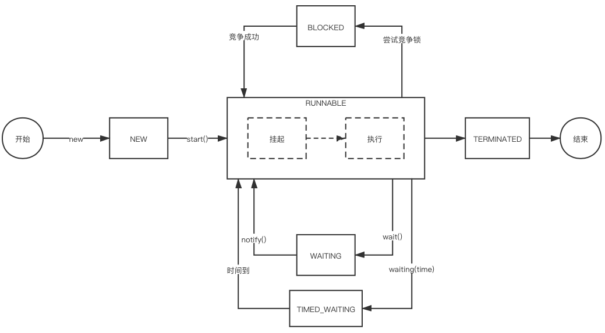
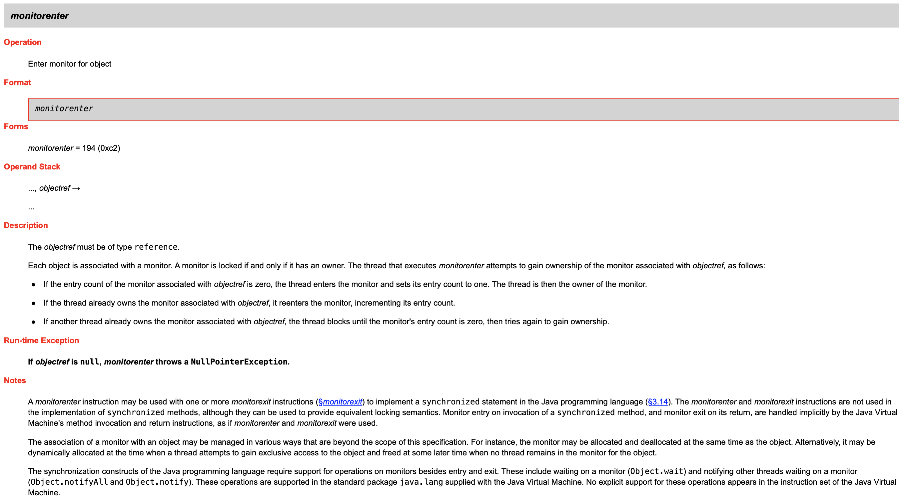
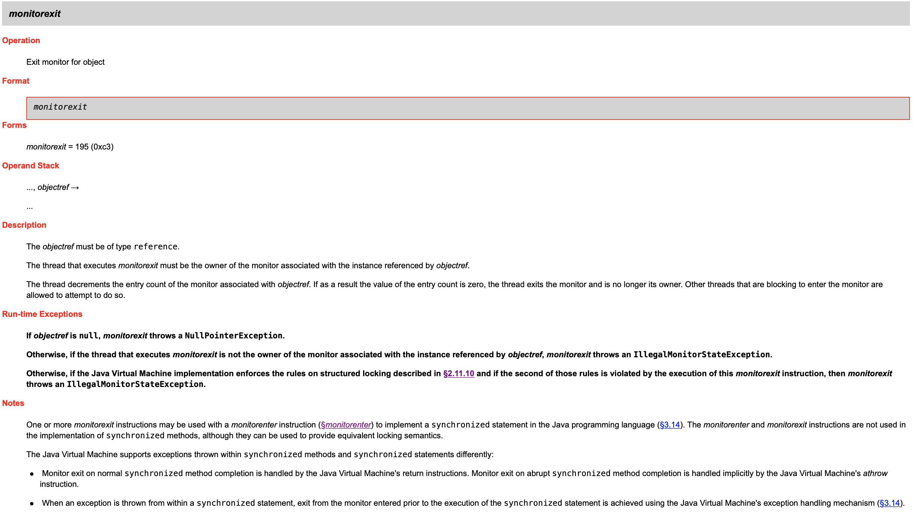
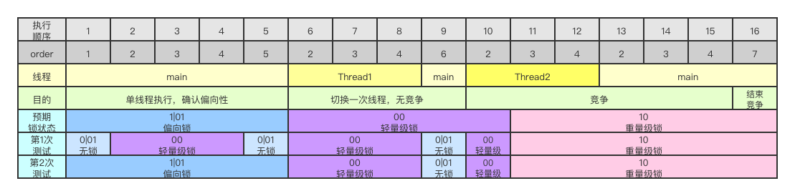
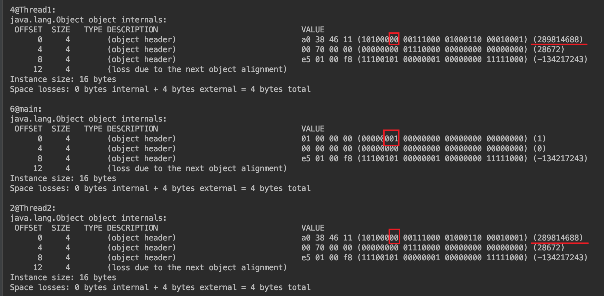
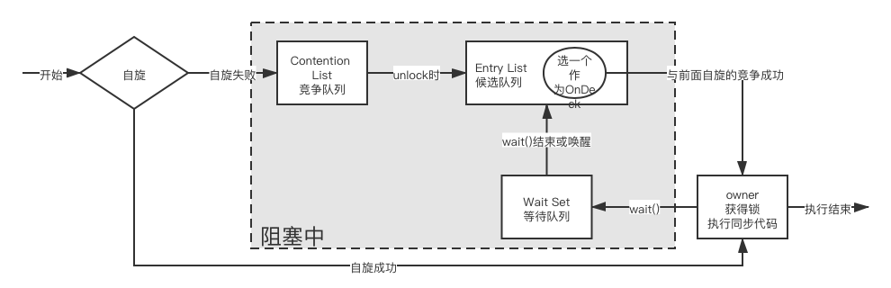
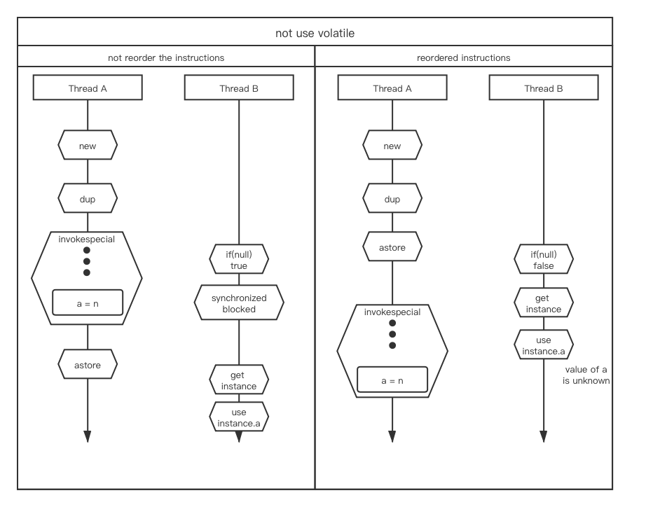

进程内的多线程与高并发是服务器程序或者单机程序需要面对的问题。本文将看看进程内的高并发时可以利用的工具，以及遇到高并发问题时如何解决。
<!--more-->
# 单机高并发的需要克服的困难

* 可见性：被线程间共享的变量发生变化时，各个线程能够及时知晓。通过volatile可以保证。
* 有序性：在本线程内观察指令执行，指令都是有序的（固定顺序）；但是在其他线程中观察这个线程，指令是无序的（可以在任何时机切入抢占）。通过volatile或者synchronized可以保证。当然也可以通过Unsafe.loadFence()和Unsafe.storeFence()来实现读屏障和写屏障。
* 原子性：操作不可中断，要么全部成功，要么全部失败。通过synchronized可以保证。 

# 线程
## 线程的概念、状态、常用的方法（start、run、join、yeild、interrupt）

### 概念
前面的基础知识大概列一下吧。
线程是操作系统可以调度的最小单元，是进程中实际执行的单元。举个例子，每一个软件看做一个应用程序（Application）；应用程序启动后将开启一个进程（Process），当然现在不少应用程序会启动多个进程；每一个进程将启动至少一个线程，比如渲染线程、网络线程等，以便在同一时间执行多个任务。  

### 状态与状态转移
线程的状态有6个，分别是

* NEW：线程创建后还没有启动时。
* RUNNABLE：线程启动后，正在执行或被挂起（也就是说随时准备好被CPU执行）
* BLOCKED：当被某个锁（locker）阻碍无法执行sychronized方法或代码块时。
* WAITING：当本线程因为执行`Object.wait(void)`、`Thread.join(Thread)`或`LockSupport.park(Object)`后暂时无法继续工作，等待其他线程执行特定的操作时。
* TIMED_WAITING：当本线程因为执行`Thread.sleep(long)`、`Object.wait(long)`、`Thread.join(long)`、`LockSupport.parkNanos(Object,long)`、`LockSupport.parkUtil(Object,long)`等带有时间参数的方法后暂时无法继续工作，等待计时器时。
* TERMINATED：当线程已经执行完成后。  

上面是根据`java.lang.Thread.State`这个枚举类列出的Java的线程状态。大致的状态转移图是这样的：


另有一种说法是根据线程模型而来的，大致可以分为5个状态：

* 创建状态：在new之后，start之前。相当于NEW
* 就绪状态：允许运行，但还没有被CPU执行的状态。是RUNNABLE中的一部分
* 运行状态：正在被CPU执行的时候，是RUNNABLE中的一部分
* 阻塞状态：等待别的线程触发某个事件前或者等待时间结束前，无法被CPU执行的状态。是BLOCKED、WAITING、TIMED_WAITING的结合
* 终结状态：线程终结态。相当于TERMINATED。

### 常用方法
线程的常用方法有`start()`、`run()`、`join()`、`yeild()`、`interrupt()`。
我们先看一段代码：
```java
package space.wudi.learnconcurrent.basicconcurrent.test03;
public class Main {
    static class MyRunnable implements Runnable{
        private final long time;
        private final Thread waitJoin;
        MyRunnable(long ms, Thread waitJoin){
            this.time = ms;
            this.waitJoin = waitJoin;
        }
        @Override
        public void run() {
            System.out.println(Thread.currentThread().getName()+" started");
            try {
                Thread.sleep(time);
                System.out.println(Thread.currentThread().getName()+" time's up");
            } catch (InterruptedException e) {
                System.out.println(Thread.currentThread().getName()+" interrupted");
            }
            if(waitJoin != null){
                try {
                    waitJoin.join();
                } catch (InterruptedException e) {
                    e.printStackTrace();
                }
            }
            System.out.println(Thread.currentThread().getName()+" stopped");
        }
    }
        public static void main(String[] args) {
        System.out.println("========Use join========");
        Thread t2 = useJoin();
        try {
            t2.join();
        } catch (InterruptedException e) {
            e.printStackTrace();
        }

        System.out.println("=====Use Interrupt======");
        useInterrupt();
    }
    private static Thread useJoin(){
        Thread t1 = new Thread(new MyRunnable(2000, null), "Thread1");
        Thread t2 = new Thread(new MyRunnable(1000, t1), "Thread2");

        t1.start();
        t2.start();
        return t2;
    }
    private static void useInterrupt(){
        Thread t1 =  new Thread(new MyRunnable(2000, null), "Thread3");
        t1.start();
        try {
            Thread.sleep(1000);
        } catch (InterruptedException e) {
            e.printStackTrace();
        }
        System.out.println("main thread time's up, call interrupt");
        t1.interrupt();
    }
}
```
创建了一个Runnable的实现，用于接收一个sleep的时间和一个等待加入的线程。  
在`useJoin()`中，我创建了`t1`和`t2`，`t2`中会执行`t1.join()`，也就是t2中会将t1加入进来。这就是说，t2在执行到t1.join()处，会等待t1完成，然后t2才会继续。由于t2的sleep时间比t1的短，所以可以得到以下输出：  

> ========Use join========  
> Thread1 started  
> Thread2 started  
> Thread2 time's up  
> Thread1 time's up  
> Thread1 stopped  
> Thread2 stopped  

除了join()外，还有`interrupt()`，通过`useInterrupt()`来测试。  
创建一个线程t3，睡2000ms。然后在主线程中，等待1000毫秒后，调用`t3.interrupt()`，这时候由于t3正在可被打断的阶段，所以就触发了`InterruptException`。  
那么有哪些可被打断的过程呢？常见的有`Thread.sleep()`和`Object.wait()`，这两个会抛出InterruptException；此外`LockSupport.part()`也可以被`interrupt()`中断，但不会抛出异常。  
`interrupt()`的原理是，在执行`interrupt()`时，将该线程的isInterrupt置为true，当执行到或正在执行可被打断的阶段时，将会主动中断。所以换句话说，中断其实是线程自发的、主动的行为。  

此外，`yield()`方法用于让出CPU资源。当当前线程执行`yield()`时，CPU就会将当前线程挂起，重新进入就绪线程队列，然后队列中的线程重新开始竞争CPU，乞求临幸。所以`yield()`并不能保证让自己被挂起，比如当就绪线程只有自己一个时，CPU将仍然继续执行当前线程。  

`start()`是用于启动一个线程的方法，会调用操作系统的API，所以是内核态的操作。而相对的，如果直接`run()`，就会直接在本线程中执行，不会新建一个线程。  


# 线程同步Synchronized
## synchronized的实现
根据[JVM规范SE8](https://docs.oracle.com/javase/specs/jvms/se8/html/jvms-6.html#jvms-6.5.monitorenter)，在进入一个synchronized的代码块(block)或调用以一个synchronized修饰的方法（method）时，需要增加一个指令`monitorenter`，在正常或异常退出这个代码块或者方法时，需要增加一个指令`monitorexit`。  
这里的monitor可以认为是一个名词，许多JVM规范的中文版将这个词翻译为“管程”，指一组对同步有要求的指令序列，可以看做是线程中的一小段代码。那么这个`monitorenter`就可以看做“管程”的入口，`monitorexit`就可以看做”管程“的出口。  
首先是`monitorenter`：
  
该指令支持一个参数，必须是一个对象的引用objectref。  
重点的有这样几句话：

> A monitor is locked if and only if it has an owner. The thread that executes monitorenter attempts to gain ownership of the monitor associated with objectref, as follows:  
>  
> * If the entry count of the monitor associated with objectref is zero, the thread enters the monitor and sets its entry count to one. The thread is then the owner of the monitor.
> * If the thread already owns the monitor associated with objectref, it reenters the monitor, incrementing its entry count.
> * If another thread already owns the monitor associated with objectref, the thread blocks until the monitor's entry count is zero, then tries again to gain ownership.

简单翻译一下的话就是:  

> 执行monitorenter指令的线程，尝试去获取objectref。遵循下面的要求：  
>  
> * 如果此管程（关联于objectref）的entry count是0，则线程执行进入管程，并且将这个管程的entry count置为1，该线程视作拥有该管程。  
> * 如果当前线程已经拥有objectref，则当前线程重新进入（reentry）管程，并且objectref的entry count自增1。  
> * 如果某个其他线程拥有objectref，当前线程将在此阻塞（block），直到这段管程的entry count为0，然后当前线程重新尝试去获取所有权。  

同样的，`monitorexit`是这样的：  
   
由于在管程monitor中执行的只能是拥有该objectref的线程，所以也只有这个线程能执行到monitorexit这个指令。当执行monitorexit指令时，首先将管程的entry count自减1，如果减为0了，当前thread就失去对objectref的所有权。  

我们来看一段代码编译后的结果，首先看源代码，在[github](https://github.com/discko/learnconcurrent/tree/master/basicconcurrent/src/space/wudi/learnconcurrent/basicconcurrent/test04)上已经同步了：
```java
// space.wudi.learnconcurrent.basicconcurrent.test04.Main
public class Main {
    void fun3(Object locker){
        synchronized (locker){
            System.out.println(1);
        }
    }
    synchronized void fun4(){
        System.out.println(2);
    }
}
```
然后利用`javap -v -c Main.class`命令查看其字节码，对于`fun3()`方法关键部分的字节码如下，完整的class文件在仓库的resources文件夹中：
```java
void fun3();
    descriptor: ()V
    flags: (0x0000)
    Code:
      stack=2, locals=3, args_size=1
         0: aload_0
         1: getfield      #2                  // Field locker:Ljava/lang/Object;
         4: dup
         5: astore_1
         6: monitorenter
         7: getstatic     #3                  // Field java/lang/System.out:Ljava/io/PrintStream;
        10: iconst_1
        11: invokevirtual #20                 // Method java/io/PrintStream.println:(I)V
        14: aload_1
        15: monitorexit
        16: goto          24
        19: astore_2
        20: aload_1
        21: monitorexit
        22: aload_2
        23: athrow
        24: return
      Exception table:
         from    to  target type
             7    16    19   any
            19    22    19   any
```
在上面可以看到，Code段中，6处有一个monitorenter，它消费了栈顶被dup的locker变量（来自getfield）的剩余的那一个（另一个被astore消费了）。然后分别在15和21处有两个monitorexit。虽然字节码指令不是很熟，但从流程上可以看到，11处执行了`println`后，15处monitorexit就结束了synchronized代码块释放了`locker`。然后在16处goto 24，也就是return结束了方法调用。那么21处的monitorexit呢？其实是为了避免在synchronized代码块中遇到异常，提前退出，这时候如果不释放锁的话，就可能造成死锁。  
在下面的Exception table中，from 7 to 16，如果发生了异常，其异常处理的入口的target在19，19处astore_2将异常对象引用从栈顶存入局部变量表2的位置，然后在20处aload_1将5处存在局部变量表1的位置的locker对象引用取出放入栈顶，接下来被21处的monitorexit消费，安全解锁，然后22处aload_2将19处astore_2存入局部变量表2的位置的异常对象引入取回栈顶，交给23处的athrow。这样就完成了异常情况下的解锁过程。

## 锁的类型
Java中锁的类型可分为无锁、偏向锁、轻量级锁、重量级锁，其类型记录于对象头的Mark Word中，与此同时还会记录与当前锁状态相关的一些参数。为了提高内存利用效率，这一部分的内存布局是复用的。详情见下表：  
  
接下来，对其中的一些信息进行解释：  
32位JVM虚拟机与64位JVM虚拟机中对象头的Mark Word中对于锁状态的总体布局是相似的。不过在细节上有一些区别。


## 锁升级的过程
锁可以从无锁/偏向锁升级为轻量级锁，然后再升级（通常称为“膨胀inflate”）为重量级锁。  
通过以下代码进行演示：
```java
package space.wudi.learnconcurrent.basicconcurrent.test05;
import org.openjdk.jol.info.ClassLayout;
public class Main05 {
    static class MyRunnable {
        void fun1(Object locker){
            try{
                synchronized (locker){
                    printHeader(locker, 2);
                    Thread.sleep(500);
                    // re-entry
                    fun2(locker);
                    printHeader(locker, 4);
                }
            }catch (InterruptedException e){
                e.printStackTrace();
            }
        }
        void fun2(Object locker){
            synchronized (locker){
                printHeader(locker, 3);
            }
        }
    }
    public static void main(String[] args) {
        MyRunnable mr = new MyRunnable();
        Object locker = new Object();
        // in main thread
        printHeader(locker, 1);
        mr.fun1(locker);
        printHeader(locker, 5);
        // complete main thread and change to thread-1
        Thread t1 = new Thread(()->{
            mr.fun1(locker);
        },"Thread1");
        t1.start();
        try {
            t1.join();
        } catch (InterruptedException e) {
        }
        printHeader(locker, 6);
        // complete single thread
        // start to threads to compete
        Thread t2 = new Thread(()->{
            mr.fun1(locker);
        },"Thread2");
        t2.start();
        try {
            Thread.sleep(500);
            // main thread compete with Thread2
            mr.fun1(locker);
            t2.join();
        } catch (Exception e) {
            e.printStackTrace();
        }
        // after compete
        printHeader(locker, 7);
    }
    private static void printHeader(Object locker, int order){
        System.out.printf("%s@%s:\n%s\n",order, Thread.currentThread().getName(), ClassLayout.parseInstance(locker).toPrintable());
    }
}
```
这里利用了openjdk的jol-core库抓取对象的header。
```xml
<dependency>
    <groupId>org.openjdk.jol</groupId>
    <artifactId>jol-core</artifactId>
    <version>0.9</version>
</dependency>
```
根据过程，在7个地方输出header信息（见“order”行），分成4个测试环节（“目的”行），总共在3个线程共计输出了16次。  

  

第5行是我原本的预期，结果第一次实验却发现根本没有进入偏向锁的状态。经过查找资料，知道了JVM在启动后会经过一个时延，才会启动偏向锁。所以利用JVM参数关闭时延：`-XX:BiasedLockingStartupDelay=0`。同时为了确保偏向锁功能开启，额外增加开关`-XX:+UseBiasedLocking`（不过据说这个开关在jdk6及之后，也就是有偏向锁之后，都是默认打开的）。

这样，就得到了第二次测试结果（第6行）。与预期的已基本一致。唯一的不同之处在于，轻量级锁在sychronized结束后，降级回了”无锁“，也就是最低3位是`001`。但奇怪的是，无锁前后的两个轻量级锁的“栈中的所记录地址”是一样的。    
  

图中`4@Thread1`和`6@Thread2`中的header的前8个字节都是一样的（低字节在左，高字节在右，因为锁标记是在32位或64位记录的最低2位，所以在这里应该是左边第1个字节的最低2位），所以都是轻量级锁，且指针是一样的（因为这里用的是64位的虚拟机，所以前2行共8个字节64位，除第0个字节的最低2位外，其他合起来用于记录地址）。而`6@main`中除了锁标记是`01`外，其他62位都是0。  
目前这个造成的原因还未知。JVM的源码读起来比较吃力，不过从我目前看到的代码来看，应该也不会造成这样的情况。
```cpp
// http://hg.openjdk.java.net/jdk8/jdk8/hotspot/file/87ee5ee27509/src/share/vm/runtime/synchronizer.cpp
// 进入同步时
void ObjectSynchronizer::slow_enter(Handle obj, BasicLock* lock, TRAPS) {
  // 获取header中的mark word
  markOop mark = obj->mark();
  assert(!mark->has_bias_pattern(), "should not see bias pattern here");
  // 如果最低2位是01的话
  if (mark->is_neutral()) {
    // 将mark word存起来
    lock->set_displaced_header(mark);
    // 通过CAS将锁记录地址写到mark word中以替换原本的mark word
    if (mark == (markOop) Atomic::cmpxchg_ptr(lock, obj()->mark_addr(), mark)) {
      TEVENT (slow_enter: release stacklock) ;
      return ;
    }
    // 下面的不重要
  } else
  if (mark->has_locker() && THREAD->is_lock_owned((address)mark->locker())) {
    assert(lock != mark->locker(), "must not re-lock the same lock");
    assert(lock != (BasicLock*)obj->mark(), "don't relock with same BasicLock");
    lock->set_displaced_header(NULL);
    return;
  }
#if 0
  if (mark->has_monitor() && mark->monitor()->is_entered(THREAD)) {
    lock->set_displaced_header (NULL) ;
    return ;
  }
#endif
  lock->set_displaced_header(markOopDesc::unused_mark());
  ObjectSynchronizer::inflate(THREAD, obj())->enter(THREAD);
}
// 退出同步时
void ObjectSynchronizer::fast_exit(oop object, BasicLock* lock, TRAPS) {
  assert(!object->mark()->has_bias_pattern(), "should not see bias pattern here");
  // 获取存起来的原来的mark word
  markOop dhw = lock->displaced_header();
  markOop mark ;
  if (dhw == NULL) {
     // 因为确实存起来了，应该不会执行到这里
     mark = object->mark() ;
     assert (!mark->is_neutral(), "invariant") ;
     if (mark->has_locker() && mark != markOopDesc::INFLATING()) {
        assert(THREAD->is_lock_owned((address)mark->locker()), "invariant") ;
     }
     if (mark->has_monitor()) {
        ObjectMonitor * m = mark->monitor() ;
        assert(((oop)(m->object()))->mark() == mark, "invariant") ;
        assert(m->is_entered(THREAD), "invariant") ;
     }
     return ;
  }
  // 获取当前的mark word
  mark = object->mark() ;

  if (mark == (markOop) lock) {
     assert (dhw->is_neutral(), "invariant") ;
     // 将原本暂存的mark word通过CAS写回
     if ((markOop) Atomic::cmpxchg_ptr (dhw, 
     object->mark_addr(), mark) == mark) {
        TEVENT (fast_exit: release stacklock) ;
        return;
     }
  }

  ObjectSynchronizer::inflate(THREAD, object)->exit (true, THREAD) ;
}
```
所以总的来说，锁的升级过程遵循这样的规律：
当不开启偏向锁时，进入synchronized代码块时，对象会从“无锁”变为“轻量级锁”，当有其他线程竞争该“轻量级锁”时，锁会升级为“重量级锁”，之后就不会降级了。  
当开启偏向锁时，进入synchronized代码块时，对象会从“匿名偏向锁（也就是线程ID为0）”变为“偏向锁”。在非竞争状态下（比如原线程的synchronized代码块已经执行完毕），如果有其他线程通过该对象加锁，则该对象变为“轻量级锁”。当发生竞争时，升级为“重量级锁”，这个过程锁不会降级。  
### 初始状态
从原理上来说的话，新生成的对象是无锁状态（也可能是匿名偏向锁状态，测试下来发现两种都有）。当进入临界区（critical section，这个区域只允许一个线程执行，也就是同步代码段）时，通过CAS操作，向Markword中写入当前线程的ID，此时偏向标记和锁标记应当是`101`。  
### 偏向锁升级为轻量级锁
当这时有另外一个线程到达临界区，意欲通过CAS向锁对象写入自己的线程ID时，发现它已经有别的线程ID了（当然有可能此时原线程的临界区已经执行完了，但这不妨碍系统认为该对象存在竞争），这时候，就需要撤销偏向锁，将其升级为轻量级锁。


1. 一个线程到达临界区，发现锁对象的对象头上记录的不是自己的线程ID（如果是自己的线程ID的话，那么就会继续偏向了）
2. 在自己的栈帧中创建一个`LockRecord`空间，并锁对象的markword复制到`LockRecord`的displaced_markword字段中
3. 通过CAS操作将锁对象的markword修改为`LockRecord`的地址。如果成功了，则在修改的过程中会顺便将锁状态修改为`00`；如果失败了，说明锁被占用了，这时候开始自旋。  
4. 等到退出临界区的时候，再将`LockRecorder`中的displaced_markword放回对象头的mark word中，这样其他线程就可以方便地使用此锁对象了。

在创建完`LockRecord`后如果CAS失败就会进行自旋，也就是通过原地不断尝试原线程释放锁的占用。在并发情况不严重时，通过自旋能很快占有锁，所以这是乐观的。

自旋锁有两种，普通的自旋锁有一个自旋次数的阈值（通常是10，可通过`-XX:PreBlockSpin`修改），还有一种“自适应自旋锁”，对于虚拟机认为有较大概率获得锁的情况，将会允许它自旋相对更长的时间，比如对某一个锁，他前一次能够通过自旋而被别的线程获取，那么虚拟机就会认为这次自旋也是很有可能获得锁，进而它将允许自旋等待相对更长的时间。

但当尝试次数达到阈值后，这就意味着这个所资源可能面临着较高的并发（很多线程都在争取它，而我还没有轮上），或者原线程在执行较为耗时的操作，一直都没有释放锁。  
这时候就只能对锁进行再次升级，以避免长时间的自旋而空消耗CPU指令。

### 轻量级锁膨胀为重量级锁
进入重量级锁，这时候就要让线程进入BLOCK状态，这是一个系统级的操作，从用户态转移到内核态比较耗费资源，所以才会设计上面的锁升级过程，尽量不直接使用重量级锁。但上面说到了，自旋的过程是消耗CPU指令的，如果长时间自旋，CPU性能就浪费了，权衡之后也只能升级为重量级锁。  
升级时，会让操作系统


当执行`synchronized(obj)`的时候，对象头上的markword中记录当前线程号，锁标记更改为“偏向锁biased lock”。此时相当于没有加锁。当只有本线程访问时，畅通无阻。（也就是偏向于该线程的意思）  
当其他线程过来访问时，obj升级为”自旋锁spinned lock"。自旋锁是一种乐观锁，认为该线程竞争情况不激烈。新线程每经过一个自旋周期，就会去尝试获取该锁。自旋锁是通过CPU的CAS指令去获取锁的，但是是在用户态。  
如果超过了阈值（通常是10）次数还没有获取到，该锁就会升级到重量级锁。重量级锁是系统层面的，内核态的。所以每次使用（进入和退出）重量级锁，都会切换状态，开销很大。  
接下来看看重量级锁：

1. 当轻量级锁状态下通过自旋仍然无法获取锁，这时新线程就创建（源码中是在一个缓存池中获取，获取不到的再创建）一个monitor对象
2. 然后将锁对象的markword修改为monitor对象的地址，同时修改锁标记为`10`
3. 这时，原来的持有锁对象的线程如果执行完成了，本来会通过CAS将暂存的displaced_mark_word放回锁对象的mark word，但是CAS失败了（因为对象头应发生了修改），这时候就直接释放锁，开始锁竞争。

而竞争过程是这样的[，这里参考了大牛的文章](https://blog.csdn.net/zqz_zqz/article/details/70233767)：
1. 所有请求锁的线程进入竞争队列（Contention List）
2. 由于竞争队列是通过CAS写入的，并发量较高的情况下，直接从其中选出竞争成功者效率比较低，所以在竞争队列unlock的情况下，将其中的一小部分元素移入候选队列（Entry List）。
3. 接下来，将候选队列中的某个元素指定为OnDeck，也就是时刻准备接任线程。通常会指定先进入候选队列的那个线程。  
4. 称为OnDeck后，这个线程也不能确保获得线程的使用权，而仅仅获得了竞争权。在锁被被原线程释放后，OnDeck会与进入竞争队列（Contention List）前先自旋的线程竞争，成功后上岗，失败的话重新回到候选列表（EntryList）。
5. 正在执行的线程如果被wait等方法阻塞，会进入等待队列（Wait Set）中，直到某个时刻或被notify唤醒，重新进入候选队列（Entry List）



需要注意的是，处于Contention List、Entry List、Wait Set中的线程都是BLOCKED状态，是系统级的。

### 升级流图


## FAQ
### 自旋锁和重量级锁的选择
什么时候选择自旋锁：执行时间比较短，线程数比较少。
什么时候选择重量级锁：执行时间比较长，线程数比较多。

### 锁null可行么？
当然不可以。synchronized必须是一个对象，因为需要在该对象头的mark word中进行设置和记录。所以null是不可以的，基础类型（int、long、float、double、byte、boolean）也是不可以的。

# volatile
作用：保证线程可见性，禁止指令重排序。
## 保证线程可见性
除了堆内存（共享的），对每一个线程还都存在一个工作空间。当访问堆内存时，会先将堆内存中的值复制一份到工作空间，而对工作空间的修改，即使能即使写道共享区域中，但是不会通知到其他线程。所以在其中一个线程中对全局变量的修改，其他线程不能及时知道。
下面是一个[测试代码](https://github.com/discko/learnconcurrent/blob/master/basicconcurrent/src/main/java/space/wudi/learnconcurrent/basicconcurrent/test02/Main0201.java)。
```java
package space.wudi.learnconcurrent.basicconcurrent.test02;
import java.util.concurrent.TimeUnit;
public class Main0201 {
    @SuppressWarnings("all")
    static class MyAction{
        boolean flag1 = true;
        volatile boolean flag2 = true;
        void fun1(){
            System.out.println(Thread.currentThread().getName()+" fun1 loop started");
            while (flag1) {
            }
            System.out.println(Thread.currentThread().getName()+" fun1 loop stopped");
        }
        void fun2(){
            System.out.println(Thread.currentThread().getName()+" fun2 loop started");
            while (flag2) {
            }
            System.out.println(Thread.currentThread().getName()+" fun2 loop stopped");
        }
    }
    public static void main(String[] args) {
        MyAction a1 = new MyAction();
        MyAction a2 = new MyAction();
        Thread t1 = new Thread(a1::fun1);
        Thread t2 = new Thread(a2::fun2);
        t1.start();
        t2.start();
        try {
            TimeUnit.SECONDS.sleep(1);
        } catch (InterruptedException e) {
            e.printStackTrace();
        }
        a1.flag1 = false;
        System.out.println("change a1.flag to " + a1.flag1);
        a2.flag2 = false;
        System.out.println("change a2.flag to " + a2.flag1);
    }
}
```
在主线程中修改while循环的condition，这里的输出是这样的：

> Thread-0 fun1 loop started  
> Thread-1 fun2 loop started  
> change a1.flag to false  
> change a2.flag to true  
> Thread-1 fun2 loop stopped  

到这里，输出就不再更新了，而程序仍然在执行，可以看出来Thread-0并没有响应flag的修改。  
而加了volatile的flag的修改就能够被别的线程响应到。

## 防止指令重排序
CPU在执行指令的时候，可能会将某些指令的顺序进行修改。因为指令是流水进行的，一边在读指令，一边在执行指令。为了提高效率，可能会交换一些指令的次序。  

举个例子。  

在正常的操作下，`new`行为对应了下面的4条指令。对于一个简单的语句`A a = new A()`，有下面这样的字节码：
```asm
0: new           #2
3: dup
4: invokespecial #3 // <init>":()V
7: astore_1
```
new用于申请一块内存，并将获得的地址放入栈中；dup将栈顶元素复制一份再次放入栈顶（这样栈顶就有两个一样的值了）；然后invokespecial消费一个栈顶的值（也就是申请的空间地址），调用`<init>`方法，对这份地址进行初始化；最后，消费栈顶的值（也就是申请的空间地址），将其赋值给变量a。  
注意到invokespecial和astore一个是对地址代表的内存区域进行填充，一个是将地址赋值给别人，都不涉及对这个值的修改。所以在执行时，可能会将两个指令进行交换以提高速度。  
在单线程中，这个没有关系，因为只有一个PC指针，无论先执行invokespecial还是astore，在这两个结束之后，才会执行后面的操作。那么这时候，变量a得到了新对象的地址，新对象的空间中也已经填充好了。  
但是在高并发情况下，比如下面这个单例模式的[代码](https://github.com/discko/learnconcurrent/blob/master/basicconcurrent/src/main/java/space/wudi/learnconcurrent/basicconcurrent/test02/Main0202.java)：
```java
package space.wudi.learnconcurrent.basicconcurrent.test02;
@SuppressWarnings("all")
public class Main0202 {
    private static /*volatile*/ Main0202 instance = null;
    private int a;
    private Main0202(int n){
        a = n;
    }
    public static Main0202 getInstance(int n){
        // B thread is checking instance is or isn't null
        if(instance == null){
            synchronized (Main0202.class){
                if(instance == null){
                    // A thread is invoking <init>
                    instance = new Main0202(n);
                }
            }
        }
        return instance;
    }
    public static void main(String[] args) {
        final int COUNT = 100;
        for(int i=0;i<COUNT;i++){
            final int n = i;
            new Thread(()->{
                System.out.println(Main0202.getInstance(n).a);
            }).start();
        }
    }
}

```
在超高并发情况下，在某一个时刻可能会发生这样的情况：  
A线程正在执行new Main0202()这个方法，而B线程刚刚进入，正好要执行第一个`if(instance == null)`的确认工作。  
这时指令是重排序的，先astore，再invokespecial，而恰恰构造方法中的操作比较耗时。那么A线程通过atore已经让instance获取了一个对象的引用（虽然这个对象还没有初始化完成），但是此时B线程去判断`instance==null`就会为false然后直接`return instance`这个还没有初始化完成的对象。  
此时如果B线程直接获取属性a的值，如果A线程仍然没有对a进行初始化的话，B线程就会获取到错误的值。  

大致的流图是这样的，左边是没有重排序（或者说是我们预期的流程），右边是重排序后可能会造成负面影响的流程：  
  

## 不能替代原子性
虽然volatile可以保证线程可见性，让变量能够在线程的工作空间和堆共享空间中实时更新，但不能保证对该变量的所有操作是原子的。
看下面这段代码：
```java
package space.wudi.learnconcurrent.basicconcurrent.test02;
import java.util.ArrayList;
public class Main0203 {
    private volatile int a = 0;
    private /*synchronized*/ void fun(){
        for(int i = 0;i<10000;i++){
            a++;
        }
    }
    public static void main(String[] args) {
        Main0203 m = new Main0203();
        ArrayList<Thread> threads = new ArrayList<>(10);
        for(int i=0;i<10;i++){
            threads.add(new Thread(m::fun));
        }
        threads.forEach(Thread::start);
        threads.forEach(thread -> {
            try {
                thread.join();
            } catch (InterruptedException e) {
                e.printStackTrace();
            }
        });
        System.out.println(m.a);
    }
}
```
预期的运行结果是100,000，可实际的结果只有几万。造成这个的原因是`a++`不是原子性操作。比如现在有`A`、`B`、`C`三个线程，当`A`线程将`a`的值设为5后，`B`、`C`线程也都能获得`a=5`，然后各自分别将5加1获得6后，再赋值回去，这样本来在这一轮之后，`a`应该是7的，现在只有6了。  
我们来看一下下面这段代码的字节码反汇编的结果。
```java
public class T {
    private int a = 0;
    public static void main(String[] args) {
        int b = 5;
        T t = new T();
        for(int i=0;i<1000;i++){
            t.a++;
        }
        for(int i=0;i<1000;i++){
            b++;
        }
    }
}
```
```asm
public static void main(java.lang.String[]);
    Code:
       0: iconst_5
       1: istore_1
       2: new           #3                  // class T
       5: dup
       6: invokespecial #4                  // Method "<init>":()V
       9: astore_2
//-----------执行第一个for循环-----------
      10: iconst_0
      11: istore_3
      12: iload_3
      13: sipush        1000
      16: if_icmpge     35
      19: aload_2
      20: dup
      21: getfield      #2                  // 取属性a
      24: iconst_1                          // 建一个常数，值为1
      25: iadd                              // 属性a的值和常数1的值相加
      26: putfield      #2                  // 相加结果放入属性a
      29: iinc          3, 1                // 循环变量i自增1
      32: goto          12
//-----------执行第二个for循环-----------
      35: iconst_0
      36: istore_3
      37: iload_3
      38: sipush        1000
      41: if_icmpge     53
      44: iinc          1, 1                // 局部变量b自增
      47: iinc          3, 1                // 循环变量i自增
      50: goto          37
      53: return

```

可以看到，在第一个for循环中，`t.a++`这条语句需要4条指令，而第二个for循环中`b++`只需要一条指令。换句话说，对于局部变量，直接对局部变量表中的对象进行iinc自增就可以了，而对于类内属性，就需要`取出属性的值，设置加数，相加，设置属性值`这样的4步。因此，volatile虽然能够保证这个变量对其他线程同样是可见的，但在语义上是没有原子含义的。  

## 底层实现原理
保证线程可见性：缓存一致性协议，如MESI。
MESI中每个缓存行都有四个状态，分别是M（modified）、E（exclusive）、S（shared）、I（invalid）。  

* M：代表该缓存行中的内容被修改了，并且该缓存行只被缓存在该CPU中。这个状态的缓存行中的数据和内存中的不一样，在未来的某个时刻它会被写入到内存中（当其他CPU要读取该缓存行的内容时。或者其他CPU要修改该缓存对应的内存中的内容时（个人理解CPU要修改该内存时先要读取到缓存中再进行修改），这样的话和读取缓存中的内容其实是一个道理）。  
* E：代表该缓存行对应内存中的内容只被该CPU缓存，其他CPU没有缓存该缓存对应内存行中的内容。这个状态的缓存行中的内容和内存中的内容一致。该缓存可以在任何其他CPU读取该缓存对应内存中的内容时变成S状态。或者本地处理器写该缓存就会变成M状态。  
* S:该状态意味着数据不止存在本地CPU缓存中，还存在别的CPU的缓存中。这个状态的数据和内存中的数据是一致的。当有一个CPU修改该缓存行对应的内存的内容时会使该缓存行变成 I 状态。
* I：代表该缓存行中的内容是无效的。  

这里面有一张图可以帮助理解：[MESI状态转换](https://blog.csdn.net/m18870420619/article/details/82431319#mesi状态转换)

volatile的防止指令重排序是通过读写屏障来完成的。Java Memory Model（JMM）中的8条原子指令，通过load与store的组合，来防止指令重新排序。（一读一写两条指令放在一起，那么必须先执行写的指令，然后才能执行读的指令）

# 锁优化
## 锁粒度优化
当被锁定的函数竞争十分激烈，而其中不可并发的部分比较小，那么就可以将锁的粒度缩小：
```java
synchronized void fun(){
    Thread.sleep(1000);
    a++;
    Thread.sleep(1000)
}
void fun(){
    Thread.sleep(1000);
    synchronized(o){
        a++;
    }
    Thread.sleep(1000);
}
``` 
当频繁进出临界区，会造成性能下降时（比如一片都是分立的synchronized代码块，每执行一两句话，就要在synchronized处竞争），那不如将synchronized粗话，一次竞争执行完了，再交给下一个线程。  

# CAS操作
CAS即compare and swap(set)，伪代码大概是这样的：
```c
bool cas(obj, expect, newValue){
    if(obj == expect){
        obj = newValue;
        return true;
    }else{
        return false;
    }
}
```
当然这个过程，由CPU保证是原子的。  
大概的使用过程是这样的：
```c
oldValue = get(obj);
newValue = modify(obj);
if(cas(obj,oldValue, newValue)){
    // success
}else{
    // retry or fail
}
```
换句话说就是，我首先先取一下obj的值，然后对obj进行修改，在CAS时，我期望obj中的值仍然没有发生变化（还是oldValue），这样，我就能放心大胆地将obj的值修改为newValue了。（如果不一样了，那么根据逻辑我再重新计算新的newValue或者直接失败。

这时可能会遇到一个问题——ABA问题。
比如在上面的伪代码中，get(obj)之后，在modify的过程中，obj中的值从oldValue变成了midValue，然后又变成了oldValue。此时modify完成执行cas时，发现oldValue没有变化，就会将newValue放进去。  
对于普通的Integer类型没有什么问题。但是对于其他的有着许多成员属性的可能就会在计算newValue时出问题。  
解决这个问题，可以对obj增加一个版本号，每一次更新obj时，都需要修改版本号（或者时间戳），然后expect的就不再是属性的值了，而永远是版本号。  

BTW，unsafe中的allocateMemory是在操作直接内存（Direct Memory，堆外内存），DirectByteBuffer的alloc就是通过Unsafe.allocateMemory来做的。

## AtomicXXX和LongAdder
当线程比较多，但是需要对某一个变量做累加的时候（比如秒杀时对下访问人数做统计），可以使用LongAdder。其内部使用的是一个数组（长度是2的幂），相当于是一个分段锁，各线程累加的时候只锁自己编辑的那一部分。最后获取总值时，将各个cell中的值加起来。  

## 基于CAS的锁
### ReentrantLock可重入锁
ReentrantLock可以设置该锁是公平的还是非公平的。通过构造方法参数`ReentrantLock(boolean fair=false)`去设置。  
所谓公平，就是某个线程刚进入临界区的时候，非公平锁会让线程首先去尝试获取锁，锁不上再进入竞争队列（这样的话，候选队列中需要与还没有进入竞争队列的进程竞争）；而公平锁，所有线程都必须进入竞争队列，竞争只发生在候选队列中。

因为syncrhonized也是可重入的，所以很多情况下ReentrantLock可以用于替代synchronized。
```java
// use synchronized:
public void fun(){
    operationBefore();
    synchronized{
       synchronizedOperation();
    }
    operationAfter();
}
// use ReentrantLock:
ReentrantLock lock;
public void fun(){
    operationBefore();
    lock.lock()
    try{
       synchronizedOperation();
    }finally{
        lock.unlock();
    }
    operationAfter();
}
```
但在ReentrantLock不可以完全替代synchronized。

1. synchronized可以得到编译器和JVM的优化
2. JDK1.6之后，从偏向锁、轻量级锁到重量级锁的升级过程，让synchronized的性能得到了提升。
3. ReentrantLock可以设置为公平锁，而synchronized是非公平的
4. ReentrantLock可以尝试获取或中断获取，这依赖与下面几个方法：
    * tryLock()：尝试获取一次，成功或失败会返回true或false
    * tryLock(timeout, unit)：尝试获取一定的时间，成功或失败返回true或false。当线程状态是interrupted或者在tryLock时线程被interrupt，则抛出InterruptException异常。
    * lockInterruptibly()：在尝试获取lock的时候会被一直阻塞，但线程状态是interrupted或者在tryLock时线程被interrupt，则抛出InterruptException异常，从而停止线程阻塞。
5. 可以进行锁轮询。利用上面的几个方法，可以在可能出现死锁的情况下，在代码层面避免。
```java
ReentrantLock lock1, lock2; //lock1和lock2不能给不同的线程分别持有，否则可能会死锁
if(lock1.tryLock()){
    // 获取了lock1
    try{
        if(lock2.tryLock()){
            //获取了lock2
            try{
                doSomething();
            }finally{
                lock2.unlock();
            }
        }
    }finally{
        // 没有获取lock2或者lock2释放了
        lock1.unlock();
    }
}
```

### CountDownLatch、CyclicBarrier、Phaser
```java
CountDownLatch cdl = new CountDownLatch(5);
cdl.countDown();    // coundown 1
cdl.await(); // until coundown to 0
```
```java
CyclicBarrier cb = new CyclicBarrier(/*parties:*/5);
// CyclicBarrier cb = new CyclicBarrier(/*parties:*/5, /*barrierAction:*/()->print());
cb.await(); // until count in await() reaches 5
```
CyclicBarrier会阻塞调用cb.await()的线程，直到此时调用cb.await()的线程达到初始化时的值。这时候所有await的线程都可以继续执行后面的操作（开闸）。而最后到达await()的那个线程，调用初始化时的barrierAction。  
```java
// create a costum Phaser
class MyPhaser extends Phaser{
    @Override
    boolean onAdvance(int phase, int registeredParties){
        swicth(phase){
        case 0: initPhase0(); return false; // not ended
        case 1: initPhase1(); return false;
        case 2: initPhase2(); return true;  // last phase
    }
}
// main thread
phaser.bulkRegister(/*parties:*/n); // 注册phaser的大小
// each sub thread

someThingCurrentPhaser();
phaser.arriveAndAwaitAdvance(); // 等待phaser到达注册数
someThingNextPhaser();
phaser.arriveAndDeregister();   // phaser中的大小-1
phaser.register();              // phaser中的大小+1
```
### ReentrantReadWriteLock可重入读写锁
读写分离。
```java
ReentrantReadWriteLock lock = new ReentrantReadWriteLock();
Lock readLock = lock.readLock();
Lock writeLock = lock.writeLock();
```
其中，读锁是共享的，可以并发读，但是上锁的时候，不可以写。  
写锁是排他的，上锁的时候既不可以读，也不可以写。  

### Semaphore 信号量
做同步或者限流。
```java
// init
Semaphore s = new Semaphore(/*permits:*/n/* ,fair = false*/);
// in some thread
s.acquire();    // 如果对s.acquire的次数超过 permits，这里阻塞
try{
    doSomething();
}finally{
    s.release() // 释放对s的acquire
}
```
### Exchanger 交换器
用于两个线程之间的数据交换，只能用于两个线程。
```java
// init
Exchanger<String> exchanger = new Exchanger<>();
// in some thread
String myValue = "myValue";
String exchangeValue = exchanger.exchange(myValue); // 阻塞，直到另一个线程执行exchanger.exchange(thatValue)。这时本线程将thatValue赋值给exchangeValue；那个线程将myValue作为exchange的返回值。  
```
### LockSupport
用于实现锁的支持类。
```java
// in thread t
LockSupport.lock();
LockSupport.parkNanos(long waitNano);
LockSupport.parkUntil(long absoluteTime);
// in other thread
LockSupport.unlock(t);  // t should started (but whatever it is parking or not)
L
```

# 经典面试题
## 两个线程，线程`T1`向容器中添加10个元素，线程`T2`当容器中有5个元素时中断自己
### 死循环监视
```java
List<Object> list = new LinkedList<>();
new Thread(()->{
    for(int i=0;i<10;i++)
        list.add(new Object);
},"T1").start();
new Thread(()->{
    while(true){
        if(list.size() == 5){
            break;
        }
    }
    System.out.println("terminated");
}, "T2").start();
```
这样做是不行的，会有两个问题。  

1. list会因为线程可见性问题，在T1中的修改不能及时反馈到T2中，造成T2无法实时监控list的大小而错误5的时机。  
2. 由于LinkedList(ArrayList同理)不是线程安全的。所以可能导致插入元素没有完成就错误地获得了size。  

### wait+notify
```java
List<Object> list = new LinkedList<>();
Object lock = new Object();
new Thread(()->{
    synchronized(lock){
        try{
            lock.await();
        }catch(InterruptedException e){
        }
    }
    System.out.println("break");
}, "T2").start();
new Thread(()->{
    synchronized(lock){
        for(int i=0;i<10;i++){
            list.add(new Object());
            if(list.size()==5)
                lock.notify();
        }
    }
}, "T1").start();
```
由于wait和notify的使用者必须是正在被monitor的对象，所以必须写在synchronized中。`T2`中wait方法会释放锁，因而可以让`T1`得以执行。但是，notify不会释放锁。所以notify之后，`T2`就被唤醒了，但是一直无法获得锁，不能继续执行，直到`T1`的synchronized代码块执行完了（也就是10个元素全部添加完了），才能执行`break`。  
针对这个原因，有两种改进的方法。第一个，缩小锁的粒度：
```java
new Thread(()->{
    for(int i=0;i<10;i++){
        list.add(new Object());
        if(list.size()==5)
            synchronized(lock){
                lock.notify();
            }
    }
}, "T1").start();
``` 
只将notify进行包裹，这样很快就能够结束对lock对象的占用。但是频繁加锁释放锁可能对性能造成影响。  
第二种方案：
```java
new Thread(()->{
    synchronized(lock){
        try{
            lock.await();
        }catch(InterruptedException e){
        }
        lock.notify();
    }
    System.out.println("break");
}, "T2").start();
new Thread(()->{
    synchronized(lock){
        for(int i=0;i<10;i++){
            list.add(new Object());
            if(list.size()==5){
                lock.notify();
                try{
                    lock.wait();
                }catch(InterruptedException e){
                }
            }
        }
    }
}, "T1").start();
```
也就是`T1`一旦notify马上就通过wait让出锁。而在`T2`中，一旦被唤醒，马上就再次唤醒`T1`。  

### CountDownLatch
```java
CountDownLatch cdl = new CountDownLatch(1);
new Thread(()->{
    try{
        cdl.await()
    }catch(InterruptException e){
    }
    System.out.println("break");
}, "T2").start();
new Thread(()->{
    for(int i=0;i<10;i++){
        list.add(new Object());
        if(list.size() == 5){
            cdl.countdown();
        }
    }
}, "T1").start();
```
这样基本上没有什么问题了。如果要特别精确，一定要加入5个之后T2停止，然后T1再加入第6个的话：
```java
CountDownLatch cdl1 = new CountDownLatch(1);
CountDownLatch cdl2 = new CountDownLatch(1);
new Thread(()->{
    try{
        cdl1.await()
    }catch(InterruptException e){
    }
    System.out.println("break");
    cdl2.countdown();
}, "T2").start();
new Thread(()->{
    for(int i=0;i<10;i++){
        list.add(new Object());
        if(list.size() == 5){
            cdl1.countdown();
            try{
                cdl2.await();
            }catch(InterruptException e){
            }
        }
    }
}, "T1").start();
```

### LockSupport
与wait+notify差不多：
```java
static Thread t1 = null, t2 = null;
t1 = new Thread(()->{
    for(int i=0;i<10;i++){
        list.add(new Object());
        if(list.size() == 5){
            LockSupport.unpark(t2);
            LockSupport.park();
        }
    }
});
t2 = new Thread(()->{
    LockSupport.park();
    System.out.println("break");
    LockSupport.unpark(t1);
});
t2.start();
t1.start();
```

## 生产者消费者模式的简单实现
大小有限的容器，由若干个生产者和消费者进行生产和消费。当容器满时，生产者阻塞生产；当容器空时，消费者阻塞消费。
```java
import java.util.LinkedList;
import java.util.List;
import java.util.concurrent.locks.*;

public class Main06 {
    final int MAX_SIZE = 10;
    private Object[] elements = new Object[MAX_SIZE];
    private List<Object> list = new LinkedList<>();
    private int size = 0;

    private ReentrantLock lock = new ReentrantLock();
    private Condition producer = lock.newCondition();
    private Condition consumer = lock.newCondition();

    void put(Object o){
        lock.lock();
        try{
            while(size == MAX_SIZE){
                try {
                    producer.await();
                } catch (InterruptedException e) {
                    e.printStackTrace();
                }
            }
            list.add(o);
            size--;
            consumer.signalAll();
        } finally {
            lock.unlock();
        }
    }

    Object get(){
        lock.lock();
        try{
            while(size == 0){
                try {
                    consumer.await();
                } catch (InterruptedException e){
                    e.printStackTrace();
                }
            }
            Object rtVal = list.remove(0);
            size--;
            return rtVal;
        } finally {
            lock.unlock();
        }
    }
    int getCount(){
        return size;
    }
}
```
