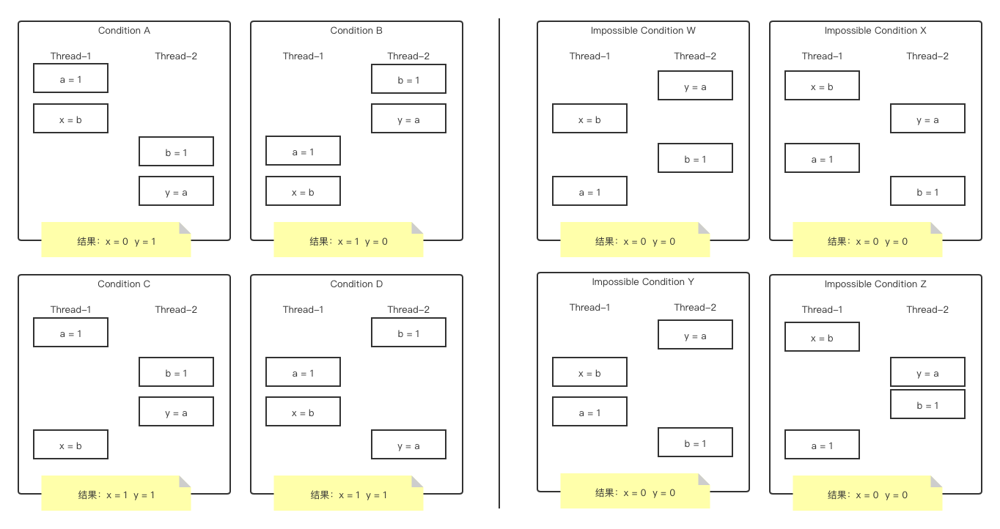
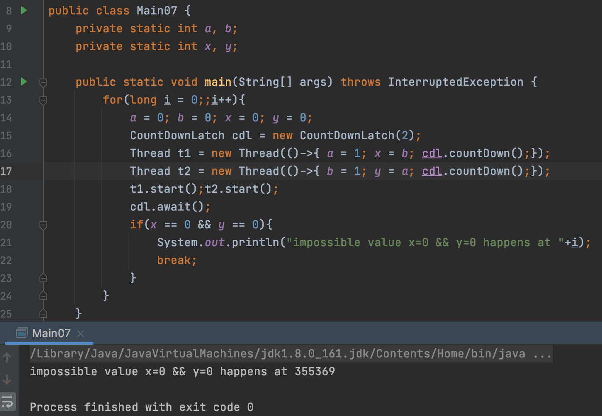
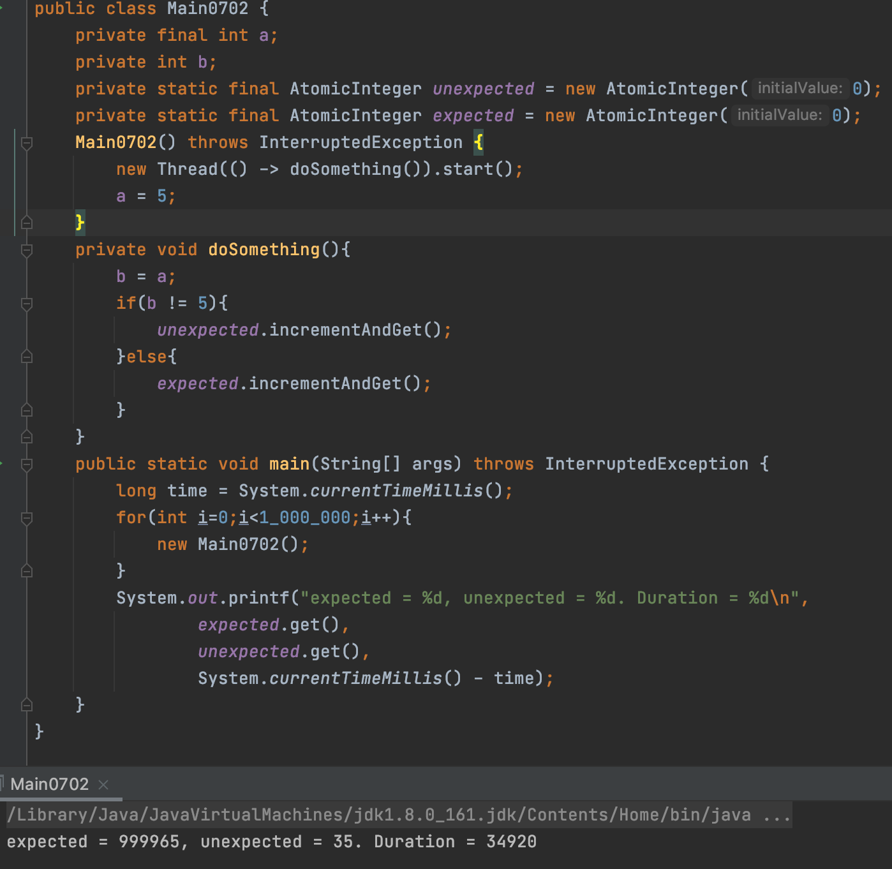

前面的文章仅仅简单提到了指令重排序。这篇文章将单独以例子的形式来展现指令重排序发生的可能性。

<!--more-->

本文的代码均可以在[我的GitHub Repository](https://github.com/discko/learnconcurrent/tree/master/basicconcurrent/src/main/java/space/wudi/learnconcurrent/basicconcurrent/test07)中查看。

# 指令重排序的测试用例

看这样一个例子：
```java
public class Main07 {
    private static int a, b;
    private static int x, y;

    public static void main(String[] args) throws InterruptedException {
        for(int i = 0;i<Integer.MAX_VALUE;i++){
            a = 0; b = 0; x = 0; y = 0;
            CountDownLatch cdl = new CountDownLatch(2);
            Thread t1 = new Thread(()->{
                a = 1; x = b;
                cdl.countDown();
            });
            Thread t2 = new Thread(()->{
                b = 1; y = a;
                cdl.countDown();
            });
            t1.start();
            t2.start();
            cdl.await();
            if(x == 0 && y == 0){
                System.out.println("impossible value x=0 && y=0 happens at "+i);
                break;
            }
        }
        System.out.println("terminated");
    }
}
```
理论上来说，根据上面的代码，在多线程下只可能有这样的几种情况：  
  
原则上应该只有左边的4种可能，所以执行结果不可能有x和y同时为0的情况。但是，经过一定的运行之后，在偶然的情况下，还是会出现x和y都为0的情况的情况：  
  
而这，只有在上图右侧的4中情况下，才可能发生。这就表示指令发生了重排序。  

# This指针的逃逸

还有一种情况，来看下面这段代码：
```java
public class Main0702 {
    private final int a;
    private int b;
    private static final AtomicInteger unexpected = new AtomicInteger(0);
    private static final AtomicInteger expected = new AtomicInteger(0);
    Main0702() throws InterruptedException {
        new Thread(() -> doSomething()).start();
        a = 5;
    }
    private void doSomething(){
        b = a;
        if(b != 5){
            unexpected.incrementAndGet();
        }else{
            expected.incrementAndGet();
        }
    }
    public static void main(String[] args) throws InterruptedException {
        long time = System.currentTimeMillis();
        for(int i=0;i<1_000_000;i++){
            new Main0702();
        }
        System.out.printf("expected = %d, unexpected = %d. Duration = %d\n",
                expected.get(),
                unexpected.get(),
                System.currentTimeMillis() - time);
    }
}
```
我们所期望的是，在new Thread中执行doSomething时，a应当是等于5的。也即最终输出的unexpected应该是0。  
但实际上，在偶然情况下，a可能还没有来得及被初始化，就在doSomething()中被调用了。  
  
可以看到，在测试了100万次后，有几十次是非预期的值。  

而发生这一现象的原因就是未完全构造完成的对象的调用（“invoking an incompletely constructed object”)。但是，这个对象是在哪里传入new Thread中的呢？  

lambda的字节码找起来比较麻烦，我们来看一下将lambda转换为匿名类：
```java
Main0702() throws InterruptedException {
    new Thread(new Runnable() {
        @Override
        public void run() {
            Main0702.this.doSomething();
        }
    }).start();
    a = 5;
}
```
然后看一看这个匿名的Runnable的实现类的字节码。首先是构造函数的签名：
```
<init>(Lspace/wudi/learnconcurrent/basicconcurrent/test07/Main0702;)V
```
看到了么，带有一个参数，类型是Main0702。然后，在看一下构造函数的执行过程：
```
0 aload_0
1 aload_1
2 putfield #1 <space/wudi/learnconcurrent/basicconcurrent/test07/Main0702$1.this$0>
5 aload_0
6 invokespecial #2 <java/lang/Object.<init>>
9 return
```
aload_0就是将这个匿名类的`this`压入栈中，aload_1就是将第1个局部变量（这里也就是参数列表中的Main0702对象）压入栈中。然后通过putfield将栈顶元素放入类内的field（名字叫做this$0)中（putfield会消费栈顶的2个元素，分别代表是哪个对象的field，以及将什么值放入这个field）。  

这样一来，就知道了，其实这相当于执行了这样一段代码：
```java
Main0702(){
    new Thread(()->this.doSomething());
    a = 5;
}
```
也即，隐式地传入了this对象。更甚者，这段代码其实是下面这段代码的语法糖：
```java

class Main0702{
    class MyRunnable implements Runnable{
        Main0702 this$0;
        MyRunnable(Main0702 this$0){
            this.this$0 = this$0;
        }
        @Override
        public void run(){
            this$0.doSomething();
        }
    }
    Main0702(){
        new Thread(new MyRunnable(this)).start();
        a = 5;
    }
    void doSomething(){
        // blabla
    }
}
```

当理解了这个过程之后，甚至在理解之前就会觉得，这不就是并发问题么？写的时候注意点就好了。确实，修正这段代码其实很简单，确保在构造确实完成之后，再执行调用this对象的方法就好了。比如：
```java
class Main0702{
    private Main0702(){
        a = 5;
    }
    private void doSomething(){ /* blabla */}

    public static Main0702 newThread(){
        Main0702 instance = new Main0702();
        new Thread(instance::doSomething).start();
        return instance;
    }
}
```
然后调用静态方法`Main0702.newThread()`就可以获得`Main0702`的新对象了。  

但是，IBM的[Java开发建议](https://www.ibm.com/developerworks/java/library/j-jtp0618/index.html#2)中给出了这样的例子：  

```java
public class EventListener { 
  public EventListener(EventSource eventSource) {
    // do our initialization
    ...
 
    // register ourselves with the event source
    eventSource.registerListener(this);
  }
  public onEvent(Event e) { 
    // handle the event
  }
}

public class RecordingEventListener extends EventListener {
  private final ArrayList list;
 
  public RecordingEventListener(EventSource eventSource) {
    super(eventSource);
    list = Collections.synchronizedList(new ArrayList());
  }
 
  public onEvent(Event e) { 
    list.add(e);
    super.onEvent(e);
  }
 
  public Event[] getEvents() {
    return (Event[]) list.toArray(new Event[0]);
  }
}
```

由于Java在构造时，必须将super写在构造函数的最开始位置，如果在父类的构造中触发了某些异步事件（比如上例中的register可能会触发某个异步的回调），而在异步实事件中如果使用了this引用，就可能因为this逸出而调用到没有完成构造的对象属性（如list对象）。  

特别是被final修饰的field。本来编译器（包括IDE）都能够提醒代码编写者，必须在初始化阶段为final字段赋值（比如类内的一个裸的普通代码块，总是在构造函数之前执行；或者在声明的同时，定义其值；或者在构造函数中为其赋值）。而现在，即便在构造函数中为final字段赋值了，但是由于this的逸出，仍然可能取到一个没有初始化的值（好在Java会为每一个没有初始化的对象赋上默认的初值，这比某些语言还是要安全一些）。  
