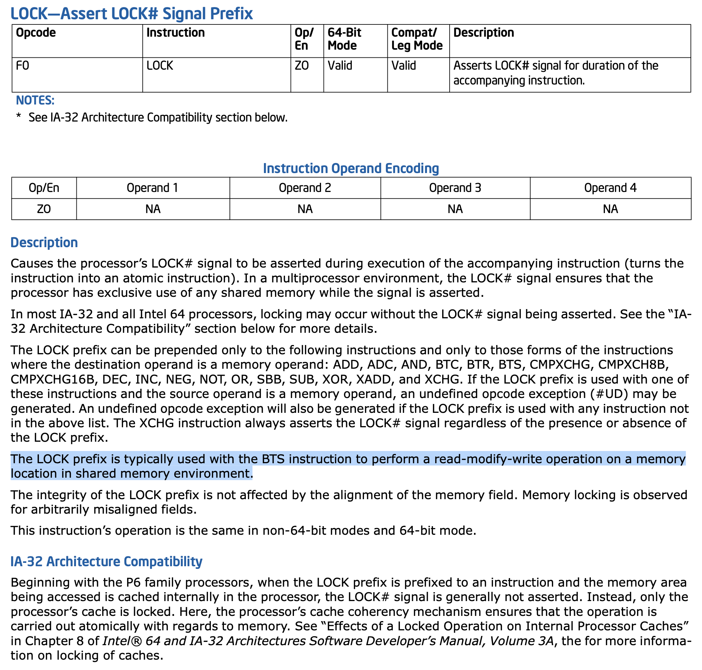
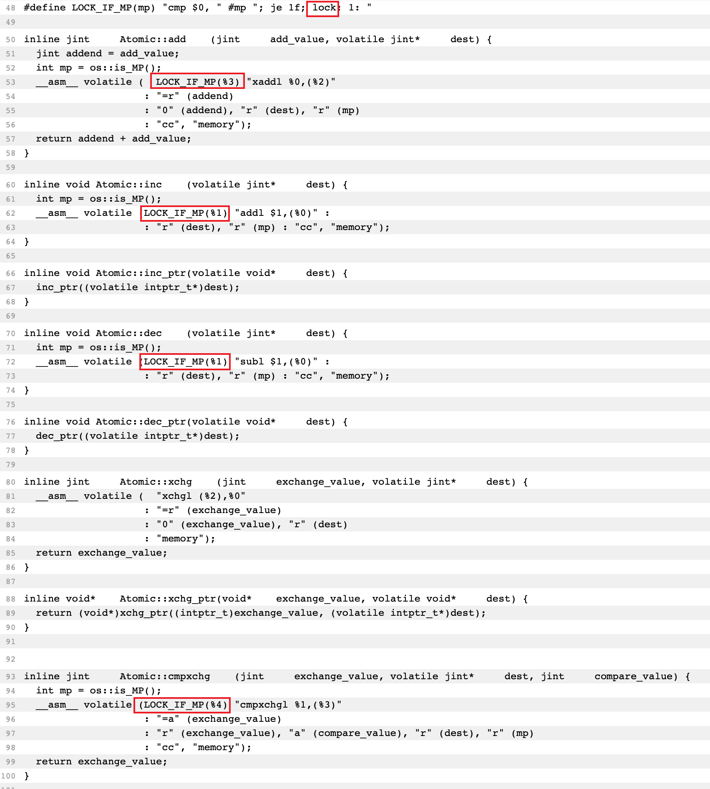
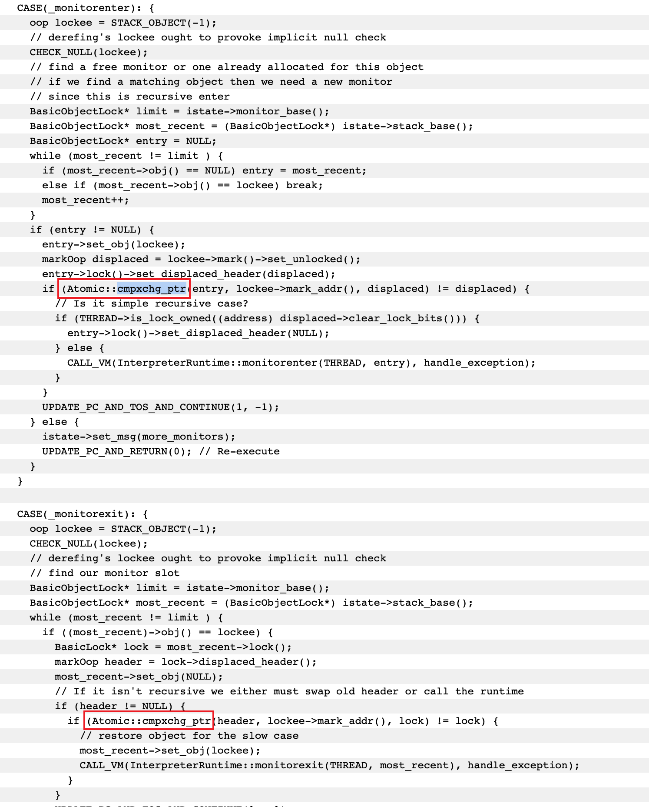

[前面的文章](/2020/12/15/Concurrent-InProcessConcurrent/)提到了volatile的底层实现是靠在CPU汇编指令上添加LOCK前缀来实现的（等同于添加内存屏障MFENCE指令）。接下来来看看具体的过程，并且根据LOCK看看还有什么也可以实现volatile相似的功能。

<!--more-->

# 源码跟踪
添加了volatile的field会在编译为字节码后，会增加一个ACC_VOLATILE属性。  
这条属性在JVM执行是，根据调用的是putfield还是getfield指令会执行这样的操作：
```cpp
// http://hg.openjdk.java.net/jdk8/jdk8/hotspot/file/87ee5ee27509/src/share/vm/interpreter/bytecodeInterpreter.cpp
// 省略了一些代码
BytecodeInterpreter::run(interpreterState istate) {
    while(1){   // 不断循环取下一个指令
        switch (istate->msg()) {
        CASE(_getfield):
        CASE(_getstatic):
          {
            if (cache->is_volatile()) {
                // volatile下，根据各种类型执行各种读操作
                if (tos_type == itos) {
                    SET_STACK_INT(obj->int_field_acquire(field_offset), -1);
                } else if (xxx) {
                    // 省略其他类型，都差不多
                }
            } else {
                // 非volatile下，根据各种类型执行各种读操作
                if (tos_type == itos) {
                    SET_STACK_INT(obj->int_field(field_offset), -1);
                } else if (xxx) {
                    // 省略其他类型，都差不多
                }
            }
            UPDATE_PC_AND_CONTINUE(3)
          }
        CASE(_putfield):
        CASE(_putstatic):
          {
            if (cache->is_volatile()) {
                // volatile下，根据各种类型执行各种读操作
                if (tos_type == itos) {
                    obj->release_int_field_put(field_offset, STACK_INT(-1));
                } else if (xxx) {
                    // 省略其他类型，都差不多
                }
                // 注意下面这一行：
                OrderAccess::storeload();
            } else {
                // 非volatile下，根据各种类型执行各种读操作
                if (tos_type == itos) {
                    obj->int_field_put(field_offset, STACK_INT(-1));
                } else if (xxx) {
                    // 省略其他类型，都差不多
                }
            }
          }
        }
    }
}
```
在JVM的interceptor（字节码解释）过程中，当getfield和putfield时，都会检查该field是否是volatile的。然后根据field的不同类型，执行不同的指令。对于int类型而言，getfield执行`int_field_acquire`方法（volatile）或`obj_field`方法（非volatile）；而putfield执行`release_int_field_put`（volatile）或`int_field_put`（非volatile）。并且在putfield的volatile情况下，各种类型的操作执行完成后，都会执行静态方法`OrderAccess::storeload()`。  

上面提到的对int类型的操作的源码如下：
```cpp
// http://hg.openjdk.java.net/jdk8/jdk8/hotspot/file/87ee5ee27509/src/share/vm/oops/oop.inline.hpp
// getfield with volatile
inline oop oopDesc::obj_field_acquire(int offset) const {
  return UseCompressedOops ?
             decode_heap_oop((narrowOop)
               OrderAccess::load_acquire(obj_field_addr<narrowOop>(offset)))
           : decode_heap_oop((oop)
               OrderAccess::load_ptr_acquire(obj_field_addr<oop>(offset)));
}
// getfield without volatile
inline oop oopDesc::obj_field(int offset) const {
  return UseCompressedOops ?
    load_decode_heap_oop(obj_field_addr<narrowOop>(offset)) :
    load_decode_heap_oop(obj_field_addr<oop>(offset));
}
// putfield with volatile
inline void oopDesc::release_int_field_put(int offset, jint contents) {
    OrderAccess::release_store(int_field_addr(offset), contents);
}
// putfield without volatile
inline void oopDesc::int_field_put(int offset, jint contents) {
    *int_field_addr(offset) = contents;
}
```
可以看到，对volatile的field进行操作时，也同样会调用`OrderAccess`下的静态方法。OrderAccess会根据不同的系统和CPU有不同的实现。下面的是Linux_x86的实现：
```cpp
// http://hg.openjdk.java.net/jdk8/jdk8/hotspot/file/87ee5ee27509/src/os_cpu/linux_x86/vm/orderAccess_linux_x86.inline.hpp  
// volatile getfield中调用的OrderAccess::load_acquire(jint*)
inline jint OrderAccess::load_acquire(volatile jint* p) {
    return *p;
}
// volatile putfield中调用的
inline void OrderAccess::release_store(volatile jint* p, jint v) {
    *p = v;
}
// putfield中都会调用的OrderAccess::storeload()
inline void OrderAccess::storeload()  { fence(); }
inline void OrderAccess::fence() {
  if (os::is_MP()) {
    // always use locked addl since mfence is sometimes expensive
#ifdef AMD64
    __asm__ volatile ("lock; addl $0,0(%%rsp)" : : : "cc", "memory");
#else
    __asm__ volatile ("lock; addl $0,0(%%esp)" : : : "cc", "memory");
#endif
  }
}
```
从这里就能看出来，无论是getfield还是putfield，对不同类型的操作指令种都是直接获取值或修改值的。但是在putfield的volatile分支中，最后会执行一条内联汇编：

内联汇编的基本语法是：
```cpp
__asm__ 修饰符 (汇编指令:输入参数:输出参数:被更改资源列表)
```

所以上面的汇编的大致意思就是：  
请不要随意优化调整我的汇编（volatile）；   
请执行语句“lock; addl $0,0(%%rsp)”；  
在次过程中会修改标志寄存器（“cc”），请输入和输出操作数执行内存读取或写入操作（“memory”）。  

这里的`addl $0,0(%%rsp)`本身是没有意义的（寄存器`rsp`自增立即数0）。

通过翻阅资料，在单处理器的情况下，CPU都是线性执行指令的。但是在多处理器情况下，单条指令对内存的读或写都可能因为其他寄存器的写而造成干扰。因此需要通过lock指令，让其他CPU暂时无法对内存进行。  
而根据Inter的`Inter 64`和`IA32`指令手册（可以[在这里下载](https://software.intel.com/content/www/us/en/develop/download/intel-64-and-ia-32-architectures-sdm-combined-volumes-1-2a-2b-2c-2d-3a-3b-3c-3d-and-4.html)），lock指令与其他BTS指令一起，在共享内存的环境下，能够对内存地址进行“读取-修改-写入”。（在第3-568页，Vol. 2A）  

> perform a read-modify-write operation on a memory location in shared memory environment.  



正是因为添加了Lock指令前缀，才让volatile能够在对某个共享变量（对应于共享的内存地址）修改后，立即放回内存中（而不是保存在自己的工作内存中）。这样，就可以利用CPU的无效化队列，在其他线程访问该共享变量在自己线程内的工作空间中的缓存时，知晓缓存已经失效了，直接去内存重新读取。进而达到可见性的目的。  

而被Lock的那条指令（`addl $0,0(%%rsp)`），其实换成其他没有副作用的指令也可以，至于为什么不直接使用`NOP`指令，从手册中对LOCK的解释来看，应该是NOP不支持加LOCK前缀。

所以总结下来就是JVM在解释字节码时，当发现对volatile进行写操作时，会对其设立StoreLoadFence，而StoreLoadFence通过内联汇编加LOCK前缀，强制刷新内存。  

与此同时，使用Lock更主要的目的是利用Lock与mfence基本等价，但能避免一些情况下mfence的代价较高的问题。mfence指令是用作形成内存屏障，阻止其前后代码重排序的CPU指令。  
所以从这个角度来说，不知道应该数volatile在阻止指令重排序的同时，顺便完成了共享变量对各线程可见的需求；还是要说CPU的指令在设计时就将阻止指令重排与内存刷新的功能放在了一起。  

# 额外的发现
在查阅源码的过程中，发现了一些比较有意思的东西。

1. Atomic类的底层实现中，大多都添加了Lock前缀（见[HotSpot源码](http://hg.openjdk.java.net/jdk8/jdk8/hotspot/file/87ee5ee27509/src/os_cpu/linux_x86/vm/atomic_linux_x86.inline.hpp)）  
  
2. monitorenter和monitorexit调用了Atomic::cmpxchg（见[HotSpot源码](http://hg.openjdk.java.net/jdk8/jdk8/hotspot/file/87ee5ee27509/src/share/vm/interpreter/bytecodeInterpreter.cpp)）  


根据上面这两条，我们可以推导出，使用了以下的任意操作，都可以保证共享变量的线程间可见性，同时保证前后操作的有序性：  

1. 使用Unsafe类下的各种原子操作
2. 进入和离开synchronized代码块  

由此，我们可以尝试一下下面的代码（代码位于[我的GitHub仓库](https://github.com/discko/learnconcurrent/blob/master/basicconcurrent/src/main/java/space/wudi/learnconcurrent/basicconcurrent/test06/Main06.java)中）：

```java
public class Main0204 {
    static class MyAction{
        /*volatile */boolean flag = true;
        Lock lock = new ReentrantLock();
        StringBuffer stringBuffer = new StringBuffer();
        StringBuilder stringBuilder = new StringBuilder();
        LinkedList<Integer> list = new LinkedList<>();
        LinkedBlockingDeque<Integer> lbq = new LinkedBlockingDeque<>();
        AtomicInteger integer = new AtomicInteger(1);
        int a;
        void fun1() {
            System.out.println(Thread.currentThread().getName()+" fun1 loop started");
            while (flag) {
//                lock.lock(); lock.unlock();
//                Thread.yield();
//                stringBuffer.append("a");
//                stringBuilder.append("a");
//                list.add(1);
//                lbq.add(1);
//                integer.addAndGet(1);
//                a++;
//                System.out.println("running");
            }
            System.out.println(Thread.currentThread().getName()+" fun1 loop stopped");
        }

    }
    public static void main(String[] args) {
        MyAction a = new MyAction();
        Thread t = new Thread(a::fun, "Thread-1");
        t1.start();
        try {
            TimeUnit.MILLISECONDS.sleep(100);
        } catch (InterruptedException e) {
            e.printStackTrace();
        }
        a.flag = false;
//        System.out.println("change a1.flag to " + a1.flag1);
    }
}
```
在线程内通过一个field `flag`来控制while循环。同时`flag`也可以在线程外被访问，也就是说`flag`是在线程间共享的。如果声明`flag`为`volatile`的，那毫无疑问MainThread中的修改对Thread-1是可见的。  
那么上面的那些推论是否成立呢？  

于是，将`flag`的`volatile`去掉，并添加了各种测试对象，在循环中执行，可以发现：  
使用了`ReentrantLock#lock()`（在竞争锁时使用了CAS操作）和`AtomicInteger#addAndGet(int)`（在设值时使用了CAS操作）、`LinkedBlockingDeque#add(T)`（方法中调用了`ReentrantLock#lock()`）等通过Unsafe中的方法进行操作的测试用例，是可以发现flag的变化的。  
使用了`StringBuffer#append(String)`（方法被声明为synchronized）、`PrintStream#println(String)`（方法中包含synchronized块）的测试用例，是可以发现flag的变化的。  

同时也发现，`LinkedList#add(T)`和`a++`是无法发现flag的变化的。  
这与预期是一致的。  

当然，仍然有一个问题，为什么`StringBuilder.append(String)`也可以。通过查看jdk的源码发现其底层调用了`System.arraycopy`方法：
```java
// java.lang.String#getChars(int, int, char[], int)
public void getChars(int srcBegin, int srcEnd, char dst[], int dstBegin) {
    // 省略校验
    System.arraycopy(value, srcBegin, dst, dstBegin, srcEnd - srcBegin);
}
```
在jvm的源码中，这个方法最终调用了
```cpp
void Copy::conjoint_memory_atomic(void* from, void* to, size_t size) {
    address src = (address) from;
    address dst = (address) to;
    uintptr_t bits = (uintptr_t) src | (uintptr_t) dst | (uintptr_t) size;

    if (bits % sizeof(jlong) == 0) {
        Copy::conjoint_jlongs_atomic((jlong*) src, (jlong*) dst, size / sizeof(jlong));
    } else if (bits % sizeof(jint) == 0) {
        Copy::conjoint_jints_atomic((jint*) src, (jint*) dst, size / sizeof(jint));
    } else if (bits % sizeof(jshort) == 0) {
        Copy::conjoint_jshorts_atomic((jshort*) src, (jshort*) dst, size / sizeof(jshort));
    } else {
        // Not aligned, so no need to be atomic.
        Copy::conjoint_jbytes((void*) src, (void*) dst, size);
    }
}
```
可以看到，如果目标地址和源地址可以被jlong对齐，那么就用`Copy::conjoint_jlongs_atomic`拷贝（以jlong为单位64bits）；如果能被jint对其，那么就用`Copy::conjoint_jint_atomic`拷贝（以jint为单位32bits）；如果能被jshort对其，那么就用`Copy::conjoint_jshorts_atomic`拷贝（以jshort为单位32bits）；无法对齐那么就1字节1字节地通过`Copy::conjoint_jbytes((void*) src, (void*) dst, size)`拷贝。  
可以看到，除了最后一个，名字里都带有“atomic”，猜想也是运用了原子操作，但是源码艰深，实在看不下去了。于是做了个实验，在`while(flag)`中单独执行`System.arraycopy`，发现依然可以观察到flag的变化。这样来看的话，StringBuilder虽然不是线程安全的，但是在底层也依然会因为字符拷贝而意外使用内存屏障。  
`StringBuilder#append(char)`同样也是一样的，别看只添加了1个char进去，但是因为StringBuilder内部的`char[] value`数组在扩容时，也会通过`Arrays.copyOf`调用到`System.arraycopy`，所以依然能够发现flag的变化。  
最后，尝试使用`Builder#setCharAt(int, char)`，终于无法发现flag的变化了。  


差一点忘记了，上面的测试用例中还有一个是`Thread.yield()`。这个同样能够发现flag的变化。其原因应该与线程切换强制缓存失效（强制刷新缓存）有关。

# 一朵疑云
当然在测试中，还发现了一个我解释不了的现象，那就是关于try-catch的。
```java
void funWithTryCatch(){
    System.out.println(Thread.currentThread().getName()+" funWithTryCatch loop started");

    while (flag) {
        try{
            // do nothing -> cannot stop
//            throw new Exception();    // throw a exception -> stopped
//            a++;                      // a++ -> cannot stop
            list.add(1);                // some
        }catch(Exception e){
//            a++;
            list.add(1);
//        }finally {
//            a++;
//            list.add(1);
        }
    }
    System.out.println(Thread.currentThread().getName()+" funWithTryCatch loop stopped");
}
```
当我使用throw exception进行测试时，即使catch中什么都不做，也能发现flag的变化。  
当我使用a++进行测试时，在try、catch、finally这3个代码块中的任意1个或几个或全部中，添加了a++，都无法发现flag。这也很符合预期。  
但是，当我使用list.add(1)进行测试时，同样是try、catch、finally这3个代码块，当且仅当try和catch中存在list.add(1)时（finally中有没有都不影响这个现象），能够发现flag的变化，但仅有1个时是无法发现flag变化的。  
这一点很迷，留作以后有缘再来解答。
