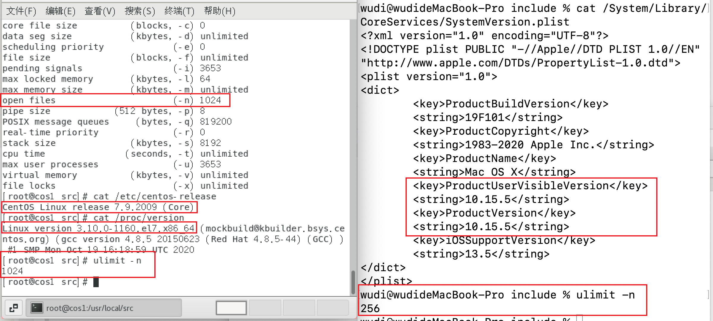
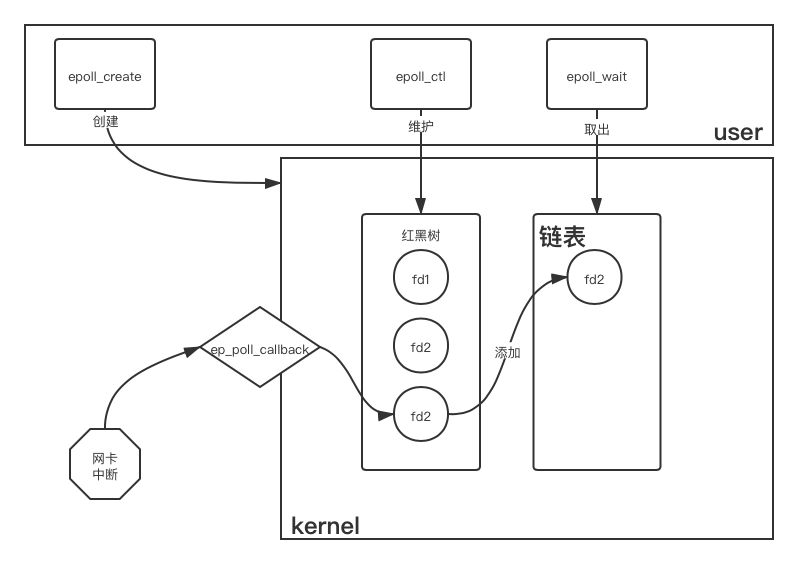

在[学习缓存的时候](2021/01/02/Cache-01Basic/)，简要认识了一下IO的变迁史。在这篇文章中，将详细介绍一下各个历史阶段中IO的变迁过程。

<!--more-->

对于UNIX系统来说，“一些皆文件”，无论是是一个txt文件、一个文件夹、一个磁盘、一个光驱、一个网络URL、一个鼠标、一个打印机，这些在UNIX的用户眼中，统统都是“文件”。也因此，这些“文件”通过`open`、`read`、`write`、`close`等操作，就可以进行基础甚至全部访问操作。一个普通的文本文件可以打开、读取、写入、关闭，一个打印机可以打开（连接）、读取（查看打印列表）、写入（打印）、关闭（断开连接），一个网络URL可以打开（连接）、读取（下载）、写入（上传/发送）、关闭（断开连接）。从这种层面上来说，UNIX的一切皆文件是一种面向接口编程的实践，对于大部分而言，这些接口传输的都是字节流。    
Windows其实也是类似的，底层大多也将各类抽象为文件，无论是串口、键盘等，都可以利用ReadFile和WriteFile进行操作。只不过为了更好的可读性，再上层再次封装，变成了各种不同的设备、对象。  

在Linux系统中，设备的驱动注册后，当有相关的设备被创建，就将注册的驱动对象写入Linux的`inode`中。在open时将驱动中的read、write等函数放入`file`结构体中的`file_operations`中，并返回file结构体的索引file descriptor（也就是fd）。这样当通过fd调用read、write等指令时，通过`file_operations`就可以调用到驱动中的各个方法了。（相关结构体可以参见[这篇文章](https://www.linuxidc.com/linux/2017-02/140227.htm)）  

因为操作系统的资源是有限的，如果不对访问进行区分，可能会造成访问间的冲突。Inter的X86架构划分了R0~R3特权等级，R0权限最高，R3权限最低。Linux通常使用R0和R3，R0就是内核态，R3就是用户态。当在用户态下调用内核态的方法时，就需要从用户态切换到内核态。所以上面提到的IO操作就涉及到了用户态向内核态的切换。这个过程相对比较占用资源，因为需要将用户态的上下文保存下来，完事还要恢复现场，同时由于内核不信任用户，还需要做一些校验和检查，零零总总的操作有可能比实际执行的函数耗时还要长。在IO密集的情况下，这个损耗是不可容忍的。  

正因如此，在IO的变迁，就是在不断降低阻塞的时间，减少开销，提高程序的执行效率。

# 阻塞/非阻塞与同步/异步
首先需要明确几个概念。什么是阻塞与非阻塞，什么是同步与异步。  
我们知道，读取一个IO端口，有2步。首先是检查有无数据就绪，可以读取；然后是将就绪的数据从内核中拷贝到用户空间中。  
检查有无数据就绪这个过程可以是阻塞的，也就是一直等待，直到有数据就绪；也可以是非阻塞的，也就是发现没有数据就绪，就先去执行别的事情，稍后再来检查。  
将数据从内核拷贝到用户控件，可以是与用户的其他指令同步的，也就是拷贝完成了再执行其他的执行；也可以是异步的，也就是一边拷贝，一边用户执行其他的指令。  

举一个不太恰当的例子，对于烧水的这个过程，将水在烧水壶中烧开，然后倒入热水壶中备用。如果使用普通的烧水壶，我不知道水什么时候开，如果一直观察水开了没有，直到水开了倒出热水，再做其他的事情，这就是阻塞同步的。如果我时不时过来看一眼水开了没有，没开的话我就先去做别的事情，但是当水开了我还是要停下其他的工作把开水倒出来，这就是非阻塞同步的。如果我买的是一个高科技热水壶，我只需要给它下一个烧水的指令，烧好了之后它能自动倒出热水到热水壶中，而我在此期间可以去左点其他的事情，这就是非阻塞异步的。在这个例子中，开水就是我需要的数据，烧水壶就是内核态的容器，检查水开了没有就是检查数据是否就绪，将开水从烧水壶倒入热水壶就是将数据从内核中拷贝到用户空间。  

# BIO——Blocking IO

最初的IO是完全阻塞的同步的。这就是BIO。
在Java中，最简单的写法就是各种XXXInputStream和OutputStream。常见的有`FileInputStream`、`ChannelInputStream`、`SocketInputStream`等等。

既然是Blocking IO，那么它在inputStream.read处就是阻塞的，直到数据准备完成才会返回。这在文件系统上不是很明显，但是在socket上就非常明显了。相关代码就不展示了，很基础。  

这里需要说的是用户态与内核态的切换造成的性能损耗。我们假设有10个字符需要通过write写入文件。如果我1个字符1个字符的调用write，那么需要调用10次，需要进行10次“用户态-内核态-用户态”的切换。但是如果我一次性将10个字符都交给内核，那么就只需要进行1次“用户态-内核态-用户态”的切换。可以想见后者的效率理论上应该更高。  

Java的BufferedOutputStream就是后一种想法的实现。我们可以做一个实验。不过上面的说法是相同的数据比较时间长短，要准备一个大文件比较麻烦，这里反过来，相同时间比较数据写入的速度。  
以下代码位于我的[github仓库learnIO中](https://github.com/discko/learnio/tree/master/io/src/main/java/space/wudi/learnio/io)
```java
// TestBioBuffer.java
public class TestBioBuffer {
    private static volatile boolean flag;
    private static final int delay = 5000;  // delay 5 seconds
    public static void main(String[] args) throws IOException {
        test(1);
        test(10);
        test(100);
        test(8*1024);
        test(16*1024);
        test(24*1024);
    }
    private static void test(int bytesEachTime) throws IOException {
        // write bytesEachTime bytes at once with and without buffer
        System.out.println("------------test "+bytesEachTime+" bytes each time");
        byte[] data = getData(bytesEachTime);
        Timer timer1 = startTimer();
        testWithoutBuffer("/tmp/WithoutBuffer.txt."+bytesEachTime, data);
        timer1.cancel();
        Timer timer2 = startTimer();
        testWithBuffer("/tmp/WithBuffer.txt."+bytesEachTime, data);
        timer2.cancel();
    }
    // create and start a timer to stop the loop after delay
    private static Timer startTimer(){
        flag = true;
        Timer timer = new Timer();
        timer.schedule(new TimerTask() {
            public void run() { flag = false; }
        }, delay);
        return timer;
    }
    private static byte[] getData(int len){
        byte[] bytes = new byte[len];
        for(int i=0;i<len;i++){
            bytes[i]='a';
        }
        return bytes;
    }
    private static void testWithoutBuffer(String filename, byte[] data) throws IOException {
        // directly use FileOutputStream, without buffer
        try (FileOutputStream fos = new FileOutputStream(filename)){
            while (flag) {
                fos.write(data);
            }
            fos.flush();    // force flush to disk
        }
        // check file size
        System.out.println("output without buffer done. size = " + new File(filename).length());
    }
    private static void testWithBuffer(String filename, byte[] data) throws IOException {
        // use a buffered OutputStream to output to file
        // 2nd parameter of new BufferedOutputStream is buffer size, default is 8192B
        try(BufferedOutputStream bos = new BufferedOutputStream(new FileOutputStream(filename)/*, 16*1024*/)) {
            while (flag) {
                bos.write(data);
            }
            bos.flush();    // force flush to dist
        }
        // check file size
        System.out.println("output with buffer done.    size = " + new File(filename).length());
    }
}
```

首先是默认buffer大小的情况下（8k）： 

> ------------test 1 bytes each time
output without buffer done. size = 1696000
output with buffer done.    size = 236268904
------------test 10 bytes each time
output without buffer done. size = 19415060
output with buffer done.    size = 2902987640
------------test 100 bytes each time
output without buffer done. size = 158360000
output with buffer done.    size = 4002388300
------------test 4096 bytes each time
output without buffer done. size = 3118297088
output with buffer done.    size = 4433104896
------------test 8192 bytes each time
output without buffer done. size = 5410914304
output with buffer done.    size = 5402279936
------------test 16384 bytes each time
output without buffer done. size = 7075823616
output with buffer done.    size = 6856409088

然后是buffer大小为16k的情况下：  

>------------test 1 bytes each time
output without buffer done. size = 2017573
output with buffer done.    size = 240117056
------------test 10 bytes each time
output without buffer done. size = 19067480
output with buffer done.    size = 3281763900
------------test 100 bytes each time
output without buffer done. size = 161144400
output with buffer done.    size = 5610525300
------------test 8192 bytes each time
output without buffer done. size = 4813963264
output with buffer done.    size = 6567288832
------------test 16384 bytes each time
output without buffer done. size = 6554075136
output with buffer done.    size = 6761381888
------------test 24576 bytes each time
output without buffer done. size = 7432421376
output with buffer done.    size = 6854615040

可以看到，在每一次输出的数量很少的情况下，BufferedOutputStream的效率是很高的。如果每次输出1个字节，BufferedOutputStream的速度甚至可以达到FileOutputStream的100倍（应该与硬盘也有关系）。  
但随着单次输出的大小的提高，当达到与buffer size接近时，BufferedOutputStream的优势不再，反而因为不断地将数据复制到buffer中，反而浪费了不少的时间。  
当单次输出的数量超过buffer size时，因为封装的层次和调用栈的加深，BufferedOutputStream反而落了下风。  

从BufferedOutputStream.write的源码中也可以看出来它的取舍：
```java
// java.io.BufferedOutputStream
public synchronized void write(byte b[], int off, int len) throws IOException {
        if (len >= buf.length) {
            // 当要输出的大小超过本身buffer的大小时
            // 不经过buffer中转，直接输出
            flushBuffer();
            out.write(b, off, len);
            return;
        }
        if (len > buf.length - count) {
            flushBuffer();
        }
        // 将数据复制到buffer中
        System.arraycopy(b, off, buf, count, len);
        count += len;
    }
```


先看看网络连接在Linux系统API层面上是如何完成的。  
首先需要明确的是，在底层的系统API上，网络IO大致遵循“创建服务程序的文件描述符`serverFd`”→“将IP与端口bind到服务程序上”→“将进程修改为listen状态，开始监听”→“通过accept获取客户端连接的文件描述符`clientFd`”。也即`socket()`、`bind()`、`listen()`、`accept()`。  
当有客户端连接过来后，`accept()`就会返回该客户端对应的文件描述符`clientFd`。接下来对`clientFd`进行读写操作，就对应着从客户端读取数据与向其发送数据了。
```cpp
int serverBlocked(struct sockaddr_in* serverAddr, int backlog){
    int serverFd;
    if((serverFd = socket(PF_INET, SOCK_STREAM, 0)) < 0){   // 创建ServerSocket的文件描述符
        error(); return -1;
    }
    if(bind(serverFd, serverAddr, sizeof(*address)) < 0){   // 绑定IP和端口
        error(); return -2;
    }
    if(listen(serverFd, backlog) < 0){  // 开始监听
        error(); return -3;
    }
    struct sockaddr_in clientAddr;
    socklen_t clientAddrLen = sizeof(clientAddr);
    int clientFd = accept(serverFd, &clientAddr, &clientAddrLen);
    // 阻塞直到客户端连接过来，或发生错误
    while(1){
        if(clientFd < 0){
            error(); break;
        }
        char  buff[4096];
        int readSize = recv(clientFd, buff, MAXLINE, 0);
        // 阻塞直到客户端数据到达
        buff[n] = '\0';
        printf("received from client: %s\n", buff);
        close(clientFd);
    }
    close(serverFd);
    return 0;
}
```

系统API写起来比较麻烦，通过Java来写看上去就比较清晰了：
```java
ServerSocket server = new ServerSocket();
Socket client = server.accept();    // 阻塞
client.getInputStream().read();     // 阻塞
```

无论是在accept处还是在recv处，都会发生阻塞。  
所以经典的做法是，为每一个Socket连接创建一个线程，在线程中进行IO，这样就不会阻塞其他的连接了：
```java
ServerSocket server = new ServerSocket();
while(true){
    Socket client = server.accept();
    new Thread(new ClientHandler(client)).start();
}
```
当然这仍然会存在问题。最显著的问题就是C10K问题，也就是单机1万客户端连接的瓶颈。  
首先可以估算一下，在JVM中，通常我们会给-Xss参数设置为128k到1M不等，也就是每个线程的Thread Stack空间大小，这一块是每个线程的固定开销。那么，当有1万个连接并发，为它们创建1万个线程，这就是1G到10G的开销。这个问题是1999年提出来的，当时的计算机还是32位，理论内存上限是4GB。可以想见，通过这样的IO模型，是很难突破万级连接的。  

如果在IO读写时，没有数据就直接返回，而不是阻塞住，时不时地去查询一下有没有可读的端口，再进行对应的处理，哪怕实时性稍差一点，但每一个线程就可以应对多数的连接了。  

# NIO——Non-blocking IO

于是，非阻塞IO就诞生了。下面先简单展示一下Linux系统提供的api，介绍一下集中NIO方式的变迁过程和特点、原理。然后再用java.nio包下的工具编写Java下的非阻塞IO用例。

## 最基本的非阻塞IO

```cpp
int serverNonblocked(struct sockaddr_in* serverAddr, int backlog){
    int serverFd;
    if((serverFd = socket(PF_INET, SOCK_STREAM, 0)) < 0){
        error(); return -1;
    }

    int flags = fcntl(sockfd, F_GETFL, 0);  //获取flags。
    fcntl(sockfd, F_SETFL, flags | O_NONBLOCK); //设置成非阻塞模式；

    if(bind(serverFd, serverAddr, sizeof(*address)) < 0){   //绑定IP与端口
        error(); return -2;
    }
    if(listen(serverFd, backlog) < 0){  // 开始监听
        error(); return -3;
    }
    struct sockaddr_in clientAddr;
    socklen_t clientAddrLen = sizeof(clientAddr);
    while(1){
        int clientFd = accept(serverFd, &clientAddr, &clientAddrLen);
        // 不会阻塞，没有连接会返回-1
        if(clientFd < 0){
            continue;
        }
        while(1){
            char  buff[4096];
            int readSize = recv(clientFd, buff, MAXLINE, 0);
            // 不会阻塞，没有收到数据返回-1
            if(readSize < 0){
                continue;
            }
            buff[n] = '\0';
            printf("received from client: %s\n", buff);
            close(clientFd);
            break;
        }
        close(serverFd);
        break;
    }
    return 0;
}
```
当然，这里都仅仅展示创建1个服务端口，在接收了1个客户端发过来的1次数据后就断开连接。如果要单端口应对多个客户端，在一个线程里非阻塞式读写数据，写起来还是比较麻烦了。  

## 利用select完成多客户端轮询
针对普通的方式在多客户端情况下，通过单线程方式编程较为复杂的情况，Linux提供了一组以select函数为核心的API组。  
具体而言，针对该进程，每一个客户端的连接都会为其创建一个File Descriptor文件描述符（这个在上面的阻塞代码中也同样有体现），而这个FD的范围总是有限的，而且通常都是连续申请的。比如我的macOS 10.15.5在默认情况下就是256（ulimit -n)，而我CentOS 7.9（内核版本4.9.）的虚拟机中，最大FD就是1024：  
  
所以select利用一个bitmap就能够通过几个字节将这些FD存储起来。  

比如如果我有6个fd，分别是0、3、4、5、6、7，我就只需要1个byte就能存储下来（`高11111001低`）。而如果我有3个fd，分别是3和17，那我就需要3个字节（`高00000010 00000000 00001000低`）。
接下来，来看看select函数怎么使用：
```cpp
int
    select(
         int nfds,                          // fd的最大值+1
         fd_set *restrict readfds,          // 可读fdset
         fd_set *restrict writefds,         // 可写fdset
         fd_set *restrict errorfds,         // 异常fdset
         struct timeval *restrict timeout   // 超时时间
    ); 
```
这是这个函数的定义。其返回值是各个传入的fdset中就绪的fd的个数。而参数中的类型fd_set就是上面提到的bitmap，其底层其实就是一个long型的数组。各参数的含义如下：  

* nfds：表示的是这个fd的bitmap中，select应当从低位到高位遍历的次数（比如上面0、3、4、5、6、7这个例子，虽然1和2这两个fd不存在，但是因为穿插在里面，也需要遍历，所以从0到7，一共遍历8次，这个例子中nfds就是8），换句话说，就是这些fd中的最大的值+1。需要注意，这里不是fd的个数+1，而是fd的最大的值+1。  
* readfds、writefds、errorfds：分别是交给select去处理判断“可读”、“可写”、“有异常”的fd的bitmap。  
* timeout：用于控制select本身的阻塞时间，如果为NULL则永久阻塞，否则可以通过timeval结构体设置秒值和毫秒值。  

同时，select也提供了几个宏定义，来方便对fd的bitmap的操作。比如如果要将fd_1放入fdset中，则执行FD_SET(fd_1, &fdset)。相关宏如下：
```cpp
void FD_SET(int fd, fd_set* fdset)  // 将fd加入fdset
void FD_CLR(int fd, fd_set* fdset)  // 将fd移出fdset
int FD_ISSET(int fd, fd_set* fdset) // 判断fd是否在fdset中
void FD_ZERO(fd_set* fdset)         // 清空fdset
void FD_COPY(fd_set* src, fd_set* dst)  // 复制fdset
```

需要注意的是，select的参数readfds、writefds、errorfds既是入参，也是出参。这几个参数除了告知select，要去判断在置为1的对应的fd的状态，还会根据这个fd的状态对fdset中的这个位进行置位或者清零。这样，在select返回后，就可以直接遍历readfds（或writefds、errorfds），看看哪些位现在是1，就表示对应的fd现在是“可读”（或“可写”、“有异常”）的。  

正因如此，在每一轮select之后，都应当重新设置各个fdset，因为它们已经被select修改了。  

下面是一个利用select的简单例子：
```cpp
int serverWithSelect()(struct sockaddr_in* serverAddr, int backlog){
    fd_set fds; // 用来保存所有接入的fd, 自动初始化
    // int maxFd = 0;  // 记录最大的fd的值

    int serverFd;
    if((serverFd = socket(PF_INET, SOCK_STREAM, 0)) < 0){
        error(); return -1;
    }
    FD_SET(serverFd, fds);  // serverFd同样也是1个fd，待会儿如果发现它可读，就说明有新的客户端连接

    int flags = fcntl(sockfd, F_GETFL, 0);  //获取flags。
    fcntl(sockfd, F_SETFL, flags | O_NONBLOCK); //设置成非阻塞模式；
    if(bind(serverFd, serverAddr, sizeof(*address)) < 0){
        error(); return -2;
    }
    if(listen(serverFd, backlog) < 0){
        error(); return -3;
    }
    // 下面开始死循环
    fd_set readfds; // 例子中仅考虑read ready的情况
    char buff[4096];// 准备1个buffer用于接收数据
    while(1){
        readfds = fds;   // 恢复readfds
        int n = select(FD_SETSIZE, &readfds, /*writefds*/NULL, /*errorfds*/, /*timeout*/NULL);
        if(n < 0){  // 发生错误
            error(); break;
        }else if(n == 0){   // 没有就绪连接
            continue;
        }else{  // 存在就绪连接
            for(int fd=0;fd<FD_SETSIZE;fd++){    // 遍历所有的fd
                if(FD_ISSET(fd, &readfds)){  // 如果fd可读
                    if(fd == serverFd){
                        // 如果fd是serverFd，说明有新客户端创建连接
                        struct sockaddr_in clientAddr;
                        socket_len clientAddrLen = sizeof(clientAddr);
                        int clientFd = accept(fd, &clientAddr, &clientAddrLen);
                        // 将clientFd放入fds中
                        FD_SET(clientFd, fds);
                    }else{
                        // 客户端连接可读
                        int recvs = recv(fd, buff, MAXLINE, MSG_WAITALL);
                        if(recvs <=0){
                            // 获取的字节数小于0，说明发生了异常
                            // 获取的字节数等于0，说明客户端close
                            close(fd);
                            FD_CLR(fd, &fd_set);
                        }else{
                            // 获取的字节数大于0，读取到了数据
                            buff[recvs] = '\0';
                            prinf("client msg: %s\n", buff);
                            // send(fd, xxx, xxx, xxx); 响应
                        }
                    }
                }
                // next fd
            }
        }
        // next time select
    }
    // 当select发生错误，退出
    close(serverFd);
    return -4;
}
```
在上面的代码中，本来是用了一个变量maxFd用于记录当前最大的fd。但考虑到移出断开的客户端连接后，需要重新遍历来获得新的maxFd，比较麻烦，就直接使用了系统内置的FD_SETSIZE。  

在mac上这个值是1024，在CentOS上，根据`/usr/include/bits/typesizes.h`中的定义也是1024。  

所以从这个角度来说，使用select反而限制了并发量不能超过FD_SIZE。在上限上面，反而低于了C10K问题。  

而且，由于循环是运行在用户态，而select运行于内核态，每一次将fd_set在用户态与内核态间来回复制（1024位的话，就是128B，read、write、error三个fd_set就是384B），看上去不是很大，但是性能的提升不就是一点一滴地提高的么。  

总结一下，select的优缺点：

* 优点：简单化了单线程对多个客户端连接的轮询和数据处理
* 缺点：
    1. 存在监听客户端上限（由FD_SETSIZE限制）
    2. 每次都需要将fd_set在用户态与内核态之间来回复制
    3. select返回后，用户态中需要遍历整个fdset，检查对应的fd是否可以操作
    3. 根据源码，do_select时总是会将所有的fd全都遍历一遍才会判断是否满足返回条件

源码我就不去分析了，可以参考[这一篇文章](https://blog.csdn.net/weixin_42462202/article/details/95315926)，而且我相信不同的内核版本、不同的UNIX发行版，具体的实现应该都会有一些差异。  

至于FD_SETSIZE被设置为1024的原因，我没有找到特别靠谱的说法，在CentOS 7 的`/usr/include/linux/posixtypes.h`中找到这样一句话，大意就是1024已经够用了。考虑到select诞生于1990s，姑且就相信它吧，因为后来诞生的技术都大大突破了这个限制，也就没有了修改的动力。而且，由于系统内核中总是会遍历从0开始的所有fd编号，如果FD_SETSIZE过大的话，遍历的大多数fd都是没有启用的，那何尝不是一种性能损耗呢。

> /*
 * This allows for 1024 file descriptors: if NR_OPEN is ever grown
 * beyond that you'll have to change this too. But 1024 fd's seem to be
 * enough even for such "real" unices like OSF/1, so hopefully this is
 * one limit that doesn't have to be changed [again].
 *
 * Note that POSIX wants the FD_CLEAR(fd,fdsetp) defines to be in
 * <sys/time.h> (and thus <linux/time.h>) - but this is a more logical
 * place for them. Solved by having dummy defines in <sys/time.h>.
 */

## poll
poll的诞生，解决了select的第1个问题，但是其实现本身并没有什么新意。  
为了避免FD_SETSIZE，poll需要将各个监听的fd完完整整的构造成数组：  
```cpp
int                             // 返回可IO的fd数量，负值异常
    poll(
        struct pollfd fds[],    // 监听的fd们
        nfds_t nfds,            // 监听的fd的数量
        int timeout             // 超时时间
    );

struct pollfd {
    int    fd;       /* 文件描述符 */
    short  events;   /* 监听的事件 */
    short  revents;  /* 返回值，该fd发生的事件 */
};

// events 和revents的部分可用位表：
POLLERR // 发生错误，仅用作revents
POLLHUP // 连接关闭，仅用作revents
POLLIN  // 监听读事件（events），该fd可读（revents）
POLLOUT // 监听写事件（events），该fd可写（revents）
```
而在系统调用中，`do_sys_poll`函数会在将`fds`复制到内核的过程中，首先将若干个`pollfd`（也即`fds`中的元素）放在一个内存页`PAGE`中，如果一个内存页放不下所有的`pollfd`，则通过链表的形式，将若干个`PAGE`连接起来，从而充分利用碎片内核内存。每一个内存页大小的`pollfd`容器的结构如下，由于一个`pollfd`的大小为8B，一个内存页PAGE的大小为4kB，根据下面的结构可以计算出，一个`poll_list`中的`entries`数组长度大约是511，也即1页中大致能存放511个`pollfd`：  
```cpp
struct poll_list {
    struct poll_list *next;
    int len;
    struct pollfd entries[0];
};
```
接下来，就会遍历`poll_list`中的每一个`pollfd`，去查询其状态，并设置各个`pollfd`的`revents`字段。  
源码可以参考[这篇文章](https://www.jianshu.com/p/da6642369ef0)。  

总结一下：

* 优点：poll解决了select中对于监听的文件描述符总量过小的问题
* 缺点：
    1. 在解决select文件描述符总量过小问题的同时，扩大了内核中复制的数据的量（本来只需要复制一个bitmap，现在要将整个`pollfd`数组复制到内核中  
    2. 在内核中，仍然需要遍历所有的fd去查看是否可操作
    3. 在返回到用户态后，仍然需要遍历所有的fd去找出可操作的fd，并操作

正是因为这个问题，poll的应用总是不温不火。   

## epoll
介绍epoll之前，首先先介绍一下epoll解决了哪些方面的问题，然后通过例子来看看。首先是，用户态内核态间来回复制***所有FD***的问题被epoll解决；第二，在内核中，也没有遍历fd，而是通过事件驱动来发现可操作性的fd；第三，在发现可操作的fd后，用户态中可以直接操作这些fd，而不需要遍历所有的fd。 
然后根据这三个优势，来看看epoll是怎么实现的。   

1. 与select、poll不同的是，epoll会在内核中自己维护一个表，用于记录所有需要监视的fd。这样，只有在添加fd时，才需要从用户态中复制一个fd到内核中（以及少量的相关的监视信息）。  
2. 在软中断中注册每一个fd对应的网卡事件的回调。
3. 当发生中断时，在回调中通过表找到对应的fd，并取出来单独保存。  
4. 当用户查询时，就只需要返回有事件发生的这些fd。  

为了提高第3步中回调查找对应fd的速度，epoll维护的这个表会采用红黑树的方式进行组织。这样查找的速度就仅与树的深度有关了。同时，为了避免大片连续内存的开辟，存放有事件发生的fd的数据结构被设计为一个链表。  
这样，来看epoll暴露的3个API：
```cpp
int epoll_create(int notused);
int epoll_ctl(int epfd, int op, int fd, struct epoll_event* event);
int epoll_wait(int epfd, struct epoll_event* events, int maxevents, int timeout);
```
`epoll_create`用于创建一个epoll的fd（`epfd`）用作后面的两个API，而在内部，则是初始化了红黑树和链表头。入参本身没有用了，只需要传入任意一个大于0的值即可，本身是用作兼容旧版本的epoll。  
`epoll_ctl`用于向`epfd`中添加、删除监听的fd，或者对已经添加的fd的相关事件进行修改。而在内部，就是根据下面op字段的取值，对红黑树进行增删改的操作：
```cpp
// epoll中op字段的取值
EPOLL_CTL_ADD   // 添加一个fd，并注册对该fd需要关注的event
EPOLL_CTL_DEL   // 删除一个fd
EPOLL_CTL_MOD   // 修改一个fd注册的event
```
而`epoll_wait`用于对`epfd`取出可操作的fd。在内部，就是将链表中的可操作fd取出并放入第二个参数`events`数组中。  

整个流程大致是这样的：
  

其中`ep_poll_callback`就是网卡发生中断后的回调函数。


所以总的流程就是：  

1. 通过`epoll_create`创建一个epfd，同时在内核内存中初始化一棵红黑树和一个就绪链表，并将epfd指向它们。
2. 当有需要监听的fd，就通过`epoll_ctl`加入红黑树，对有需要修改监听内容的或者不再需要监听的，也通过`epoll_ctl`对红黑树结点进行操作。在此过程中，向系统注册网卡软中断。  
3. 当触发网卡软中断后，回调函数`ep_poll_callback`先通过红黑树快速查找对应的fd，然后将该fd复制到就绪链表尾。
4. 用户通过`epoll_wait`查询目前已经就绪的fd时，内核将就绪链表中最多`maxevents`个复制到`events`数组中。如果就绪链表中的就绪fd个数超过`maxevents`，则剩余的继续留在就绪链表中，等待下一次`epoll_wait`调用；如果就绪列表为空，则将主动让出CPU，直到超时或被唤醒。  


这样就比较清晰了。源码部分可以参考[这一篇博文](https://blog.csdn.net/weiyuefei/article/details/53006659)。  

接下来写一个例子程序来看看：

```cpp
// 入口函数。调用该函数，启动epoll版server socket
int serverWithEpoll(struct sockaddr_in* serverAddr, int backlog){
    // 获取epfd，让epoll初始化
    int epfd = initEpoll(); 
    if(epfd < 0) return epfd;
    // 创建server socket，开始监听
    int serverFd = initServerSocket(serverAddr, backlog);
    if(serverFd < 0) return serverFd;
    // 将serversocket也加入epoll，方便对新连接做统一处理
    int registerResult = registerFd(epfd, serverFd, EPOLLIN, EPOLL_CTL_ADD);
    if(registerResult < 0) return registerResult;
    // 开始执行消息响应
    struct epoll_event  events[EVENT_NUM];
    int epollError;
    while(1){
        int count = epoll_wait(epfd, events, EVENT_NUM, -1);
        if(count < 0){
            error();
            epollError = count-10;
            break;
        };
        for(int i=0;i<count;i++){
            int fd = events[i].data.fd;
            if( fd == serverFd){
                // 如果fd是server，则说明有客户端连接过来了
                acceptClient(epfd, serverFd);
            }else{
                // 否则就是客户端就绪
                if(events[i].events & EPOLLIN){
                    // 可读，则接收数据，并监听写就绪
                    receiveFromClient(epfd, fd);
                }
                if(events[i].events & EPOLLOUT{
                    // 可写，则发送数据，并改为监听读就绪
                    sendToClient(epfd, fd); //写
                }
                if(events[i].events & EPOLLHUP){
                    // 对方断开连接，则释放资源
                    disconnectClient(epfd, fd);
                }
            }
        }
    }
    // 在epoll执行过程中发生异常
    unregisterFd(epfd, serverFd);
    close(epfd);
    return epollError;
}
// 初始化epoll，获取epfd
int initEpoll(){
    int epfd = epoll_create(1);
    if(epfd < 0){
        error();
        return EPOLL_CREATE_FAIL;
    }
}
// 初始化server socket
int initServerSocket(struct sockaddr_in* serverAddr, int backlog){
    int serverFd;
    if((serverFd = socket(PF_INET, SOCK_STREAM, 0)) < 0){
        error(); return SERVER_SOCKET_CREATE_FAIL;
    }
    int flags = fcntl(sockfd, F_GETFL, 0);  //获取flags。
    fcntl(sockfd, F_SETFL, flags | O_NONBLOCK); //设置成非阻塞模式；
    if(bind(serverFd, serverAddr, sizeof(*address)) < 0){
        error(); return SERVER_SOCKET_BIND_FAIL;
    }
    if(listen(serverFd, backlog) < 0){
        error(); return SERVER_SOCKET_LISTEN_FAIL;
    }
    return serverFd;
}
// 向epoll中添加监听事件
// status 可选读EPOLLIN或写EPOLLOUT
// op可选添加EPOLL_CTL_ADD或修改EPOLL_CTL_MOD
int registerFd(int epfd, int fd, int status, int op){
    struct epoll_event epollEvent;
    memset(&epollEvent, 0, sizeof(struct epoll_event));
    // 添加 status，并设置为边缘触发方式
    epollEvent.events = status | EPOLLHUP | EPOLLET;    
    epollEvent.data.fd = fd;
    if(epoll_ctl(epfd, op, fd, &epollEvent)<0){
        return EPOLL_REGISTER_FAIL;
    }
    return 0;
}
// 从epoll中注销监听事件
int unregisterFd(int epfd, int fd){
    struct epoll_event epollEvent;
    memset(&epollEvent, 0, sizeof(struct epoll_event));
    // 添加 status，并设置为边缘触发方式
    epollEvent.data.fd = fd;
    if(epoll_ctl(epfd, EPOLL_CTL_DEL, fd, &epollEvent)<0){
        return EPOLL_UNREGISTER_FAIL;
    }
    return 0;
}
// 与客户端建立连接
int accept(int epfd, int serverFd){
    struct sockaddr_in clientAddr;
    socklen_t clientAddrLen = sizeof(clientAddr);
    // 获得client socket对应的fd
    int clientFd = accept(serverFd, &clientAddr, &clientAddrLen);
    if(clientFd < 0){
        error();
        return SERVER_SOCKET_ACCEPT_FAIL;
    }
    printf("client connected");
    // 将clientFd注册到epoll中
    return registerFd(epfd, clientFd);  
}
// 从客户端读取数据
int receiveFromClient(int epfd, int clientFd){
    char buff[MAX_LEN];
    int byteCount = recv(clientFd, buff, MAX_LEN);
    buff[byteCount]='\0';
    printf("client: %s\n", buff);
    // 接收完成后，将监听事件改为 写EPOLLOUT
    registerFd(epfd, clientFd, EPOLLOUT, EPOLL_CTL_MOD);
    return 0;
}
// 向客户端发送数据
int sendToClient(int epfd, int clientFd){
    send(clientFd, "hello", 6);
    printf("server: hello\n");
    // 发送完毕后，将监听事件改回 读EPOLLIN
    registerFd(epfd, clientFd, EPOLLIN, EPOLL_CTL_MOD);
    return 0;
}
// 与客户端断开连接
int disconnectClient(int epfd, int clientFd){
    unregisterFd(epfd, clientFd);
    close(clientFd);
    printf("client disconnected");
    return 0;
}
```

至此，epoll就算完成了。  

需要注意的是，上面的代码中，在监听的类型EPOLLIN或EPOLLOUT之后，都增加了EPOLLET的监听类型，这表示是通过Edge-Triggered边缘触发方式进行事件响应，而不是电平触发Level-Triggered（不知道是不是翻译成电平触发，在以前的数字电路中是叫做电平触发的），对于学习过数字电路的朋友对这两种方式应该不会陌生。


最后总结一下epoll：

1. 内核态与用户态间的数据拷贝大大减少（只需要传输需要的数据）
2. 内核中不再需要轮询各个监听的fd（通过中断与回调实现）
3. 用户态中不再需要轮询各个fd（只将就绪链表中确实就绪的fd返回）

# AIO——Asynchronous IO
上面的BIO、NIO都是指在确认IO通道是否就绪的时候，会不会阻塞。当发现有数据，进行读写的时候，依然会阻塞线程。  
而AIO的A是指，读写的时候也不会阻塞线程（判断是否就绪就更加不会阻塞了）。  

在Windows上目前已经有AIO的实现了，在Linux上虽然也有（见man aio），但似乎有一些问题。这里就不做介绍了，有兴趣的话可以看看这篇文章：

[Linux kernel AIO这个奇葩](https://blog.csdn.net/abcd1f2/article/details/47440087)  
