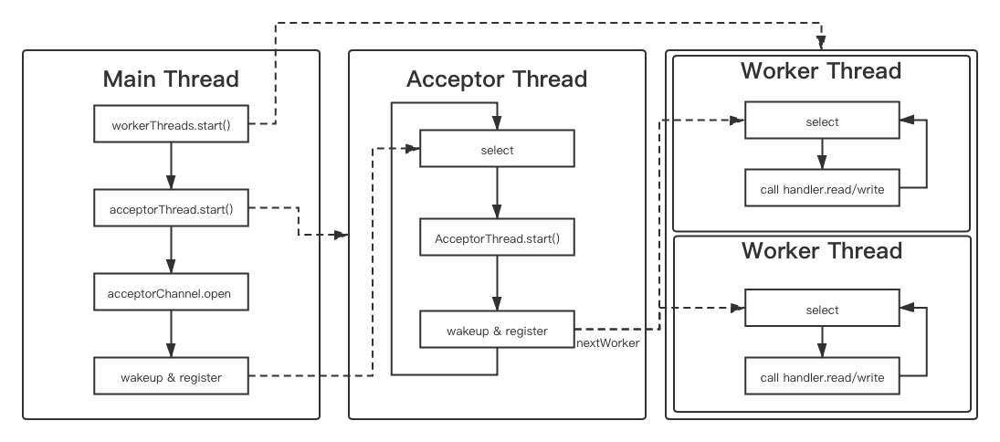

[前文介绍了IO的变迁](/2021/01/30/IO-01History/)，从BIO到NIO，但是AIO没有介绍（暂时也不打算学习-，-）本文将从Java提供的API——java.nio包中看看如果编写IO程序。
<!--more-->
首先，与java.io包下直接操作byte[]不同，java.nio包下大多是通过ByteBuffer类来操作字节。

# ByteBuffer使用
通过`ByteBuffer.allocate(capacity)`或者`ByteBuffer.allocateDirect(capacity)`可以在堆内或者堆外（直接内存）开辟一块`capacity`大小的空间作为Buffer使用；也可以通过`ByteBuffer.wrap(byte[])`等方式直接开辟一块为value量身打造的空间。

`ByteBuffer`中有3个变量`position`、`limit`、`mark`。怎么理解呢？ 
首先需要明确如何读写`ByteBuffer`。读的时候，从当前读取位置开始，一直读到最后一个有效位置；写的时候，往当前写入位置写，一直写到最后一个位置。  
这里就出现了几个特定的位置：“当前读取位置”、“最后一个有效位置”、“当前写入位置”、“最后一个位置”。  

* “当前读取位置”：逐字节读取，每次读取这个位置的字符，然后这个位置向后移动一个，直到达到最后一个有效位置。
* “最后一个有效位置”：读的时候需要标记出来最后一个字节在什么地方，不能超出。因为超出后的字节是未定义的。
* “当前写入位置”：逐字节写入，每一个字符都要写在这个位置，然后这个位置向后移动一个，让后续写时能够找到合适的位置。
* “最后一个位置”：也即该片内存的尾位置，或者认为是数组的尾单元。  

于是，通过`position`来标记当前的读写的位置，将`limit`作为最后一个有效位置。为了让ByteBuffer支持reset（也就是恢复position到某一个特定位置），还需要`mark`去记录。这样，通过这3个变量，就可以完成ByteBuffer的操作了。  

比如，先写再读再写的场景：
```java
// 向buffer中写
while(hasNextByte() && position < limit){
    buffer[position++] = nextByte()
}
// 然后从buffer中读
// 读取的位置需要回到0，但是读取的结尾需要限制
limit = position;
position = 0;
while(position < limit){
    readByte(buffer[position++]);
}
// 再向buffer中写
// 直接从0位置覆盖
position = 0;
limit = capacity;
while(hasNextByte() && position < limit){
    buffer[position++] = nextByte()
}
```
这样就能看出来了，当从写到读时，通常需要将`limit`置为当前的`position`，然后`position`清零；而从读到写时，通常需要将`limit`的限制取消，而`position`清零。对应于这两个过程，就是`flip()`和`clear()`，也就是：
```java
// java.nio.Buffer
public final Buffer flip() {
    limit = position;
    position = 0;
    mark = -1;
    return this;
}
public final Buffer clear() {
    position = 0;
    limit = capacity;
    mark = -1;
    return this;
}
```
  
当然还有一些特殊情况下，`limit`只需要保持现在的值，而将`position`归零（比如需要对buffer内的同一内容多次读取），则直接使用`rewind`也就是倒带：
```java
// java.nio.Buffer
public final Buffer rewind() {
    position = 0;
    mark = -1;
    return this;
}
```

而如果不是让`position`回到0，而是某个特定的位置，则首先通过`mark()`设置mark为当前`position`，当p`osition`漂移后，通过`reset()`来重置`position`到`mark`的位置：
```java
// java.nio.Buffer
public final Buffer mark() {
    mark = position;
    return this;
}
public final Buffer reset() {
    int m = mark;
    if (m < 0)
        throw new InvalidMarkException();
    position = m;
    return this;
}
final void discardMark() {                          // package-private
    mark = -1;
}
```
在flip、clear、rewind时都会清除`mark`，此外还可以通过`discardMark()`来清除`mark`。  

此外，需要注意的是，虽然`ByteBuffer`有诸如`asCharBuffer()`、`asIntBuffer()`、`asDoubleBuffer()`这样的方法，来对同一段数据采用不同的视图来操作（也即将同一个空间看做char或int或double之类构成的数组），但是得到的相应的`CharBuffer`、`IntBuffer`等视图与原来的`ByteBuffer`是不共享`position`、`limit`、`mark`和`capacity`的，而且这4个参数的单位也会变成视图中的元素，也就是说对于`IntBuffer`，如果执行`readInt`，`IntBuffer.position`还是只会+1，而原来的`ByteBuffer.position`不变。  
而且在`asXXXBuffer`创建新视图的时候，只会将`ByteBuffer`中目前剩余的部分（也就是`position`到`limit`之间的部分）作为新视图可以操作的部分。因此如果需要对`ByteBuffer`中已经有的数据，通过其他的视图读写，一定要将position设置为0。
```java
ByteBuffer bb = ByteBuffer.allocate(12);
// 向bb中写入0x00000001, 0x0000002, 0x00000003
bb.put(new byte[]{(byte)0, (byte)0, (byte)0, (byte)1, (byte)0, (byte)0, (byte)0, (byte)2, (byte)0, (byte)0, (byte)0, (byte)3});
bb.position(4);
System.out.println(bb); // [pos=4 lim=12 cap=12]
IntBuffer ib = bb.asIntBuffer();
System.out.println(ib.get());   // 2
System.out.println(ib.get());   // 3
ib.clear();
System.out.println(ib.get());   // 2
```
  

如果ByteBuffer中剩余的部分不是目标视图的单元大小的整数倍，则会通过向下取整确定视图的大小（也就是抛弃靠后的无法对其的容量），这从源码中也可以看出来：
```java
public LongBuffer asLongBuffer() {  //转换为Long视图
    int size = this.remaining() >> 3;   //remaining = limit - position，每一个long占8个字节，所以>>3
    int off = offset + position();  // offset恒为0
    return (bigEndian   // 大小端
        ? (LongBuffer)(new ByteBufferAsLongBufferB(this,    // 持有数据
                                                    -1,     // mark
                                                    0,      // position
                                                    size,   // limit
                                                    size,   //capacity
                                                    off))   // 在内存单元中的偏移基量
        : (LongBuffer)(new ByteBufferAsLongBufferL(this,
                                                    -1,
                                                    0,
                                                    size,
                                                    size,
                                                    off)));
}
```
# 使用
本节代码见[我的GitHub仓库](https://github.com/discko/learnio/tree/master/nio/src/main/java/space/wudi/learnio/nio)。

在java.nio中，使用Selector作为选择器，将各个端点作为Channel，注册到Selector上，并监听相应的事件，做出相应的处理，这与linux内核中的select、poll、epoll的思想是一致的。  
在java.nio中，会默认使用当前操作系统中最好的多路复用工具。对于Linux而言，一般是epoll，对于FreeBSD（如MacOS的Darwin）而言，则是kqueue（与epoll有一定的相似性，但不完全一样）。如果想要切换多路复用器，可以修改启动参数：
```java
-Djava.nio.channels.spi.SelectorProvider=SelectorProviderName
/*
SelectorProviderName为一个SelectorProvider的全限定名，在Darwin中内置的有：  
sun.nio.ch.KQueueSelectorProvider
sun.nio.ch.PollSelectorProvider
sun.nio.ch.SelectorProviderImpl

而默认使用的sun.nio.ch.DefaultSelectorProvider中会直接返回KQueueSelectorProvider

其他内核的同理
*/
```
## 设立一个小目标
首先，我们设立一个小目标，使用java.nio.Selector来做点啥。  

1. 设计一个“智能对话机器人”，能够自动回复客户端发来的句子
2. 对连接进行分线程处理，具体而言：
    * 一个线程用于用户连接的接受（acceptor），可以开启多个端口进行处理
    * 多个线程作为工作线程（worker），将acceptor接受的客户端在工作线程中对话处理
    * 允许根据不同的客户端（如根据IP分），使用不同的应对方式（比如回复加入口音）

这样的话，就可以按照select的语法进行编写了。

## 错误的写法导致的死锁
错误的写法：
```java
// Thread-Worker, on loop
while(true){
    int num = selector.select();
    if(num > 0 ){
        Iterator<SelectionKey> iterator = selector.selectedKeys().iterator();
        while(iterator.hasNext()){
            SelectionKey key = iterator.next();
            iterator.remove();
            if(key.isAcceptable()){
                handleAccept(key);
            }else if(key.isReadable() || key.isWritable()){
                handleReadWrite(key);
            }
        }
    }
}
// Thread-Init, on init
new Thread(workerRunnable, "Thread-Worker").start();
ServerSocketChannel server = ServerSocketChannel.open();
server.register(workerRunnable.selector, OP_ACCEPT);    // 阻塞在这里

// Thread-Server, on accept
ServerSocketChannel server = selectionKey.channel();
SocketChannel client = server.accept();
client.register(workerRunnable.selector, OP_READ, handler); // 阻塞在这里
```
这两个线程会因为`selector.select()`的锁，导致`channel.register(select)`被阻塞，无法成功注册。而如果将`Thread-Init`中改成这样：
```java
new Thread(workerRunnable, "Thread-Worker").start();
ServerSocketChannel server = ServerSocketChannel.open();
workRunnable.selector.wakeup()；
server.register(workerRunnable.selector, OP_ACCEPT);
```
则一定概率下仍然会因为锁竞争而阻塞，因为在`Thread-Worker`中，因为num为0而快速loop回到`selector.select()`造成锁无法获得。  

锁竞争的相关代码在这里：
```java
// selector.select()实际调用的是SelectorImpl.lockAndDoSelect()方法
// sun.nio.ch.SelectorImpl#lockAndDoSelect
private int lockAndDoSelect(long var1) throws IOException {
    synchronized(this) {
        if (!this.isOpen()) {
            throw new ClosedSelectorException();
        } else {
            Set var4 = this.publicKeys;
            int var10000;
            synchronized(this.publicKeys) { // 锁this.publicKeys
                Set var5 = this.publicSelectedKeys;
                synchronized(this.publicSelectedKeys) {
                    var10000 = this.doSelect(var1);
                }
            }
            return var10000;
        }
    }
}
// register实际调用的是SelectorImpl.register()方法
// sun.nio.ch.SelectorImpl#register
protected final SelectionKey register(AbstractSelectableChannel var1, int var2, Object var3) {
    if (!(var1 instanceof SelChImpl)) {
        throw new IllegalSelectorException();
    } else {
        SelectionKeyImpl var4 = new SelectionKeyImpl((SelChImpl)var1, this);
        var4.attach(var3);
        Set var5 = this.publicKeys;
        synchronized(this.publicKeys) { // 锁this.publicKeys
            this.implRegister(var4);
        }
        var4.interestOps(var2);
        return var4;
    }
}
```
由于`selector.select()`和`selectionKey.register(selector, op)`中的`selector`是同一个对象，而这两个方法的底层调用的都是`SelectorImpl`中的方法，都对`this.publicKeys`进行`synchronized`。所以如果select和register发生在不同的线程，而且select先行执行并阻塞，那么register将等待锁释放而被挂起。而select只有当被register的事件发生时才能释放，register又被挂起了，这样的互相阻塞就就死锁。  
解决方案有2个。  
由于select()方法可以接受一个long类型的参数作为`timeout`。所以可以设置一个合适的时间让其自动释放锁。但这个方法并不太好，因为为了避免这个情况，需要每隔timeout的时间就将线程唤醒造成空转，这显然是不经济的；而且在有客户端连接过来时，每一个新连接，最长都需要等待`timeout`的延时，这显然也是不合理的。  
为此，可以将register事件放到`Thread-Worker`的这个loop中，在其他线程中需要register的时候通过`selector.wakeup()`将`selector.select()`手动唤醒：  

```java
// 在需要注册的地方调用该方法：
public void addRegisterQueueAndWakeUpSelector(RegisterHolder channelHolder){
    // 将需要注册的channel放入RegisterHolder中
    // 然后将channelHolder加入到待注册队列registerQueue中
    registerQueue.add(channelHolder);
    // 接下来唤醒被阻塞的selector
    selector.wakeup();
}
// registerQueue是一个阻塞链表
private LinkedBlockingQueue<RegisterHolder> registerQueue;
```
然后，在主事件循环中，就能将阻塞的select方法唤醒：
```java
// 纤程内循环
public void run(){
    while(true){
        try {
            int num = selector.select();    // block util event happens or be waken up
            if(num > 0 ){
                // 当有事件而结束阻塞时
                Iterator<SelectionKey> iterator = selector.selectedKeys().iterator();
                while(iterator.hasNext()){  // 遍历有事件的key
                    SelectionKey key = iterator.next();
                    iterator.remove();  // 记得移除，下面解释
                    if(key.isAcceptable()){ 
                        // 只有acceptor会进入该分支
                        handleAccept(key);  // 处理accept事件
                    }else if(key.isReadable() || key.isWritable()){
                        // 只有worker会进入该分支
                        handleReadWrite(key);   // 处理IO事件
                    }
                }
            }
            while(!registerQueue.isEmpty()){
                // 在被wakeup唤醒后，或执行完上面的遍历后，都会进入到这里
                // 将待注册队列中的channel一个个取出，注册到本线程的selector上
                RegisterHolder registerHolder = registerQueue.take();
                // 执行注册，因为此时没有被select阻塞
                // 所以可以顺利完成
                registerHolder.register(selector, handlerBuilder);
            }
        } catch (IOException | InterruptedException e) {
            e.printStackTrace();
        }
    }
}
```

## 一个细节导致重复处理事件
在上面主事件循环的代码中可以看到，在遍历发生了事件的key时，会把SelectedKeys中的key一个个remove掉。如果不这么做，即使该key没有新的事件，在下一次被唤醒后，SelectedKeys这个集合中，仍然会存在这个key。
```java
while(iterator.hasNext()){  // 遍历有事件的key
    SelectionKey key = iterator.next();
    iterator.remove();  // 为什么要移除
    if(key.isAcceptable()){ 
        handleAccept(key);  
    }else if(key.isReadable() || key.isWritable()){
        handleReadWrite(key); 
    }
}
```
那么这是为什么呢？  
我们来看一下源码。我目前使用的是Mac，所以Selector的具体实现是KQueue，不过相信Epoll的实现也是一样的。  
在KQueue中，调用`Selector.select()`后，内部实际通过`doSelect()`调用`KQueueArrayWrapper.poll()`获得发生事件的key的集合，然后通过`updateSelectedKeys()`方法，将发生事件的key放入`selectedKeys`这个Set中。  
```java
// sun.nio.ch.KQueueSelectorImpl#updateSelectedKeys
private int updateSelectedKeys(int count) throws IOException {
    int var2 = 0;
    boolean var3 = false;
    ++this.updateCount;

    for(int var4 = 0; var4 < count; ++var4) {
        int var5 = this.kqueueWrapper.getDescriptor(var4);
        if (var5 == this.fd0) {
            var3 = true;
        } else {
            KQueueSelectorImpl.MapEntry var6 = (KQueueSelectorImpl.MapEntry)this.fdMap.get(var5);
            if (var6 != null) {
                int var7 = this.kqueueWrapper.getReventOps(var4);
                SelectionKeyImpl var8 = var6.ski;
                if (this.selectedKeys.contains(var8)) {
                    if (var6.updateCount != this.updateCount) {
                        if (var8.channel.translateAndSetReadyOps(var7, var8)) {
                            ++var2;
                            var6.updateCount = this.updateCount;
                        }
                    } else {
                        var8.channel.translateAndUpdateReadyOps(var7, var8);
                    }
                } else {
                    var8.channel.translateAndSetReadyOps(var7, var8);
                    if ((var8.nioReadyOps() & var8.nioInterestOps()) != 0) {
                        // 重点在这里
                        // 只是通过add加入selectedKeys集合
                        this.selectedKeys.add(var8);
                        ++var2;
                        var6.updateCount = this.updateCount;
                    }
                }
            }
        }
    }

    if (var3) {
        synchronized(this.interruptLock) {
            IOUtil.drain(this.fd0);
            this.interruptTriggered = false;
        }
    }

    return var2;
}
```
可以看到，里面仅仅调用了add方法，将发生了事件的key放入selectedKeys中，而没有每次都清理一下selectedKeys。  

另外可能有人要问了，明明在外部调用的selector.selectedKeys()这个方法返回的是publicSelectedKeys，为什么这里操作selectedKeys呢？明明实现类没有覆盖父类的方法啊。  
```java
// sun.nio.ch.SelectorImpl
public Set<SelectionKey> selectedKeys() {
    if (!this.isOpen() && !Util.atBugLevel("1.4")) {
        throw new ClosedSelectorException();
    } else {
        return this.publicSelectedKeys;
    }
}
```
这还要从publicSelectedKeys的定义说起。下面是SelectorImpl的构造函数，KQueue继承自它，自然也会调用这个构造函数。在下面，会执行else分支（当然不论哪一个，都可以看出来，publicSelectedKeys都是通过selectedKeys构造而来的），而`Util.ungrowableSet()`方法只是将selectedKeys包装了一下，屏蔽对selectedKeys的修改，保留了对selectedKeys的访问。
```java
protected SelectorImpl(SelectorProvider var1) {
    super(var1);
    if (Util.atBugLevel("1.4")) {
        this.publicKeys = this.keys;
        this.publicSelectedKeys = this.selectedKeys;
    } else {
        this.publicKeys = Collections.unmodifiableSet(this.keys);
        this.publicSelectedKeys = Util.ungrowableSet(this.selectedKeys);
    }
}
// sun.nio.ch.Util
static <E> Set<E> ungrowableSet(final Set<E> var0) {
    return new Set<E>() {
        // 对publicSelectedKeys的访问，被代理到了selectedKeys上
        public int size() {
            return var0.size();
        }
        public Object[] toArray() {
            return var0.toArray();
        }
        public Iterator<E> iterator() {
            return var0.iterator();
        }
        public boolean remove(Object var1) {
            return var0.remove(var1);
        }
        // 省略其他操作
        // 下面的对set的修改直接返回UnsupportOperation
        public boolean add(E var1) {
            throw new UnsupportedOperationException();
        }
        public boolean addAll(Collection<? extends E> var1) {
            throw new UnsupportedOperationException();
        }
    };
}
```

## 流程

最终执行的流程大致就是：

1. 使用时通过`new ServerSelectorGroup(ports, workers, clientHanderBuilder)`来创建一个selector组。
2. 这个selector组会初始化workers个工作线程和1个acceptor线程，并根据ports启动各个listener服务。然后将这些listener服务注册到acceptor线程中。
3. acceptor线程在select处阻塞，直到新客户端建立连接，accept它，并将其注册到某个worker中。
4. worker中也阻塞在selector处，直到注册的客户端读或写就绪，然后根据key调用其对应的clientHandler。



代码见[我的GitHub仓库](https://github.com/discko/learnio/tree/master/nio/src/main/java/space/wudi/learnio/nio)。