[前一篇文章](/2021/02/08/IO-02MultiplexSelector/)自己利用java.nio.Selector实现了一个可以分组的多路复用器。在实际实践中，对于复杂的网络通信环境，通常会使用Netty来简化开发工作。由于netty5迟迟难产（具体可以参见[Netty Issue 4466](https://github.com/netty/netty/issues/4466)），目前稳定的版本依然是Netty4（截止2021年初）  

接下来，就利用Netty 4.1.59-Final（1天前发布的，趁热）来对前文的“智能对话机器人”进行重构。

Netty的核心Core分为部分。为了简化对ByteBuffer的操作，Netty使用了自己定义的ByteBuf（官方介绍为Zero-Copy-Capable Rich Byte Buffer，即“可零拷贝的富字节缓存”），然后是对新旧Java IO封装的API（官方介绍为Universal Communication API，即“通用通信API”）。最后是基于拦截链的灵活事件模型（官方介绍为Extensible Event Model，也即“可扩展的事件模型”）
<!--more-->

# ByteBuf
`ByteBuf`是Netty中的一个抽象类，通过接口`ReferenceCounted`提供对内存的引用计数和释放。  
## 内部结构和基本操作
在上一篇文章中，我们分析了JDK中的`java.nio.ByteBuffer`的结构，其中只有一个`position`指针来记录当前操作到（读到 和 写到）的位置，然后通过limit标记读写的极限位置，使用时通过`flip()`、`reset()`、`rewind()`等方法不断操作`position`的位置，从而对`ByteBuffer`进行读写。`ByteBuffer`的操作还是略显麻烦，并且违反直觉。  

而Netty的`ByteBuf`中通过两个指针`readerIndex`和`writerIndex`记录已经读到和写到的位置。这样的话，整个ByteBuf的内存就可以分为3块：

1. `discardable bytes`：0到`readerIndex`之间，这一部分已经读过了，可以通过`ByteBuf#discardReadBytes()`或`ByteBuf#discardSomeReadBytes()`去丢弃它们。  
2. `readable bytes`：`readerIndex`到`writerIndex`之间，这一部分是已经写入的，但还没有读的，是接下来可读的，可以通过`ByteBuf#readByte`系列的方法读取。
3. `writable bytes`：`writerIndex`到最后（也即`capacity`）之间，这一部分是还没有写入的区域，也就是还剩余的可写区域。可通过`ByteBuf#writeByte`系列的方法写入。  

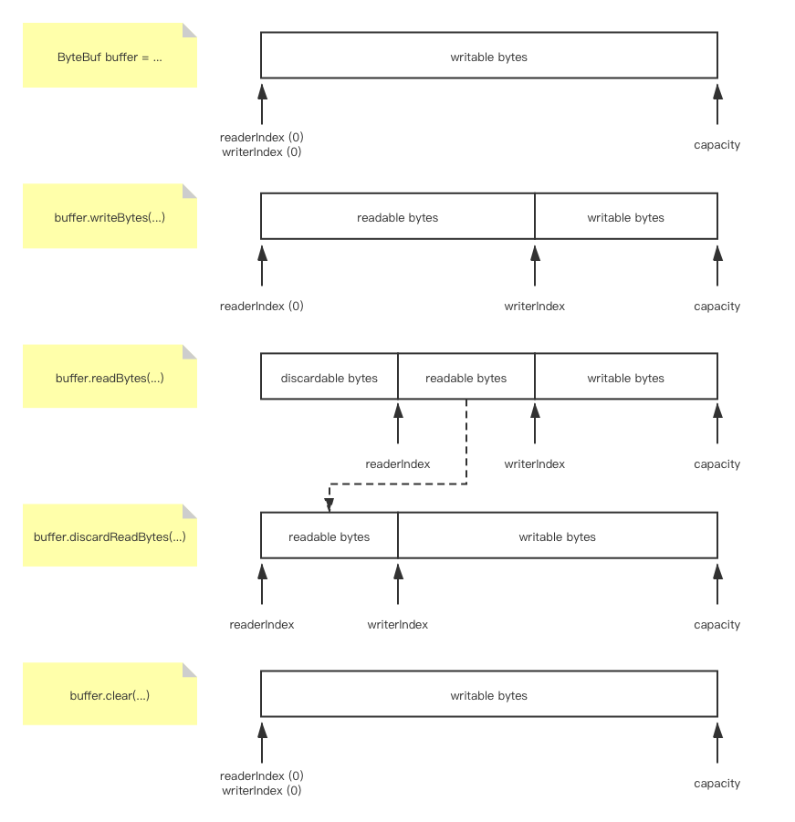 

通过上面提到的这些方法，可以遵循正常的操作直觉对ByteBuf进行操作，当然实际是在操作`readerIndex`和`writerIndex`两个指针。顺序情况下，我们只需要通过readByte或者writeByte在读写的过程中对readerIndex和writerIndex进行移动。  
当需要丢弃一部分数据时，如果需要丢弃已被读过的部分（discardable bytes），可以通过`discardReadBytes`或者`discardSomeReadBytes`来进行。当开始丢弃时，会将`readerIndex`和`writerIndex`之间的`readable bytes`复制到0位置，然后将`readerIndex`指针移动到0位置，`writerIndex`移动到新的`readable bytes`的尾。两个方法的不同之处在于，`discardReadBytes`会无条件地进行复制（当`readable bytes`区域长度为0是退化为不复制）；而`discardSomeReadBytes`只会在可用空间不足一半时，才会复制，这样就避免了在空间还很充足的情况下反复地滕让空间。
```java
// io.netty.buffer.AbstractByteBuf
public ByteBuf discardReadBytes() {
    if (readerIndex == 0) {
        ensureAccessible();
        return this;
    }
    if (readerIndex != writerIndex) {
        setBytes(0, this, readerIndex, writerIndex - readerIndex);
        writerIndex -= readerIndex;
        adjustMarkers(readerIndex);
        readerIndex = 0;
    } else {
        ensureAccessible();
        adjustMarkers(readerIndex);
        writerIndex = readerIndex = 0;
    }
    return this;
}
public ByteBuf discardSomeReadBytes() {
    if (readerIndex > 0) {
        if (readerIndex == writerIndex) {
            ensureAccessible();
            adjustMarkers(readerIndex);
            writerIndex = readerIndex = 0;
            return this;
        }
        if (readerIndex >= capacity() >>> 1) {
            setBytes(0, this, readerIndex, writerIndex - readerIndex);
            writerIndex -= readerIndex;
            adjustMarkers(readerIndex);
            readerIndex = 0;
            return this;
        }
    }
    ensureAccessible();
    return this;
}
```
另外一种丢弃数据的方式就是将已经被读过的部分和写入的部分都丢弃，也就是清空这个ByteBuf，使用`clear()`方法。当然这个方法仅仅将2个指针都移动到0的位置，当然，并没有真的清空，这些已经写入的区域，将会在后面写入时被覆盖掉）。  
```java
// io.netty.buffer.AbstractByteBuf
public ByteBuf clear() {
    readerIndex = writerIndex = 0;
    return this;
}
```

当然，最暴力的方法就是通过`setIndex(int readerIndex, writerIndex)`直接设置两个指针的位置：
```java
// io.netty.buffer.AbstractByteBuf
public ByteBuf setIndex(int readerIndex, int writerIndex) {
    if (checkBounds) {
        checkIndexBounds(readerIndex, writerIndex, capacity());
    }
    setIndex0(readerIndex, writerIndex);
    return this;
}
final void setIndex0(int readerIndex, int writerIndex) {
    this.readerIndex = readerIndex;
    this.writerIndex = writerIndex;
}
```

 

## ByteBuf的分类
ByteBuf可以根据不同的维度进行分类。总的来说说基本会按照分配的位置（Heap vs Direct）、可重用性（Pooled vs Unpooled）和指针安全性（- vs Unsafe）这三个方面进行分类。

### 分配位置
如果按照分配位置来分类的话，ByteBuf可以分为在堆上分配的ByteBuf和在直接内存上分配的ByteBuf。在命名上以Heap和Direct进行区分。
在堆上分配，就直接通过new byte[]的方式进行，比如UnpooledHeapByteBuf。  
```java
// io.netty.buffer.UnpooledDirectByteBuf
public UnpooledDirectByteBuf(ByteBufAllocator alloc, int initialCapacity, int maxCapacity) {
    // 省略参数校验和field赋值
    setByteBuffer(allocateDirect(initialCapacity), false);
}
protected ByteBuffer allocateDirect(int initialCapacity) {
    return ByteBuffer.allocateDirect(initialCapacity);
}
```
直接内存则是通过ByteBuffer.allocateDirect，比如UnpooledDirectByteBuf
```java
// io.netty.buffer.UnpooledHeapByteBuf
public UnpooledHeapByteBuf(ByteBufAllocator alloc, int initialCapacity, int maxCapacity) {
    // 省略参数校验和field赋值
    setArray(allocateArray(initialCapacity));
    setIndex(0, 0);
}
protected byte[] allocateArray(int initialCapacity) {
    return new byte[initialCapacity];
}
```
### 是否复用内存空间
根据是否复用内存空间来分，ByteBuf可以分为Pooled和Unpooled两类。  
Unpooled每一次初始化，都会调用相关API，在内存中直接创建一块内存用于存储，具体而言就是[上面提到的分配位置的API](#分配位置)。

而Pooled则是在一块预先分配好的空间上，反复使用。这块内存通过一个`PoolChunk`对象进行管理，通过`reuse`方法进行重复使用，在需要回收时，通过传入的`recycleHandler`进行deallocate：
```java
// io.netty.buffer.PooledByteBuf
final void reuse(int maxCapacity) {
    maxCapacity(maxCapacity);
    resetRefCnt();
    setIndex0(0, 0);
    discardMarks();
}
private void recycle() {
    recyclerHandle.recycle(this);
}
```
### 是否使用Unsafe
根据是否通过Unsafe直接访问内存来访问ByteBuf的内容，可以将ByteBuf分为带有Unsafe和不带Unsafe的两类。  
从`Unpooled`的`wrappedBuffer(ByteBuffer)`中可以看到，如果运行的平台支持Unsafe（也就是`sun.misc.Unsafe`存在），则会创建Unsafe的ByteBuf，否则创建普通的ByteBuf。
```java
// io.netty.buffer.Unpooled
public static ByteBuf wrappedBuffer(ByteBuffer buffer) {
    // 省略
    if (!buffer.isDirect() && buffer.hasArray()) {
        // 省略
    } else if (PlatformDependent.hasUnsafe()) {
        if (buffer.isReadOnly()) {
            // 返回ReadOnly的ByteBuf
        } else {
            // 返回UnsafeByteBuf
            return new UnpooledUnsafeDirectByteBuf(ALLOC, buffer, buffer.remaining());
        }
    } else {
        if (buffer.isReadOnly()) {
            return new ReadOnlyByteBufferBuf(ALLOC, buffer);
        }  else {
            // 返回普通ByteBuf
            return new UnpooledDirectByteBuf(ALLOC, buffer, buffer.remaining());
        }
    }
}
```
而PlatformDependent.hasUnsafe()则是明确的说明了判断的条件以及为什么使用Unsafe的原因：

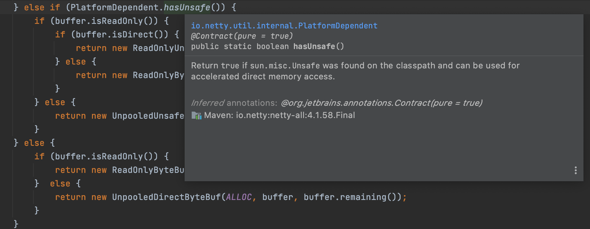

> 如果`sun.misc.Unsafe`存在则返回`true`，以此提速对直接内存的访问。  

而在底层，UnsafeByteBuf是通过Unsafe对内存直接进行操作，以获取特定index处的字节为例：
```java
// io.netty.buffer.UnpooledUnsafeDirectByteBuf
public byte getByte(int index) {
    checkIndex(index);
    return _getByte(index);
}
// 调用_getByte(int)
protected byte _getByte(int index) {
    return UnsafeByteBufUtil.getByte(addr(index));
}
// 将index转换为地址
final long addr(int index) {
    return memoryAddress + index;
}
// UnsafeByteBufUtil.getByte最终调用
// io.netty.util.internal.PlatformDependent0#getByte(long)
static byte getByte(long address) {
    // UNSAFE是一个sun.misc.Unsafe的实例
    return UNSAFE.getByte(address);
}
```

而与之相对的，不带Unsafe标志的ByteBuf，则是直接通过对象操作，交由JVM自己去执行响应的API。比如Direct就利用ByteBuffer（具体来说是一个`DirectByteBuffer`），而Heap就通过`byte[]`数组：
```java
// io.netty.buffer.UnpooledDirectByteBuf
public byte getByte(int index) {
    ensureAccessible();
    return _getByte(index);
}
protected byte _getByte(int index) {
    // buffer是一个java.nio.ByteBuffer的实例
    return buffer.get(index);
}

// io.netty.buffer.UnpooledHeapByteBuf
public byte getByte(int index) {
    ensureAccessible();
    return _getByte(index);
}
protected byte _getByte(int index) {
    return HeapByteBufUtil.getByte(array, index);
}
// io.netty.buffer.HeapByteBufUtil#getByte
static byte getByte(byte[] memory, int index) {
    return memory[index];
}
```

所以总的来说，标有Unsafe的ByteBuf对象，在进行数据访问时，会通过sun.misc.Unsafe工具类对内存进行直接访问；而没有Unsafe的ByteBuf则直接通过JVMAPI对数据进行访问。使用Unsafe在一些情况下，会快一些。  

### 小结
最后，通过Idea生成一个在上述3个分类中的8个ByteBuf派生类的继承关系图
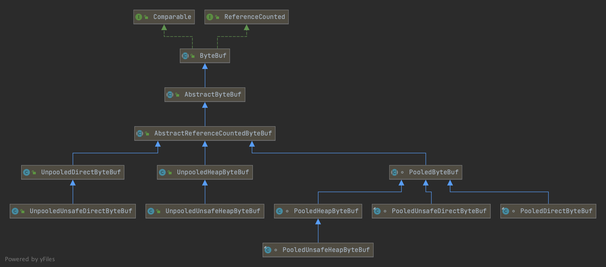

关于为什么其他Unsafe的都是继承自非Unsafe的同名类，而`PooledUnsafeDirectByteBuf`和`PooledDirectByteBuf`却是同级的（都直接继承自`PooledByteBuf`，目前我还没有看出来原因，直接在源码上，我似乎还没有找到需要绕过`PooledDirectByteBuf`的情况。

不过看稍早期Netty 4 的类结构，似乎`UnpooledUnsafeDirectByteBuf`也是直接绕过`UnpooledUnsafeDirectByteBuf`，转而继承自`AbstractReferenceCountedByteBuf`。也许只是忘记改了？

## PooledByteBuf的创建
这一块比较复杂，值得单独抽一篇文章来讲。这里仅仅说明一下结论。  
在创建时，如果没有指定使用Direct内存还是Heap内存，将优先使用Direct。这样在直接操作内存时，就可以不受GC回收导致内存地址变化而需要反复获取内存地址了。但是由于创建直接内存比在堆上直接分配内存慢（因为堆上直接由JMM管理，而堆上内存需要通过操作系统分配），所以通过Pooled的形式形成内存池，接下来由Netty自行管理。  

### 名词解释
首先先说明一下Netty的内存管理中的几个名词：

* page：page是可分配的最小内存块
* run：若干个page组成的集合
* chunk：若干个run组成的集合  
* handle：用于快速识别和访问chunk中已经被分配的内存的一个long指针。其格式见后
* runAvailMap：一个用于管理所有run（包括已使用的和未使用的）的map。其key是runOffset（chunk中page的偏移量），value是对应的handle。每一个run的首page和尾page都会放在这个map中。
* runAvail：一个PriorityQueue[]，每一个queue中存放相同大小的run，并以offset为优先级排序。

```
oooooooo ooooooos ssssssss ssssssue bbbbbbbb bbbbbbbb bbbbbbbb bbbbbbbb
o：runOffset（chunk中page的偏移量），15bit。
s：run的大小（用page的个数表示），15bit。
u：是否被使用了，1bit
e：是否是subpage，1bit
b：subpage的bitmapIdx，如果不是subpage则为0，32bit
```

### Chunk

在初始时，Netty将会一次性获取`chunkSize`大小的Direct内存（通过`DirectByteBuffer`持有），`chunkSize = maxPages * pageSize`。默认情况下最大page数量`maxPages = 2048`，而单page大小`pageSize = 8kiB`，所以默认情况下，Netty会分配`chunkSize = 16Mib`大小的直接内存。  

但显然Netty不可能仅适用一块Chunk。所以更多的Chunk将通过ChunkList进行管理（`PoolChunkList`），而各个元素就是`PoolChunk`，他们之间以双向链表的形式进行连接。  

为了提高内存管理效率，避免内存混乱找不到合适的连续空间，Netty还将多个`PoolChunkList`按照使用量进行分类，并且将`PoolChunkList`也做成双向链表，并存放在`PoolArena`中。（arena是舞台的意思）  
```java
// io.netty.buffer.PoolArena#PoolArena
q100 = new PoolChunkList<T>(this, null, 100, Integer.MAX_VALUE, chunkSize);
q075 = new PoolChunkList<T>(this, q100, 75, 100, chunkSize);
q050 = new PoolChunkList<T>(this, q075, 50, 100, chunkSize);
q025 = new PoolChunkList<T>(this, q050, 25, 75, chunkSize);
q000 = new PoolChunkList<T>(this, q025, 1, 50, chunkSize);
qInit = new PoolChunkList<T>(this, q000, Integer.MIN_VALUE, 25, chunkSize);
// PoolChunkList(PoolArena<T> arena, PoolChunkList<T> nextList, int minUsage, int maxUsage, int chunkSize)

q100.prevList(q075);
q075.prevList(q050);
q050.prevList(q025);
q025.prevList(q000);
q000.prevList(null);
qInit.prevList(qInit);
```
所以在chunk级别上，其结构大致是这样的：  
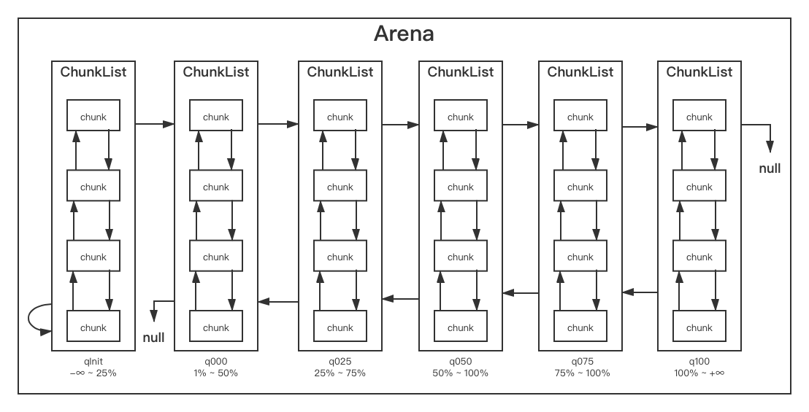  
至于为什么q100的空间要写成100%到+∞，可以看一下PoolChunkList的add方法，这样就不需要为q100单独编写没有阈值上限的代码了：
```java
// io.netty.buffer.PoolChunkList
void add(PoolChunk<T> chunk) {
    if (chunk.freeBytes <= freeMinThreshold) {
        nextList.add(chunk);
        return;
    }
    add0(chunk);
}
```

在一个Chunk中，其所占有的空间被分割为一个个的page。这些page首先组成一个从头到尾的run。在后面申请内存的时候，将其拆分为一个个小的run。这些小run就通过runAvail数组进行管理。  

```java
private long splitLargeRun(long handle, int needPages) {
    int totalPages = runPages(handle);  // 也就是s位置的值
    int remPages = totalPages - needPages;
    if (remPages > 0) {
        int runOffset = runOffset(handle);  // o位置的值
        int availOffset = runOffset + needPages;
        long availRun = toRunHandle(availOffset, remPages, 0);
        insertAvailRun(availOffset, remPages, availRun);
        // not avail
        return toRunHandle(runOffset, needPages, 1);
    }
    //mark it as used
    handle |= 1L << IS_USED_SHIFT;
    return handle;
}
```
所以从这个层面上来说，runAvail数组中大尺寸的块在被不断拆分，用剩下的则被放到了runAvail数组中较小尺寸的队列中等待被使用。  

比如在下面这张图中，初始化时所有page合并视作一个run，存放在`runsAvail[39]`中。  
当申请内存时，即使只需要1个page大小的空间，在使用后，都会使得`runsAvail[39]`少于其最少要满足的空间大小（也即`chunkSize`），所以只能在分配完空间后，将剩余的空间移动到符合条件的queue中，比如`runsAvail[38]`。  
当再需要分配一个小空间时，因为即使少了这样一块空间，`runsAvail[38]`中的这个run的尺寸依然大于要求的最小空间，所以直接缩减这个run，不需要拆分。  
这时，如果需要一大块内存，缩减这个run之后，剩余的尺寸不满足`runsAvail[38]`的最低要求时，就只能将这个run的剩余部分拆分至其他合适的queue中了。  

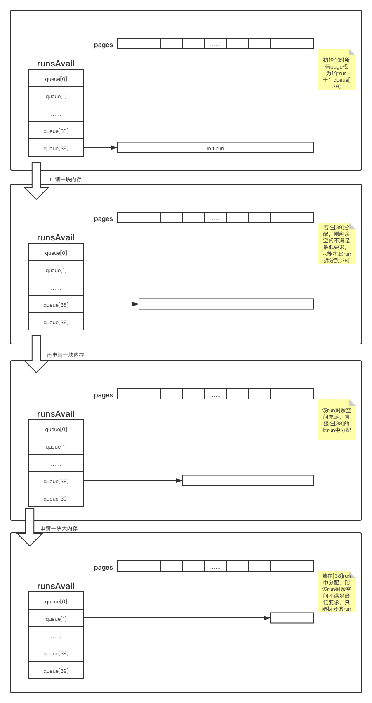

上面的每个queue中都只有一个run。来看看多个run的情况。  
当空间被释放时，自然就会有空闲的page被放入`runAvail`中。当多个page是连续的，则会被合并为1个run，并放到合适的queue中；如果多个run之间并不能彼此连续，则queue会根据他们的pageOffset（也就是page的序号）将它们排序，这样在分配内存时，总是会取到合适的run中offset最小的那一个。  
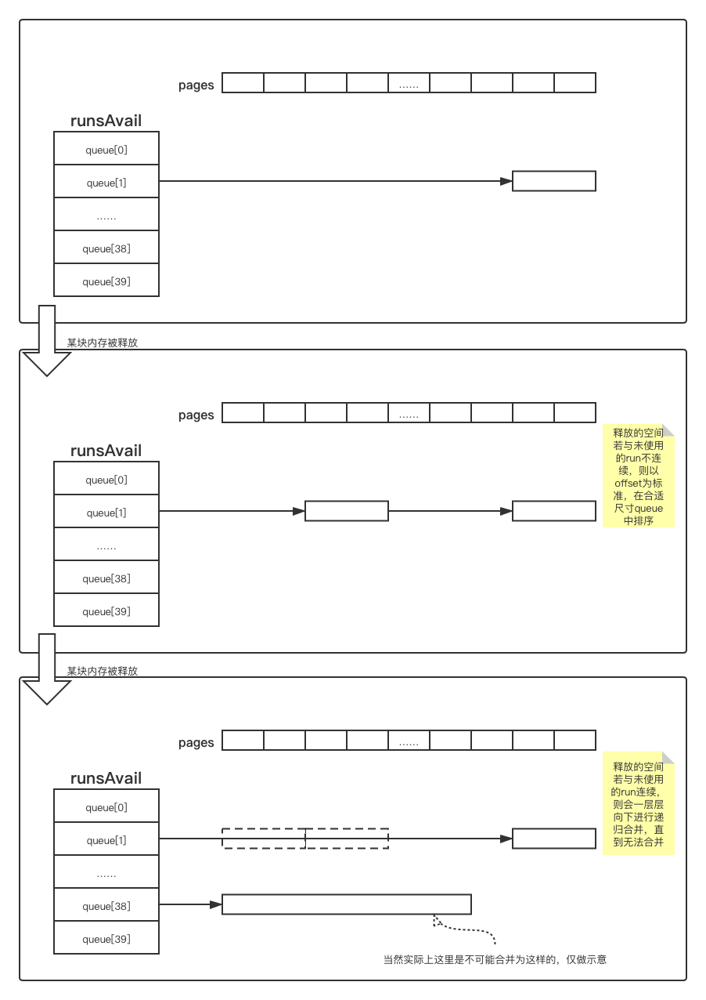

### Subpage
往大了不够可以增加chunk，但对于每一个page占用8KiB的空间而言有时也比较浪费，所以在page中又增加了一层subpage，用于对更小内存的管理（但对内存管理还是按page进行的）。  

当所需要的空间小于1个page大小时，会首先判断是否有已经使用过的subpage，如果有，则直接使用：
```java
// io.netty.buffer.PoolArena#tcacheAllocateSmall
private void tcacheAllocateSmall(PoolThreadCache cache, PooledByteBuf<T> buf, final int reqCapacity, final int sizeIdx) {
        // 省略
        // 查找是否有已经使用过的同尺寸的Subpage（可能还有空间可以放得下）
        final PoolSubpage<T> head = smallSubpagePools[sizeIdx];
        final boolean needsNormalAllocation;
        synchronized (head) {
            // 因为可能会进行链表操作，需要上锁
            final PoolSubpage<T> s = head.next;
            // 如果head.next指向自己，说明没有创建过Subpage
            // 如果已经创建过Subpage，则head.next会指向一个PoolSubpage对象，用于记录使用情况
            needsNormalAllocation = s == head;
            if (!needsNormalAllocation) {
                // 已经使用过了Subpage，直接向这块Page中填充剩余的部分
                assert s.doNotDestroy && s.elemSize == sizeIdx2size(sizeIdx);
                long handle = s.allocate();
                assert handle >= 0;
                s.chunk.initBufWithSubpage(buf, null, handle, reqCapacity, cache);
            }
        }

        if (needsNormalAllocation) {
            // 这个尺寸上没有创建过Subpage，则从`runsAvail`中取出一个合适大小的run用作Subpage
            synchronized (this) {
                allocateNormal(buf, reqCapacity, sizeIdx, cache);
            }
        }

        incSmallAllocation();
    }
```

否则会从`runsAvail`中取出一个合适大小的run用作Subpage。上面的allocateNormal最终会调用PoolChunk的allocate方法。当申请的尺寸属于small大小时，就会执行allocateSubpage：
```java
// io.netty.buffer.PoolChunk
boolean allocate(PooledByteBuf<T> buf, int reqCapacity, int sizeIdx, PoolThreadCache cache) {
    if (sizeIdx <= arena.smallMaxSizeIdx) {
        // small
        handle = allocateSubpage(sizeIdx);
        if (handle < 0) {
            return false;
        }
        assert isSubpage(handle);
    } else {
        // allocateRun
    }
    // init buf
}
```

当然，allocateSubpage会首先在PoolArena中找出一个合适大小的run。那么合适的大小是多大呢？首先会将所申请的size调整到某个预设的大小上（通过sizeIdx，这样可以让许多相差不大的尺寸都使用一个大小，代价仅仅是浪费几个字节）并取出这个大小的代表head，然后计算出所需要的run的合适尺寸，接下来就是将这个subpage的信息记录到PoolSubpage对象中，然后将这个对象添加到head.next上（这样，在上面tcacheAllocateSmall方法中就可以通过next指针判断是否还需要重新取run作为subpage了）。  

```java
private long allocateSubpage(int sizeIdx) {
    // 根据sizeIdx取出合适大小的PollSubpage的head
    PoolSubpage<T> head = arena.findSubpagePoolHead(sizeIdx);
    synchronized (head) {   // 因为可能会涉及链表操作，上锁
        // 计算需要的run的尺寸
        int runSize = calculateRunSize(sizeIdx);
        // 通过allocateRun获取该尺寸的run
        long runHandle = allocateRun(runSize);
        if (runHandle < 0) {
            return -1;
        }
        int runOffset = runOffset(runHandle);
        assert subpages[runOffset] == null;
        // 这个run中每一个subpage的尺寸
        int elemSize = arena.sizeIdx2size(sizeIdx);
        // 将这个run中的subpage使用情况记录到head.next中
        PoolSubpage<T> subpage = new PoolSubpage<T>(head, this, pageShifts, runOffset, runSize(pageShifts, runHandle), elemSize);
        subpages[runOffset] = subpage;
        return subpage.allocate();
    }
}
```

那么run是如何划分为subpage的呢？奥秘在`calculateRunSize`中：
```java
private int calculateRunSize(int sizeIdx) {
    int maxElements = 1 << pageShifts - SizeClasses.LOG2_QUANTUM;
    int runSize = 0;
    int nElements;
    final int elemSize = arena.sizeIdx2size(sizeIdx);
    // 下面的2个while循环，保证了runSize始终是pageSize和elemSize的最小公倍数        
    do {
        runSize += pageSize;
        nElements = runSize / elemSize;
    } while (nElements < maxElements && runSize != nElements * elemSize);
    while (nElements > maxElements) {
        runSize -= pageSize;
        nElements = runSize / elemSize;
    }
    return runSize;
}
```
所以，目标runSize总是page大小和subpage大小的最小公倍数。比如pageSize是8KiB，申请的空间是2Kib，那么1个page就够了，则这个page会被划分为4块，每块都是2KiB。  

# NioEventLoop
之前在写java原生的NIO代码时，在线程中通过一个死循环执行selector.select()以及事件处理，在Netty中同样如此。这个死循环在NioEventLoop中被使用。  

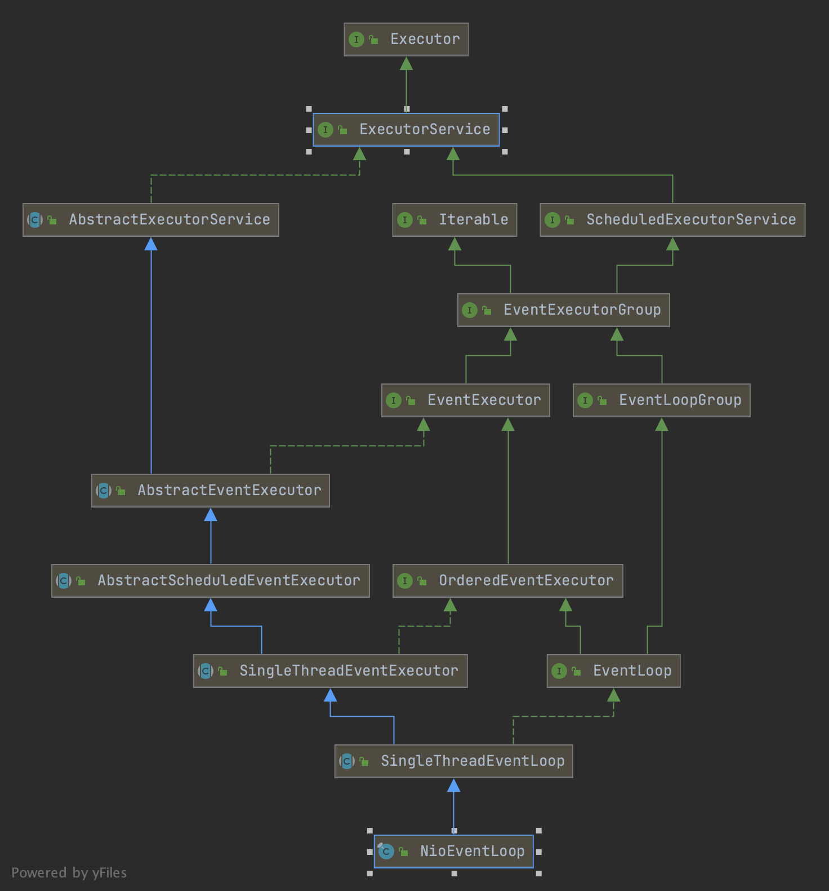

## 寻找循环入口
从上面的UML中可以看出，`NioEventLoop`继承自接口`Executor`，所以必然存在`execute(Runnable)`方法。该方法在其父类`SingleThreadEventExecutor`中被实现：
```java
// io.netty.util.concurrent.SingleThreadEventExecutor
public void execute(Runnable task) {
    // 省略参数校验
    execute(task, !(task instanceof LazyRunnable) && wakesUpForTask(task));
}
```
那么这个task就是NIO的事件循环EventLoop么？并不是。  
往下看调用栈，可以发现，这个task很快就通过addTask方法交给了一个名为taskQueue的队列进行缓存：
```java
// io.netty.util.concurrent.SingleThreadEventExecutor
private void execute(Runnable task, boolean immediate) {
    boolean inEventLoop = inEventLoop();
    addTask(task);  // call taskQueue.offer(task);
    if (!inEventLoop) {
        startThread();
        if (isShutdown()) {
            boolean reject = false;
            try {
                if (removeTask(task)) {
                    reject = true;
                }
            } catch (UnsupportedOperationException e) {
            }
            if (reject) {
                reject();
            }
        }
    }
    if (!addTaskWakesUp && immediate) {
        wakeup(inEventLoop);
    }
}
```
这个execute方法很快就结束了，并没有发现什么无限循环在其中。但是这个方法通过`startThread()`另外开启了一个线程，让人很是在意。  
在多层调用后来到了`doStartTrhead()`方法中，可以看到除了参数校验，核心语句只有一个：`executor.execute(new Runnable(){...});`由此可见，在`NioEventLoop`中，通过`execute()`方法，再开启了一个线程，执行另外的事情。那么这个“另外的事情”具体有哪些呢？我们来看看这个匿名的`Runnable`的`run()`方法：   
```java
// io.netty.util.concurrent.SingleThreadEventExecutor 
thread = Thread.currentThread();    // 将新线程保存在NioEventLoop的thread域中
if (interrupted) {
    thread.interrupt();
}
boolean success = false;
updateLastExecutionTime();
try {
    SingleThreadEventExecutor.this.run();   // 执行NioEventLoop的run()方法
    success = true;
} catch (Throwable t) {
    logger.warn("Unexpected exception from an event executor: ", t);
} finally {
    // 优雅地收尾
}
```
## select循环
那么显而易见，核心过程就在`run()`中了。由于`SingleThreadEventExecutor`的`run()`是abstract的，真正的实现在`NioEventLoop`中。  
```java
// io.netty.channel.nio.NioEventLoop
protected void run() {
    int selectCnt = 0;
    for (;;) {  // 死循环
        try {
            int strategy;
            try {
                // 如果taskQueue中有任务，则尝试select()并立即返回select的数量 >= 0
                // 否则返回SelectStrategy.SELECT
                strategy = selectStrategy.calculateStrategy(selectNowSupplier, hasTasks());
                switch (strategy) {
                case SelectStrategy.CONTINUE:   // -2
                    continue;
                case SelectStrategy.BUSY_WAIT:  // -3
                    // fall-through to SELECT since the busy-wait is not supported with NIO
                case SelectStrategy.SELECT:     // -1
                    // 没有其他任务，则执行select()
                    long curDeadlineNanos = nextScheduledTaskDeadlineNanos();
                    if (curDeadlineNanos == -1L) {
                        curDeadlineNanos = NONE; // 没有定时任务(Integer.MAX_VALUE)
                    }
                    nextWakeupNanos.set(curDeadlineNanos);
                    try {
                        if (!hasTasks()) {
                            // 再次判断，没有任务的话，执行select，并保证在下一个定时任务完成时结束select
                            strategy = select(curDeadlineNanos);
                        }
                    } finally {
                        // 将下一个醒来时间设置为“已醒来(-1)”以示区别
                        nextWakeupNanos.lazySet(AWAKE);
                    }
                    // fall through
                default:
                }
            } catch (IOException e) {
                // 发生异常后的处理
                rebuildSelector0();
                selectCnt = 0;
                handleLoopException(e);
                continue;
            }

            selectCnt++;    // select的次数，用于日志
            cancelledKeys = 0;
            needsToSelectAgain = false;
            final int ioRatio = this.ioRatio;
            boolean ranTasks;
            // radio表示IO时间占总时间的比例
            if (ioRatio == 100) {
                // radio==100表示不启用IO吞吐量控制
                // 会在处理selectedKey之后，立即执行所有堆积的task
                try {
                    if (strategy > 0) {
                        processSelectedKeys();
                    }
                } finally {
                    ranTasks = runAllTasks();
                }
            } else if (strategy > 0) {
                // 如果存在若干个待处理的selectedKey，且ioRadio启用（!=100)
                // 则先处理selectKey
                // 然后根据ioTime计算taskTime并执行task
                final long ioStartTime = System.nanoTime();
                try {
                    processSelectedKeys();
                } finally {
                    final long ioTime = System.nanoTime() - ioStartTime;
                    // 执行一定时间的任务，并返回执行的任务数量
                    ranTasks = runAllTasks(ioTime * (100 - ioRatio) / ioRatio);
                }
            } else {
                // 执行最少数量的任务，以期尽早返回，避免长时间阻塞IO
                ranTasks = runAllTasks(0); 
            }
            // select每一定次数，输出日志
        } catch ... {
            // 各种异常处理
        }
    }
}
```

## IO与任务的处理
可能有人要问了，这里的task具体是指什么？这里的task其实就是指的各种register、unregister、interstOp调整等操作。  

由于IO和task混在一个线程中进行（至于原因可以参考[上一篇博文](https://www.wudi.space/2021/02/08/IO-02MultiplexSelector/#错误的写法导致的死锁)）这里Netty提供了一个参数ioRatio用于控制IO和task的时间占比。  

* 当ioRatio在1~99时，表示IO的时间占IO+task时间的百分比。此时在task时间过长时，会仅执行部分task
* 当ioRatio为100时，表示取消IO占比的调整，有多少task就执行多少task（而不是IO时间为100%，那样task无法执行就可能出现死锁了）
* ioRatio的默认值为50，且不可以是0

这样，在ioRatio≠100时，会在执行processSelectedKeys时（这个过程是阻塞的IO）进行计时，然后根据ioRatio计算出可供task执行的时间。接下来就是调用`runAllTasks(long)`了。  
```java
// io.netty.util.concurrent.SingleThreadEventExecutor
protected boolean runAllTasks(long timeoutNanos) {
    // 从scheduledTaskQueue中取出task装入taskQueue中，直到scheduledTaskQueue被取完，或者taskQueue被装满
    fetchFromScheduledTaskQueue();
    // 从taskQueue中取出一个task
    Runnable task = pollTask();
    if (task == null) {
        // 如果taskQueue空了，则执行后处理，并返回false
        afterRunningAllTasks();
        return false;
    }
    // 如果参数timeoutNanos为0，则deadline为0
    final long deadline = timeoutNanos > 0 ? ScheduledFutureTask.nanoTime() + timeoutNanos : 0;
    long runTasks = 0;
    long lastExecutionTime;
    for (;;) {
        safeExecute(task);  // 执行一个task
        runTasks ++;
        if ((runTasks & 0x3F) == 0) {
            // nanoTime()调用成本比较高，每64（0x40）个任务判断一下时间是否超过deadline
            lastExecutionTime = ScheduledFutureTask.nanoTime();
            if (lastExecutionTime >= deadline) {
                break;  // 超时则不在取task，结束循环
            }
        }
        // 取下一个task，如果为空则结束循环
        task = pollTask();
        if (task == null) {
            lastExecutionTime = ScheduledFutureTask.nanoTime();
            break;
        }
    }
    afterRunningAllTasks(); // 执行后处理并返回
    this.lastExecutionTime = lastExecutionTime;
    return true;
}
```
由于获取nanoTime的方法调用成本比较高，每执行完一个task就调用一下非常不经济，因此这里通过`(runTasks & 0x3F)`每64个任务才会判断一次是否超时。根据官方的说法，这个`0x3F`未来可能会改成可配置的，在目前的版本中还是一个hard code。  

关于`afterRunningAllTasks()`这个方法，目前官方对它的定位是`@UnstableApi`，也就是甚至可能在bugfix时就会对其进行修改甚至删除。在NioEventLoop中，这个方法被用于“在目前正在执行的任务或下一个任务完成后，立即执行一个额外的插队任务”，可以通过`NIOEventLoop.executeAfterEventLoopIteration(Runnable task)`进行。  

## Netty对selectedKeys的骚操作
任务都看完了，那接下来就是真正的IO操作了。不过在此之前，需要给大家展示一下Netty的骚操作。在NioEventLoop的`openSelector()`方法中，
```java
final Class<?> selectorImplClass = Class.forName("sun.nio.ch.SelectorImpl", false, PlatformDependent.getSystemClassLoader());   // 获取SelectorImpl的Class对象
// 上面做了一定的意会，不是原始代码

// 获取SelectorImpl中的selectedKeys和publicSelectedKeys2个field
Field selectedKeysField = selectorImplClass.getDeclaredField("selectedKeys");
Field publicSelectedKeysField = selectorImplClass.getDeclaredField("publicSelectedKeys");

// 从selectorProvider中获取一个SelectorImpl的实例
final Selector unwrappedSelector = provider.openSelector();
// 创建一个SelectionKey的集合
final SelectedSelectionKeySet selectedKeySet = new SelectedSelectionKeySet();
// 将selector中的selectedKeys和publicSelectedKeys替换为自定义的selectedKeySet
selectedKeysField.set(unwrappedSelector, selectedKeySet);
publicSelectedKeysField.set(unwrappedSelector, selectedKeySet);
```
自定义的这个selectedKeySet是`io.netty.channel.nio.SelectedSelectionKeySet`类型的，继承自`AbstractSet<SelectionKey>`，内部不再是通过Map进行存储，而是直接通过一个初始大小为1024的定长数组存放keys。而在`SelectorImpl`也就是原本的selector中，这两个Set都是通过ConcurrentHashMap进行封装的。
```java
// io.netty.channel.nio.SelectedSelectionKeySet
SelectedSelectionKeySet() {
    keys = new SelectionKey[1024];
}

// sun.nio.ch.SelectorImpl
protected SelectorImpl(SelectorProvider sp) {
    super(sp);
    keys = ConcurrentHashMap.newKeySet();
    selectedKeys = new HashSet<>();
    publicKeys = Collections.unmodifiableSet(keys);
    publicSelectedKeys = Util.ungrowableSet(selectedKeys);
}
```
而且甚至各个操作都没有加锁，因为Netty的时间循环都是在单线程中：
```java
@Override
public boolean add(SelectionKey o) {
    if (o == null) 
        return false;
    keys[size++] = o;
    if (size == keys.length) 
        increaseCapacity(); // 长度翻倍，arraycopy
    return true;
}
```
可以说，Netty为了效率是无所不用其极啊。

## 对selectedKeys的IO操作
接下来就到`processSelectedKeys()`方法了。
```java
// io.netty.channel.nio.NioEventLoop
private void processSelectedKeys() {
    if (selectedKeys != null) {
        processSelectedKeysOptimized();
    } else {
        processSelectedKeysPlain(selector.selectedKeys());
    }
}
```
在这里就可以看到，如果selectedKeys替换成功，就会执行`processSelectedKeysOptimized()`方法，而如果替换失败，则只能通过selector.selectedKeys()取出默认的keys集合。  
对默认keys集合进行处理，只能通过iterator进行，而自定义的keys集合因为是通过数组实现的（而且这个数组还是package-proteced的，在包内可以直接访问），所以直接通过数组访问就可以了。  
```java
private void processSelectedKeysOptimized() {
    for (int i = 0; i < selectedKeys.size; ++i) {
        final SelectionKey k = selectedKeys.keys[i];
        selectedKeys.keys[i] = null;    // 设为null，助GC
        // 默认情况下，attachment存放的是jdk channel对应的netty NioChannel
        final Object a = k.attachment();
        if (a instanceof AbstractNioChannel) {
            // 根据ACCEPT、WRITE、READ等事件执行读写IO
            processSelectedKey(k, (AbstractNioChannel) a);
        } else {
            // 用户自定义的处理任务
            processSelectedKey(k, (NioTask<SelectableChannel>)a);
        }
        // 省略重新select
    }
}
```
用户自定义的处理任务没什么好看的，对连接、读、写的操作的processSelectedKey就相对比较熟悉了，其核心代码就是根据ops进行对应的操作：
```java
// io.netty.channel.nio.NioEventLoop
private void processSelectedKey(SelectionKey k, AbstractNioChannel ch) {
    // 省略前后的校验和异常捕获
    if ((readyOps & SelectionKey.OP_CONNECT) != 0) {
        // 省略OP_CONNECT
    }
    // OP_WRITE
    if ((readyOps & SelectionKey.OP_WRITE) != 0) {
        ch.unsafe().forceFlush();
    }
    // 合并OP_READ和OP_ACCEPT，对ServerSocketChannel而言ACCEPT时读，对SocketChannel而言READ时读
    if ((readyOps & (SelectionKey.OP_READ | SelectionKey.OP_ACCEPT)) != 0 || readyOps == 0) {
        unsafe.read();
    }
}
```
那么，最终，`unsafe.read()`又做了些什么来读取相关的数据或者将新连接accept呢？  
对于新连接的处理，会通过NioMessageUnsafe进行：
```java
// io.netty.channel.nio.AbstractNioMessageChannel.NioMessageUnsafe
public void read() {
    try {
        do {
            // 读取数据到readBuf中，返回是否读取到了数据（1或0）
            int localRead = doReadMessages(readBuf);
            if (localRead == 0) {
                break;
            }
            if (localRead < 0) {
                closed = true;
                break;
            }
            allocHandle.incMessagesRead(localRead);
        } while (allocHandle.continueReading());
    } catch (Throwable t) {
        exception = t;  // 记录异常
    }
    int size = readBuf.size();
    for (int i = 0; i < size; i ++) {
        // 即使发生异常，也会先将已经读取到的数据fireChannelRead
        readPending = false;
        pipeline.fireChannelRead(readBuf.get(i));
    }
    readBuf.clear();
    pipeline.fireChannelReadComplete(); // 通知数据读取完毕
    if (exception != null) {
        // 如果发生了异常，fireExceptionCaught
        closed = closeOnReadError(exception);
        pipeline.fireExceptionCaught(exception);
    }
}
```
而对于普通消息的处理会通过`NioByteUnsafe`进行：
```java
// io.netty.channel.nio.AbstractNioByteChannel.NioByteUnsafe
public final void read() {
    final ChannelConfig config = config();
    final ChannelPipeline pipeline = pipeline();
    final ByteBufAllocator allocator = config.getAllocator();
    final RecvByteBufAllocator.Handle allocHandle = recvBufAllocHandle();
    ByteBuf byteBuf = null;
    boolean close = false;
    try {
        do {
            byteBuf = allocHandle.allocate(allocator);  // 分配内存，过程见上
            allocHandle.lastBytesRead(doReadBytes(byteBuf));// 从缓冲区读取数据
            if (allocHandle.lastBytesRead() <= 0) {
                // 省略没有读到数据的处理
                break;
            }
            allocHandle.incMessagesRead(1);
            // 将数据fire到pipeline中
            pipeline.fireChannelRead(byteBuf);
            byteBuf = null; // null out for gc
        } while (allocHandle.continueReading());// 直到读完
        allocHandle.readComplete();
        pipeline.fireChannelReadComplete(); // 发送读完通知
        if (close) {
            closeOnRead(pipeline);
        }
    } catch (Throwable t) {
        // 发生了异常也要把能读的数据fireRead后，再fireExceptionCaught
        if (byteBuf != null) {
            if (byteBuf.isReadable()) {
                readPending = false;
                pipeline.fireChannelRead(byteBuf);
            } else {
                byteBuf.release();
            }
        }
        allocHandle.readComplete();
        pipeline.fireChannelReadComplete();
        pipeline.fireExceptionCaught(cause);
    } finally {
        // 省略finally收尾
    }
}
```

好的，到这里，可以发现，无论是建立连接accept的事件，还是对channel进行读字节流，在读取完成后，都会通过pipeline的fireChannelRead将读取到的message交给用户自行处理。  

这个pipeline到底怎么工作的，具体的过程将在下一章进行介绍。  

# Netty Pipeline
Netty的Pipeline是一个容器，用于承载对在Netty中进出的数据的处理方法。  
数据结构上，Pipiline可以认为是一个双向链表，而各个处理的handle就是链表中的元素。在数据进出时，通过在双向链表中的前后移动，就可以实现对各个handle中功能的调用。  
举个常见的例子，通常对于进出的数据，我们都有加解密、日志等需求，那么从入到出大概就是下图的样子：  
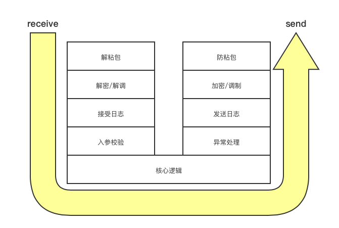。  

## ChannelInboundHandler和ChannelOutboundHandler
Netty关于Pipeline及其存储的Handle有这样的要求。  
首先根据功能，Handle分为`ChannelInboundHandler`和`ChannelOutboundHandler`两类。对于`ChannelInboundHandler`，通常有如下方法供用户实现，其主要功能是面向用户侧的状态或数据事件触发：
```java
// interface io.netty.channel.ChannelInboundHandler
// 当channel注册时触发
void channelRegistered(ChannelHandlerContext ctx) throws Exception;
// 当channel注销时触发
void channelUnregistered(ChannelHandlerContext ctx) throws Exception;
// channel连接完成时触发
void channelActive(ChannelHandlerContext ctx) throws Exception;
// channel失去连接时触发
void channelInactive(ChannelHandlerContext ctx) throws Exception;
// channel中数据已经读好时触发
void channelRead(ChannelHandlerContext ctx, Object msg) throws Exception;
// channel的本次读事件已经全部完成时触发
void channelReadComplete(ChannelHandlerContext ctx) throws Exception;
// channel的用户事件时触发（如关闭Input通道）
void userEventTriggered(ChannelHandlerContext ctx, Object evt) throws Exception;
// channel的writable state改变时触发（比如连接存续但是无法写时）
// 见io.netty.channel.AbstractChannel.AbstractUnsafe#flush0
void channelWritabilityChanged(ChannelHandlerContext ctx) throws Exception;
// 发生异常时
void exceptionCaught(ChannelHandlerContext ctx, Throwable cause) throws Exception;
```
另外，还有`ChannelOutboundHandler`：
```java
// io.netty.channel.ChannelOutboundHandler
// （服务端）将SocketAddreess与channel绑定，执行成功后触发fireChannelActive
void bind(ChannelHandlerContext ctx, SocketAddress localAddress, ChannelPromise promise) throws Exception;
// （客户端）执行连接，执行成功后触发fireChannelActive
void connect(ChannelHandlerContext ctx, SocketAddress remoteAddress,SocketAddress localAddress, ChannelPromise promise) throws Exception;
// 执行断开连接，执行完成后触发fireChannelInactive
void disconnect(ChannelHandlerContext ctx, ChannelPromise promise) throws Exception;
// 执行关闭channel，执行完成后触发fireChannelInactive，以及Unregistered
void close(ChannelHandlerContext ctx, ChannelPromise promise) throws Exception;
// 注销本channel，执行完成后触发fireChannelUnregistered
void deregister(ChannelHandlerContext ctx, ChannelPromise promise) throws Exception;
// 执行读（将数据从缓冲区读到buffer中），读取完成后执行fireChannelRead等方法
void read(ChannelHandlerContext ctx) throws Exception;
// 执行写（将msg写到缓冲区中让网卡发送）
void write(ChannelHandlerContext ctx, Object msg, ChannelPromise promise) throws Exception;
// 执行flush（强制网卡缓冲区数据发送）
void flush(ChannelHandlerContext ctx) throws Exception;
```
所以总结一下，`ChannelInboundHandler`主要用于事件响应或回调，也即在事件发生后进行处理（比如读“完成”后对读取到的数据进行处理），是用户侧的；而`ChannelOutboundHandler`主要用于发出某个指令（比如`read()`的参数列表中就没有数据，也不会将读到的数据返回`read()`的调用者），是面向硬件或者系统的。  

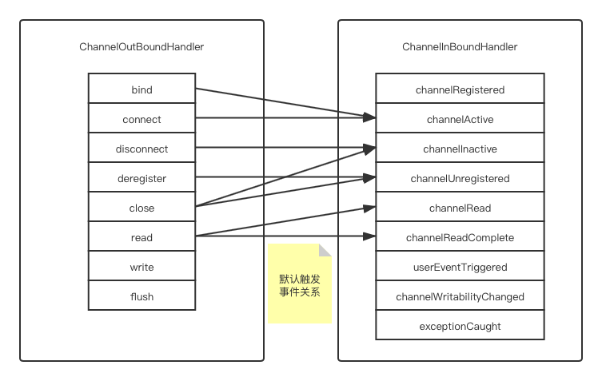  

注意，上面所说的触发关系仅仅是在Netty-all-4.1.59.Final中的默认触发情况，其他版本中可能会有所不同，而且当自己实现`ChannelOutboundHandler`时，也可以根据自己的需要去fire其他的事件。  

此外，还有一种Handler叫做DuplexHandler，同时继承自`ChannelInboundHandler`和`ChannelOutboundHandler`。这种Handler就可以同时承担这两方面的职责

## Inbound和Outbound在Pipeline中的查找方向
与ChannelInBoundHandler和OutBoundHandler不同的是，在handler中进行链式调用时，也需要考虑其Bound的方向。  
比如在某个ChannelInBoundHandler的实现中：
```java
 public void channelRead(ChannelHandlerContext ctx, Object msg) {
     ByteBuf in = (ByteBuf)msg;
     ctx.writeAndFlush(getReply(in));
     ctx.fireChannelRead(ctx, doHandle(in));
 }
```
通过ctx.write和ctx.fireChannelRead两个方法，都可以将ByteBuf转移给另一个Handler去(修改后再)写或者（继续）读。但是他们所调用的Handler是不同的（这个应该可以理解吧，除非Handler是Duplex的，不然要么只能响应ChannelInBound事件，要么只能响应ChannelOutBound事件），而且甚至在pipeline的链表中查找的方向也是不同的。  

来看一段源码：
```java
// io.netty.channel.AbstractChannelHandlerContext
private void write(Object msg, boolean flush, ChannelPromise promise) {
// 省略其他
    final AbstractChannelHandlerContext next = findContextOutbound(flush ? (MASK_WRITE | MASK_FLUSH) : MASK_WRITE);
    if (flush) {
        next.invokeWriteAndFlush(m, promise);
    } else {
        next.invokeWrite(m, promise);
    }
}
public ChannelHandlerContext fireChannelRead(final Object msg) {
    invokeChannelRead(findContextInbound(MASK_CHANNEL_READ), msg);
    return this;
}
```
在同一个实现类中，write（含writeAndFlush）与fireChannelRead在调用具体的ChannelHandler去执行时，前者是通过`findContextOutbond`，而后者是通过findContextInbound。这两者的区别在哪里呢：
```java
// io.netty.channel.AbstractChannelHandlerContext
private AbstractChannelHandlerContext findContextOutbound(int mask) {
    AbstractChannelHandlerContext ctx = this;
    EventExecutor currentExecutor = executor();
    do {
        ctx = ctx.prev;
    } while (skipContext(ctx, currentExecutor, mask, MASK_ONLY_OUTBOUND));
    return ctx;
}
private AbstractChannelHandlerContext findContextInbound(int mask) {
    AbstractChannelHandlerContext ctx = this;
    EventExecutor currentExecutor = executor();
    do {
        ctx = ctx.next;
    } while (skipContext(ctx, currentExecutor, mask, MASK_ONLY_INBOUND));
    return ctx;
}
```
可以看到，两者就是复制粘贴的关系，唯一的区别就是，findOutbound时，循环体内是`ctx = ctx.prev`，而findInbound是`ctx = ctx.next`。这里就可以看出来Outbound是向前查找合适的handler，而Inbound是向后查找合适的handler。  
所以原则上对输入的处理要放在后面，对输出的处理要放在前面。而且不论对于输入还是输出，越靠前的数据往往被包装的层级越多，越靠后的则越接近业务数据。当然，考虑到异常是Inbound的，所以一般情况下会在最后插入一个异常处理的handler。那么对于本章开头的那个输入输出逻辑，其各个handler在pipeline中的排布可能是下面图中的样子（不绝对，顺序应当根据业务逻辑调整，比如日志到底放在那里）：  
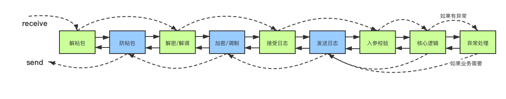  
其中绿色的是`ChannelInbondHandler`，蓝色的是`ChannelOutboundHandler`。  

## 真实的Pipeline
上面所说的pipeline其实只是为了方便叙述而简化的模型，真正的pipeline内部并不是直接承载着Handler，而是通过`ChannelHandlerContext`去承载。在其抽象实现`AbstractChannelHandlerContext`中，有2个指针，这就是pipeline中的链表关节：
```java
// io.netty.channel.AbstractChannelHandlerContext
volatile AbstractChannelHandlerContext next;
volatile AbstractChannelHandlerContext prev;
```
而在`ChannelPipeline`的实现`DefaultChannePipeline`中，存在两个指针，它们就会指向首尾各1个`AbstractChannelHandlerContext`：
```java
// io.netty.channel.DefaultChannelPipeline
final AbstractChannelHandlerContext head;
final AbstractChannelHandlerContext tail;
```
但是如果有心的话，在运行时对pipeline下断点，会惊讶地发现无论是`head`还是`tail`，指向的都不是我们自定义的`ChannelHandler`。而是`DefaultChannelPipeline`中实现的两个内部类`HeadContext`和`TailContext`，均继承自`AbstractChannelHandlerContext`，而且都实现了所有的`ChannelInboundHandler`的接口（也就是上面提到的fireXXX等）和`ChannelOutboundHandler`中的接口（也就是上面提到的bind、read、write等）。这是要干什么呢？  

对于`HeadContext`，可以看一下源码，其关于`ChannelOutboundHandler`的那些接口，都相当于`io.netty.channel.Channel.Unsafe`的同名方法的代理；而关于`ChannelInboundHandler`的那些接口，则直接通过`ctx`向后调用同名方法。  
继续往下，可以看到这个`Unsafe`接口的实现很多，但都很明确，那就是调用具体的（Epoll、Select、KQueue等）的实现类来进行实际的read、write、bind操作。  
那么`HeadContext`的作用就很清楚了，在调用Outbound系列方法时，通过`HeadContext`兜底，让自定义的排在最前面的OutboundHandler在调用诸如`ctx.write`时，可以真正触发向网卡“写”的操作。  

同理，对于`TailContext`，它是Inbound方向上的兜底。比如exceptionCaught方法，当最后一个自定义handler仍然执行`ctx.fireExceptionCaught(ctx, throwable)`，`TailContext`就可以将其log下来：
```java
// io.netty.channel.DefaultChannelPipeline.TailContext
public void exceptionCaught(ChannelHandlerContext ctx, Throwable cause) {
    onUnhandledInboundException(cause);
}
protected void onUnhandledInboundException(Throwable cause) {
    try {
        logger.warn("An exceptionCaught() event was fired, and it reached at the tail of the pipeline. It usually means the last handler in the pipeline did not handle the exception.", cause);
    } finally {
        ReferenceCountUtil.release(cause);
    }
}
```

## ctx.read()不要也罢？
最后，可能会有人问，ChannelOutBoundHandler的read()有什么用，从来都没有调用过，不是也依然每次都能够自动进入`ChannelRead()`方法么？  

这是因为Netty庞大的默认配置，不信的话，在初始化`NioServerSocketChannel`的时候，进行这样的设置：
```java
NioServerSocketChannel server = new NioServerSocketChannel();
server.config().setAutoRead(false);
```
你会发现没有触发`fireChannelRead()`了。而这时，只能在所有需要的场合下，提前发出`ctx.read()`指令，比如在NioChannel Actived之后、在每一次read之后等等，很多细碎的细节，但是自己控制实在是太麻烦了，写多了怕消耗性能，写少了又怕在某个环节忘记read造成卡死。所以如果不是需要精确控制的话，乖乖使用autoRead吧。  

## 一个测试用例
下面是一个用来测试InboundHandler和OutboundHandler的测试用例，代码已经放在[我的GitHub仓库](https://github.com/discko/learnio/tree/master/trynetty/src/main/java/space/wudi/learnio/nettyInOut)中了，欢迎随时取用。  

其主要作用是，客户端每发送过来一个字符串，则在经过InBoundHandler的时候都将自己的handlerName拼接在上面，并返回客户端。  
handler的顺序如下：
```java
serverPipeline.addLast(new InHandler(group, (remoteAddress -> {
    final List<ChannelHandler> handlers = new ArrayList<>();
    handlers.add(new OutHandler("ClientOut0"));
    handlers.add(new InHandler("ClientIn1"));
    handlers.add(new OutHandler("ClientOut1"));
    handlers.add(new InHandler("ClientIn2"));
    handlers.add(new OutHandler("ClientOut2"));
    return handlers;
}), "AcceptIn1"));
```
比如客户端发送“Hello”，则应该收到的是：

> HelloClientIn1  
> HelloClientIn1ClientIn2

下图是调用过程，与预期是完全一致的：  
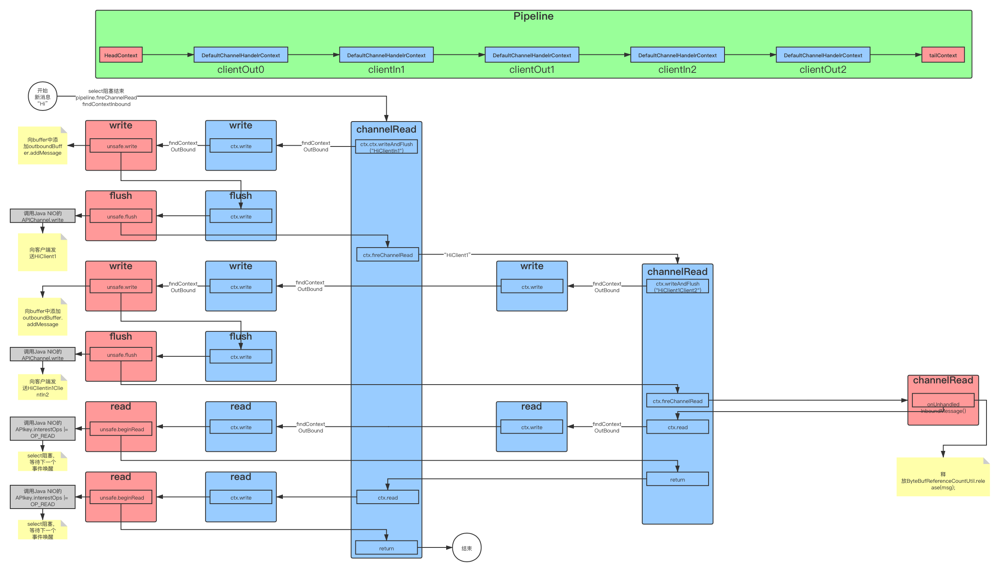  
图中红色的是HeadContext和TailContext，蓝色的是自定义的handler。  

## 为什么需要以如此麻烦的方式给childHandler赋值
### 问题的描述
在新手期，可能会遇到这样的问题，比如通过ServerBootstrap给childHandler赋值时，本来是这么写的：
```java
// 错误的写法
ServerBootstrap serverBootstrap = new ServerBootstrap();
ClientHandler clientHandler = new ClientHandler();
serverBootstrap.childHandler(new ChannelInitializer<SocketChannel>() {
    @Override
    protected void initChannel(SocketChannel ch) throws Exception {
        ch.pipeline().addLast(clientHandler);
    }
});
```
甚至在简单测试时都没有问题。但是当同时有2个客户端连接过来时，控制台上马上就会打印出这样的红字：
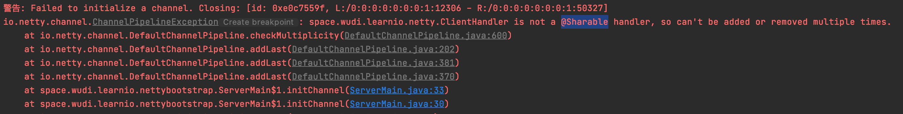  
提示信息也很清晰，那就是加入的这个handler没有标注为@Sharable的。  
加上这个注解是很简单的，但是为什么呢？甚至会问，为什么要通过ChannelInitializer这个抽象类去传递childHandler而直接传入呢？  

同样，在不使用Bootstrap的时候，同样可能会出现这样的问题：
```java
// 错误的写法
final List<ChannelHandler> handlers = new ArrayList<>();
handlers.add(new OutHandler("ClientOut0"));
handlers.add(new InHandler("ClientIn1"));
handlers.add(new OutHandler("ClientOut1"));
handlers.add(new InHandler("ClientIn2"));
handlers.add(new OutHandler("ClientOut2"));
NioEventLoopGroup group = new NioEventLoopGroup(3);
NioServerSocketChannel server = new NioServerSocketChannel();
server.pipeline().addLast(new InHandler(group, handlers), "AcceptIn1"));
// new InHandler(NioEventLoopGroup, List<ChildHandler>)
```
写的时候初看觉得没什么问题，顺序也决定好了，东西也传进去了。但是在连接时，同样会报出@Sharable的错误。  

### 问题的解释
这个问题其实解释起来也很简单，甚至不需要去翻源码。  
当我们的ServerHandler触发ChannelRead事件后，我们知道，是新的客户端来了，这时我们会为新的客户端的NioChannel的pipeline中加入In和Outbound的handler。  

而如果加入到pipeline中的handler是在外面就new好的，那么显然无论新建多少客户端channel，他们中的handler都是相同的那几个对象。  
相同的对象就意味着他们在执行各个事件时是共享的，不但可能存在并发隐患，甚至记录在handler中的channel的状态也会因为handler的共享而被混淆。  

正因如此，如果确定自己的handler即使被多个channel共享也不会有问题，那么就通过@Sharable，显式地标记其为可以共享的，否则就需要一个工具函数，在accept客户端channel时，现场new出这些handler。  
所以ChannelInitializer发挥的其实是一个Functional Interface的功能，如果要求不高的话，完全可以像我一样，用一个`Function<SocketAddress, Collection<ChannelHandler>>`来代替，这样就可以开心地一个lambda写过去了：
```java
serverPipeline.addLast(new InHandler(group, (remoteAddress -> {
    final List<ChannelHandler> handlers = new ArrayList<>();
    handlers.add(new OutHandler("ClientOut0"));
    handlers.add(new InHandler("ClientIn1"));
    handlers.add(new OutHandler("ClientOut1"));
    handlers.add(new InHandler("ClientIn2"));
    handlers.add(new OutHandler("ClientOut2"));
    return handlers;
}), "AcceptIn1"));
```
当然，ChannelInitializer的可取之处在于他本身就是一个handler，可以直接将其加入到pipeline中，就不需要额外的代码将自定义的handler取出来加入pipeline中了。