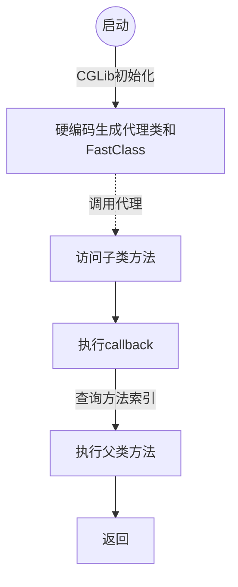

[前一篇文章](/2020/12/12/ReadSource-SpringAOP-02JdkDynamicProxy/)主要分析了一下JdkDynamicProxy的调用方法和生成过程。本文将切换到CG Lib的动态代理，来看看有没有什么不一样的地方。
<!--more-->
# 自己写一个代理（通过继承）
前一篇文章使用Jdk Dynamic Proxy，其核心是获取目标对象的接口，然后根据这些接口，实现所有接口中的方法，并在这些方法中调用目标对象的同名方法，并在调用前后做一些处理。由于使用了InvocationHandler，所以其核心是通过反射来执行原被代理的目标对象的方法。代理对象和目标对象两者是平级的，都是某个或某些接口的实现。  
在较早版本的java中，运行时的反射效率比较低，而且JdkDynamicProxy只能代理接口中的方法，所以CgLib换成了另外一个思路。  
除了使用接口来获得某个对象的方法外，还可以使用继承。CgLib就是这样，创建一个新的类，并继承自目标对象。然后覆盖目标方法，在其中调用父对象（也就是目标对象类）的同名方法，并在前后增加一些切面处理。大概就是下面这样：
```java
// 目标类
// package space.wudi.readsourceaop.cglibproxy.codemyself
class Target{
    void method(){System.out.println("in target method");}
}
// 代理类
class Proxy extends Target{
    @Override
    void method(){
        System.out.println("before target method");
        super.method();
        System.out.println("after target method");
    }
}
// 测试类
class Main{
    public static void main(String[] args){
        Target target = new Proxy();
        target.method();
    }
}
```
这样就完成了代理。
最终输出结果如下：

> before target method  
> in target method  
> after target method   

# 使用CgLib生成代理并调用
这次为了简单，使用了public static void main去调用CgLib直接生成代理并调用，来看看其执行过程是什么样子的。
## 编写代码并执行
创建一个目标对象`TargetObject`，为其增加2个方法：
```java
package space.wudi.readsourceaop.cglibproxy.createproxy;
public class TargetObject {
    void sayHi(String to){
        System.out.println("Hi, "+to+"!");
    }
    String whoAreYou(String from){
        return String.format("Hi %s, it's WuDi", from);
    }
}
```
创建一个方法拦截器，继承自`MethodInterceptor`：
```java
package space.wudi.readsourceaop.cglibproxy.createproxy;
import org.springframework.cglib.proxy.MethodInterceptor;
import org.springframework.cglib.proxy.MethodProxy;
import java.lang.reflect.Method;
public class MyMethodInterceptor implements MethodInterceptor {
    private final String id;
    MyMethodInterceptor(String id){
        this.id = id;
    }
    @Override
    public Object intercept(Object sub, Method method, Object[] args, MethodProxy methodProxy) throws Throwable {
        System.out.println("before from "+id);
        Object rtVal = methodProxy.invokeSuper(sub, args);
        System.out.println("after from "+id+" with rtVal: "+rtVal);
        return rtVal;
    }
}
```
创建代理对象：
```java
package space.wudi.readsourceaop.cglibproxy.createproxy;
import org.springframework.cglib.core.DebuggingClassWriter;
import org.springframework.cglib.proxy.Callback;
import org.springframework.cglib.proxy.Enhancer;
public class ProxyCreator {
    final static String SAVE_PATH = "/Users/wudi/program/javaworkspace/readsource/readsource-aop/target";
    public static TargetObject createByNormalInterceptor(){
        System.setProperty(DebuggingClassWriter.DEBUG_LOCATION_PROPERTY, SAVE_PATH);
        Enhancer enhancer = new Enhancer();
        enhancer.setSuperclass(TargetObject.class);
        enhancer.setCallbacks(new Callback[]{new MyMethodInterceptor("a"), new MyMethodInterceptor("b")});
        //如果method名字包含"say"则使用callbacks[0]否则使用callbacks[1]
        enhancer.setCallbackFilter(method -> method.getName().contains("say") ? 0 : 1);
        return (TargetObject)enhancer.create();
    }
}
```
调用：
```java
package space.wudi.readsourceaop.cglibproxy.createproxy;
public class Main {
    public static void main(String[] args) {
        TargetObject to = ProxyCreator.createByNormalInterceptor();
        to.sayHi("WuDi");
        String response = to.whoAreYou("stranger");
        System.out.println(response);
    }
}

```
最终在控制台可以看到如下输入：  

> before from a  
> Hi, WuDi!  
> after from a with rtVal: null  
> before from b  
> after from b with rtVal: Hi stranger, it's WuDi  
> Hi stranger, it's WuDi   

## 调用过程
那么调用过程是怎样的呢？  

可以想见，实际调用的并非`TargetObject`，而应该是其代理对象。  
由于上面开启了将CGLib生成的对象输出到文件的选项(`System.setProperty(DebuggingClassWriter.DEBUG_LOCATION_PROPERTY, SAVE_PATH);`)，所以可以在`SAVE_PATH`指定的位置根据目标对象的包名找到新生成的3个对象。  
  
这三个对象分别是：  

* `TargetObject$$EnhancerByCGLIB$$5307ad86.class`：这个就是CGLib增强后的代理类。
* `TargetObject$$EnhancerByCGLIB$$5307ad86$$FastClassByCGLIB$$a80b111f.class`：这个名字超长的是上面那个代理类的辅助索引类，也就是所谓的代理类的FastClass。  
* `TargetObject$$FastClassByCGLIB$$799a8d8d.class`：这个是目标类的辅助索引FastClass。  
这三个文件怎么用呢，我们接下去看。

### CG代理对象中的调用
将生成的代理类class文件反编译后，可以看到它继承自`TargetObject`：
```java
public class TargetObject$$EnhancerByCGLIB$$5307ad86 extends TargetObject implements Factory{
    //xxx
}
```
然后是继承的两个方法，由于一个有返回值，一个没有返回值，所以后半部分不太一样
```java
// 调用目标对象（也就是父类）的sayHi方法
final void CGLIB$sayHi$0(String var1) {
    super.sayHi(var1);
}
// 代理目标对象（也就是父类）的sayHi方法
final void sayHi(String var1) {
    MethodInterceptor var10000 = this.CGLIB$CALLBACK_0;
    if (this.CGLIB$CALLBACK_0 == null) {
        CGLIB$BIND_CALLBACKS(this);
        var10000 = this.CGLIB$CALLBACK_0;
    }
    if (var10000 != null) {
        var10000.intercept(this, CGLIB$sayHi$0$Method, new Object[]{var1}, CGLIB$sayHi$0$Proxy);
    } else {
        super.sayHi(var1);
    }
}
// 调用目标对象（也就是父类）的whoAreYou方法
final String CGLIB$whoAreYou$1(String var1) {
    return super.whoAreYou(var1);
}
// 代理目标对象（也就是父类）的whoAreYou方法
final String whoAreYou(String var1) {
    MethodInterceptor var10000 = this.CGLIB$CALLBACK_1;
    if (this.CGLIB$CALLBACK_1 == null) {
        CGLIB$BIND_CALLBACKS(this);
        var10000 = this.CGLIB$CALLBACK_1;
    }
    return var10000 != null ? (String)var10000.intercept(this, CGLIB$whoAreYou$1$Method, new Object[]{var1}, CGLIB$whoAreYou$1$Proxy) : super.whoAreYou(var1);
}
```
两个方法的前半部分都是获取本方法需要使用的方法拦截器，如果获取失败了，就通过懒加载，将callbacks列表绑定到`this.CGLIB$CALLBACK_n`（这个`n`应该就是callbacks数组中的序号了，看来在编译时就已经将callback与目标方法一一硬编码配对上了） ，然后调用方法拦截器的`intercept()`方法就可以了。而这个方法，就是我们在`MyMethodInterceptor`中实现的那个方法。  

可以看到，`intercept(Object sub, Method method, Object[] args, MethodProxy methodProxy)`有4个参数：

* Object sub：增强后的对象（也即代理对象），所以传入了`this`
* Method method：需要调用的目标对象中的方法，所以传入了格式类似于`CGLIB$目标方法名$方法索引$Method`这样的变量，如`CGLIB$sayHi$0$Method`
* Object[] args：调用方法的参数，直接将入参传入
* MethodProxy methodProxy：一个方法代理器，命名格式大致是`CGLIB$目标方法名$方法索引$Proxy`，如`CGLIB$sayHi$0$Proxy`。

`sub`和`args`应该问题不大。我们首先来看看method和proxy是如何绑定的。全局有一个static方法块，里面调用了`CGLIB$STATICHOOK1()`，而这个函数里面对对这个代理对象中的所有奇怪属性进行了初始化。
```java
static void CGLIB$STATICHOOK1() {
        CGLIB$THREAD_CALLBACKS = new ThreadLocal();
        CGLIB$emptyArgs = new Object[0];
        // var0是代理对象的class
        Class var0 = Class.forName("space.wudi.readsourceaop.cglibproxy.createproxy.TargetObject$$EnhancerByCGLIB$$5307ad86");
        // var1是目标对象的class，在初始化Method[] var10000时定义
        Class var1;
        // 获取sayHi和whoAreYou等自定义方法
        Method[] var10000 = ReflectUtils.findMethods(new String[]{"sayHi", "(Ljava/lang/String;)V", "whoAreYou", "(Ljava/lang/String;)Ljava/lang/String;"}, (var1 = Class.forName("space.wudi.readsourceaop.cglibproxy.createproxy.TargetObject")).getDeclaredMethods());
        CGLIB$sayHi$0$Method = var10000[0];
        CGLIB$sayHi$0$Proxy = MethodProxy.create(var1, var0, "(Ljava/lang/String;)V", "sayHi", "CGLIB$sayHi$0");
        CGLIB$whoAreYou$1$Method = var10000[1];
        CGLIB$whoAreYou$1$Proxy = MethodProxy.create(var1, var0, "(Ljava/lang/String;)Ljava/lang/String;", "whoAreYou", "CGLIB$whoAreYou$1");
        // 获取equals、toString、hashCode、clone这4个自带的方法
        var10000 = ReflectUtils.findMethods(new String[]{"equals", "(Ljava/lang/Object;)Z", "toString", "()Ljava/lang/String;", "hashCode", "()I", "clone", "()Ljava/lang/Object;"}, (var1 = Class.forName("java.lang.Object")).getDeclaredMethods());
        CGLIB$equals$2$Method = var10000[0];
        CGLIB$equals$2$Proxy = MethodProxy.create(var1, var0, "(Ljava/lang/Object;)Z", "equals", "CGLIB$equals$2");
        CGLIB$toString$3$Method = var10000[1];
        CGLIB$toString$3$Proxy = MethodProxy.create(var1, var0, "()Ljava/lang/String;", "toString", "CGLIB$toString$3");
        CGLIB$hashCode$4$Method = var10000[2];
        CGLIB$hashCode$4$Proxy = MethodProxy.create(var1, var0, "()I", "hashCode", "CGLIB$hashCode$4");
        CGLIB$clone$5$Method = var10000[3];
        CGLIB$clone$5$Proxy = MethodProxy.create(var1, var0, "()Ljava/lang/Object;", "clone", "CGLIB$clone$5");
    }

```
#### 目标对象的Method对象的生成
从这里面看到，method是通过`ReflectUtils.findMethods()`来获取的，而proxy是通过`MethodProxy.create()`来生成的。
先看看method：
```java
// org.springframework.cglib.core.ReflectUtils
public static Method[] findMethods(String[] namesAndDescriptors, Method[] methods) {
		Map map = new HashMap();
		for (int i = 0; i < methods.length; i++) {
			Method method = methods[i];
			map.put(method.getName() + Type.getMethodDescriptor(method), method);
		}
		Method[] result = new Method[namesAndDescriptors.length / 2];
		for (int i = 0; i < result.length; i++) {
			result[i] = (Method) map.get(namesAndDescriptors[i * 2] + namesAndDescriptors[i * 2 + 1]);
			if (result[i] == null) {
				// TODO: error?
			}
		}
		return result;
	}
```
初看比较费解，这不是什么事情都没有干么，就将入参method返回出去。仔细一想，应该是在目标类中可能存在不需要代理的方法，传入的String[]中描述了所有需要代理的方法，通过这种方式过滤一遍，只将需要方法的组成数组再传出去。  

#### 方法代理MethodProxy的生成
然后再看MethodProxy。`MethodProxy.create()`以及MethodProxy中的一个内部类CreateInfo在这里：
```java
// org.springframework.cglib.proxy.MethodProxy
public static MethodProxy create(Class c1, Class c2, String desc, String name1, String name2) {
    // c1对应于var1，也就是目标类；c2对应于var0，也就是代理类
    MethodProxy proxy = new MethodProxy();
    proxy.sig1 = new Signature(name1, desc);
    proxy.sig2 = new Signature(name2, desc);
    proxy.createInfo = new CreateInfo(c1, c2);
    return proxy;
}
private static class CreateInfo {
    Class c1;
    Class c2;
    NamingPolicy namingPolicy;
    GeneratorStrategy strategy;
    boolean attemptLoad;
    public CreateInfo(Class c1, Class c2) {
        this.c1 = c1;
        this.c2 = c2;
        AbstractClassGenerator fromEnhancer = AbstractClassGenerator.getCurrent();
        if (fromEnhancer != null) {
            namingPolicy = fromEnhancer.getNamingPolicy();
            strategy = fromEnhancer.getStrategy();
            attemptLoad = fromEnhancer.getAttemptLoad();
        }
    }
}
```
所以全局变量createInfo中的c1就是目标类的class，c2就是代理类的class。而MethodProxy的sig1就是用于代理父类目标方法的方法签名（比如上面代理类中的sayHi，sig2就是实际可以调用父类目标方法的方法签名（比如上面代理类中的CGLIB$sayHi$0）。
换句话说，1就是目标类相关的，2就是代理类相关的。

### 使用MethodProxy

method和methodProxy都生成之后，传入intercept()方法就可以调用了。接下来
来看看方法代理器MethodProxy是如何工作的。我
#### 生成FastClassInfo并获取对应方法的索引
将相关的代码都贴在下面。可以看出来，这里调用init()，然后获取FastClassInfo，最后利用FastClassInfo去调用。流程很清晰，具体是怎么做的呢？
```java
// org.springframework.cglib.proxy.MethodProxy
public Object invokeSuper(Object obj, Object[] args) throws Throwable {
    try {
        init();
        FastClassInfo fci = fastClassInfo;
        return fci.f2.invoke(fci.i2, obj, args);
    }
    catch (InvocationTargetException e) {
        throw e.getTargetException();
    }
}
private void init() {
    if (fastClassInfo == null) {
        synchronized (initLock) {
            if (fastClassInfo == null) {
                CreateInfo ci = createInfo;
                FastClassInfo fci = new FastClassInfo();
                fci.f1 = helper(ci, ci.c1);
                fci.f2 = helper(ci, ci.c2);
                fci.i1 = fci.f1.getIndex(sig1);
                fci.i2 = fci.f2.getIndex(sig2);
                fastClassInfo = fci;
                createInfo = null;
            }
        }
    }
}
private static FastClass helper(CreateInfo ci, Class type) {
    FastClass.Generator g = new FastClass.Generator();
    g.setType(type);
    // SPRING PATCH BEGIN
    g.setContextClass(type);
    // SPRING PATCH END
    g.setClassLoader(ci.c2.getClassLoader());
    g.setNamingPolicy(ci.namingPolicy);
    g.setStrategy(ci.strategy);
    g.setAttemptLoad(ci.attemptLoad);
    return g.create();
}
private static class FastClassInfo {
    FastClass f1;
    FastClass f2;
    int i1;
    int i2;
}
```
首先调用`init()`，对全局变量`fastClassInfo`初始化。`fastClassInfo`来自于MethodProxy对象中的createInfo对象。可以看到FastClassInfo中也存在两组`f`和`i`，是与createInfo中的`c`一一对应的，1表示目标对象中的，2表示代理对象中的。利用`helper()`将create中的两个`c`，生成对应的FastClass，从而得到2个`f`。然后调用这两个`fastClass中的getIndex()`，为`i`赋值。那么可以猜想，`i`表示的应该就是`index`也就是索引了。  
`getIndex`怎么做的呢，那就需要利用上面生成的3个class的后两个来看了。  
首先是目标对象的`getIndex()`。
```java
// in class file: TargetObject$$FastClassByCGLIB$$799a8d8d.class
public int getIndex(Signature var1) {
    String var10000 = var1.toString();
    switch(var10000.hashCode()) {
    case -1119198413:
        if (var10000.equals("sayHi(Ljava/lang/String;)V")) {
            return 0;
        }
        break;
    case -256920502:
        if (var10000.equals("whoAreYou(Ljava/lang/String;)Ljava/lang/String;")) {
            return 1;
        }
        break;
    case 1826985398:
        if (var10000.equals("equals(Ljava/lang/Object;)Z")) {
            return 2;
        }
        break;
    case 1913648695:
        if (var10000.equals("toString()Ljava/lang/String;")) {
            return 3;
        }
        break;
    case 1984935277:
        if (var10000.equals("hashCode()I")) {
            return 4;
        }
    }
    return -1;
}
```
也就是说，通过`createInfo`中生成的`Signature`，将其`toString()`之后的字符串对象的`hashcode`，硬编码成了对应的`index`。
那么同理，在代理对象中也是这样的：
```java
// in class file: TargetObject$$EnhancerByCGLIB$$5307ad86$$FastClassByCGLIB$$a80b111f.class
public int getIndex(Signature var1) {
    String var10000 = var1.toString();
    switch(var10000.hashCode()) {
    case -1870561232:
        if (var10000.equals("CGLIB$findMethodProxy(Lorg/springframework/cglib/core/Signature;)Lorg/springframework/cglib/proxy/MethodProxy;")) {
            return 10;
        }
        break;
    case -1745842178:
        if (var10000.equals("setCallbacks([Lorg/springframework/cglib/proxy/Callback;)V")) {
            return 2;
        }
        break;
    case -1641413109:
        if (var10000.equals("newInstance([Lorg/springframework/cglib/proxy/Callback;)Ljava/lang/Object;")) {
            return 21;
        }
        break;
    case -1457535688:
        if (var10000.equals("CGLIB$STATICHOOK1()V")) {
            return 3;
        }
        break;
    case -1411812934:
        if (var10000.equals("CGLIB$hashCode$4()I")) {
            return 8;
        }
        break;
    case -1119198413:
        if (var10000.equals("sayHi(Ljava/lang/String;)V")) {
            return 0;
        }
        break;
    case -1034266769:
        if (var10000.equals("CGLIB$SET_STATIC_CALLBACKS([Lorg/springframework/cglib/proxy/Callback;)V")) {
            return 12;
        }
        break;
    case -1025895669:
        if (var10000.equals("CGLIB$SET_THREAD_CALLBACKS([Lorg/springframework/cglib/proxy/Callback;)V")) {
            return 13;
        }
        break;
    case -988317324:
        if (var10000.equals("newInstance([Ljava/lang/Class;[Ljava/lang/Object;[Lorg/springframework/cglib/proxy/Callback;)Ljava/lang/Object;")) {
            return 22;
        }
        break;
    case -508378822:
        if (var10000.equals("clone()Ljava/lang/Object;")) {
            return 19;
        }
        break;
    case -385262742:
        if (var10000.equals("CGLIB$sayHi$0(Ljava/lang/String;)V")) {
            return 4;
        }
        break;
    case -256920502:
        if (var10000.equals("whoAreYou(Ljava/lang/String;)Ljava/lang/String;")) {
            return 1;
        }
        break;
    case 374345669:
        if (var10000.equals("CGLIB$equals$2(Ljava/lang/Object;)Z")) {
            return 6;
        }
        break;
    case 610042816:
        if (var10000.equals("newInstance(Lorg/springframework/cglib/proxy/Callback;)Ljava/lang/Object;")) {
            return 20;
        }
        break;
    case 1132856532:
        if (var10000.equals("getCallbacks()[Lorg/springframework/cglib/proxy/Callback;")) {
            return 15;
        }
        break;
    case 1246779367:
        if (var10000.equals("setCallback(ILorg/springframework/cglib/proxy/Callback;)V")) {
            return 11;
        }
        break;
    case 1364367423:
        if (var10000.equals("getCallback(I)Lorg/springframework/cglib/proxy/Callback;")) {
            return 14;
        }
        break;
    case 1388004980:
        if (var10000.equals("CGLIB$whoAreYou$1(Ljava/lang/String;)Ljava/lang/String;")) {
            return 5;
        }
        break;
    case 1517819849:
        if (var10000.equals("CGLIB$toString$3()Ljava/lang/String;")) {
            return 7;
        }
        break;
    case 1826985398:
        if (var10000.equals("equals(Ljava/lang/Object;)Z")) {
            return 16;
        }
        break;
    case 1913648695:
        if (var10000.equals("toString()Ljava/lang/String;")) {
            return 17;
        }
        break;
    case 1984935277:
        if (var10000.equals("hashCode()I")) {
            return 18;
        }
        break;
    case 2011844968:
        if (var10000.equals("CGLIB$clone$5()Ljava/lang/Object;")) {
            return 9;
        }
    }
    return -1;
}
```
（太tm长了）可以看到，里面不但有代理方法和调用父类的方法，还有其他的各种奇奇怪怪但确实在代理类中存在的方法。  

### 通过索引调用方法
接下来就是调用了。`fci.f2.invoke(fci.i2, obj, args)`。从这里可以看出来，直接通过f2（也就是代理对象的FastClass）去调用目标对象中的索引为i2的那个方法。需要注意的是，这里的obj其实是就是代理类的实例（因为在调用intercept时传入的是this）。这样，查看代理类的FastClass，看看invoke：   
```java
// in class file: TargetObject$$EnhancerByCGLIB$$5307ad86$$FastClassByCGLIB$$a80b111f.class
public Object invoke(int var1, Object var2, Object[] var3) throws InvocationTargetException {
    // 5307ad86是被反编译识别错误的代理类
    5307ad86 var10000 = (5307ad86)var2;
    int var10001 = var1;
    try {
        switch(var10001) {
        case 0:
            var10000.sayHi((String)var3[0]);
            return null;
        case 1:
            return var10000.whoAreYou((String)var3[0]);
        case 2:
            var10000.setCallbacks((Callback[])var3[0]);
            return null;
        case 3:
            5307ad86.CGLIB$STATICHOOK1();
            return null;
        case 4:
            var10000.CGLIB$sayHi$0((String)var3[0]);
            return null;
        case 5:
            return var10000.CGLIB$whoAreYou$1((String)var3[0]);
        case 6:
            return new Boolean(var10000.CGLIB$equals$2(var3[0]));
        case 7:
            return var10000.CGLIB$toString$3();
        case 8:
            return new Integer(var10000.CGLIB$hashCode$4());
        case 9:
            return var10000.CGLIB$clone$5();
        case 10:
            return 5307ad86.CGLIB$findMethodProxy((Signature)var3[0]);
        case 11:
            var10000.setCallback(((Number)var3[0]).intValue(), (Callback)var3[1]);
            return null;
        case 12:
            5307ad86.CGLIB$SET_STATIC_CALLBACKS((Callback[])var3[0]);
            return null;
        case 13:
            5307ad86.CGLIB$SET_THREAD_CALLBACKS((Callback[])var3[0]);
            return null;
        case 14:
            return var10000.getCallback(((Number)var3[0]).intValue());
        case 15:
            return var10000.getCallbacks();
        case 16:
            return new Boolean(var10000.equals(var3[0]));
        case 17:
            return var10000.toString();
        case 18:
            return new Integer(var10000.hashCode());
        case 19:
            return var10000.clone();
        case 20:
            return var10000.newInstance((Callback)var3[0]);
        case 21:
            return var10000.newInstance((Callback[])var3[0]);
        case 22:
            return var10000.newInstance((Class[])var3[0], (Object[])var3[1], (Callback[])var3[2]);
        }
    } catch (Throwable var4) {
        throw new InvocationTargetException(var4);
    }

    throw new IllegalArgumentException("Cannot find matching method/constructor");
}
```
由于类名中含有`$`符号，被反编译工具认为成了子类，以至于在import的时候因为名字上出现`$$`而认为是某个空类的子类，最终认为某个类名叫做`5307ad86`。所以这个`5307ad86`可以认为就是代理类。
```java
import space.wudi.readsourceaop.cglibproxy.createproxy.TargetObject..EnhancerByCGLIB..5307ad86;
```
由于代理类中调用的sayHi()中使用的是`CGLIB$sayHi$0$Proxy`，而这个MethodProxy是通过`CGLIB$sayHi$0$Proxy = MethodProxy.create(var1, var0, "(Ljava/lang/String;)V", "sayHi", "CGLIB$sayHi$0");`生成的，所以其sig2就是`new Signature("CGLIB$sayHi$0", "(Ljava/lang/String;)V")`，`toString()`之后就是`"CGLIB$sayHi$0(Ljava/lang/String;)V")"`，通过在代理类的FastClass中通过`getIndex()`获取到的索引就是`4`：
```java
case -385262742:
    if (var10000.equals("CGLIB$sayHi$0(Ljava/lang/String;)V")) {
        return 4;
    }
    break;
```
所以，最后invoke的时候进入：
```java
case 4:
    var10000.CGLIB$sayHi$0((String)var3[0]);
    return null;
```
也就是：
```java
final void CGLIB$sayHi$0(String var1) {
    super.sayHi(var1);
}
```
终于千辛万苦调用到了父类的方法。

## 总结一下
就是在启动后初始化时通过硬编码的方式，生成代理类的FastClass，其中存放了各个可以调用的方法的索引。  
在需要调用时，由于调用的是子类覆盖的方法，所以可以可以执行一些自定义的代理（也就是callback），然后通过MethodProxy，利用其中存放的方法索引，快速找到父类被覆盖方法，并通过super去调用。

这样一来，调用时就不会通过反射了，某种程度上增快了速度。  
不过jdk7之后对反射进行了优化，实际测试下来，jdkDynamic的速度反而要快一点，特别是调用次数很多的情况下，更为明显。



# CGLib在Spring中创建代理的过程

## 创建开始的地方
前面是通过CGLib创建了一个代理，用来对自己编写的简单类进行代理。如果是在Spring框架中，会怎么做呢？  
我们在[前一篇文章]((/2020/12/12/ReadSource-SpringAOP-02JdkDynamicProxy/))中已经介绍了切面和责任链是是如何初始化，这在CGLib中是一样的，从前面的AOP注册，一直到这里：
```java
// org.springframework.aop.framework.DefaultAopProxyFactory
public AopProxy createAopProxy(AdvisedSupport config) throws AopConfigException {
    if (!IN_NATIVE_IMAGE &&
            (config.isOptimize() || config.isProxyTargetClass() || hasNoUserSuppliedProxyInterfaces(config))) {
        Class<?> targetClass = config.getTargetClass();
        if (targetClass == null) {
            throw new AopConfigException("TargetSource cannot determine target class: Either an interface or a target is required for proxy creation.");
        }
        if (targetClass.isInterface() || Proxy.isProxyClass(targetClass)) {
            return new JdkDynamicAopProxy(config);
        }
        return new ObjenesisCglibAopProxy(config);
    }
    else {
        return new JdkDynamicAopProxy(config);
    }
}
```
当`target`没有接口，或者是Proxy的实现（且已经在`ProxyCache`中），就用`ObjenesisCglibAopProxy`来初始化。（然后调用其`getProxy()`方法就能获得动态代理对象了）。  
从Spring 4开始，`ObjenesisCglibAopProxy`就是默认的CgLib动态代理对象的生成器。它与原本的`CglibAopProxy`没有很大的区别，主要就是不会代理构造方法。
下面就是`ObjenesisCglibAopProxy`类的注释
> Objenesis-based extension of {@link CglibAopProxy} to create proxy instances without invoking the constructor of the class. Used by default as of Spring 4.

那我们就跟着调试工具继续往下看。  

```java
// org.springframework.aop.framework.ObjenesisCglibAopProxy
public ObjenesisCglibAopProxy(AdvisedSupport config) {
    super(config);
}
```
直接调用父类也就是`CglibAopProxy`的同名构造方法：
```java
// org.springframework.aop.framework.CglibAopProxy
public CglibAopProxy(AdvisedSupport config) throws AopConfigException {
    Assert.notNull(config, "AdvisedSupport must not be null");
    if (config.getAdvisorCount() == 0 && config.getTargetSource() == AdvisedSupport.EMPTY_TARGET_SOURCE) {
        throw new AopConfigException("No advisors and no TargetSource specified");
    }
    this.advised = config;
    this.advisedDispatcher = new AdvisedDispatcher(this.advised);
}
```
我们先回顾一下AdvisedSupport里有些什么。从下面的图里可以看到，最主要的是2个，一个是目标对象的引用，还有一个是advisor链。  
  
`CgLibProxy`初始化之后，一路返回至`org.springframework.aop.framework.ProxyFactory`调用生成的`ObjenesisCglibAopProxy`的`getProxy()`方法。在这里面会经过以下几步，并最终生成代理对象：
验证目标对象合法性→生成Enhancer→生成callbacks列表→创建代理实例。

### 验证目标对象合法性
通过`validateClassIfNecessary(proxySuperClass, classLoader);`指令，调用后进入到这里：
```java
// org.springframework.aop.framework.CglibAopProxy
private void doValidateClass(Class<?> proxySuperClass, @Nullable ClassLoader proxyClassLoader, Set<Class<?>> ifcs) {
    if (proxySuperClass != Object.class) {
        Method[] methods = proxySuperClass.getDeclaredMethods();
        for (Method method : methods) {
            int mod = method.getModifiers();
            if (!Modifier.isStatic(mod) && !Modifier.isPrivate(mod)) {
                if (Modifier.isFinal(mod)) {
                    if (logger.isInfoEnabled() && implementsInterface(method, ifcs)) {
                        logger.info("Unable to proxy interface-implementing method [" + method + "] because it is marked as final: Consider using interface-based JDK proxies instead!");
                    }
                    if (logger.isDebugEnabled()) {
                        logger.debug("Final method [" + method + "] cannot get proxied via CGLIB: " +
                                "Calls to this method will NOT be routed to the target instance and " +
                                "might lead to NPEs against uninitialized fields in the proxy instance.");
                    }
                }
                else if (logger.isDebugEnabled() && !Modifier.isPublic(mod) && !Modifier.isProtected(mod) && proxyClassLoader != null && proxySuperClass.getClassLoader() != proxyClassLoader) {
                    logger.debug("Method [" + method + "] is package-visible across different ClassLoaders and cannot get proxied via CGLIB: Declare this method as public or protected if you need to support invocations through the proxy.");
                }
            }
        }
        doValidateClass(proxySuperClass.getSuperclass(), proxyClassLoader, ifcs);
    }
}
```
这里主要就是用来先行验证被代理的类和方法的可继承性和可访问性。  

### 生成Enhancer
前面我们自己已经自己创建过Enhancer对象了，这里是大同小异的。
```java
Enhancer enhancer = createEnhancer();
    if (classLoader != null) {
        enhancer.setClassLoader(classLoader);
        if (classLoader instanceof SmartClassLoader &&
                ((SmartClassLoader) classLoader).isClassReloadable(proxySuperClass)) {
            enhancer.setUseCache(false);
        }
    }
    enhancer.setSuperclass(proxySuperClass);
    enhancer.setInterfaces(AopProxyUtils.completeProxiedInterfaces(this.advised));
    enhancer.setNamingPolicy(SpringNamingPolicy.INSTANCE);
    enhancer.setStrategy(new ClassLoaderAwareGeneratorStrategy(classLoader));
```
唯一需要关注一下的，就是多了一个`SmartClassLoader`的判断。这是Spring中的一个接口，如果`SmartClassLoader.isClassReloadable() == true`，就认为该类是可以reload的，那么就不需要将生成的代理对象缓存下来了。  
然后将目标类作为superclass传入enhancer，然后再将目标类的接口列表合并上SpringAOP必须要带上的`org.springframework.aop.SpringProxy`、`org.springframework.aop.framework.Advised`两个接口。不过如果开启了`spring.aop.proxy-target-class=false`的话，目标类有接口的应该都被JdkDynamicProxy代理掉了，这里可能就只有Spring自带的2个接口了。  
接下来传入命名规则`SpringNamingPolicy.INSTANCE`，这是一个Spring的CGLib自建的命名规则，这样在生成名字的时候，就能把原来class名字上的一个tag`"ByCGLIB"`替换成`"BySpringCGLIB"`。在`SpringNamingPolicy`继承的基类`DefaultNamingPolicy`中还有具体的命名构造规则：
```java
// org.springframework.cglib.core.DefaultNamingPolicy
private static final boolean STRESS_HASH_CODE = Boolean.getBoolean("org.springframework.cglib.test.stressHashCodes");
public String getClassName(String prefix, String source, Object key, Predicate names) {
    if (prefix == null) {
        prefix = "org.springframework.cglib.empty.Object";
    } else if (prefix.startsWith("java")) {
        prefix = "$" + prefix;
    }
    String base = prefix + "$$" + source.substring(source.lastIndexOf(46) + 1) + this.getTag() + "$$" + Integer.toHexString(STRESS_HASH_CODE ? 0 : key.hashCode());
    String attempt = base;
    for(int var7 = 2; names.evaluate(attempt); attempt = base + "_" + var7++) {
        ;
    }
    return attempt;
}
```
大概的格式就是`目标类名$$来源和tag$$hashcode`，其中来源就是Enhancer或者FastClass之类的，tag就是上面提到的`"ByCGLIB"`或者`"BySpringCGLIB"`。  
最后传入生成器策略`new ClassLoaderAwareGeneratorStrategy(classLoader)`，最后通过这个对象，才能生成代理。  

### 生成callbacks列表
callbacks列表通过`Callback[] callbacks = getCallbacks(rootClass);`这个函数来生成。看上去很长，其实不复杂：
```java
private Callback[] getCallbacks(Class<?> rootClass) throws Exception {
    // 准备参数
    boolean exposeProxy = this.advised.isExposeProxy();
    boolean isFrozen = this.advised.isFrozen();
    boolean isStatic = this.advised.getTargetSource().isStatic();
    // 创建切面入口MethodInterceptor，用于普通的advisor
    Callback aopInterceptor = new DynamicAdvisedInterceptor(this.advised);
    // 创建一个不需要插入advice，但是需要return this的MethodInterceptor
    Callback targetInterceptor;
    if (exposeProxy) {
        // 需要向内部过程暴露proxy
        targetInterceptor = (isStatic ?
                new StaticUnadvisedExposedInterceptor(this.advised.getTargetSource().getTarget()) :
                new DynamicUnadvisedExposedInterceptor(this.advised.getTargetSource()));
    }
    else {
        // 不需要向内部过程暴露proxy
        targetInterceptor = (isStatic ?
                new StaticUnadvisedInterceptor(this.advised.getTargetSource().getTarget()) :
                new DynamicUnadvisedInterceptor(this.advised.getTargetSource()));
    }

    // 生成一个在不需要插入代码，而且不需要返回this的callback，
    // 其中StaticDispatcher implements Dispathcer
    // 而Dispatcher implements implements Callback
    Callback targetDispatcher = (isStatic ?
            new StaticDispatcher(this.advised.getTargetSource().getTarget()) : new SerializableNoOp());
    // 组合成Callbacks列表
    Callback[] mainCallbacks = new Callback[] {
            aopInterceptor,  // 0.给切面方法使用的拦截器
            targetInterceptor,  // 1.给需要返回this而没有切面的方法的拦截器
            new SerializableNoOp(),  // 2.不会被使用
            targetDispatcher,  // 3.不会返回this也不没有切面的方法的拦截器
            this.advisedDispatcher, // 4.可以返回advisedConfig对象的调度器
            new EqualsInterceptor(this.advised),    // 5.equals拦截器
            new HashCodeInterceptor(this.advised)   // 6.hashCode拦截器
    };

    Callback[] callbacks;
    // 如果目标对象是静态的（单例），而且被冻结了
    // (所谓冻结是ProxyConfig中的一个属性，表示这里面的advice不应当被修改)
    if (isStatic && isFrozen) {
        // 这面的看上去比较复杂，暂时还没有深究
        Method[] methods = rootClass.getMethods();
        Callback[] fixedCallbacks = new Callback[methods.length];
        this.fixedInterceptorMap = CollectionUtils.newHashMap(methods.length);
        for (int x = 0; x < methods.length; x++) {
            Method method = methods[x];
            List<Object> chain = this.advised.getInterceptorsAndDynamicInterceptionAdvice(method, rootClass);
            fixedCallbacks[x] = new FixedChainStaticTargetInterceptor(chain, this.advised.getTargetSource().getTarget(), this.advised.getTargetClass());
            this.fixedInterceptorMap.put(method, x);
        }
        callbacks = new Callback[mainCallbacks.length + fixedCallbacks.length];
        System.arraycopy(mainCallbacks, 0, callbacks, 0, mainCallbacks.length);
        System.arraycopy(fixedCallbacks, 0, callbacks, mainCallbacks.length, fixedCallbacks.length);
        this.fixedInterceptorOffset = mainCallbacks.length;
    }
    else {
        callbacks = mainCallbacks;
    }
    return callbacks;
}
```
从这里可以看出来，getCallbacks()生成了一个callbacks列表。从0到6一共有7个元素，我们倒着看。最后2个分别是给`equals()`方法和`hashCode()`方法使用的。
所谓代理对象的equals，就需要另一个对象也是一种代理对象，它们代理的是同一个对象，而且代理着相同的interface、有相同的advisor。注意Arrays.equals不但要求列表中的元素数量相同、元素彼此相同，而且要求元素顺序相同。
```java
// org.springframework.aop.framework.AopProxyUtils
public static boolean equalsInProxy(AdvisedSupport a, AdvisedSupport b) {
    return (a == b ||
            (equalsProxiedInterfaces(a, b) && equalsAdvisors(a, b) && a.getTargetSource().equals(b.getTargetSource())));
}
public static boolean equalsProxiedInterfaces(AdvisedSupport a, AdvisedSupport b) {
    return Arrays.equals(a.getProxiedInterfaces(), b.getProxiedInterfaces());
}
public static boolean equalsAdvisors(AdvisedSupport a, AdvisedSupport b) {
    return a.getAdvisorCount() == b.getAdvisorCount() && Arrays.equals(a.getAdvisors(), b.getAdvisors());
}
```
hashCode()的代理相对简单，代理对象的`hashcode = CglibAopProxy.class.hashCode() * 13 + 目标对象.hashCode()`。

第4个`this.advisedDispatcher`暂时还没悟透，以后再说。
第3个`targetDispatcher`，如果`advisedConfig.isStatic()==true`就使用`StaticDispatcher`，如果是`false`就是用`SerializableNoOp`。所谓`isStatic`，文档中是这么说的：  
  
也就是说，只要target不会发生变化，那么就是static的。这里的Target大部分都是单例的（因为bean默认是单例的），所以这里也是static的，就要创建一个`StaticDispatcher`。如果真的是non-static的，那么就返回一个空接口，什么都不做。而对于`StaticDispatcher`，源码超简单，也就是把传入的目标对象，保存起来，在需要的时候通过`loadObject`再取出来。使用这个调度器作为callback，由于不会在其中插入任何代码，所以效率最好，但只应当使用在不需要return this的时候，因为如果使用这个对象来调用return this的话，返回的就是一个没有进过增强的原始目标对象了。
```java
private static class StaticDispatcher implements Dispatcher, Serializable {
    private final Object target;
    public StaticDispatcher(@Nullable Object target) {
        this.target = target;
    }
    public Object loadObject() {
        return this.target;
    }
}
```
接下来是第1个，targetInterceptor，也就是在需要返回this但是不需要插入其他advisor的情况下使用的方法拦截器。它会根据条件在4种拦截器中实例化。分别是`StaticUnadvisedExposedInterceptor`、`DynamicUnadvisedExposedInterceptor`、`StaticUnadvisedInterceptor`、`DynamicUnadvisedInterceptor`。
看上去很复杂，但看过源码之后会觉得很简单：
```java
// 构造函数都是讲传入的targetSource保存起来，就不重复了
// StaticUnadvisedExposedInterceptor
public Object intercept(Object proxy, Method method, Object[] args, MethodProxy methodProxy) throws Throwable {
    Object oldProxy = null;
    try {
        oldProxy = AopContext.setCurrentProxy(proxy);
        Object retVal = methodProxy.invoke(this.target, args);
        return processReturnType(proxy, this.target, method, retVal);
    }
    finally {
        AopContext.setCurrentProxy(oldProxy);
    }
}
// StaticUnadvisedInterceptor
public Object intercept(Object proxy, Method method, Object[] args, MethodProxy methodProxy) throws Throwable {
    Object retVal = methodProxy.invoke(this.target, args);
    return processReturnType(proxy, this.target, method, retVal);
}
// DynamicUnadvisedInterceptor
public Object intercept(Object proxy, Method method, Object[] args, MethodProxy methodProxy) throws Throwable {
    Object target = this.targetSource.getTarget();
    try {
        Object retVal = methodProxy.invoke(target, args);
        return processReturnType(proxy, target, method, retVal);
    }
    finally {
        if (target != null) {
            this.targetSource.releaseTarget(target);
        }
    }
}
// DynamicUnadvisedExposedInterceptor
public Object intercept(Object proxy, Method method, Object[] args, MethodProxy methodProxy) throws Throwable {
    Object oldProxy = null;
    Object target = this.targetSource.getTarget();
    try {
        oldProxy = AopContext.setCurrentProxy(proxy);
        Object retVal = methodProxy.invoke(target, args);
        return processReturnType(proxy, target, method, retVal);
    }
    finally {
        AopContext.setCurrentProxy(oldProxy);
        if (target != null) {
            this.targetSource.releaseTarget(target);
        }
    }
}
```
对比一下，所谓static的，就是直接使用目标对象`target`，而dynamic的在使用外`target`之后，还需要调用`this.targetSource.releaseTarget(target);`，当然，这在上面`isStatic()`的注释中也提到了。  
而expose和non-expose的区别就在于，在调用前后是否需要把proxy这个代理对象缓存到AopContext这个ThreadLocal中，以方便本线程中的其他过程获取该proxy代理对象。   
最后就是第0个，生成AopInterceptor了，这里虽然是用`DynamicAdvisedInterceptor`去装载的，但是在其内部实现中，还是会去判断`isStatic`，再决定需不需要调用`releaseTarget(target)`方法。其中具体的执行过程，我们后面再说。  
接下来，如果是static而且被冻结了，就要对callbacks列表进行进一步处理。所谓冻结，是ProxyConfig中的一个属性，表示这里面的advice不应当被修改。通常用于优化过程中。这一部分我还没有深究，所以就不过多探讨了。  
最终将callbacks列表返回，就完成了`getCallbacks()`函数了。  

### 生成callbackfilter
接下来设置callbackfilter，会生成一个`ProxyCallbackFilter`对象，该对象的构造需要好3个参数，第一个是将advised复制了一份（但其中的targetSource被设为了空，后两个都是在getCallback时如果是frozen的则对callbacks列表进行修改时创建的，否则一个是EmptyMap，一个是0。
`new ProxyCallbackFilter(this.advised.getConfigurationOnlyCopy(), this.fixedInterceptorMap, this.fixedInterceptorOffset)`  
在前面自己写CgLib代理的例子中，我使用了一个简单的CallbackFilter。`enhancer.setCallbackFilter(method -> method.getName().contains("say") ? 0 : 1);`也就是根据method的名字来指定对应应当使用的callback在callbacks列表中的索引。下面就来看看ProxyCallbackFilter中，是如何将一个个需要代理的方法和callback对应起来。
```java
// org.springframework.aop.framework.CglibAopProxy中定义的常量
private static final int AOP_PROXY = 0;
private static final int INVOKE_TARGET = 1;
private static final int NO_OVERRIDE = 2;
private static final int DISPATCH_TARGET = 3;
private static final int DISPATCH_ADVISED = 4;
private static final int INVOKE_EQUALS = 5;
private static final int INVOKE_HASHCODE = 6;
// org.springframework.aop.framework.CglibAopProxy.ProxyCallbackFilter
public int accept(Method method) {
    // 如果方法被final修饰，则使用new SerializableNoOp
    if (AopUtils.isFinalizeMethod(method)) {
        logger.trace("Found finalize() method - using NO_OVERRIDE");
        return NO_OVERRIDE;
    }
    // 如果当前方法所在的类继承或实现自interface Advised，则使用this.advisedDispatcher
    if (!this.advised.isOpaque() && method.getDeclaringClass().isInterface() &&
            method.getDeclaringClass().isAssignableFrom(Advised.class)) {
        if (logger.isTraceEnabled()) {
            logger.trace("Method is declared on Advised interface: " + method);
        }
        return DISPATCH_ADVISED;
    }
    // 如果调用的是equals，则使用new EqualsInterceptor(this.advised)
            new HashCodeInterceptor(this.advised) 
    if (AopUtils.isEqualsMethod(method)) {
        if (logger.isTraceEnabled()) {
            logger.trace("Found 'equals' method: " + method);
        }
        return INVOKE_EQUALS;
    }
    // 如果调用的是hashCode，则使用new HashCodeInterceptor(this.advised)
    if (AopUtils.isHashCodeMethod(method)) {
        if (logger.isTraceEnabled()) {
            logger.trace("Found 'hashCode' method: " + method);
        }
        return INVOKE_HASHCODE;
    }
    Class<?> targetClass = this.advised.getTargetClass();
    // 获取前面创建的advice链
    List<?> chain = this.advised.getInterceptorsAndDynamicInterceptionAdvice(method, targetClass);
    boolean haveAdvice = !chain.isEmpty();
    boolean exposeProxy = this.advised.isExposeProxy();
    boolean isStatic = this.advised.getTargetSource().isStatic();
    boolean isFrozen = this.advised.isFrozen();
    if (haveAdvice || !isFrozen) {
        // 如果存在advice或者没有被冻结
        if (exposeProxy) {
            // 如果允许暴露Proxy，选择aopInterceptor
            if (logger.isTraceEnabled()) {
                logger.trace("Must expose proxy on advised method: " + method);
            }
            return AOP_PROXY;
        }
        if (isStatic && isFrozen && this.fixedInterceptorMap.containsKey(method)) {
            // 如果在getCallbacks中进入过了isStatic && isFrozen
            // 那么应该根据这个map和offset去获取callback
            if (logger.isTraceEnabled()) {
                logger.trace("Method has advice and optimizations are enabled: " + method);
            }
            // We know that we are optimizing so we can use the FixedStaticChainInterceptors.
            int index = this.fixedInterceptorMap.get(method);
            return (index + this.fixedInterceptorOffset);
        }
        else {
            // 不然的话，就是什么都没做，还是用aopInterceptor去执行
            if (logger.isTraceEnabled()) {
                logger.trace("Unable to apply any optimizations to advised method: " + method);
            }
            return AOP_PROXY;
        }
    }else {
        // See if the return type of the method is outside the class hierarchy of the target type.
        // If so we know it never needs to have return type massage and can use a dispatcher.
        // If the proxy is being exposed, then must use the interceptor the correct one is already
        // configured. If the target is not static, then we cannot use a dispatcher because the
        // target needs to be explicitly released after the invocation.
        // 如果执行到这里了，那么应该就是没有advice了。
        // 就在targetInterceptor和targetDispatcher中选择
        if (exposeProxy || !isStatic) {
            // 如果需要暴露Proxy或者是非静态的，就选择targetInterceptor
            return INVOKE_TARGET;
        }
        Class<?> returnType = method.getReturnType();
        if (targetClass != null && returnType.isAssignableFrom(targetClass)) {
            // 如果返回this，就选择targetInterceptor
            if (logger.isTraceEnabled()) {
                logger.trace("Method return type is assignable from target type and " +
                        "may therefore return 'this' - using INVOKE_TARGET: " + method);
            }
            return INVOKE_TARGET;
        }
        else {
            // 不然的话，就是无返回值，选择targetDispatcher
            if (logger.isTraceEnabled()) {
                logger.trace("Method return type ensures 'this' cannot be returned - " +
                        "using DISPATCH_TARGET: " + method);
            }
            return DISPATCH_TARGET;
        }
    }
}
```

### 生成代理对象
调用`createProxyClassAndInstance()`生成代理类字节码。
```java
protected Object createProxyClassAndInstance(Enhancer enhancer, Callback[] callbacks) {
    // 生成代理类字节码
    Class<?> proxyClass = enhancer.createClass();
    Object proxyInstance = null;
    if (objenesis.isWorthTrying()) {
        // 如果允许通过objenesis实例化代理对象
        try {
            // 生成代理对象
            proxyInstance = objenesis.newInstance(proxyClass, enhancer.getUseCache());
        } catch (Throwable ex) {
            logger.debug("Unable to instantiate proxy using Objenesis, falling back to regular proxy construction", ex);
        }
    }
    if (proxyInstance == null) {
        // 如果不允许通过objenesis实例化，或者实例化失败，则通过传统方法生成
        try {
            Constructor<?> ctor = (this.constructorArgs != null ?
                    proxyClass.getDeclaredConstructor(this.constructorArgTypes) :
                    proxyClass.getDeclaredConstructor());
            ReflectionUtils.makeAccessible(ctor);
            proxyInstance = (this.constructorArgs != null ?
                    ctor.newInstance(this.constructorArgs) : ctor.newInstance());
        } catch (Throwable ex) {
            throw new AopConfigException("Unable to instantiate proxy using Objenesis, and regular proxy instantiation via default constructor fails as well", ex);
        }
    }
    // 将callbacks列表放入代理对象中
    ((Factory) proxyInstance).setCallbacks(callbacks);
    return proxyInstance;
}
```
主流程还是很清楚的，首先创建代理类的字节码，然后利用`objenesis.newInstance()`生成代理对象，如果实例化失败的话，就调用常规方法通过反射去生成。最后，由于`createClass()`方法不支持传入`callbacks`，所以还需要将`callbacks`设置到代理对象中。
接下来分步看一下这几个环节
#### Enhancer生成代理类字节码
代码调用`Objenesis.createClass()`方法中的`createHelper()`。
这里面首先会对参数们进行校验，主要是`callbacks`的数量和`callbackfilter`。如果`callbackfilter`没有设置且`callbacks`数量为1的话，就会自动使用`ALL_ZERO`这个预设的过滤器，也就是所有方法的访问，`callbackfilter`都会让代理去访问`callbacks[0]`:
```java
// org.springframework.cglib.proxy.Enhancer
private static final CallbackFilter ALL_ZERO = new CallbackFilter() {
    public int accept(Method method) {
        return 0;
    }
};
```
接下来利用`KEY_FACTORY`来生成了一个`key`。传入的参数很多，看一下最终生成的`key`是个什么：
  
大致来说，里面存放了目标类的类名、2个额外的接口（SpringProxy和Advised）、callbackFilter的弱引用、callbacks的类型、各个主要方法的签名，以及51个质数组成的数组。  
然后利用这个`key`，调用父类也就是`org.springframework.cglib.core.AbstractClassGenerator`的`create`方法。从缓存中获取ClassLoaderData后，调用`data.get()`方法。如果ClassGenerator不允许使用缓存的话，就直接调用自身的`generate()`方法；如果允许使用缓存的话，就先尝试通过缓存获取
```java
//org.springframework.cglib.core.AbstractClassGenerator
protected Object create(Object key) {
    ClassLoader loader = getClassLoader();
    Map<ClassLoader, ClassLoaderData> cache = CACHE;
    ClassLoaderData data = cache.get(loader);
    // blabla
    Object obj = data.get(this, getUseCache());
    if (obj instanceof Class) {
        return firstInstance((Class) obj);
    }
    return nextInstance(obj);
}
// org.springframework.cglib.core.AbstractClassGenerator.ClassLoaderData
public Object get(AbstractClassGenerator gen, boolean useCache) {
    if (!useCache) {
        return gen.generate(ClassLoaderData.this);
    }
    else {
        Object cachedValue = generatedClasses.get(gen);
        return gen.unwrapCachedValue(cachedValue);
    }
}
// org.springframework.cglib.core.internal.LoadingCache
public V get(K key) {
    KK cacheKey = this.keyMapper.apply(key);
    Object v = this.map.get(cacheKey);
    // 如果缓存中的value不为空，而且缓存的对象不是一个正在执行的任务，就返回value，否则就新建FutureTask去生成代理类字节码
    return v != null && !(v instanceof FutureTask) ? v : this.createEntry(key, cacheKey, v);
}
```
在最后，对map中取出的缓存进行判断，如果`v!=null`（v不为空）且`!(v instanceof FutureTask)`（v不是一个任务），那么就返回v；否则就调用`this.createEntry()`方法。  
那么来看看最终调用的`createEntry()`方法，估计这里就是生成代理类字节码的地方。
```java
// org.springframework.cglib.core.internal.LoadingCache
protected V createEntry(final K key, KK cacheKey, Object v) {
    boolean creator = false;
    FutureTask task;
    Object result;
    if (v != null) {
        // 防止task还在执行过程中，就再次调用createEntry()造成重复
        task = (FutureTask)v;
    } else {
        task = new FutureTask(new Callable<V>() {
            public V call() throws Exception {
                // 这个key也就是data.get(this)处的this
                // 也即是我们创建的那个Enhancer（继承自AbstractClassGenerator）
                return LoadingCache.this.loader.apply(key);
            }
        });
        // task初始化完成后，就将task放入map中，如果发生了覆盖，resuilt就是被替换掉的旧值
        result = this.map.putIfAbsent(cacheKey, task);
        if (result == null) {
            creator = true;
            // 启动futureTask
            task.run();
        } else {
            if (!(result instanceof FutureTask)) {
                return result;
            }
            task = (FutureTask)result;
        }
    }
    try {
        // 阻塞等待任务执行
        result = task.get();
    } catch (InterruptedException var9) {
        throw new IllegalStateException("Interrupted while loading cache item", var9);
    } catch (ExecutionException var10) {
        Throwable cause = var10.getCause();
        if (cause instanceof RuntimeException) {
            throw (RuntimeException)cause;
        }
        throw new IllegalStateException("Unable to load cache item", cause);
    }
    if (creator) {
        // 将任务执行结果放入map中缓存起来
        this.map.put(cacheKey, result);
    }
    return result;
}
```
流程上看起来就是启动一个异步线程执行`LoadingCache.this.loader.apply(key)`，待完成后，获取其执行结果，并放入map中缓存起来。那么这个`loader.apply`是哪儿来的呢？
往上看28行，可以看到`LoadingCache`的构造方法，loader是传进来的。继续往前回溯，可以看到`LoadingCache`的构造被调用的地方，回到了`AbstractClassGenerator`中：
```java
// org.springframework.cglib.core.internal.LoadingCache
public LoadingCache(Function<K, KK> keyMapper, Function<K, V> loader) {
    this.keyMapper = keyMapper;
    this.loader = loader;
    this.map = new ConcurrentHashMap();
}
// org.springframework.cglib.core.AbstractClassGenerator
public ClassLoaderData(ClassLoader classLoader) {
    if (classLoader == null) {
        throw new IllegalArgumentException("classLoader == null is not yet supported");
    }
    this.classLoader = new WeakReference<ClassLoader>(classLoader);
    Function<AbstractClassGenerator, Object> load =
            new Function<AbstractClassGenerator, Object>() {
                public Object apply(AbstractClassGenerator gen) {
                    Class klass = gen.generate(ClassLoaderData.this);
                    return gen.wrapCachedClass(klass);
                }
            };
    generatedClasses = new LoadingCache<AbstractClassGenerator, Object, Object>(GET_KEY, load);
}
```
可以看到`FutureTask`中执行的那个`loader`就是这里的`load`。代理类就是在这里调用`gen.generate`创建的。由于我们的gen是一个Enhancer，所以会首先进入`Enhancer.generater`，然后设置好类名前缀后，进入父类`AbstractClassGenerator.generater`中
```java
// org.springframework.cglib.proxy.Enhancer
protected Class generate(ClassLoaderData data) {
    validate();
    if (superclass != null) {
        setNamePrefix(superclass.getName());
    }
    else if (interfaces != null) {
        setNamePrefix(interfaces[ReflectUtils.findPackageProtected(interfaces)].getName());
    }
    return super.generate(data);
}
// 
protected Class generate(ClassLoaderData data) {
    Class gen;
    // 如果本线程中有的话，就取出来，最后再放回去
    Object save = CURRENT.get();
    // 将当前classGenerator放入当前线程的ThreadLocal中
    CURRENT.set(this);
    try {
        ClassLoader classLoader = data.getClassLoader();
        if (classLoader == null) {
            throw new IllegalStateException("ClassLoader is null while trying to define class " + getClassName() + ". It seems that the loader has been expired from a weak reference somehow. Please file an issue at cglib's issue tracker.");
        }
        synchronized (classLoader) {
            // 同步下生成新类的名字，并占用下来
            String name = generateClassName(data.getUniqueNamePredicate());
            data.reserveName(name);
            this.setClassName(name);
        }
        if (attemptLoad) {
            // 尝试加载，由于是新类还没有生成，肯定不可能加载成功，所以目前而言attempLoad必为false
            try {
                gen = classLoader.loadClass(getClassName());
                return gen;
            }
            catch (ClassNotFoundException e) {
                // ignore
            }
        }
        // 利用策略生成字节码，存放在byte数组中
        byte[] b = strategy.generate(this);
        // 从字节码中获取类名
        String className = ClassNameReader.getClassName(new ClassReader(b));
        ProtectionDomain protectionDomain = getProtectionDomain();
        synchronized (classLoader) { 
            // 为了以防万一，还是采用同步方式将字节码加入jvm
            gen = ReflectUtils.defineClass(className, b, classLoader, protectionDomain, contextClass);
        }
        return gen;
    }
    catch (RuntimeException | Error ex) {
        throw ex;
    }
    catch (Exception ex) {
        throw new CodeGenerationException(ex);
    }
    finally {
        CURRENT.set(save);
    }
}
```
流程不复杂，获取类加载器，同步生成类名，利用策略strategy生成字节码数组，将字节码数组加载到jvm中（为了以防万一，也采用同步方式）并获得Class对象，返回新生成的Class对象。  
这里的策略strategy是在enhancer初始化时设置的，还记得么？
```java
// org.springframework.aop.framework.CglibAopProxy#getProxy
enhancer.setSuperclass(proxySuperClass);
enhancer.setInterfaces(AopProxyUtils.completeProxiedInterfaces(this.advised));
enhancer.setNamingPolicy(SpringNamingPolicy.INSTANCE);
enhancer.setStrategy(new ClassLoaderAwareGeneratorStrategy(classLoader));
```
所以这里的策略器是`org.springframework.cglib.core.ClassLoaderAwareGeneratorStrategy`，最后导航回Enhancer中，调用`org.springframework.cglib.proxy.Enhancer.generateClass()`方法生成字节码。
生成字节码的过程就不去细看了。跳过~
#### 实例化代理对象
字节码生成后，就可以实例化代理对象了。这里有一个`objenesis.isWorthTrying()`，下面是其说明，大致翻译一下就是”如果被识别到类字节码不是在本机生成的，或者设置了spring.objenesis.ignore=true“，那么就不使用`objenesis.newInstance()`。

这里是worth trying的，所以利用newInstance去实例化：
```java
// org.springframework.objenesis.SpringObjenesis
public <T> T newInstance(Class<T> clazz, boolean useCache) {
    if (!useCache) {
        return newInstantiatorOf(clazz).newInstance();
    }
    return getInstantiatorOf(clazz).newInstance();
}
public <T> ObjectInstantiator<T> getInstantiatorOf(Class<T> clazz) {
    ObjectInstantiator<?> instantiator = this.cache.get(clazz);
    if (instantiator == null) {
        ObjectInstantiator<T> newInstantiator = newInstantiatorOf(clazz);
        instantiator = this.cache.putIfAbsent(clazz, newInstantiator);
        if (instantiator == null) {
            instantiator = newInstantiator;
        }
    }
    return (ObjectInstantiator<T>) instantiator;
}
```
首先，先获取该类的实例化器的缓存，如果不存在，则调用实例化器生成策略，去创建一个实例化器，并缓存下来。这里就不贴代码了，里面林林总总写了10个Instantiator，甚至还有Android上的（可能是因为Spring也能用于Android吧，[见这里](https://spring.io/projects/spring-android)）。反正由于我是用的OpenJDK，最终选择了`SunReflectionFactoryInstantiator`这个实例化器（Oracle的应该也是这个）。  
因为在实例化器创建过程中，会根据需要实例化的类去反射调用，所以CgLib也会将实例化器缓存下来。
这样，就可以调用该实例化器去newInstance了。  

#### 传入callbacks列表
最后，由于前面生成的callbacks列表是已经实例化的对象数组，没有写入代理对象中，所以需要将其传入代理对象。调用代理对象的`setCallbacks()`方法，完成设置callbacks列表。其源码位于代理类的字节码中：
```java
// space.wudi.readsourceaop.cglibproxy.service.CgLibDynamicService$$EnhancerBySpringCGLIB$$dcb1951
public void setCallbacks(Callback[] var1) {
    this.CGLIB$CALLBACK_0 = (MethodInterceptor)var1[0];
    this.CGLIB$CALLBACK_1 = (MethodInterceptor)var1[1];
    this.CGLIB$CALLBACK_2 = (NoOp)var1[2];
    this.CGLIB$CALLBACK_3 = (Dispatcher)var1[3];
    this.CGLIB$CALLBACK_4 = (Dispatcher)var1[4];
    this.CGLIB$CALLBACK_5 = (MethodInterceptor)var1[5];
    this.CGLIB$CALLBACK_6 = (MethodInterceptor)var1[6];
}
```
这样，代理对象就生成好了。

# 代理对象的调用
代理对象的方法进入之后，根据class文件，会调用callback。比如`useGcLibDynamicProxy()`这个方法：
```java
// space.wudi.readsourceaop.cglibproxy.service.CgLibDynamicService$$EnhancerBySpringCGLIB$$dcb1951
public final String useCgLibDynamicProxy(String var1) {
    MethodInterceptor var10000 = this.CGLIB$CALLBACK_0;
    if (this.CGLIB$CALLBACK_0 == null) {
        CGLIB$BIND_CALLBACKS(this);
        var10000 = this.CGLIB$CALLBACK_0;
    }
    return var10000 != null ? (String)var10000.intercept(this, CGLIB$useCgLibDynamicProxy$0$Method, new Object[]{var1}, CGLIB$useCgLibDynamicProxy$0$Proxy) : super.useCgLibDynamicProxy(var1);
}
```

对于我们需要代理的方法，大多数都是由`DynamicAdvisedInterceptor`进行拦截的。所以以此为例进行说明，其他的源码可以自行查看，相信看到之后都会直呼简单。  
```java
// org.springframework.aop.framework.CglibAopProxy.DynamicAdvisedInterceptor
public Object intercept(Object proxy, Method method, Object[] args, MethodProxy methodProxy) throws Throwable {
    // 初始化
    Object oldProxy = null;
    boolean setProxyContext = false;
    Object target = null;
    TargetSource targetSource = this.advised.getTargetSource();
    try {
        if (this.advised.exposeProxy) {
            // 如果是可以expose的，则将proxy保存到ThreadLocal中
            oldProxy = AopContext.setCurrentProxy(proxy);
            setProxyContext = true;
        }
        target = targetSource.getTarget();
        Class<?> targetClass = (target != null ? target.getClass() : null);
        List<Object> chain = this.advised.getInterceptorsAndDynamicInterceptionAdvice(method, targetClass);
        Object retVal;
        if (chain.isEmpty() && Modifier.isPublic(method.getModifiers())) {
            // 如果advice是空的，而且目标方法是可以访问的
            // 那么就可以跳过生成MethodInvocation，直接访问目标方法
            Object[] argsToUse = AopProxyUtils.adaptArgumentsIfNecessary(method, args);
            retVal = methodProxy.invoke(target, argsToUse);
        }
        else {
            // advice链不为空，则创建一个MethodInvocation去调用advice链
            retVal = new CglibMethodInvocation(proxy, target, method, args, targetClass, chain, methodProxy).proceed();
        }
        // 对返回值进行处理，通常而言就是将返回的this替换成代理对象
        retVal = processReturnType(proxy, target, method, retVal);
        return retVal;
    }
    finally {
        if (target != null && !targetSource.isStatic()) {
            // 非静态情况下需要调用releaseTarget
            targetSource.releaseTarget(target);
        }
        if (setProxyContext) {
            // 恢复ThreadLocal中的proxy
            AopContext.setCurrentProxy(oldProxy);
        }
    }
}
```
`CglibMethodInvocation`继承自`ReflectiveMethodInvocation`，其proceed()过程也是直接使用了父类的proceed()，在`MethodInvocation.proceed()`中不断调用advice，最终执行`methodProxy.invoke()`。
```java
// org.springframework.aop.framework.CglibAopProxy.CglibMethodInvocation
public Object proceed() throws Throwable {
    try {
        return super.proceed();
    }
    catch (RuntimeException ex) {
        throw ex;
    }
    catch (Exception ex) {
        if (ReflectionUtils.declaresException(getMethod(), ex.getClass())) {
            throw ex;
        }
        else {
            throw new UndeclaredThrowableException(ex);
        }
    }
}
```
而[前面](#方法代理MethodProxy的生成)MethodProxy的生成和使用过程我们已经说过了，通过FastClass生成对应方法的索引，然后用硬编码的方式根据索引直接执行目标方法。

# 总结
经过源码追踪，总算把CGLib的生成和调用过程分析完了。可以看出来，CGLib的核心思想就是能不用反射，就尽量不用反射，能在初始化期完成，就绝不拖到运行期。所以在创建代理类的时候，虽然会不可避免的使用到反射，但是在方法代理调用的过程中，全部都是通过索引，直接运行的目标方法。这也是为什么在早期，CGLib的运行时效率比JdkDynamic要高的原因。  
本文中所涉及的代码，都已经上传至了[我的github](https://github.com/discko/ReadSource)，包括本文中分析到的那几个CGLib生成的class（位于resource文件夹中），如有需要，欢迎取用。