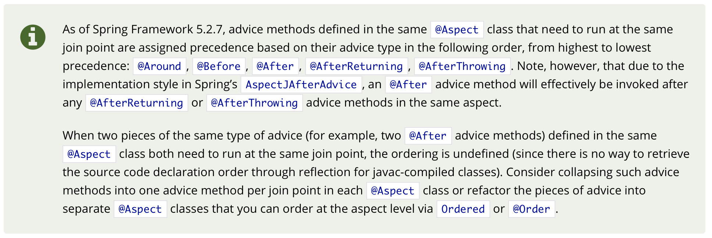
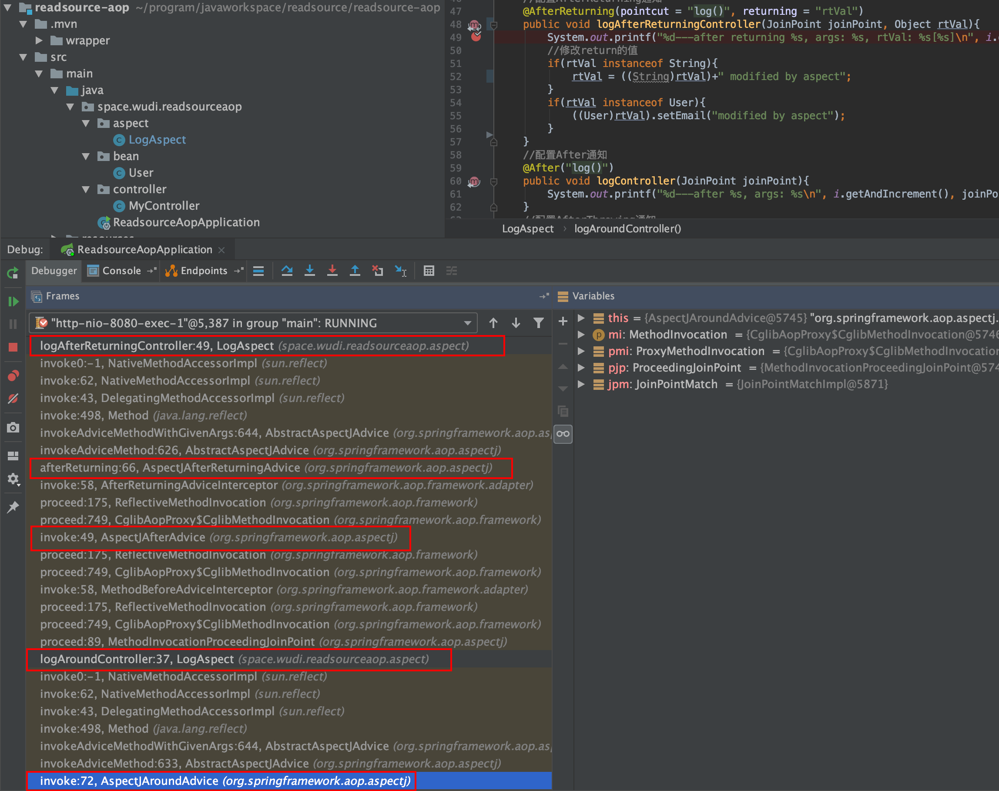
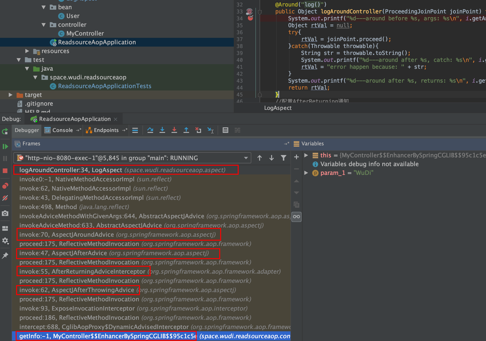

最近上了一门公开课，带着我们大致阅读了一边Spring AOP的源码，为了加强理解，自己再整理一遍。本文中使用的Spring Boot版本为2.4.0，Spring版本为5.3.1。  

当然，首先再回顾一下AOP的用法，以及一些名词解释。
<!--more-->
# 用法用例
## 创建工程
创建一个工程（我已经将源码上传到了GitHub上，有需要的可以自行查看，[传送门](https://github.com/discko/ReadSource/tree/master/readsource-aop)）。
如果使用SpringBoot的话，记得引入AOP的starter。  

```xml
<parent>
    <groupId>org.springframework.boot</groupId>
    <artifactId>spring-boot-starter-parent</artifactId>
    <version>2.4.0</version>
</parent>
<dependencies>
    <dependency>
        <groupId>org.springframework.boot</groupId>
        <artifactId>spring-boot-starter-web</artifactId>
    </dependency>
    <dependency>
        <groupId>org.springframework.boot</groupId>
        <artifactId>spring-boot-starter-aop</artifactId>
    </dependency>
</dependencies>
```
## 创建需要被插入切面的Controller
```java
package space.wudi.readsourceaop.controller;
import org.springframework.web.bind.annotation.GetMapping;
import org.springframework.web.bind.annotation.RestController;
import space.wudi.readsourceaop.bean.User;
@RestController
public class MyController {
    @GetMapping("/greeting")
    public String getInfo(String fromInfo){
        return "Hi, "+fromInfo+"!";
    }
    @GetMapping("/userinfo")
    public User getUserInfo(String fromInfo){
        // User is a simple POJO, contains 2 fields:
        // username and email
        return new User(fromInfo, "email");
    }
    @GetMapping("/exception")
    public String throwException(){
        throw new RuntimeException("an error occurred in controller");
    }
}
```
那么正常访问时  

* 对于第一个接口`/greeting`，将会返回一个字符串，比如`fromInfo = WuDi`，则会返回`Hi, WuDi!`。  
* 对于第二个接口，将会返回一个JSON对象，如果`fromInfo = WuDi`，则返回`{"username":"WuDi","email":"email"}`。
* 对于第三个接口，将会报错。

## 添加切面
接下来，为了测试切面的各个Advice，编写切面类：
```java
package space.wudi.readsourceaop.aspect;

import org.aspectj.lang.JoinPoint;
import org.aspectj.lang.ProceedingJoinPoint;
import org.aspectj.lang.annotation.*;
import org.springframework.stereotype.Component;
import space.wudi.readsourceaop.bean.User;

import java.util.Arrays;
import java.util.concurrent.atomic.AtomicInteger;

@Aspect
@Component
public class LogAspect {
    private static AtomicInteger i = new AtomicInteger(1);
    //配置切入点，所有满足条件的函数都会被加入监控
    @Pointcut(value = "execution(* space.wudi.readsourceaop.controller..*.*(..))")
    public void log(){}
    //配置Before通知
    @Before(value="log()")
    public void logBeforeController(JoinPoint joinPoint){
        System.out.printf("%d---before %s, args: %s\n", i.getAndIncrement(), joinPoint.getSignature(), Arrays.toString(joinPoint.getArgs()));
    }
    //配置Around通知
    @Around("log()")
    public Object logAroundController(ProceedingJoinPoint joinPoint) throws Throwable {
        System.out.printf("%d---around before %s, args: %s\n", i.getAndIncrement(), joinPoint.getSignature(), Arrays.toString(joinPoint.getArgs()));
        Object rtVal = null;
        try{
            rtVal = joinPoint.proceed();
        }catch(Throwable throwable){
            String str = throwable.toString();
            System.out.printf("%d---around after %s, catch: %s\n", i.getAndIncrement(), joinPoint.getSignature(), str);
            rtVal = "error happen because: " + str;
        }
        System.out.printf("%d---around after %s, returns: %s\n", i.getAndIncrement(), joinPoint.getSignature(), rtVal==null?"null":rtVal.toString());
        return rtVal;
    }
    //配置AfterReturning通知
    @AfterReturning(pointcut = "log()", returning = "rtVal")
    public void logAfterReturningController(JoinPoint joinPoint, Object rtVal){
        System.out.printf("%d---after returning %s, args: %s, rtVal: %s[%s]\n", i.getAndIncrement(), joinPoint.getSignature(), Arrays.toString(joinPoint.getArgs()), rtVal.toString(), rtVal.getClass());
        //修改return的值
        if(rtVal instanceof String){
            rtVal = ((String)rtVal)+" modified by aspect";
        }
        if(rtVal instanceof User){
            ((User)rtVal).setEmail("modified by aspect");
        }
    }
    //配置After通知
    @After("log()")
    public void logController(JoinPoint joinPoint){
        System.out.printf("%d---after %s, args: %s\n", i.getAndIncrement(), joinPoint.getSignature(), Arrays.toString(joinPoint.getArgs()));
    }
    //配置AfterThrowing通知
    @AfterThrowing(pointcut = "log()", throwing = "exception")
    public void logAfterThrowingController(JoinPoint joinPoint, Exception exception){
        System.out.printf("%d---after throwing %s, args: %s, exception: %s\n", i.getAndIncrement(), joinPoint.getSignature(), Arrays.toString(joinPoint.getArgs()), exception.toString());
    }
}
```
上面一共使用了`@Before`、`@After`、`@Around`、`@AfterReturning`、`@AfterThrowing`这所有的5个Advice。

## 测试
### 调用`/greeting`
调用`/greeting?fromInfo=WuDi`，浏览器返回：

同时标准输出得到：  

> 1---**around before** String space.wudi.readsourceaop.controller.MyController.getInfo(String), args: [WuDi]  
> 2---**before** String space.wudi.readsourceaop.controller.MyController.getInfo(String), args: [WuDi]  
> 3---**after returning** String space.wudi.readsourceaop.controller.MyController.getInfo(String), args: [WuDi], rtVal: Hi, WuDi![class java.lang.String]  
> 4---**after** String space.wudi.readsourceaop.controller.MyController.getInfo(String), args: [WuDi]  
> 5---**around after** String space.wudi.readsourceaop.controller.MyController.getInfo(String), returns: Hi, WuDi!  

### 调用`/userinfo`
调用`/userinfo?fromInfo=WuDi`，浏览器返回：

同时标准输出得到： 

> 1---**around** before User space.wudi.readsourceaop.controller.MyController.getUserInfo(String), args: [WuDi]  
> 2---**before** User space.wudi.readsourceaop.controller.MyController.getUserInfo(String), args: [WuDi]  
> 3---**after** returning User space.wudi.readsourceaop.controller.MyController.getUserInfo(String), args: [WuDi], rtVal: space.wudi.readsourceaop.bean.User@a5d1bbd[class space.wudi.readsourceaop.bean.User]  
> 4---**after** User space.wudi.readsourceaop.controller.MyController.getUserInfo(String), args: [WuDi]  
> 5---**around after** User space.wudi.readsourceaop.controller.MyController.getUserInfo(String), returns: space.wudi.readsourceaop.bean.User@a5d1bbd  

### 调用`/exception`
调用`/exception`，浏览器返回：

同时标准输出得到： 

> 1---**around before** String space.wudi.readsourceaop.controller.MyController.throwException(), args: []  
> 2---**before** String space.wudi.readsourceaop.controller.MyController.throwException(), args: []  
> 3---**after throwing** String space.wudi.readsourceaop.controller.MyController.throwException(), args: [], exception: java.lang.RuntimeException: an error occurred in controller  
> 4---**after** String space.wudi.readsourceaop.controller.MyController.throwException(), args: []  
> 5---**around after** String space.wudi.readsourceaop.controller.MyController.throwException(), catch: java.lang.RuntimeException: an error occurred in controller  
> 6---**around after** String space.wudi.readsourceaop.controller.MyController.throwException(), returns: error happen because: java.lang.RuntimeException: an error occurred in controller  

# 分析——不同AOP版本Advice顺序不同
从上面的调用结果来看，其执行过程和网上所说的还不太一样。网上说的大概是这样的流程：  
  
也就是`@Around`只包裹了`@Before`和`invoke method`。而且先`@After`再执行`@AfterReturning`或`@AfterThrowing`。  

比如我测试了一下Spring Boot 2.1.0-RELEASE on Spring 5.1.2，其在`/greeting`接口下的输出是这样的：

> 1---**around before** String space.wudi.readsourceaop.controller.MyController.getInfo(String), args: [WuDi]  
> 2---**before** String space.wudi.readsourceaop.controller.MyController.getInfo(String), args: [WuDi]  
> 3---**around after** String space.wudi.readsourceaop.controller.MyController.getInfo(String), returns: Hi, WuDi!  
> 4---**after** String space.wudi.readsourceaop.controller.MyController.getInfo(String), args: [WuDi]  
> 5---**after returning** String space.wudi.readsourceaop.controller.MyController.getInfo(String), args: [WuDi], rtVal: Hi, WuDi![class java.lang.String]   


而从我使用的版本上（Spring-AOP-5.3.1）的输出可以看出来，大致是这样的：  
  
也就`@Around`包裹了所有的过程，且`@After`被挪到了`@AfterReturning`和`@AfterThrowing`之后。  

具体什么时候发生的在官方文档里，找了半天终于找到了，[传送门](https://docs.spring.io/spring-framework/docs/5.3.1/reference/html/core.html#aop-ataspectj-advice-ordering)。这里截图看一下：  
  
大致翻译一下：

> Spring Framework 5.2.7版本（开始，【我从上下文推理出来的】），定义在同一个`@Aspect`修饰的class中的advice方法，在同一个Join Point处运行时，将按照下面的优先级从高到低排列：`@Around`、`@Before`、`@After`、`@AfterReturning`、`@AfterThrowing`。然而请注意，由于Spring `AspectJAfterAdvice`的实现，`@After` advice方法将实际上会在`@Aspect`中`@AfterReturning`或`@AfterThrowing`执行之后，才会被调用。  
> 当两个相同类型的advice（比如两个`@After`）的advice函数，需要在一个相同的`@Aspect`中的同一个join point处执行，其源码中的位置是无法通过用javac编译过的class文件确定的。这样的话，可以考虑在各个`@Aspect`中，将多个在同一个Join Point处执行的（相同的）advice合并成一个；或者将同一个`@Aspect`中，将这些advice拆分到不同的`@Aspect`中，这样就可以使用`Ordered`接口或者`@Order`注解去指定顺序了。 

这是什么意思呢，翻看一下`AspectJAfterAdvice.java`的源码：
```java
public class AspectJAfterAdvice extends AbstractAspectJAdvice
		implements MethodInterceptor, AfterAdvice, Serializable {
	//constructor
    @Override
	@Nullable
	public Object invoke(MethodInvocation mi) throws Throwable {
		try {
			return mi.proceed();
		}
		finally {
			invokeAdviceMethod(getJoinPointMatch(), null, null);
		}
	}
	//other methods
}
```
从这里可以看到，这个`invoke(MethodInvocation)`方法，换句话说就是这个`@After` advice，一定是在`AfterReturning`或者`AfterThrowing`之前进入的，但进入之后，首先执行的是`mi.process()`，在此过程中`return`或者`throw`，最后在`finally`中才会执行`invokeAdviceMethod()`。这样的话，差不多就理解了，`@After` Advice的优先级高，所以先进入调用栈，但是执行靠后，所以造成了输出晚。  
再看一下调用栈，我在Aspect中的`logAfterReturningController()`里第一行下来一个断点，执行`/greeting?fromInfo=WuDi`，得到如下调用栈：（Spring AOP 5.3.1） 
  
可以看到左下角的调用栈，从上往下数第1个红框的是我写的Aspect中的AfterReturning处理方法，第2个红框是`AfterReturningAdvice`代理类的，第3个红框是`AfterAdvice`代理类的，第4个是我写的Aspect里的Around处理方法，第5个是`AroundAdvice`代理类。

而同样的，我将AOP替换为Spring AOP 5.2.6，然后在`logAroundController()`中下断点，可以看到完全不一样的调用栈。


## 结论
从Spring AOP 5.2.7开始，各Advice的加载优先级从高到低分别是`@Around`、`@Before`、`@After`、`@AfterReturning`、`@AfterThrowing`。但是加载或者说进入优先级，仅代表了入栈的优先级，各Advice调用用户自定义编写的切面中的方法的顺序可能与上述的加载优先级不同。特别是`@After`，虽然是先入栈的，但它需要先调用目标对象的方法，在其退出后（这时就会调用`@AfterReturning`或`@AfterThrowing`）才会执行我们写的`@After`中的切面事件。

# AOP中的术语和解释
## 名词解释
* Aspect（切面）：为了达成某种目的而设置的功能的集合。  
* Pointcut（切入点）：为了实现切面Aspect，我们需要寻找在哪些地方切入。换句话说，Pointcut也可以理解成Join Point的筛选条件。  
* Join Point（连接点）：在切入点处，切面和业务逻辑的实际交叉点。一个Pointcut可能存在不定个数的Join Point。  
* Advice（通知）：在切入点不同位置处，应当在切面中增加的执行事件。   
* TargetObject（目标对象）：Join Point所在的对象叫做目标对象。  
* AOP Proxy（代理对象）：我们知道，在应用AOP之前，Spring框架是直接执行Target Object中的方法的。但在使用AOP之后，会创建一个对象，代理其行为，在调用其中的那些方法前后增加Advice点。  
* Introduction（引入）：通常用于静态代理，为一个类型增加额外的方法或属性。  
* weave（织入）：生成代理对象并将其替代原本应由目标对象承担角色的位置的过程。Weaving可以发生在编译期（如使用AspectJ）、类加载期（通常需要特定的类加载器）、运行时（比如Spring AOP）。

## 举个例子
为了记录日志，所以需要日志切面，因此创建了一个`LogAspect`；为了提高计算或者查询效率，需要使用缓存，所以需要添加缓存切面，因此创建了`CacheAspect`。  

在`LogAspect`中，我们需要在所有接口进入的时候、所有数据库访问时添加日志记录，那么这就是`LogAspect`中的两个Pointcut（`apiAccessLogPointcut`、`dbAccessLogPointcut`）；而对于`CacheAspect`，可能就需要制定特定的某个或某些切入点，比如读取配置文件的函数（`configLoadCachePointcut`）。

具体执行到用户登录接口对应的`login(LoginInfo)`方法了，那么这个用户登录接口就是一个连接点；在进行查询用户信息时`userDao.findUserByUsername(String)`就是。

在所有接口进入的切入点`apiAccessLogPointcut`，产品经理要求记录接口调用成功和失败的情况，那么就分别需要在这些接口的`@AfterReturning`和`@AfterThrowing`两个位置进行通知（Advise）。 

`login(LoginInfo)`这个方法所在的`UserController`的bean就是目标对象；`userDao`也是一个目标对象。

这样被创建的对象叫做代理对象。比如上一个图中，调用栈最下面那个`getInfo()`本来是存在于MyController中的，但实际执行的是由AOP框架创建的`MyController$$EnhancedBySpringCGLIB$$95c1c5e`的实例中的同名函数。  

