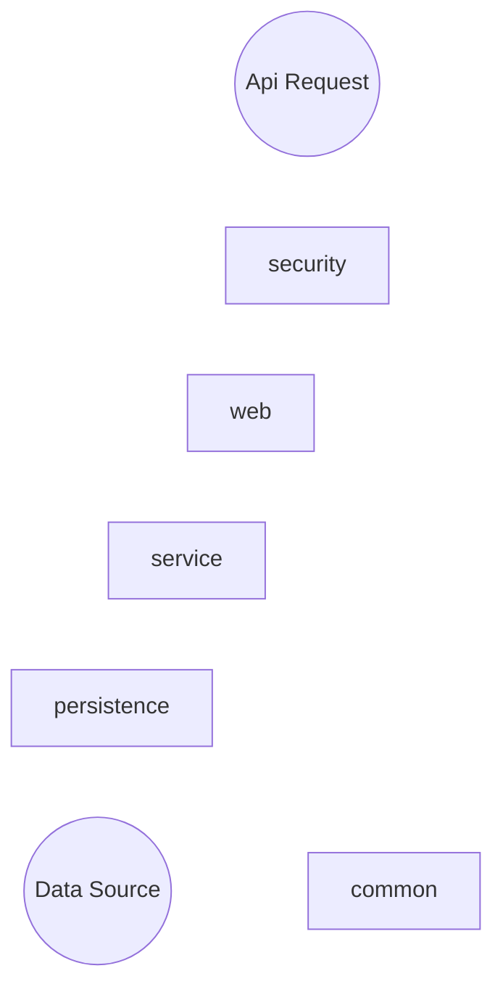

# 本文目标
* 建立后端开发环境（`Spring Boot`），并且区分本地、开发、测试、生产环境。
* 使用GitHub Actions自动化CI和CD
<!--more-->

# 前情提要
在[上一篇](/2020/10/14/TodoList-Starting/)中，我们搭建了一个测试环境去尝试使用了GitHub Actions的工作流去集成和发布我们的后端程序。花了很多时间去尝试GitHub Actions的工作流描述文件yml应该怎么去写。所以本文中，就不会再详细分析workflow的配置文件了。

下面，正式开始环境配置。

# 后端项目结构
后端项目可以在[我的GitHub](https://github.com/discko/TodoList-backend/tree/base)中看到，选择Tag为base就是截止本文的提交
以小型系统为目标，朝着未来能够快速微服务化、云化，我将主要模块分为：  

* common： 提供基本通用功能，以工具类为主。可以在多个项目间持续共用。   
* persistence：持久层，配置与连接底层数据库。  
* security：安全配置。  
* service：服务层。  
* web：网络连接层，面向接口。  
此外还有一个dependencies模块用作这些模块的公共配置。  


然后这些合起来，通过一个parent项目打包整合成一个工程，其中web项目是含有Main Class的excutable模块，其他不是。后面还会再增加一个schedule模块，与web一起，一个做即时响应，一个做定时任务，两个都做成excutable的。

后端项目结构是这样的：  
  
todolist-parent中含有6个module，分别是todolist-common，todolist-persistence，todolist-dependencies，todolist-security，todolist-service和todolist-web。  
这6个module可以分别由不同的人开发，只需要遵守一些约定（如果是在公司的话，通常就是研发规范之类的）。

这些模块可以由一个人统一创建，由一个git仓库进行管理，也可以由每一个子模块分别创建、分别放在不同的仓库中。这里为了简化，就使用一个git仓库进行版本控制了。

## 基本配置todolist-dependencies
当多人开发或项目较大时，为了防止版本冲突和配置信息混乱，通常会使用一个公共的配置库。在这里就是todolist-dependencies模块。  
该模块很简单，里面只有一个pom.xml文件。  

[这个pom.xml比较长，内容见这里。](https://github.com/discko/TodoList-backend/blob/base/todolist-dependencies/pom.xml)  

该`pom.xml`中可以看做分为了5段。

* 第一段`<parent>`到`<packaging>`部分，可以看做是基础信息。注意其中的`<packaging>`属性应当设为`pom`，这样其他子模块就不会去找该模块的jar包而是直接引用这个pom文件了。  
* 第二段`<properties>`是整个项目的一些设置项。目前仅有一个`java.version`。  
* 第三段`<dependencies>`是整个项目公用的依赖项。  
* 第四段`<build>`是默认的构建方式和插件。其他子模块如果没有声明的话，就默认使用这里的。需要注意的是，spring boot的maven plugin会将application.yml中引用pom.xml中的参数的方法从`${propertyName}`转换为`@propertyName@`，如果要改回来的话，可以使用`org.apache.maven.plugins.maven-resources-plugin`这个插件，声明`useDefaultDelimiters=true`就能使用原来的`${}`方式，或者声明`useDefaultDelimiters=false`并另行指定其他的分隔符`delimiter`。  
* 第五段`<profiles>`声明了4个profile，其id分别为`local`、`dev`、`test`和`product`。每一个profile中都定义了相同的一组参数，用于指定最终application-*.yml的名字。至于如何选用profile，只需要在mvn构建时增加`-P profile.id`参数就可以了，比如如果选用local，那么就是`mvn clean install -P local`

然后其他的module都将该artifact作为parent去继承。这样的话，如果其他module有应当设置而没有设置的参数，就会从这个dependencies中读取，包括共用的依赖项们。  

## 子模块们的基本结构
子模块们的结构基本都是一样的，我们以todolist-common为例。  
  
单元测试的文件夹test我们先不管。main中的java和resource分别存放module的代码和资源文件。  
各子模块中，application-*.yml文件，是在不同的profile环境下调用的。比如途中的common包，当`profile.id=local`时，在todolist-dependencies的profiles中我们可以看到有common-profile这个参数被指定为`common-local`，那么通过一定手法就可以加载application-common-local.yml文件了。这个手法在后面讲到application.yml时我们再细讲。  
还有一个需要注意的，这里创建了一个META-INF/spring.factories文件。这里面就一行配置，用于最后生成的jar包能够应用于`@EnableAutoConfigure`注解：
```
org.springframework.boot.autoconfigure.EnableAutoConfiguration=somepackage.SomeClass
```

# 模块分析
接下来分析一下每一个模块的内容。  

## todolist-common模块
这个模块比较简单，里面现在就写了一个StringUtil工具类，和一个配置文件。  
   
工具类里面是一个生成随机字符串的函数`public static String randmoString(boolean...)`和字符串转MD5字符串的函数`public static String stringToMd5String(String)`。仅用作测试，所以就不拎出来讲了。  
`CommonConfig.xml`这个文件如下：  
```java
package space.wudi.todolist.common;

import lombok.extern.slf4j.Slf4j;
import org.springframework.beans.factory.annotation.Value;
import org.springframework.context.annotation.Bean;
import org.springframework.context.annotation.Configuration;
import org.springframework.context.annotation.DependsOn;

@Slf4j
@Configuration
public class CommonConfig {
    public static String COMMON_ENV;
    public static String COMMON_SERIAL;
    @Bean
    boolean bindCommonEnv(
            @Value("${my-variables.common.env}")String commonEnv,
           @Value("${my-variables.common.serial}")String serial
    ){
        COMMON_ENV=commonEnv;
        COMMON_SERIAL=serial;
        return true;
    }
    @Bean("commonPrintEnv")
    @DependsOn("bindCommonEnv")
    void printEnv(){
        log.info("Common is at {}.{}",COMMON_ENV, COMMON_SERIAL);
    }
}
```
由于`Spring`的`@bean`不可以将static property转换为Bean，所以通过`CommonConfig::bindCommonEnv`这个成员方法将两个配置文件中的参数`my-variables.common.env`和`my-variables.common.serial`注入到两个`public static String`属性中，这样就可以在其他包、类和函数中使用了。当然了，这两个参数也可以注入为两个Bean，只不过这里就不这么做了。  
至于这两个参数具体是读取的application-common-local.yml还是dev、test亦或是product，我们在web模块中再讲。

## todolist-persistence模块
该模块是对持久层的封装，通过JPA对数据库进行访问，后面还会增加redis等数据相关的功能。该模块结构如下：  

其中entity包中用来存放对数据库的抽象，可以认为一个class就是一张表，如`User`类就对应数据库的user表。
使用`@Entity`注解，就可以让JPA知道这个类对应与一张数据库里的table。然后再类内的属性上增加`@Id`、`@Column`等注解，就可以对数据表的字段增加属性或约束。利用`@ManyToOne`之类的注解，还可以将多张表关联起来，这个会在后面提到。另外，利用lombok来偷个懒，也是非常轻松的。
```java
package space.wudi.todolist.persisitance.entity;
import lombok.AllArgsConstructor;
import lombok.Data;
import lombok.NoArgsConstructor;
import javax.persistence.Column;
import javax.persistence.Entity;
import javax.persistence.GeneratedValue;
import javax.persistence.Id;
@Data
@NoArgsConstructor
@AllArgsConstructor
@Entity
public class User {
    @Id
    @GeneratedValue()
    private Long id;
    @Column(name="username", nullable = false, unique = true, length = 20)
    private String username;
    @Column(name="password", nullable = false, length = 32)
    private String password;
}
```

而repository包中就是数据访问接口，相当于是DAO，不过比DAO更OO一些。可以这么认为，在JPA中其实已经没有数据库了。利用`@Entity`去声明了这些实体的结构，然后利用`Repository::save`方法将实体对象放到仓库中，当需要的时候再用`Repository::find`系列的方法将相关的实体对象找出来，供我们处理。而DAO仅仅是对数据库的封装，正如其名，Data Access Object，是一个用于访问（数据库里的）数据的对象。  
这里写的`UserRepository`非常的轻量，继承自`JpaRepository`抽象类（两个模板分别表示仓库里的是什么类型的实体、它们以什么进行区分），然后就通过`@Repository`告知Spring框架这里有一个Repository的接口。剩下的，框架会自动创建默认的inner bean去实现这个接口以及接口中的CRUD方法们。
```java
package space.wudi.todolist.persisitance.repository;
import org.springframework.data.jpa.repository.JpaRepository;
import org.springframework.stereotype.Repository;
import space.wudi.todolist.persisitance.entity.User;
@Repository
public interface UserRepository extends JpaRepository<User, Long> {
}
```

最后就是`PersistenceConfig`这个配置项了。类内的内容与`CommonConfig`是一样的，在初次配置时将两个环境参数注入属性，并打印出来。  
而类上的注解比`CommonConfig`要多了两个。`@EntityScan`告知JPA我们项目中的Entities在哪里，`@EnableJpaRepository`告知JPA我们的repository抽象类（或接口）在哪里。
```java
package space.wudi.todolist.persisitance;
import lombok.extern.slf4j.Slf4j;
import org.springframework.beans.factory.annotation.Value;
import org.springframework.boot.autoconfigure.domain.EntityScan;
import org.springframework.context.annotation.Bean;
import org.springframework.context.annotation.Configuration;
import org.springframework.context.annotation.DependsOn;
import org.springframework.core.annotation.Order;
import org.springframework.data.jpa.repository.config.EnableJpaRepositories;
@Slf4j
@Configuration("PersistenceConfig")
@EntityScan(basePackages = "space.wudi.todolist.persisitance.entity")
@EnableJpaRepositories(basePackages = "space.wudi.todolist.persisitance.repository")
public class PersistenceConfig {
    public static String PERSISTENCE_ENV;
    public static String PERSISTENCE_SERIAL;
    @Bean()
    boolean bindPersistenceEnv(
            @Value("${my-variables.persistence.env}") String env,
            @Value("${my-variables.persistence.serial}") String serial
    ){
        PERSISTENCE_ENV=env;
        PERSISTENCE_SERIAL=serial;
        return true;
    }
    @Bean("persistencePrintEnv")
    @DependsOn("bindPersistenceEnv")
    void printEnv(){
        log.info("persistence is at {}.{}", PERSISTENCE_ENV, PERSISTENCE_SERIAL);
    }
}
```

至于数据库的连接信息，都在application-persistence-*.yml中，下面是local的配置内容。
`spring.datasource`中是连接信息，driverClassName是驱动的报名，因为使用的是mysql-connector-java的8.0版本，所以驱动位置是`com.mysql.cj.jdbc.Driver`，5.x版本的是在`com.mysql.jdbc.Driver`。  
`spring.jpa`中下面两个是比较常用的。`spring.jpa.show-sql`比较简单，就是在执行sql语句时，将语句log出来，方便调试。正式的生产环境如果并发量大，建议不要开启，否则日志服务会炸。`spring.jpa.hibernate.dll-auto`，则用于开启或关闭根据`@Entity`如何更新数据库，有下面5个值可选：  
* none：不更新数据库。
* create：启动时删数据库中的表并根据`@Entity`创建，退出时不删除数据表 
* create-drop：启动时删数据库中的表并`@Entity`创建，退出时删除数据表 如果该表不存在则报错 
* update：如果启动时根据`@Entity`更新表格式（包括创建），原有数据保留 
* validate：项目启动时根根据`@Entity`对表结构进行校验，如果不一致则报错
```yml
spring:
  datasource:
    url: jdbc:mysql:///todolistdb-local?useUnicode=true&characterEncoding=utf8&useSSL=false
    username: todolist
    password: todolist
    driverClassName: com.mysql.cj.jdbc.Driver
  jpa:
    hibernate.ddl-auto: update
    show-sql: true
my-variables:
  persistence:
    env: local-persistence
    serial: 1
```

## todolist-security模块
该模块结构如下：
  
这个模块暂时还没有用到，不过由于我在pom.xml中已经引入了spring-security，所以启动时会出现login界面，如下：
 
任何接口的访问都会被劫持到`/login`页面，如果没有额外的鉴权配置的话，这里只能使用user作为用户名，启动项目时控制台打印的`sing generated security password: xxxx`进行登录。
所以为了关掉这个页面（或者说暂时开放所有接口可以未经授权访问），有两个方法。   

* 禁用Spring-Security
增加`@SpringBootApplication(exclude = { SecurityAutoConfiguration.class })`
但是这个注解如果加在`todolist-web`模块的启动器上，耦合感过重；而如果加在本模块中，又会出现重复Import。
```
org.springframework.beans.factory.parsing.BeanDefinitionParsingException: Configuration problem: A circular @Import has been detected: Illegal attempt by @Configuration class 'SecurityConfig' to import class 'SecurityConfig' as 'SecurityConfig' is already present in the current import stack [SecurityConfig->SecurityConfig->TodolistWebApplication]
```
* 显式声明不需要鉴权的接口
在Spring Security的生命周期中，`WebSecurityConfigurer`是专门用来配置WebSecurity中各种鉴权授权功能的，使用`WebSecurityConfigurerAdapter`去创建一个`WebSecurityConfigurer`的实例，并修改其鉴权配置即可。  
所以我们可以创建一个实现类去继承这个抽象的适配器（虽然声明是abstract的，但似乎里面所有应当实现的都实现了），然后重写`void configure(HttpSecurity)`这个方法。这个方法里可以显示的要求某些接口或所有接口都是anonymous的，或者干脆这个函数里什么都不写，可以达到我们目前要的效果。  
然后在`SecurityConfig`类上增加扫描到这个配置的指引`@ComponentScan`即可。
```java
@Configuration
public class WebSecurityConfigureAdaptorImpl extends WebSecurityConfigurerAdapter {
    @Override
    protected void configure(HttpSecurity http) throws Exception {
        http.antMatcher("/**").anonymous();
    }
}
```
```java
package space.wudi.todolist.security;
import lombok.extern.slf4j.Slf4j;
import org.springframework.beans.factory.annotation.Value;
import org.springframework.boot.autoconfigure.EnableAutoConfiguration;
import org.springframework.context.annotation.Bean;
import org.springframework.context.annotation.ComponentScan;
import org.springframework.context.annotation.Configuration;
import org.springframework.context.annotation.DependsOn;
@Slf4j
@Configuration
@ComponentScan(basePackages = "space.wudi.todolist.security.config")
public class SecurityConfig {
    public static String SECURITY_ENV;
    public static String SECURITY_SERIAL;
    @Bean
    boolean bindSecurityEnv(
            @Value("${my-variables.security.env}") String env,
            @Value("${my-variables.security.serial}") String serial
    ){
        SECURITY_ENV=env;
        SECURITY_SERIAL=serial;
        return true;
    }
    @Bean("securityPrintEnv")
    @DependsOn("bindSecurityEnv")
    void printEnv(){
        log.info("security is at {}.{}", SECURITY_ENV, SECURITY_SERIAL);
    }
}
```

## todolist-service模块
service模块是服务层的核心模块，用于各数据层或中间层与外部接口层的沟通。为了能够一套接口应对不同的场景（如对于Web、Android和iOS相同的接口提供差异性服务，同时需要对多个版本的API提供服务等等），就需要对接口进行抽象和差异化实现。所以该模块的结构如下：  
  

* `service`包中是各个提供的服务的接口。这里`UserService`的例子是这样的，只需要将能提供的服务的签名列出来就可以了。  
```java
package space.wudi.todolist.service.service;
import space.wudi.todolist.service.dto.DtoUser;
public interface UserService {
    DtoUser queryUser(String username);
    String createUser(String username);
}
```
* `impl`包中是各个服务接口的具体实现。接口与实现可能是一对多的关系。下面就是一个`UserService`的实现。需要在类名上增加`@Service(value = "beanName")`这样的注解，如果使用默认bean name的话就直接舍去括号就可以了。  
```java
package space.wudi.todolist.service.impl;
import org.springframework.beans.factory.annotation.Autowired;
import org.springframework.data.domain.Example;
import org.springframework.stereotype.Service;
import space.wudi.todolist.persisitance.entity.User;
import space.wudi.todolist.persisitance.repository.UserRepository;
import space.wudi.todolist.service.service.UserService;
import space.wudi.todolist.service.dto.DtoUser;
import space.wudi.todolist.common.string.StringUtil;
import java.util.Optional;
@Service
public class UserServiceImpl implements UserService {
    private final UserRepository userRepository;
    @Autowired
    public UserServiceImpl(UserRepository userRepository) {
        this.userRepository = userRepository;
    }
    @Override
    public DtoUser queryUser(String username) {
        User exampleUser=new User();
        exampleUser.setUsername(username);
        Example<User> userExample=Example.of(exampleUser);
        Optional<User> oUser=userRepository.findOne(userExample);
        if(oUser.isPresent()){
            User user=oUser.get();
            return new DtoUser(user.getId(), user.getUsername());
        }else{
            return new DtoUser(true);
        }
    }
    @Override
    public String createUser(String username) {
        String randomPassword= StringUtil.randmoString(10, true, true, true, true);
        String md5Password=StringUtil.stringToMd5String(randomPassword);
        User newUser=new User();
        newUser.setUsername(username);
        newUser.setPassword(md5Password);
        userRepository.save(newUser);
        return randomPassword;
    }
}
```
* `dto`中是Data Transfer Objects也就是service层向api层传输数据的结构。通常，我会使用DTO作为service和api的通信接口，而VO作为api和前端的通信接口。
```java
package space.wudi.todolist.service.dto;
import lombok.Data;
import lombok.NoArgsConstructor;
@Data
@NoArgsConstructor
public class DtoUser {
    private boolean notFound;
    private Long id;
    private String username;
    public DtoUser(boolean notFound) {
        this.notFound = notFound;
        this.id=null;
        this.username=null;
    }
    public DtoUser(Long id, String username) {
        this.notFound = false;
        this.id = id;
        this.username = username;
    }
}
```
## todolist-web模块

最后，就到了todolist-web了。由于该模块含有启动项，最终应当编译成executable jar，所以在该模块的pom.xml中，应当将build插件从`org.apache.maven.plugins.maven-compiler-plugin`换成`org.springframework.boot.spring-boot-maven-plugin`。
具体的`pom.xml`文件见[这里](https://github.com/discko/TodoList-backend/blob/base/todolist-web/pom.xml)。  
本模块的结构如下：  
  

### profile设置
之前的各个模块的application.yml都被命名为`application-${ModuleName}-${ProfileId}.yml`的形式。本模块也不例外，但除此之外，还有一个`application.yml`作为根配置文件。我们知道Spring Boot的配置文件就是application.yml，因此通过根配置去引导各模块的子配置。因此，在`application.yml`中设置`spring.profiles.avtive`属性即可，这里设置为一个数组。里面含有web模块引用到的所有模块的配置。
```yml
spring:
  profiles:
    active:
    - "@web-profile@"
    - "@security-profile@"
    - "@service-profile@"
    - "@persistence-profile@"
    - "@common-profile@"
```
这些配置是以`@`作为开始和结束的参数，而参数的定义位于`todolist-dependencies`模块的`pom.xml`中的`<profiles>`字段内。里面的每一个`profile.id`对应一组参数。比如使用下面的命令进行编译：  
```
mvn clean package -P dev
```
其中的`-P dev`就是指定使用`id`为`dev`的那个profile，这时候，我们来看看dependencies模块的pom.xml中`id=dev`的profile是怎么写的：  
```xml
<profile>
    <id>dev</id>
    <properties>
        <profileName>dev</profileName>
        <web-profile>web-dev</web-profile>
        <security-profile>security-dev</security-profile>
        <persistence-profile>persistence-dev</persistence-profile>
        <service-profile>service-dev</service-profile>
        <common-profile>common-dev</common-profile>
    </properties>
    <activation>
        <activeByDefault>false</activeByDefault>
    </activation>
</profile>
```
所以如果profile为dev的话，`application.yml`就相当于：
```yml
spring:
  profiles:
    active:
    - "web-dev"
    - "security-dev"
    - "service-dev"
    - "persistence-dev"
    - "common-dev"
```
也就是除了`application.yml`外，还要加载`application-web-dev.yml`、`application-security-dev.yml`、`application-service-dev.yml`、`application-persistence-dev.yml`和`application-common-dev.yml`这几个配置文件。  
需要说明的是，由于Spring Boot的build插件`org.springframework.boot.spring-boot-maven-plugin`会将`pom.xml`中的参数的引用方式从`${propertyName}`改为`@propertyName@`，如果要改回来，或者改成其他的样式，可以使用`maven-resources-plugin`插件。

### 自动化文档
Controller的写法没什么好说的，很基础了。就不做过多的说明。不过一个好的接口应当搭配上比较清晰的文档甚至测试接口才更好。为此，我使用springfox的swagger2来定义文档，并用swagger-ui来展示。  
swagger在spring boot中已经有官方starter可以直接maven导入项目，这是[官方文档](http://springfox.github.io/springfox/docs/current/#springfox-spring-mvc-and-spring-boot)，可以直接参考这个进行配置。Maven是这样引入的：  
```xml
        <dependency>
            <groupId>io.springfox</groupId>
            <artifactId>springfox-boot-starter</artifactId>
            <version>${swagger.version}</version>
        </dependency>
```
然后在Controller上增加注解就可以了：  
```java
package space.wudi.todolist.web.controller;

import io.swagger.annotations.ApiOperation;
import io.swagger.annotations.ApiParam;
import org.springframework.beans.factory.annotation.Autowired;
import org.springframework.web.bind.annotation.GetMapping;
import org.springframework.web.bind.annotation.PathVariable;
import org.springframework.web.bind.annotation.RequestMapping;
import org.springframework.web.bind.annotation.RestController;
import space.wudi.todolist.service.service.UserService;
import space.wudi.todolist.service.dto.DtoUser;
import space.wudi.todolist.web.vo.VoUserQuery;
@RestController
@RequestMapping(value="/user")
public class UserController {
    private final UserService userService;
    @Autowired
    public UserController(UserService userService   ) {
        this.userService = userService;
    }
    @GetMapping(value="/user/{username}")
    @ApiOperation(value = "query a exist user or create one with random password")
    public VoUserQuery userQuery(
            @PathVariable
            @ApiParam(value = "the username to query", required = true)
                    String username
    ){
        DtoUser dtoUser=userService.queryUser(username);
        if(!dtoUser.isNotFound()){
            return VoUserQuery.createFromDto(dtoUser);
        }
        String plainPassword=userService.createUser(username);
        DtoUser dtoUser2=userService.queryUser(username);
        return VoUserQuery.createFromDto(dtoUser2, plainPassword);
    }
}
```
上面的接口上，增加`@ApiOperation`注解，其`value`最终会显示在swagger-ui的网页上作为该接口的描述。  
然后对接口的每一个参数增加`@ApiParam`,其`value`也会显示在swagger-ui页面上作为该参数的描述。如果参数有取值限制（如只接受有限个值或者范围值），可以在`@ApiParam`的参数中增加`allowableValues`，如`@ApiParam(allowableValue="value1,value2")`表示这个参数只可以取`value1`或者`value2`两个值;`@ApiParam(allowableValue="Range[5,10)")`表示该参数只可以取5到10的区间，且为左闭右开的区间；另外`Range[5, infinity)`表示该参数应当≥5，`Range(-infinity, 3)`表示该参数应当<3。  

最后再加上Swagger的配置`SwaggerConfig.java`：
```java
package space.wudi.todolist.web;

import org.springframework.beans.factory.annotation.Value;
import org.springframework.context.annotation.Bean;
import org.springframework.context.annotation.Configuration;
import springfox.documentation.builders.PathSelectors;
import springfox.documentation.builders.RequestHandlerSelectors;
import springfox.documentation.spi.DocumentationType;
import springfox.documentation.spring.web.plugins.Docket;
import springfox.documentation.swagger.web.UiConfiguration;
import springfox.documentation.swagger.web.UiConfigurationBuilder;
import springfox.documentation.swagger2.annotations.EnableSwagger2;
@Configuration
@EnableSwagger2
public class SwaggerConfig {
    @Value("${swagger.enable}")
    private boolean enableSwagger;
    @Bean
    public Docket configApi(){
        return new Docket(DocumentationType.SWAGGER_2)
                .enable(enableSwagger)
                .select()
                .apis(RequestHandlerSelectors.basePackage("space.wudi.todolist.web.controller"))
                .paths(PathSelectors.any())
                .build()
                .pathMapping("/")
                .useDefaultResponseMessages(true);
    }
    @Bean
    public UiConfiguration uiConfiguration(){
        return UiConfigurationBuilder.builder()
                .build();
    }
}
```
这里两个Bean，返回`Docket`的是用于对java环境内的Swagger进行配置，返回`UiConfiguration`的是用于对swagger-ui进行配置。两者都可以在[官方文档](http://springfox.github.io/springfox/docs/current/#springfox-spring-mvc-and-spring-boot)中看到每一行每一个设置的说明，这里仅做最简单的。  
在`Docket`设置中，`apis()`这个参数用于指定被documentation的这些controller在哪里，可以通过自己写一个`Predicate<RequestHandler>`的实现来过滤，也可以通过`RequestHandlerSelectors`里预设的`any()`、`none()`、`basePackage()`、`withMethodAnnotation()`、`withClassAnnotation()`这几个静态方法返回，都是字面意思。我一开始选择的是`any()`，结果把spring内置的几个api接口也都documentation了，所以最终选择了指定包位置的形式。  
当然，对于product环境，我们也需要对Swagger关闭。这里就利用了不同环境下的application-web-*.yml去配置，然后在`Docket`的设置中去有选择的`enable()`就可以了。
在product环境中我将`swagger.enable`设为`false`，其他为`true`。所以最终启动后就有了：  


  

未来，我会考虑为swagger-ui增加

### 优化IntelliJ Idea的错误提示Could not autowire
原本在web项目的`@SpringBootApplication`中需要添加`scanBasePackages`以让框架在启动时可以添加各个模块的`@Configure`，如下：  
```java
@SpringBootApplication(scanBasePackage = {
    "space.wudi.todolist.common",
    "space.wudi.todolist.persistence",
    "space.wudi.todolist.security",
    "space.wudi.todolist.service"
})
public class TodolistWebApplication {
    public static void main(String[] args) {
        SpringApplication.run(TodolistWebApplication.class, args);
    }
}
```
这样显得很不优雅，所以利用META-INF/spring.factories文件为每一个模块增加了EnableAutoConfigure，然后`@SpringBootApplication`就不用增加`scanBasePackages`了。但是，接下来IntelliJ IDEA报错了：  

  

虽然编译后、运行时都没有问题，但看着还是很膈应。  
不过解决这个问题也不难，重新在@SpringBootApplication上增加这些所有要扫描的根包就可以了：
```java
@SpringBootApplication(scanBasePackage = "space.wudi.todolist")
```
# CI/CD
这一块直接挪用前面的DemoCI项目的yml就可以了。需要注意的是，编译命令是这样的：
```
mvn clean package -P $PROFILE -Dmaven.test.skip
```
最后的`-Dmaven.test.skip`是用来跳过lifecircle中的test环节。而$PROFILE则是当前应当选用的profile.id，可以根据branch分支的名字来获得。

另外，GitHub还可以用API的形式来执行workflow，具体可以参见下面这篇文章：

[使用Webhook执行GitHub Actions的工作流](https://p3terx.com/archives/github-actions-manual-trigger.html#toc_2)

<!--[对API添加版本号](https://blog.csdn.net/ai_xao/article/details/102672036) -->