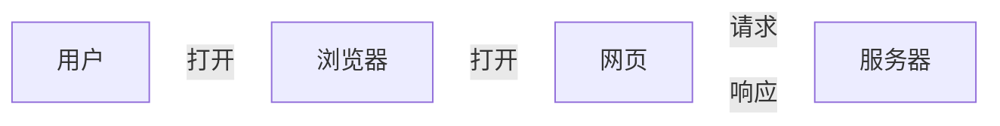
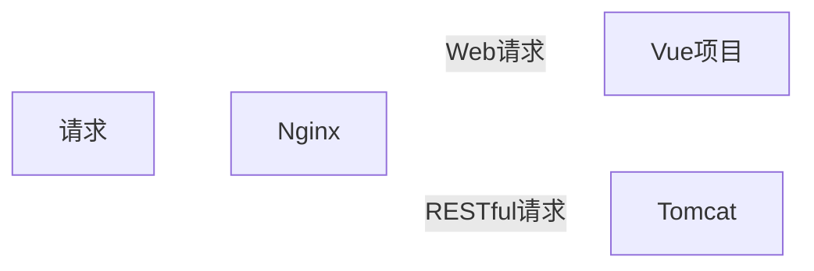

# 前言
业务能力不能忘，最近一边玩玩游戏，一边想着以前很多事情不能生疏了，又想起之前有位前辈说练习一个东西，可以从做一个TodoList开始。那么，就用Java和Vue做一个前后端分离的Web版TodoList来复习一下吧。  

具体的功能（需求）将在后续进行列出。本文首先会把主要结构和开发环境准备一下。  

本篇的代码全部位于[GitHub Repo](https://github.com/discko/DemoCI)中，可以自行查看。
<!--more-->

# 结构
这里先不说架构，先大致规划一下大致功能流程和部署结构。  

* 功能流程：  
通过电脑浏览器或手机浏览器访问网页后，登录。
然后添加、查看、修改相应的项目，或访问相关功能。



* 部署结构：  
外部请求发送到服务器Nginx。
Nginx判断如果是Web请求则交给Vue页面处理，如果是RESTful请求则交给Tomcat处理。


# 持续集成与发布 CI/CD

## 准备测试程序
我们准备一个最简单的Spring Boot Web项目。里面写一个接口（/api/hello/{msg})并将这个`msg`变量以ResponseBody的形式回传。  

```java
package space.wudi.todolist.demo.controller;

import org.springframework.web.bind.annotation.*;

@RestController
@RequestMapping(value="/api")
public class TestController {

    @GetMapping(value="hello/{msg}")
    @ResponseBody
    public String hello(@PathVariable String msg){
        return String.format("hello, %s", msg);
    }
}
```
然后在`pom.xml`中指定最终编译打包的jar包的名字为demo,也就是下面代码的`<finalName>demo</finalName>`段：
```xml
    <build>
        <finalName>demo</finalName>
        <plugins>
            <plugin>
                <groupId>org.springframework.boot</groupId>
                <artifactId>spring-boot-maven-plugin</artifactId>
                <configuration>
                    <executable>true</executable>
                </configuration>
            </plugin>
        </plugins>
    </build>
```
其他不用修改，最终目录结构是这样的，其中.github文件夹我们暂时先不管：


然后将其push到remote上。

## 认识GitHub Actions
然后就是持续集成与持续发布的环境了，我们使用git去管理我们的代码。如果需要一遍遍将编译好的程序复制到服务器上（特别是如果有很多个不同的子项目还有他们的配置文件需要同时去维护）的话，那就太麻烦了。  
上班的时候用的是Jekins，自己再搭一个太麻烦了。好在现在托管代码的GitHub和Gitee上都有CI/CD模块可以直接使用。  
这里就使用GitHub的Actions来看看。  

在GitHub的Repository中我新建了一个[TodoList仓库](https://github.com/discko/DemoCI/)，点开Actions页面，如果这个项目中还没有Actions的配置的话，就应该和下面这个一样（截止2020年10月17日）：    
    

如果需要的话，可以再下面找到很多已经写的差不多的（只需要修改一些配置的）workflow模板。这里我们从头写一个。  
点击 `Simple workflow`中的按钮“Set up this workflow”开启一个默认的工作流。下面就是这个默认的工作流脚本。

```yml
# This is a basic workflow to help you get started with Actions

name: CI

# Controls when the action will run. Triggers the workflow on push or pull request
# events but only for the master branch
on:
  push:
    branches: [ master ]
  pull_request:
    branches: [ master ]

# A workflow run is made up of one or more jobs that can run sequentially or in parallel
jobs:
  # This workflow contains a single job called "build"
  build:
    # The type of runner that the job will run on
    runs-on: ubuntu-latest

    # Steps represent a sequence of tasks that will be executed as part of the job
    steps:
      # Checks-out your repository under $GITHUB_WORKSPACE, so your job can access it
      - uses: actions/checkout@v2

      # Runs a single command using the runners shell
      - name: Run a one-line script
        run: echo Hello, world!

      # Runs a set of commands using the runners shell
      - name: Run a multi-line script
        run: |
          echo Add other actions to build,
          echo test, and deploy your project.

```

上面的第一段`name: CI`是这个workflow的名字，将会显示在GitHub Actions页面中。  
然后是`on:`段，表示该workflow的触发时机。常用的触发方式有`push`、`pull_request`、`release`等等，具体用法见[events that trigger workflows](https://docs.github.com/en/free-pro-team@latest/actions/reference/events-that-trigger-workflows)。  
第三段`jobs`就是具体的工作流。里面可以设置运行workflow的虚拟机的一些环境，以及最重要的，工作流中的步骤们。  

## 测试GitHub Actions Workflow
然后根据GitHub Actions的[语法](https://docs.github.com/en/free-pro-team@latest/actions/reference/workflow-syntax-for-github-actions)，我写了如下的workflow，也可以在我的[这个Demo项目的GitHub Repo](https://github.com/discko/DemoCI)中打开看到，所有的Actions yml文件都在`.github/workflows`文件夹里。
```yml
name: Build And Deploy Demo

# Controls when the action will run. Triggers the workflow on push or pull request
# events but only for the master branch
on:
  workflow_dispatch:
    branches: [ master ]

env:
  BUILT_DIR: ${{ github.workspace }}/target
  JAR_NAME: demo.jar

# A workflow run is made up of one or more jobs that can run sequentially or in parallel
jobs:
  # This workflow contains a single job called "build"
  build:
    # The type of runner that the job will run on
    runs-on: ubuntu-latest

    outputs:
      foundFile: ${{ steps.test_jar_exist.outputs.found }}

    # Steps represent a sequence of tasks that will be executed as part of the job
    steps:
    # Checks-out your repository under $GITHUB_WORKSPACE, so your job can access it
    - uses: actions/checkout@master

    - name: Check jdk
      uses: actions/setup-java@v1.4.3
      with:
        java-version: 1.8

    - name: mvn prepare
      id: mvn_cache
      uses: actions/cache@v2
      with:
        path: ~/.m2/repository
        key: ${{ runner.os }}-maven-${{ hashFiles('./pom.xml') }}

    - name: build
      run: |
        wd=`pwd`
        echo "we are at "$wd
        mvn -B clean package
    - name: test existance
      id: test_jar_exist
      run: |
        wd=`pwd`
        echo "we are at "$wd
        cd target
        ls
        if [ -e $JAR_NAME ]; then
          echo "::set-output name=found::true"
        else
          echo "::set-output name=found::false"
          echo "::error file=demo.jar::file not found"
          exit 1
        fi
    - name: cache jar
      if: ${{ steps.test_jar_exist.outputs.foundFile }} == 'true'
      uses: actions/cache@v2
      with:
        path: ${{ env.BUILT_DIR }}/${{ env.JAR_NAME }}
        key: ${{ runner.os }}-release-${{github.sha}}

    - name: post output
      run:
        echo "build finished"


  deploy:
    runs-on: ubuntu-latest
    needs: build
    env:
      TAR_STRIP_PATH: 1
      SCP_TAR_DIR: ~/demo
      RUNTIME_DIR: /var/todolist
      SERVICE_NAME: demo

    # Steps represent a sequence of tasks that will be executed as part of the job
    steps:

    - name: restore jar
      uses: actions/cache@v2
      with:
        path: ${{ env.BUILT_DIR }}/${{ env.JAR_NAME }}
        key: ${{ runner.os }}-release-${{github.sha}}

    - name: ssh before scp
      uses: appleboy/ssh-action@v0.1.3
      with:
        host: ${{ secrets.CI_HOST }}
        port: ${{ secrets.CI_SSH_PORT }}
        username: ${{ secrets.CI_USER }}
        key: ${{ secrets.CI_SSH_KEY }}
        script: |
          mkdir -p ${{env.SCP_TAR_DIR}}
    - name: send file by scp
      uses: appleboy/scp-action@master
      with:
        host: ${{ secrets.CI_HOST }}
        username: ${{ secrets.CI_USER }}
        port: ${{ secrets.CI_SSH_PORT }}
        key: ${{ secrets.CI_SSH_KEY }}
        proxy_host: ${{ secrets.PROXY_HOST }}
        proxy_port: ${{ secrets.PROXY_SSH_PORT }}
        proxy_username: ${{ secrets.PROXY_USER }}
        proxy_password: ${{ secrets.PROXY_PASSWORD }}
        proxy_key: ${{ secrets.PROXY_SSH_KEY }}
        source: ${{env.BUILT_DIR}}/${{env.JAR_NAME}}
        target: ${{env.SCP_TAR_DIR}}
        strip_components: ${{env.TAR_STRIP_PATH}}

    - name: ssh after scp (run server)
      uses: appleboy/ssh-action@v0.1.3
      with:
        host: ${{ secrets.CI_HOST }}
        port: ${{ secrets.CI_SSH_PORT }}
        username: ${{ secrets.CI_USER }}
        key: ${{ secrets.CI_SSH_KEY }}
        script: |
          cd ${{env.SCP_TAR_DIR}}
          JarFile=${{env.JAR_NAME}}
          TarDir=${{env.RUNTIME_DIR}}
          echo "make dir $TarDir if exists"
          sudo mkdir -p $TarDir
          echo "copy $JarFile to $TarDir"
          sudo cp ${{env.SCP_TAR_DIR}}/$JarFile $TarDir
          sudo chmod 777 $TarDir/*
          cd /lib/systemd/system
          if [ -e demo.service ];
          then
              echo "demo.service exists. stop it"
              sudo systemctl stop demo;
              echo "remove it";
              sudo rm demo.service;
          fi;
          echo "write service"
          sudo touch ${{env.SERVICE_NAME}}.service;
          echo "[Unit]" | sudo tee -a ${{env.SERVICE_NAME}}.service;
          echo "Description=demo" | sudo tee -a ${{env.SERVICE_NAME}}.service;
          echo "After=syslog.target" | sudo tee -a ${{env.SERVICE_NAME}}.service;
          echo "" | sudo tee -a ${{env.SERVICE_NAME}}.service;
          echo "[Service]" | sudo tee -a demo.service;
          echo "User=root" | sudo tee -a demo.service;
          echo "ExecStart=$TarDir/$JarFile" | sudo tee -a ${{env.SERVICE_NAME}}.service;
          echo "SuccessExitStatus=143" | sudo tee -a ${{env.SERVICE_NAME}}.service;
          echo "" | sudo tee -a ${{env.SERVICE_NAME}}.service;
          echo "[Install]" | sudo tee -a ${{env.SERVICE_NAME}}.service;
          echo "WantedBy=multi-user.target" | sudo tee -a ${{env.SERVICE_NAME}}.service;
          echo "reload service";
          sudo systemctl daemon-reload;
          echo "start service";
          sudo systemctl start ${{env.SERVICE_NAME}};
```
简单梳理一下几个部分。大框架分为`name`、`on`、`env`、`jobs`。  
### name、on、env和jobs
`name`设置之后，就可以在GitHub的Action页面中看到对应的工作流名称了，点击之后可以查看该工作流中的历次执行结果，如下：  
  

然后是`on`。原本是在`push`或者`pull_request`的时候触发，这里改成了`workflow_dispatch`手动触发，这时候会在页面上增加一个“Run Workflow”的按钮。  
   

接下来是`env`，也就是环境变量。这里可以放一些可能会变化但可以公开的参数。顶层的`env`是共用的，可以被各个`job`和`step`访问，除了在这里之外，也可以在`job`或者`step`中设置`env`。这里需要说明一下，${{github.workspace}}是GitHub Actions提供的一个系统环境变量，表示该workflow运行时，用来存放clone这个repo的文件夹的位置。更多的内置`env`在[这里](https://docs.github.com/en/free-pro-team@latest/actions/reference/environment-variables)。  


最后，就是重头戏`jobs`也就是任务集了。

### job的执行环境
上面的例子中，分为2个`job`，分别是`build`和`deploy`。两个`job`如果没有特殊说明的话，是并行运行在不同的虚拟机中，除非增加依赖关系。可以看到，在`deploy`中，有`needs: build`属性，这时，`deploy`就会在`build`运行***成功***之后，在另一个虚拟机中执行。  
虚拟机可以通过`runs-on`指定，目前可选的有windows server、ubuntu和MacOS，具体可以参考[这里](https://docs.github.com/en/free-pro-team@latest/actions/reference/specifications-for-github-hosted-runners)进行选择。  
诸如`build.outputs`或者`deploy.env`这些变量或者输出，除了在定义的时候初始化之外，还可以在后面的`step`中，使用双冒号操作符进行赋值。下面是官方给的一个例子。  
```yml
jobs:
  job1:
    runs-on: ubuntu-latest
    # Map a step output to a job output
    outputs:
      output1: ${{ steps.step1.outputs.test }}
      output2: ${{ steps.step2.outputs.test }}
    steps:
    - id: step1
      run: echo "::set-output name=test::hello"
    - id: step2
      run: echo "::set-output name=test::world"
  job2:
    runs-on: ubuntu-latest
    needs: job1
    steps:
    - run: echo ${{needs.job1.outputs.output1}} ${{needs.job1.outputs.output2}}
```
例子中声明了两个输出变量`output1`和`output2`。他们的值分别取是`job1`中`id=step1`和`id=step2`的两个步骤中通过`::set-output`设置的两个输出变量`test`和`test`。`step1.outputs.test=hello`，`step2.outputs.test=world`。所以在`job2`中，最终执行的语句是`echo hello world`。  
由此我们也可以知道，即使`output`写在`steps`前面，最终赋值的时候，也是在`steps`执行之后。  
另外还有对`env`进行赋值的、输出debug或者error信息的，等等各种“工作流命令（Workflow Command）”，都使用双冒号语法进行，各种双冒号的语法见[这里](https://docs.github.com/en/free-pro-team@latest/actions/reference/workflow-commands-for-github-actions#setting-an-output-parameter)。  

### job的执行过程steps
在`steps`中，我们以列表的形式列出各个步骤（以`-`开头且缩进一致的，就表示该列表中的一个新元素）。各个元素称为`step`，每一个`step`可以有`name`、`id`、`uses`、`run`等属性。都不是必须的。其中`id`可以用于标记这个`step`，在同一个`job`中应当是hi唯一的，后续可以通过诸如`jobs.build.steps.mvn_cache`去访问这个`step`中的一些属性。  

在`step`中，我们常用的有`uses`和`run`两个属性，这两个不能共存。  
`run`后面可以跟自己写的该虚拟机中可以运行的脚本。如果有多行的话，应该加上`|`符号，如：
```yml
jobs:
    job1:
        steps:
            - name: test
              run: |
                echo "hello GitHub"
                echo "hello Actions"
```
`uses`可以使用别人（或者自己）已经预先写好的子工作流。这些工作流可以在GitHub Actions网页上书写的地方的右侧的Marketplace中搜索得到，里面大多数都有详细的用法用例。  


我们来看一下上面使用的5个Actions。  

* actions/checkout@master  
这个通常出现在第一个`step`中。Action能将此次之行的repo branch克隆到该虚拟机的${{ github.workspace}}文件夹中，如果不使用这个Action的话，这个文件夹中将是空的。  
* actions/setup-java@v1.4.3  
由于我们使用了spring框架，如果需要通过虚拟机进行编译打包的话，就需要java和maven环境，使用这个Action，并通过with指定jdk版本为1.8，则执行到该`step`时，就会自动配置好java相关环境。  
* actions/cache@v2
由于虚拟机中的java环境是新的，在使用mvn进行package的时候因为maven repository中没有可用的dependencies，所以每次都需要去远程repo中拉取，会浪费大量时间。目前这样一个空项目mvn clean package大约需要20秒（其中更新依赖大约10秒），在后面使用的依赖更多的时候，这个时间怕是会更长。所以使用这个缓存Action，将`~/.m2/repository`文件夹，根据`pom.xml`文件缓存起来。这样，原本更新依赖的时间变成了从cache中恢复的时间，大约1~2秒。这里需要说明的有几点。
    1. 存和取两个动作（cache and restore）的指令是一样的，也就是说，如果key存在，则此次action为取，如果不存在，则会在本job结束的时候存。因为每一个使用了`actions/cache@v2`的`step`，都会在该`job`结束的时候对偶地生成一个后处理，如下图中的”mvn prepare“和”Post mvn prepare“，后者是自动生成的。  
  
    2. `actions/cache@v2`是无法手动清除的（这个在issue列表中原作者[明确说了](https://github.com/actions/cache/issues/2)，还说未来会加上，不过已经一年过去了）。不过，1周没有使用的缓存会自动失效，总缓存超过5GB后最旧的缓存也会失效（[这里](https://github.com/actions/cache#cache-limits)）。  
* appleboy/ssh-action@v0.1.3  
由于官方没有提供ssh，虚拟机里也没有ssh的工具，所以只能使用第三方的。使用起来还是很简单。  
* appleboy/scp-action@master  
同样的，scp也是必不可少的。很庆幸这个action的作者提供了proxy的选项。18M的文件从GitHub虚拟机传到我的腾讯云主机要花2分钟甚至更久，逆向使用自己搭的梯子后10秒以内就解决了。  

### 密文Secrets  
大家可以看到，在上面的`deploy`作业的时候，ssh和scp里我都传入了`$&#123;&#123;secrets.*&#125;&#125;`这样的参数。这是由于如果这个repo是public的，那么GitHub Actions（位于`.github/workflows/*.yml`)就也会被公开，而像一些敏感信息比如密码、公私钥、token等信息不应当被暴露在外面。因此需要使用Secrets来存储。  
Secrets在Repository的Settings里，点击`new secret`按钮就能够添加。添加之后，该secret只能更新或删除，无法再被查看内容。  
  
值得一提的是，在worflow log里，只要跟这些密文的内容是雷同的，那么只是恰好一样，都会被打上码（变成一串`***`）。  

# 反向代理Nginx
在Spring Boot项目的application.yml中，我将启动端口设置为了8089.
```properties
server.port=8089
```
为了能够通过80和443端口访问，我们还需要将公网的80和443端口转发到服务器的8089端口上。  
在nginx的目录中有一个conf.d文件夹，我将会把demo.service的8089端口反向代理的配置写在这里。
```js
server{
    listen 80;
    server_name api.wudi.space;
    location /demo {
        proxy_pass http://127.0.0.1:8089/api/;
    }
}
server{
    listen 443 ssl;
    server_name api.wudi.space;

    ssl_certificate "/path/to/certificate.pem";
    ssl_certificate_key "/path/to/key.pem";

    ssl_session_timeout 5m;
    ssl_ciphers ECDHE-RSA-AES128-GCM-SHA256:ECDHE:ECDH:AES:HIGH:!NULL:!aNULL:!MD5:!ADH:!RC4;
    ssl_protocols TLSv1 TLSv1.2;
    ssl_prefer_server_ciphers on;

    location /demo {
        proxy_pass http://127.0.0.1:8089/api/;
    }
}
```
在通过`nginx -t`测试通过之后（可能需要`sudo`），重启nginx服务即可`systemctl restart nginx`。  

# 尝试发布
进入GitHub Action，选择上面写好的workflow，点击”run workflow“按钮，静静等待发布完成。看到所有需要的`job`都显示$\checkmark$后，就说明任务执行完成了。具体的日志可以分别点击各`job`查看。   

  

然后打开浏览器输入网址，或者利用Postman或者在idea中使用RESTful Api Test进行测试。  
  
测试通过！
<script type="text/javascript">
document.querySelectorAll("svg").forEach((svg)=>{svg.firstChild.innerHTML=svg.firstChild.innerHTML.replace("arrowheadPath{fill:#333","arrowheadPath{fill:#aaa")})
</script>