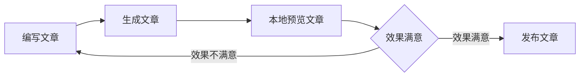

本篇最主要的目的，是记录一下使用Hexo在GitHub Pages上建立个人站的过程。整个建站过程，包括对一些基础功能的熟悉，大约历时2小时。(现在图片都在GitHub上，所以打开有点慢，未来会移到图床上或者增加一个CDN，来加速图片显示，先将就一下)
<!-- more -->
# 写在前面
最终还是提出了离职，在准备交接的过程中，整理了不少之前的代码和文档，为了对过去的成果进行总结和记录以供未来查阅，同时也为了让自己对技术积累过程有一个回顾的机会，决定建设一个小日记本（其实已经想做很多年了）。
当然了，本站绝不会涉及所在公司的核心业务代码和保密技术，仅用于记录自己的想法和试验性质的尝试。
同时，由于我也在刷LeetCode，也会将一些题目的解题心得记录在此。

# 感谢
在建站过程中，我主要参考了以下几位的博文，在此表示感谢。
> wind-liang：[建立博客系列（三）：hexo安装配置](https://windliang.wang/2017/01/23/建立博客系列（三）：hexo安装配置/)  
> seporga：[Hexo使用攻略-添加分类及标签](https://www.jianshu.com/p/e17711e44e00)
> 大专栏：[Hexo 无法加载图片（路径问题）](https://www.dazhuanlan.com/2019/12/18/5df99e24d6d27/)

# 本文环境
系统： macOS Catalina （10.15.5）  
配置： 3.1 GHz 4 core Intel i7， 内存 16GiB  
开发环境：
  - Visual Studio Code 1.47.1
  - Node.js v12.13.1
  - npm 6.14.5
  - hexo-cli 3.1.0
  - hexo 4.2.1
  - ShadowsocksX-NG 1.4.9(1)

# 开始建站
1. 安装Node.js
[Hexo](https://hexo.io/zh-cn/)是一个基于Node.js的快速建站工具。因此首先需要安装Node.js。  
可以[在此](http://nodejs.cn/download/)下载和安装Node.js，并使用`node -v`确认安装和环境配置情况。

2. 安装Hexo
在vscode中，打开一个根目录（本文以~/program为根目录），使用`ctrl+~`唤出terminal，使用npm命令安装hexo-cli、初始化一个文件夹blog用于存放hexo工程，并进入该文件夹：  
```bash
npm i hexo-cli -g
hexo init blog
cd blog
```
安装慢的话，可以将npm源切换至`https://registry.npm.taobao.org`，或使用cnpm执行install动作。在此不再赘述。`hexo init`的过程中，如果速度过慢，可以科学上网以解决该问题。  
安装完成后，使用以下命令启动本地hexo服务，并尝试打开输出结果中提示的localhost网址（本例中为`http://localhost:4000`)：
```bash
hexo serve
```
在浏览器地址栏中输入[http://localhost:4000](http://localhost:4000)，若可见hexo的hello world，则说明前面的步骤没有什么问题了。  


3. 修改主题
在[官网主题页](https://hexo.io/themes/)可以查询和预览主题。由于大部分主题都放在git上，所以可以直接将别人的主题（无论是主题模板，或者是别人的站点源码中的模板）通过git clone克隆到我们自己的站点上。我选用的[nexT主题](https://github.com/theme-next/hexo-theme-next)，可以直接将其克隆到themes文件夹中：
```bash
git clone https://github.com/theme-next/hexo-theme-next themes/next
```
然后修改***根目录***下的`_config.yml`中的`theme: landscape`为`theme: next`
使用主题时，应当关注主题发布者对该主题使用的要求。特别是对原始设置需要修改才能正确使用新主题的。  
最后需要提醒一下，注意区分***根目录***下的`_config.yml`和***各主题文件夹***下的`_config.yml`。  

4. 添加tab标签页和categories分类页
由于文章通常可以通过标签进行标记，通过分类进行归档，为了减轻后面整理的麻烦，hexo提供了tabs和categories两个东西方便用户分类整理文章。使用以下两个语句，以创建tabs页和categories页。
```bash
hexo page categories
hexo page tabs
```
这样会在`source/`下创建categories和pages两个文件夹，并分别在其中添加两个模板文件index.md  
分别修改两个index.md，在`source/categories/index.md`中修改：
```yml
#source/categories/index.md:
---
title: 分类
date: 2020-07-28 15:28:00
type: categories
---
#source/tabs/index.md:
---
title: 标签
date: 2020-07-28 15:27:18
type: tags
---
```
也即分别添加两个type。
需要注意的是，categories和tabs这两个名字会直接创建到`source/`的同名文件夹中，而这些文件夹会直接映射到最终网站的二级路径上。因此应当关注主题中的tabs和categories的首页路径是否为这两个单词。
本文使用的nexT主题，其配置文件`themes/next/_config.yml`中，菜单栏上的tags对应的相对路径为`/tags`，也即对应的`source/tags`文件夹。点击菜单栏上的tags按钮，将会打开`source/tags/index.md`生成的对应的页面：


5. 创建文章
使用`hexo new ArticleTitle`即可在`source/_post/`创建一个`ArticleTitle.md`的md文件。  
打开该文件，在最前的文件属性中，增加tags和categories。  
tags可以使用诸如`tags: [tag1, tag2]`的写法，这样就给文章增加了tag1和tag2两个标签，文章发布后，在`/tags`页面就可以看到添加进去的标签了。  
categories类似，以以下语法书写即可：
```yml
categories: 
- cat1
- cat2
```
不过文章不支持多个同级分类，但支持多级分类，上面的写法表示cat1分类中的子分类cat2。具体形式如：

当然只有一个标签或者分类时，也可以简写成：
```yml
tags: theTag
categories: theCat
```
然后正文中直接使用markdown语法书写即可。常用的markdown语法以及如何使文章更好看，将会在后续的文章中写出来。  
6. 插入图片 
这里特别写一下，如何在文章中插入图片。首先需要安装一个插件：
```bash
npm i hexo-asset-image -S
```
使用该插件后，插入图片采用markdown的语法：``，注意比超链接多了一个`!`英文的感叹号在最前面。label为图片的描述，当图破了之后将以此文字占位，link为图片的路径，可以使用相对路径。最终该标记语法将会被翻译为大致这样的html标签：
```html
</img>
```
经过上面的配置，在重新创建新的文章时，目录`source/_post/`下应该会创建一个与md同名的文件夹，将图片放在该文件夹中，即可直接利用相对路径插入图片。但还需要进行一点修改。  
如果放在非GitHub上，那直接在``的link处填写图片文件名即可，如图片TestInstallResult.gif，则对应的md语句就是``。 
但经过试验，该插件hexo-asset-image将图片的地址转换错了。经过[大专栏—Hexo 无法加载图片（路径问题）](https://www.dazhuanlan.com/2019/12/18/5df99e24d6d27/)的帮助，修改hexo-asset-image的源码，将图片的地址正确拼接。具体修改的内容如下：  
```js
    if(/.*\/index\.html$/.test(link)) {
      appendLink = 'index/';
      var endPos = link.lastIndexOf('/');
    }
    else {
      // var endPos = link.lastIndexOf('.');
      /* delete the above and add the follow */
      var endPos = link.length-1;
    }
```
这样应该就可以了。  
如果是放在GitHub Pages上，当使用的图片是jpg等格式时，由于github会对jpg等格式进行处理，所以在书写md的时候，还需要稍微加工一下，增加一个小尾巴，以让github正确放行图片请求。
```markdown

```
7. 发布文章
文章的发布遵循以下顺序。此处使用了mermaid流程图（配置可参考[荒野之萍-Hexo引入Mermaid流程图和MathJax数学公式](https://blog.csdn.net/qq_36347375/article/details/90478335))


- 编写文章
编写文章就是上面写的这些。
- 生成文章
由于文章都是使用md书写的，所以需要通过hexo将md编译为实际的页面。使用下面的命令：
```bash
hexo g
#alias for "hexo generate"
```
如果没有报错的话，那就可以在`public`文件夹中看到编译好的文章。
- 预览文章
通过预览功能，可以在本地启动站点的服务。该服务启动后，如果修改文章并保存的话，（刷新后）将会实时更新到本地的网页上。
```bash
hexo s
#alias for "hexo serve"
```
- 发布文章
首先安装hexo的git插件：
```bash
npm i hexo-deployer-git -S
```
通过以下命令，可以将整个项目推上Github Pages。
```bash
hexo d
#alias for "hexo deploy"
```
或者直接使用`hexo d -g`一个语句自动先后完成generate和deploy。  
不过在此之前需要配置好hexo与github的连接。修改***根目录***下的`_config.yml`文件，在其中找到`deploy`节，将其修改为：
```yml
deploy:
  type: git
  repo: https://github.com/discko/discko.github.io.git
  branch: master
```
其中repo为github上的仓库地址，可以是https的也可以是ssh的，不过需要注意的是，如果要开启Github Pages，该仓库必须命名为`{username}.github.io`，其中username为github的用户名。
bracnch必须为master，否则是不会显示的。
都配置好之后，就可以使用[https://discko.github.io](https://discko.github.io)来访问了。
- 清理
当修改旧文件始终无法生效时，可以使用以下命令进行清理工作空间。建议deploy之前总是使用该命令先清理一下：
```bash
hexo clean
```
8. 个性化域名
如果自己拥有域名的话，可以使用个性化域名。在GitHub上和自己的DNS提供商处简单配置就好了。 
首先是GitHub上。打开到该仓库的设置，找到GitHub Pages节，将自己的域名填入Custom Domain一栏之中，并勾选Enforce HTTPS。这样，访问该自定义域名或者访问原来的（如discko.github.io)都将自动以自定义的域名打开，并且强制使用HTTPS进行访问（证书是Let's Encrypted的，由GitHub自动申请和续期）。

然后去自己的DNS服务商那边，为自己的域名添加一个CNAME的记录，指向自己的GitHub Pages仓库。对于我的设置而言，因为我的个性化域名为www.wudi.space ，所以主机记录填www（如果是blog.wudi.space ，则主机记录就是blog），记录类型为CNAME，记录值为discko.github.io。（图中记录值结尾的那个点是腾讯云自己生成的，不要手动输入，不然会有问题）

稍等一会儿，让GitHub Pages和DNS的设置生效，刷新一下浏览器缓存，就可以使用自己的域名访问咯。
